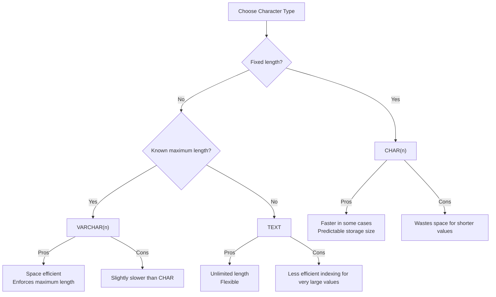

# PostgreSQL Character Types

## Introduction

Character types in PostgreSQL are used to store textual data, from single characters to documents containing thousands of words. Understanding these types is fundamental for creating efficient database schemas and ensuring optimal performance.

PostgreSQL provides three primary character types:

1. `CHAR(n)` - Fixed-length character strings
2. `VARCHAR(n)` - Variable-length character strings with a limit
3. `TEXT` - Variable-length character strings without a limit

In this tutorial, we'll explore each type in detail, understand their differences, and learn when to use each one.

## CHAR(n) - Fixed-Length Character Type

The `CHAR(n)` type stores fixed-length strings, where `n` specifies the exact number of characters to store. If a shorter string is inserted, PostgreSQL pads it with spaces to reach the specified length.

### Syntax

```sql
column_name CHAR(n)
```

Where `n` is the number of characters (the maximum is 10,485,760).

### Examples

Let's create a table with a `CHAR` column:

```sql
CREATE TABLE char_examples (
    id SERIAL PRIMARY KEY,
    code CHAR(5),
    description VARCHAR(100)
);
```

Inserting data:

```sql
INSERT INTO char_examples (code, description) 
VALUES ('ABC', 'This code is shorter than 5 characters');

INSERT INTO char_examples (code, description) 
VALUES ('ABCDE', 'This code is exactly 5 characters');

INSERT INTO char_examples (code, description) 
VALUES ('ABCDEF', 'This code is longer than 5 characters');
```

Querying the data:

```sql
SELECT id, code, LENGTH(code) AS actual_length, description 
FROM char_examples;
```

Result:

```
 id | code  | actual_length | description
----+-------+--------------+--------------------------------
  1 | ABC   |            5 | This code is shorter than 5 characters
  2 | ABCDE |            5 | This code is exactly 5 characters
  3 | ABCDE |            5 | This code is longer than 5 characters
```

Notice the following behaviors:
- The first value `'ABC'` is padded with spaces to make it 5 characters long
- The second value `'ABCDE'` is stored as-is
- The third value `'ABCDEF'` is truncated to 5 characters (`'ABCDE'`)

### When to Use CHAR(n)

Use `CHAR(n)` when:
- You need a fixed-length string column
- All values will be exactly the same length
- Examples: country codes, postal codes, standard identifiers

## VARCHAR(n) - Variable-Length with Limit

The `VARCHAR(n)` type stores variable-length character strings up to a maximum length of `n`. It doesn't pad shorter strings with spaces.

### Syntax

```sql
column_name VARCHAR(n)
```

Where `n` is the maximum number of characters (the limit is 10,485,760).

### Examples

Let's create a table with a `VARCHAR` column:

```sql
CREATE TABLE varchar_examples (
    id SERIAL PRIMARY KEY,
    username VARCHAR(20),
    bio VARCHAR(200)
);
```

Inserting data:

```sql
INSERT INTO varchar_examples (username, bio) 
VALUES ('john_doe', 'Software developer interested in PostgreSQL');

INSERT INTO varchar_examples (username, bio) 
VALUES ('db_master', 'Database administrator with 10 years of experience');
```

Querying the data:

```sql
SELECT id, username, LENGTH(username) AS username_length, bio 
FROM varchar_examples;
```

Result:

```
 id | username  | username_length | bio
----+-----------+----------------+--------------------------------------------
  1 | john_doe  |              8 | Software developer interested in PostgreSQL
  2 | db_master |              9 | Database administrator with 10 years of experience
```

Unlike `CHAR`, `VARCHAR` stores the string with its actual length, without padding.

### When to Use VARCHAR(n)

Use `VARCHAR(n)` when:
- You need to store strings of varying lengths
- You want to enforce a maximum length constraint
- You need to optimize storage space
- Examples: usernames, names, addresses, short descriptions

## TEXT - Unlimited Variable-Length Type

The `TEXT` type stores variable-length strings with no specific limit (only limited by the maximum size allowed by PostgreSQL, which is 1GB for a field).

### Syntax

```sql
column_name TEXT
```

### Examples

Let's create a table with a `TEXT` column:

```sql
CREATE TABLE text_examples (
    id SERIAL PRIMARY KEY,
    title VARCHAR(100),
    content TEXT
);
```

Inserting data:

```sql
INSERT INTO text_examples (title, content) 
VALUES ('PostgreSQL Introduction', 'PostgreSQL is an advanced open-source relational database system. It supports both SQL and JSON querying...');

INSERT INTO text_examples (title, content) 
VALUES ('Character Types', 'In this tutorial, we explore the different character types available in PostgreSQL...');
```

Querying the data:

```sql
SELECT id, title, SUBSTRING(content, 1, 30) || '...' AS content_preview 
FROM text_examples;
```

Result:

```
 id | title                   | content_preview
----+-------------------------+----------------------------------
  1 | PostgreSQL Introduction | PostgreSQL is an advanced open...
  2 | Character Types         | In this tutorial, we explore t...
```

### When to Use TEXT

Use `TEXT` when:
- You need to store strings of arbitrary length
- You don't want to enforce a maximum length constraint
- You're storing long textual content
- Examples: blog posts, product descriptions, comments, emails

## Performance Considerations



Here are some performance considerations:

1. **Storage Efficiency**:
   - `CHAR(n)` always uses `n` characters of storage space regardless of the actual string length
   - `VARCHAR(n)` and `TEXT` use only the space needed plus 1 or 4 bytes of overhead

2. **Indexing**:
   - All character types can be indexed
   - For very large strings, consider using specialized indexes like GIN or GiST with proper operators

3. **Truncation**:
   - `CHAR(n)` and `VARCHAR(n)` will truncate strings that exceed their defined length
   - `TEXT` won't truncate data

## Practical Examples

### Example 1: User Profile Table

```sql
CREATE TABLE user_profiles (
    user_id SERIAL PRIMARY KEY,
    username VARCHAR(30) NOT NULL UNIQUE,
    password_hash CHAR(64) NOT NULL,  -- For a fixed-length hash
    email VARCHAR(100) NOT NULL,
    short_bio VARCHAR(200),
    full_bio TEXT,
    country_code CHAR(2)  -- ISO country code is always 2 characters
);
```

### Example 2: Blog Post System

```sql
CREATE TABLE blog_posts (
    post_id SERIAL PRIMARY KEY,
    title VARCHAR(150) NOT NULL,
    slug VARCHAR(200) NOT NULL UNIQUE,
    excerpt VARCHAR(300),
    content TEXT,
    status CHAR(1) CHECK (status IN ('D', 'P', 'A'))  -- Draft, Published, Archived
);
```

### Example 3: Product Catalog

```sql
CREATE TABLE products (
    product_id SERIAL PRIMARY KEY,
    sku CHAR(10) NOT NULL UNIQUE,
    name VARCHAR(100) NOT NULL,
    short_description VARCHAR(200),
    full_description TEXT,
    category VARCHAR(50)
);
```

## Comparing Character Types

| Feature | CHAR(n) | VARCHAR(n) | TEXT |
|---------|---------|------------|------|
| Length | Fixed | Variable with limit | Variable unlimited |
| Padding | Yes (with spaces) | No | No |
| Maximum size | 10,485,760 chars | 10,485,760 chars | 1GB |
| Storage efficiency | Low for varying lengths | High | High |
| Use case | Fixed-length codes | Most string data | Long content |

## Common Operations with Character Types

### String Concatenation

```sql
SELECT 'Hello, ' || 'PostgreSQL!' AS greeting;
-- Result: Hello, PostgreSQL!
```

### String Functions

```sql
-- Length
SELECT LENGTH('PostgreSQL') AS length;
-- Result: 10

-- Substring
SELECT SUBSTRING('PostgreSQL' FROM 1 FOR 4) AS substring;
-- Result: Post

-- Uppercase/Lowercase
SELECT UPPER('postgresql') AS uppercase, LOWER('PostgreSQL') AS lowercase;
-- Result: POSTGRESQL, postgresql

-- Replace
SELECT REPLACE('PostgreSQL', 'SQL', 'Database') AS replaced;
-- Result: PostgreDatabase
```

### Pattern Matching

```sql
-- LIKE operator
SELECT 'PostgreSQL' LIKE 'Post%' AS starts_with_post;
-- Result: true

-- Regular expression
SELECT 'PostgreSQL' ~ '^Post.*SQL$' AS matches_regex;
-- Result: true
```

## Summary

PostgreSQL offers three main character types:

1. **CHAR(n)**: Best for fixed-length strings where all values have exactly the same length.
2. **VARCHAR(n)**: Ideal for most text data where you want to enforce a maximum length.
3. **TEXT**: Perfect for unlimited length content where flexibility is more important than strict validation.

Choosing the right character type depends on your specific requirements:
- Use `CHAR(n)` when all strings have the same length (e.g., codes, fixed identifiers)
- Use `VARCHAR(n)` for most string data where you know the maximum length
- Use `TEXT` for potentially large or variable content with no clear upper bound

## Further Learning Resources

- Practice building tables using different character types
- Experiment with different string functions
- Try implementing text search functionality using PostgreSQL's text search capabilities
- Explore character encoding and internationalization aspects of PostgreSQL

## Exercises

1. Create a table to store product information with appropriate character types for each field
2. Write a query to find all records in a table where a VARCHAR field starts with a specific pattern
3. Create a function that takes a TEXT input and returns a summary limited to 50 characters
4. Design a database schema for a blog system using appropriate character types for each column
5. Write a query that demonstrates the difference between CHAR and VARCHAR when storing and retrieving the same values