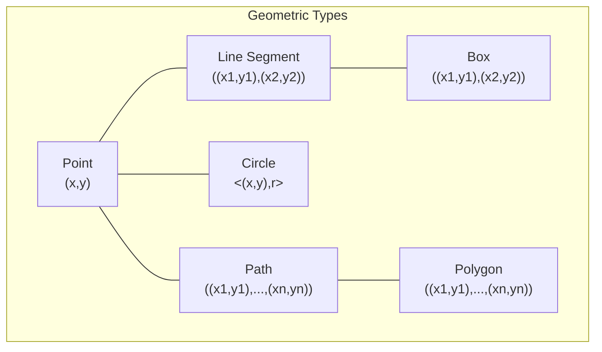

# PostgreSQL Geometric Types

## Introduction

PostgreSQL comes with powerful built-in geometric data types that allow you to store and manipulate two-dimensional spatial objects directly in your database. These geometric types enable you to perform various spatial operations without the need for additional extensions (though for advanced geographic information systems, PostGIS extends these capabilities further).

Geometric types are particularly useful when your application needs to work with:
- Coordinates and positions
- Shapes and paths
- Distance calculations
- Spatial relationships between objects

In this tutorial, we'll explore the various geometric types available in PostgreSQL, how to use them, and practical applications where they shine.

## Available Geometric Types

PostgreSQL offers the following geometric data types:

| Type | Description | Syntax | Size | Example |
|------|-------------|--------|------|---------|
| `point` | Point on a plane (x,y) | `(x,y)` | 16 bytes | `(23.4, -44.5)` |
| `line` | Infinite line | `{A,B,C}` | 32 bytes | `{1, -1, 0}` |
| `lseg` | Finite line segment | `((x1,y1),(x2,y2))` | 32 bytes | `((0,0),(1,1))` |
| `box` | Rectangular box | `((x1,y1),(x2,y2))` | 32 bytes | `((0,0),(1,1))` |
| `path` | Closed/open path | `((x1,y1),...(xn,yn))` | 16+16n bytes | `((0,0),(1,1),(2,0))` |
| `polygon` | Polygon | `((x1,y1),...(xn,yn))` | 40+16n bytes | `((0,0),(1,1),(2,0))` |
| `circle` | Circle | `<(x,y),r>` | 24 bytes | `<(0,0),5>` |

Let's explore each type in detail.

## Points

A `point` is the fundamental geometric type, representing a location in a two-dimensional plane.

### Creating and Using Points

```sql
-- Creating a point
CREATE TABLE landmarks (
    id SERIAL PRIMARY KEY,
    name VARCHAR(100),
    location POINT
);

-- Inserting points
INSERT INTO landmarks (name, location) VALUES
    ('City Center', '(0, 0)'),
    ('Airport', '(10.5, -3.2)'),
    ('Park', '(4.3, 8.7)');
    
-- Querying points
SELECT name, location[0] AS x_coord, location[1] AS y_coord 
FROM landmarks;
```

Output:
```
    name    | x_coord | y_coord
------------+---------+---------
City Center |       0 |       0
Airport     |    10.5 |    -3.2
Park        |     4.3 |     8.7
```

### Point Operators

PostgreSQL provides various operators for points:

```sql
-- Distance between two points
SELECT point '(0,0)' <-> point '(3,4)' AS distance;

-- Is point A equal to point B?
SELECT point '(1,1)' ~= point '(1,1)' AS equal;

-- Check if two points are strictly left/right/above/below each other
SELECT point '(1,1)' >> point '(0,0)' AS right_of;
SELECT point '(1,1)' << point '(2,2)' AS left_of;
SELECT point '(1,1)' ?| point '(1,0)' AS same_x;
SELECT point '(1,1)' ?- point '(0,1)' AS same_y;
```

Output:
```
distance
---------
       5
       
equal
-------
 true

right_of
---------
 true

left_of
--------
 true

same_x
-------
 true

same_y
-------
 true
```

## Line Segments

A `lseg` represents a finite line segment defined by two endpoints.

```sql
-- Creating a table with line segments
CREATE TABLE streets (
    id SERIAL PRIMARY KEY,
    name VARCHAR(100),
    segment LSEG
);

-- Inserting line segments
INSERT INTO streets (name, segment) VALUES
    ('Main Street', '((0,0),(5,5))'),
    ('Broadway', '((2,3),(7,1))'),
    ('Park Avenue', '((0,2),(8,2))');
    
-- Checking if two line segments intersect
SELECT 
    a.name, 
    b.name, 
    a.segment ?# b.segment AS intersects
FROM 
    streets a,
    streets b
WHERE 
    a.id < b.id;
```

Output:
```
    name     |     name     | intersects
-------------+--------------+------------
Main Street  | Broadway     | true
Main Street  | Park Avenue  | true
Broadway     | Park Avenue  | true
```

## Boxes

A `box` represents a rectangular box defined by two opposite corners.

```sql
-- Creating a table with boxes
CREATE TABLE regions (
    id SERIAL PRIMARY KEY,
    name VARCHAR(100),
    area BOX
);

-- Inserting boxes
INSERT INTO regions (name, area) VALUES
    ('Downtown', '((0,0),(5,5))'),
    ('Suburb', '((10,10),(15,15))'),
    ('Industrial Zone', '((3,3),(8,8))');
    
-- Calculating the area of each box
SELECT 
    name, 
    (area[1][0] - area[0][0]) * (area[1][1] - area[0][1]) AS square_units
FROM 
    regions;
    
-- Finding overlapping regions
SELECT 
    a.name, 
    b.name, 
    a.area && b.area AS overlaps
FROM 
    regions a,
    regions b
WHERE 
    a.id < b.id;
```

Output:
```
     name      | square_units
---------------+--------------
Downtown       |           25
Suburb         |           25
Industrial Zone|           25

     name      |      name      | overlaps
---------------+----------------+----------
Downtown       | Industrial Zone| true
Downtown       | Suburb         | false
Industrial Zone| Suburb         | false
```

## Circles

A `circle` is defined by a center point and a radius.

```sql
-- Creating a table with circles
CREATE TABLE coverage_areas (
    id SERIAL PRIMARY KEY,
    name VARCHAR(100),
    coverage CIRCLE
);

-- Inserting circles
INSERT INTO coverage_areas (name, coverage) VALUES
    ('WiFi Hotspot', '<(0,0),3>'),
    ('Cell Tower A', '<(5,5),4>'),
    ('Cell Tower B', '<(10,2),5>');
    
-- Finding the area of each circle
SELECT 
    name, 
    pi() * radius(coverage)^2 AS area
FROM 
    coverage_areas;
    
-- Checking for overlapping coverage areas
SELECT 
    a.name, 
    b.name, 
    a.coverage && b.coverage AS overlaps
FROM 
    coverage_areas a,
    coverage_areas b
WHERE 
    a.id < b.id;
```

Output:
```
     name     |       area        
--------------+-------------------
WiFi Hotspot  | 28.2743338823081
Cell Tower A  | 50.2654824574367
Cell Tower B  | 78.5398163397448

     name     |     name     | overlaps
--------------+--------------+----------
WiFi Hotspot  | Cell Tower A | true
WiFi Hotspot  | Cell Tower B | false
Cell Tower A  | Cell Tower B | false
```

## Paths and Polygons

A `path` can be either open or closed, while a `polygon` is always closed. Both represent a sequence of connected points.

```sql
-- Creating a table with paths
CREATE TABLE routes (
    id SERIAL PRIMARY KEY,
    name VARCHAR(100),
    route PATH,
    is_closed BOOLEAN
);

-- Inserting paths
INSERT INTO routes (name, route, is_closed) VALUES
    ('Delivery Route', '((0,0),(2,2),(5,0),(7,5))', false),
    ('Park Perimeter', '((0,0),(0,5),(5,5),(5,0),(0,0))', true),
    ('River', '((1,1),(3,2),(5,1),(7,3),(9,1))', false);
    
-- Inserting a polygon
CREATE TABLE areas (
    id SERIAL PRIMARY KEY,
    name VARCHAR(100),
    boundary POLYGON
);

INSERT INTO areas (name, boundary) VALUES
    ('Campus', '((0,0),(0,10),(10,10),(10,0))'),
    ('Lake', '((3,3),(3,7),(7,7),(7,3))');
    
-- Finding the perimeter of paths
SELECT 
    name, 
    pclose(route) AS closed_path,
    path_length(route) AS length
FROM 
    routes;
    
-- Checking if a point is inside a polygon
SELECT 
    name, 
    point '(5,5)' <@ boundary AS contains_center
FROM 
    areas;
```

Output:
```
     name      |        closed_path        | length
---------------+---------------------------+--------
Delivery Route | ((0,0),(2,2),(5,0),(7,5)) | 15.52
Park Perimeter | ((0,0),(0,5),(5,5),(5,0)) | 20
River          | ((1,1),(3,2),(5,1),(7,3)) | 10.89

  name  | contains_center
--------+-----------------
Campus  | true
Lake    | true
```

## Practical Application: Store Locator

Let's build a simple store locator system using geometric types. This example demonstrates how to:
1. Store location data
2. Calculate distances
3. Find nearby locations

```sql
-- Create the stores table
CREATE TABLE stores (
    id SERIAL PRIMARY KEY,
    name VARCHAR(100),
    location POINT,
    service_area CIRCLE
);

-- Insert sample data
INSERT INTO stores (name, location, service_area) VALUES
    ('Downtown Store', '(0,0)', '<(0,0),3>'),
    ('Mall Store', '(5,5)', '<(5,5),2>'),
    ('Airport Store', '(8,1)', '<(8,1),1.5>'),
    ('Beach Store', '(2,7)', '<(2,7),2.5>');

-- Find stores within a certain distance of a location
SELECT 
    name, 
    location <-> point '(1,1)' AS distance
FROM 
    stores
WHERE 
    location <-> point '(1,1)' <= 7
ORDER BY 
    distance;
    
-- Find stores whose service areas contain a specific point
SELECT 
    name
FROM 
    stores
WHERE 
    point '(4,4)' <@ service_area;
    
-- Find stores with overlapping service areas
SELECT 
    a.name, 
    b.name
FROM 
    stores a,
    stores b
WHERE 
    a.id < b.id AND
    a.service_area && b.service_area;
```

Output:
```
     name      | distance
---------------+----------
Downtown Store |    1.414
Mall Store     |    5.657
Beach Store    |    6.403

    name    
------------
Mall Store

     name      |     name     
---------------+--------------
Downtown Store | Beach Store
```

## Visualizing Geometric Data

To better understand geometric data, let's visualize some of the concepts we've covered:



## Common Geometric Operations

Here's a reference table of common geometric operations:

| Operation | Description               | Example                                        |
|-----------|---------------------------|------------------------------------------------|
| `<->`     | Distance between          | `point '(0,0)' <-> point '(3,4)'`              |
| `@>`      | Contains                  | `circle '<(0,0),2>' @> point '(1,1)'`          |
| `<@`      | Contained by              | `point '(1,1)' <@ circle '<(0,0),2>'`          |
| `&&`      | Overlaps                  | `box '((0,0),(2,2))' && box '((1,1),(3,3))'`   |
| `#`       | Count of points in a path | `# path '((0,0),(1,1),(2,2))'`                 |
| `?#`      | Intersects                | `lseg '((0,0),(2,2))' ?# lseg '((0,2),(2,0))'` |
| `@-@`     | Length or perimeter       | `@-@ path '((0,0),(1,1),(2,2))'`               |
| `@@`      | Center point              | `@@ circle '<(1,1),2>'`                        |
| `##`      | Closest point             | `point '(0,0)' ## lseg '((1,1),(2,2))'`        |

## Performance Considerations

When working with geometric types in PostgreSQL:

1. **Indexing**: Use GiST (Generalized Search Tree) indexes for spatial queries
   ```sql
   CREATE INDEX idx_location ON stores USING GIST (location);
   CREATE INDEX idx_service_area ON stores USING GIST (service_area);
   ```

2. **Bounding Box**: For complex geometries, consider using bounding boxes for initial filtering

3. **Large Datasets**: For very large spatial datasets or advanced GIS functionality, consider using the PostGIS extension instead of native geometric types

## Summary

PostgreSQL's geometric types provide powerful capabilities for storing and manipulating spatial data directly in your database:

- They allow representation of points, lines, paths, polygons, and circles
- Built-in operators support spatial calculations and relationships
- Geometric types can be indexed for efficient spatial queries
- They're suitable for applications like store locators, geofencing, and simple mapping

While native geometric types are sufficient for many applications, consider PostGIS for advanced geographic information systems with large datasets or complex spatial analysis requirements.

## Practice Exercises

1. Create a table for tracking the movement of vehicles with timestamp and position
2. Design a table structure for a city planning application that includes buildings (polygons), roads (paths), and utility coverage areas (circles)
3. Write a query to find all points of interest within 5 units of a given location
4. Implement a simple geofencing system using PostgreSQL geometric types

## Additional Resources

- [PostgreSQL Documentation on Geometric Types](https://www.postgresql.org/docs/current/datatype-geometric.html)
- [GiST Indexing in PostgreSQL](https://www.postgresql.org/docs/current/gist.html)
- For more advanced spatial capabilities, check out [PostGIS](https://postgis.net/)

Remember that while PostgreSQL's native geometric types are powerful, they operate in a Cartesian plane and don't account for the Earth's curvature. For geographic coordinates (latitude/longitude), consider using PostGIS, which properly handles spherical geometry.