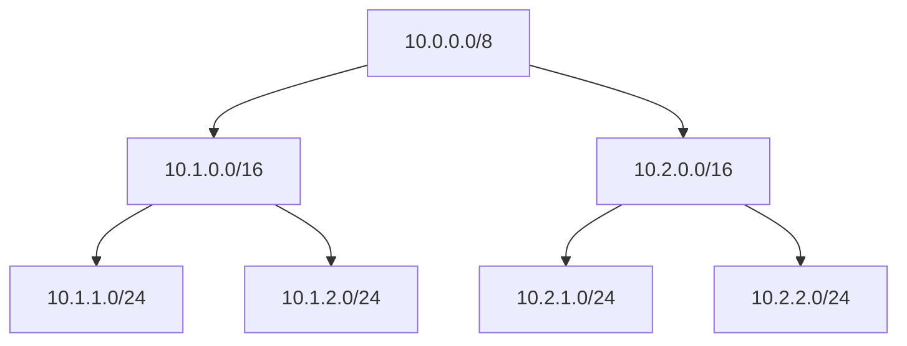

# PostgreSQL Network Address Types

## Introduction

PostgreSQL provides specialized data types for storing and working with network addresses that offer significant advantages over storing them as plain text. These network address types allow you to:

- Validate IP addresses and network ranges
- Perform subnet calculations
- Sort addresses in a network-logical way
- Apply subnet operations like containment checks

In this guide, we'll explore PostgreSQL's network address types including `inet`, `cidr`, and `macaddr` and learn how to use them effectively in your applications.

## Network Address Types Overview

PostgreSQL supports the following network address types:

| Type | Description | Size | Example |
|------|-------------|------|---------|
| `inet` | IPv4 and IPv6 hosts and networks | 7 or 19 bytes | `192.168.1.5/24` |
| `cidr` | IPv4 and IPv6 networks (strict) | 7 or 19 bytes | `192.168.1.0/24` |
| `macaddr` | MAC addresses | 6 bytes | `08:00:2b:01:02:03` |
| `macaddr8` | MAC addresses (EUI-64 format) | 8 bytes | `08:00:2b:ff:fe:01:02:03` |

## The inet Type

The `inet` type stores an IPv4 or IPv6 host address, and optionally its subnet, in a single field.

### Basic Usage

```sql
-- Creating a table with an inet column
CREATE TABLE devices (
    id SERIAL PRIMARY KEY,
    name VARCHAR(100),
    ip_address inet
);

-- Inserting data
INSERT INTO devices (name, ip_address) 
VALUES 
    ('Web Server', '192.168.1.10'),
    ('Database Server', '192.168.1.20/24'),
    ('Load Balancer', '10.0.0.5/16'),
    ('IPv6 Device', '2001:db8::8a2e:370:7334');

-- Querying data
SELECT * FROM devices;
```

Output:
```
 id |       name       |         ip_address          
----+------------------+----------------------------
  1 | Web Server       | 192.168.1.10
  2 | Database Server  | 192.168.1.20/24
  3 | Load Balancer    | 10.0.0.5/16
  4 | IPv6 Device      | 2001:db8::8a2e:370:7334
```

### Essential Functions and Operators

PostgreSQL provides many functions for working with `inet` types:

```sql
-- Extract the host address (no subnet)
SELECT ip_address, host(ip_address) FROM devices;

-- Extract network address
SELECT ip_address, network(ip_address) FROM devices;

-- Get netmask
SELECT ip_address, netmask(ip_address) FROM devices;

-- Get broadcast address
SELECT ip_address, broadcast(ip_address) FROM devices;

-- Check if address is within a subnet
SELECT '192.168.1.100'::inet << '192.168.1.0/24'::inet;  -- true
```

Output of the first query:
```
         ip_address          |       host       
-----------------------------+------------------
 192.168.1.10                | 192.168.1.10
 192.168.1.20/24             | 192.168.1.20
 10.0.0.5/16                 | 10.0.0.5
 2001:db8::8a2e:370:7334     | 2001:db8::8a2e:370:7334
```

## The cidr Type

The `cidr` type stores IPv4 or IPv6 network specifications. It is more strict than `inet` and requires the network address to be properly aligned to the network boundary based on the specified netmask.

### Difference Between inet and cidr

The key differences between `inet` and `cidr`:

1. `inet` accepts host addresses (with or without a netmask)
2. `cidr` only accepts properly aligned network addresses
3. When a netmask is specified for `inet`, host bits are preserved
4. When a netmask is specified for `cidr`, host bits are set to zero

### Basic Usage

```sql
-- Creating a table with a cidr column
CREATE TABLE networks (
    id SERIAL PRIMARY KEY,
    name VARCHAR(100),
    network cidr
);

-- Inserting data
INSERT INTO networks (name, network) 
VALUES 
    ('Office Network', '192.168.1.0/24'),
    ('Data Center', '10.0.0.0/16'),
    ('Cloud VPC', '172.16.0.0/12'),
    ('IPv6 Network', '2001:db8::/32');

-- This will fail because host bits are not zero:
-- INSERT INTO networks (name, network) VALUES ('Invalid', '192.168.1.15/24');

-- Querying data
SELECT * FROM networks;
```

Output:
```
 id |     name      |     network      
----+---------------+------------------
  1 | Office Network | 192.168.1.0/24
  2 | Data Center   | 10.0.0.0/16
  3 | Cloud VPC     | 172.16.0.0/12
  4 | IPv6 Network  | 2001:db8::/32
```

## Subnet Operations

PostgreSQL provides powerful operators for working with subnets:

```sql
-- Check if a network contains another network or host
SELECT 
    '192.168.1.0/24'::cidr >>= '192.168.1.10'::inet AS contains_host,
    '10.0.0.0/8'::cidr >>= '10.1.2.0/24'::cidr AS contains_subnet;

-- Find all devices in a specific subnet
SELECT name, ip_address 
FROM devices 
WHERE ip_address << '192.168.1.0/24';

-- Count addresses in a subnet
SELECT 
    network,
    family(network) AS ip_version,
    CASE
        WHEN family(network) = 4 THEN power(2, 32 - masklen(network))::bigint
        WHEN family(network) = 6 THEN power(2, 128 - masklen(network))::numeric
    END AS address_count
FROM networks;
```

Result of the first query:
```
 contains_host | contains_subnet 
---------------+-----------------
 true          | true
```

## The macaddr Type

The `macaddr` type stores MAC (Media Access Control) addresses, which are hardware identifiers assigned to network interfaces.

### Basic Usage

```sql
-- Creating a table with a macaddr column
CREATE TABLE network_interfaces (
    id SERIAL PRIMARY KEY,
    device_name VARCHAR(100),
    mac_address macaddr
);

-- Inserting data
INSERT INTO network_interfaces (device_name, mac_address) 
VALUES 
    ('Server NIC 1', '08:00:2b:01:02:03'),
    ('Router Interface', '00:11:22:33:44:55'),
    ('Wireless AP', 'aa-bb-cc-dd-ee-ff'),
    ('Switch Port', '08002b:010203');

-- Querying data
SELECT * FROM network_interfaces;
```

Output:
```
 id |  device_name   |   mac_address   
----+----------------+-----------------
  1 | Server NIC 1   | 08:00:2b:01:02:03
  2 | Router Interface | 00:11:22:33:44:55
  3 | Wireless AP    | aa:bb:cc:dd:ee:ff
  4 | Switch Port    | 08:00:2b:01:02:03
```

### MAC Address Functions and Operations

PostgreSQL provides functions to manipulate MAC addresses:

```sql
-- Convert to different formats
SELECT 
    mac_address,
    trunc(mac_address) AS truncated, -- Sets the last 3 bytes to zero
    mac_address & 'ff:ff:ff:00:00:00'::macaddr AS masked
FROM network_interfaces;

-- Check if two MAC addresses are the same
SELECT 
    '08:00:2b:01:02:03'::macaddr = '08:00:2b:01:02:03'::macaddr,
    '08:00:2b:01:02:03'::macaddr = '08002b:010203'::macaddr;
```

Output:
```
   mac_address    |     truncated     |       masked       
-----------------+-------------------+--------------------
 08:00:2b:01:02:03 | 08:00:2b:00:00:00 | 08:00:2b:00:00:00
 00:11:22:33:44:55 | 00:11:22:00:00:00 | 00:11:22:00:00:00
 aa:bb:cc:dd:ee:ff | aa:bb:cc:00:00:00 | aa:bb:cc:00:00:00
 08:00:2b:01:02:03 | 08:00:2b:00:00:00 | 08:00:2b:00:00:00
```

## The macaddr8 Type

The `macaddr8` type stores MAC addresses in EUI-64 format, which is primarily used for IPv6 interface identifiers.

### Basic Usage

```sql
-- Creating a table with a macaddr8 column
CREATE TABLE extended_interfaces (
    id SERIAL PRIMARY KEY,
    device_name VARCHAR(100),
    mac_address macaddr8
);

-- Inserting data
INSERT INTO extended_interfaces (device_name, mac_address) 
VALUES 
    ('IPv6 Interface', '08:00:2b:ff:fe:01:02:03'),
    ('Fiber Channel', '01:02:03:04:05:06:07:08'),
    ('InfiniBand Port', '08-00-2b-ff-fe-01-02-03');

-- Querying data
SELECT * FROM extended_interfaces;
```

## Practical Use Cases

### 1. IP Address Range Allocation

You can use network address types to manage IP address allocations:

```sql
CREATE TABLE ip_allocations (
    id SERIAL PRIMARY KEY,
    description TEXT,
    network cidr,
    allocated_to VARCHAR(100),
    allocated_at TIMESTAMP DEFAULT NOW()
);

-- Allocate subnet blocks
INSERT INTO ip_allocations (description, network, allocated_to)
VALUES
    ('Office Floor 1', '192.168.1.0/24', 'IT Department'),
    ('Office Floor 2', '192.168.2.0/24', 'Marketing'),
    ('Office Floor 3', '192.168.3.0/24', 'Engineering'),
    ('Data Center A', '10.1.0.0/16', 'Production'),
    ('Data Center B', '10.2.0.0/16', 'Development');

-- Check if a new allocation overlaps with existing ones
CREATE OR REPLACE FUNCTION check_network_overlap(new_network cidr) 
RETURNS TABLE (id INTEGER, description TEXT, network cidr) AS $$
BEGIN
    RETURN QUERY
    SELECT a.id, a.description, a.network
    FROM ip_allocations a
    WHERE a.network && new_network;
END;
$$ LANGUAGE plpgsql;

-- Usage
SELECT * FROM check_network_overlap('192.168.1.128/25');
```

### 2. Access Control Lists

Network address types are perfect for implementing network-based access control:

```sql
CREATE TABLE firewall_rules (
    id SERIAL PRIMARY KEY,
    description TEXT,
    source_network inet,
    destination_network inet,
    port INTEGER,
    action VARCHAR(10) CHECK (action IN ('ALLOW', 'DENY'))
);

-- Add some firewall rules
INSERT INTO firewall_rules (description, source_network, destination_network, port, action)
VALUES
    ('Allow internal to web servers', '10.0.0.0/8', '192.168.1.0/24', 80, 'ALLOW'),
    ('Block public access to admin', '0.0.0.0/0', '192.168.1.10', 8080, 'DENY'),
    ('Allow VPN clients', '172.16.0.0/12', '10.0.0.0/8', 0, 'ALLOW');

-- Check if a connection would be allowed
CREATE OR REPLACE FUNCTION check_firewall_access(source_ip inet, dest_ip inet, dest_port INTEGER)
RETURNS TABLE (rule_id INTEGER, description TEXT, action VARCHAR(10)) AS $$
BEGIN
    RETURN QUERY
    SELECT fr.id, fr.description, fr.action
    FROM firewall_rules fr
    WHERE 
        source_ip <<= fr.source_network AND
        dest_ip <<= fr.destination_network AND
        (fr.port = 0 OR fr.port = dest_port)
    ORDER BY 
        CASE WHEN fr.action = 'DENY' THEN 0 ELSE 1 END,
        id;
END;
$$ LANGUAGE plpgsql;

-- Check if 203.0.113.5 can access web server at 192.168.1.5:80
SELECT * FROM check_firewall_access('203.0.113.5', '192.168.1.5', 80);
```

### 3. Network Visualization

You can create network visualizations with the `cidr` type:



This can be generated from your database:

```sql
WITH RECURSIVE subnet_tree AS (
    -- Base case: top-level networks
    SELECT 
        id, 
        network, 
        description, 
        0 AS level
    FROM ip_allocations
    WHERE network = '10.0.0.0/8'
    
    UNION ALL
    
    -- Recursive case: find contained subnets
    SELECT 
        a.id, 
        a.network, 
        a.description, 
        t.level + 1
    FROM ip_allocations a
    JOIN subnet_tree t ON a.network << t.network AND a.network != t.network
)
SELECT 
    network,
    description,
    level,
    repeat('  ', level) || network::text AS tree_view
FROM subnet_tree
ORDER BY network;
```

## Performance Benefits

Using native network address types provides several performance benefits:

1. **Indexing**: PostgreSQL can create efficient indexes on network columns
2. **Storage**: Network types use less space than text representations
3. **Validation**: Automatic validation prevents invalid addresses
4. **Specialized Operators**: Network-specific operators improve query speed

Example of creating a GiST index for efficient subnet queries:

```sql
-- Create a GiST index for faster subnet operations
CREATE INDEX idx_network_gist ON networks USING gist (network inet_ops);

-- This query will use the index for efficient lookups
EXPLAIN ANALYZE
SELECT * FROM networks WHERE network && '192.168.0.0/16'::cidr;
```

## Common Pitfalls and Tips

1. **Don't confuse `inet` and `cidr`**: Remember that `cidr` is stricter and will reject improperly aligned networks
2. **Cast text to network types**: Always explicitly cast strings to network types:
   ```sql
   SELECT '192.168.1.1'::inet, '10.0.0.0/8'::cidr;
   ```
3. **Be aware of IPv4 vs IPv6**: Some functions behave differently for IPv4 and IPv6
4. **Use appropriate containment operators**:
   - `<<` and `>>` for strict subnet/supernet relationships
   - `<<=` and `>>=` for subnet/supernet or equality
   - `&&` for overlapping networks

## Summary

PostgreSQL's network address types provide powerful capabilities for working with IP addresses, subnets, and MAC addresses in your database:

- The `inet` type stores IPv4 and IPv6 host addresses with optional netmasks
- The `cidr` type strictly stores network specifications
- The `macaddr` and `macaddr8` types store hardware addresses
- These types come with specialized operators for subnet operations
- Network address types improve performance, validation, and space efficiency

These types are incredibly useful for applications involving networking, security, infrastructure management, and any system that needs to work with network addresses.

## Exercises

1. Create a table to track DHCP leases with `inet` for the IP address and `macaddr` for the client identifier
2. Write a query to find all available IP addresses in a subnet
3. Implement a function to split a network into smaller subnets of equal size
4. Create a visualization of your network hierarchy using `cidr` types
5. Build a simple IP geolocation database using `inet` ranges

## Additional Resources

- [PostgreSQL Documentation on Network Address Types](https://www.postgresql.org/docs/current/datatype-net-types.html)
- [CIDR and Subnet Calculations](https://www.postgresql.org/docs/current/functions-net.html)
- [IP Networking Tutorial](https://www.postgresql.org/docs/current/tutorial-net.html)