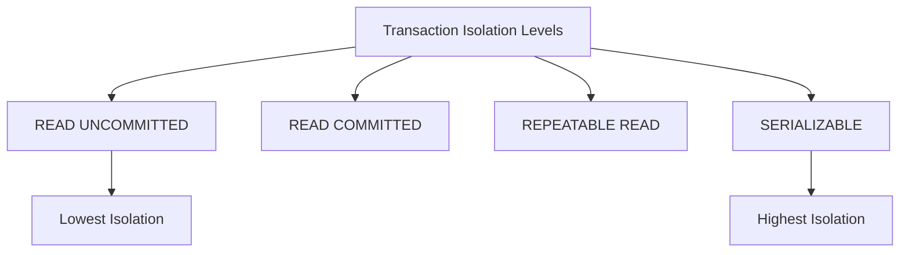

# PostgreSQL Transaction Basics

## Introduction

Database transactions are one of the most important concepts to understand when working with relational databases like PostgreSQL. A transaction is a sequence of database operations that are treated as a single logical unit of work. Either all operations within a transaction are completed successfully (committed), or none of them are (rolled back).

In this tutorial, we'll explore the fundamentals of PostgreSQL transactions, understand why they're essential, and learn how to use them effectively in your applications.

## What is a Transaction?

Imagine you're transferring money from one bank account to another. This operation involves two steps:
1. Deducting money from the source account
2. Adding money to the destination account

What happens if the system crashes after the first step but before completing the second? You'd lose money! Transactions prevent this kind of problem by ensuring that either both operations complete successfully or neither does.

In PostgreSQL, transactions provide the following guarantees, commonly known as ACID properties:

- **Atomicity**: All operations in a transaction are treated as a single unit that either succeeds completely or fails completely.
- **Consistency**: A transaction brings the database from one valid state to another, maintaining all defined rules and constraints.
- **Isolation**: Concurrent transactions do not interfere with each other. The effects of an incomplete transaction are invisible to other transactions.
- **Durability**: Once a transaction is committed, its effects persist even in the event of a system failure.

## Basic Transaction Commands

PostgreSQL provides several commands to control transactions:

- `BEGIN`: Starts a transaction
- `COMMIT`: Successfully completes a transaction
- `ROLLBACK`: Undoes all operations performed in a transaction

Let's see how these commands work in practice.

### Starting a Transaction

To start a transaction in PostgreSQL, you use the `BEGIN` command:

```sql
BEGIN;
-- or
BEGIN TRANSACTION;
```

After executing this command, all subsequent SQL statements will be part of the same transaction until you either `COMMIT` or `ROLLBACK`.

### Committing a Transaction

When you're satisfied with the changes made within your transaction and want to make them permanent, you use the `COMMIT` command:

```sql
COMMIT;
-- or
COMMIT TRANSACTION;
```

Once committed, the changes become visible to other transactions and are durable (saved to disk).

### Rolling Back a Transaction

If you want to undo all changes made within the current transaction, you use the `ROLLBACK` command:

```sql
ROLLBACK;
-- or
ROLLBACK TRANSACTION;
```

This will undo all operations performed since the `BEGIN` command.

## A Complete Transaction Example

Let's look at a complete example of a bank transfer transaction:

```sql
-- Create accounts table
CREATE TABLE accounts (
    id SERIAL PRIMARY KEY,
    name VARCHAR(100) NOT NULL,
    balance DECIMAL(15, 2) NOT NULL
);

-- Insert initial data
INSERT INTO accounts (name, balance) 
VALUES ('Alice', 1000.00), ('Bob', 500.00);

-- View initial balances
SELECT * FROM accounts;
```

Output:
```
 id | name  | balance 
----+-------+---------
  1 | Alice | 1000.00
  2 | Bob   | 500.00
```

Now, let's perform a transaction to transfer $200 from Alice to Bob:

```sql
-- Begin the transaction
BEGIN;

-- Deduct $200 from Alice's account
UPDATE accounts SET balance = balance - 200 WHERE name = 'Alice';

-- Add $200 to Bob's account
UPDATE accounts SET balance = balance + 200 WHERE name = 'Bob';

-- Check the balances before committing
SELECT * FROM accounts;
```

Output (within transaction, not yet visible to other sessions):
```
 id | name  | balance 
----+-------+---------
  1 | Alice | 800.00
  2 | Bob   | 700.00
```

```sql
-- Commit the transaction
COMMIT;

-- View final balances (now visible to all)
SELECT * FROM accounts;
```

Final output:
```
 id | name  | balance 
----+-------+---------
  1 | Alice | 800.00
  2 | Bob   | 700.00
```

## Error Handling and Rollback Example

Transactions are particularly useful when errors occur. Let's see what happens when something goes wrong:

```sql
-- Begin another transaction
BEGIN;

-- Deduct $1000 from Alice's account
UPDATE accounts SET balance = balance - 1000 WHERE name = 'Alice';

-- Check Alice's balance
SELECT name, balance FROM accounts WHERE name = 'Alice';
```

Output:
```
 name  | balance 
-------+---------
 Alice | -200.00
```

```sql
-- Oops! Alice doesn't have enough money
-- Let's roll back the transaction
ROLLBACK;

-- Check Alice's balance again
SELECT name, balance FROM accounts WHERE name = 'Alice';
```

Output after rollback:
```
 name  | balance 
-------+---------
 Alice | 800.00
```

By using `ROLLBACK`, we've canceled the operation, and Alice's balance remains at $800.

## Automatic Transactions

In PostgreSQL, if you don't explicitly start a transaction with `BEGIN`, each individual SQL statement is treated as a separate transaction (autocommit mode). This is convenient for simple operations but not ideal for related operations that need to be atomic.

Most PostgreSQL client libraries and applications provide ways to control transactions programmatically. For example, in Node.js with the `pg` library:

```javascript
const { Pool } = require('pg');
const pool = new Pool();

async function transferFunds(fromAccount, toAccount, amount) {
  const client = await pool.connect();
  
  try {
    // Start transaction
    await client.query('BEGIN');
    
    // Deduct from source account
    await client.query(
      'UPDATE accounts SET balance = balance - $1 WHERE name = $2',
      [amount, fromAccount]
    );
    
    // Add to destination account
    await client.query(
      'UPDATE accounts SET balance = balance + $1 WHERE name = $2',
      [amount, toAccount]
    );
    
    // Commit transaction
    await client.query('COMMIT');
    
    console.log('Transfer completed successfully');
  } catch (error) {
    // Something went wrong, rollback the transaction
    await client.query('ROLLBACK');
    console.error('Error during transaction, rolling back:', error);
    throw error;
  } finally {
    // Release the client back to the pool
    client.release();
  }
}

// Usage
transferFunds('Alice', 'Bob', 150)
  .catch(console.error);
```

## Transaction Savepoints

PostgreSQL also supports savepoints, which allow you to roll back parts of a transaction without discarding the entire transaction:

```sql
BEGIN;

-- Insert a new account
INSERT INTO accounts (name, balance) VALUES ('Charlie', 300.00);

-- Create a savepoint
SAVEPOINT charlie_account;

-- Try to deduct too much money
UPDATE accounts SET balance = balance - 500 WHERE name = 'Charlie';

-- Check Charlie's balance
SELECT name, balance FROM accounts WHERE name = 'Charlie';
```

Output:
```
  name   | balance 
---------+---------
 Charlie | -200.00
```

```sql
-- Rollback to savepoint
ROLLBACK TO SAVEPOINT charlie_account;

-- Check Charlie's balance after partial rollback
SELECT name, balance FROM accounts WHERE name = 'Charlie';
```

Output:
```
  name   | balance 
---------+---------
 Charlie | 300.00
```

```sql
-- Update with correct amount
UPDATE accounts SET balance = balance - 100 WHERE name = 'Charlie';

-- Commit the transaction
COMMIT;
```

Savepoints are particularly useful in complex transactions where you want to handle specific error conditions without discarding all your work.

## Transaction Isolation Levels

PostgreSQL supports different transaction isolation levels that control how transactions interact with each other:



- **READ UNCOMMITTED**: Can read uncommitted changes from other transactions (PostgreSQL treats this the same as READ COMMITTED)
- **READ COMMITTED**: Can only read committed changes (default in PostgreSQL)
- **REPEATABLE READ**: Ensures that if a row is read twice within the same transaction, the results will be the same
- **SERIALIZABLE**: The highest isolation level, ensuring transactions behave as if executed one after the other

You can set the isolation level for a transaction:

```sql
BEGIN TRANSACTION ISOLATION LEVEL REPEATABLE READ;
-- SQL statements
COMMIT;
```

## Common Transaction Patterns

### Try-Catch Pattern

In application code, it's common to use a try-catch pattern with transactions:

```python
import psycopg2

def transfer_funds(from_account, to_account, amount):
    conn = psycopg2.connect("dbname=mydatabase user=postgres")
    cursor = conn.cursor()
    
    try:
        # Start transaction
        cursor.execute("BEGIN")
        
        # Deduct from source account
        cursor.execute(
            "UPDATE accounts SET balance = balance - %s WHERE name = %s RETURNING balance",
            (amount, from_account)
        )
        new_balance = cursor.fetchone()[0]
        
        # Check if balance is negative
        if new_balance < 0:
            raise Exception(f"Insufficient funds for {from_account}")
        
        # Add to destination account
        cursor.execute(
            "UPDATE accounts SET balance = balance + %s WHERE name = %s",
            (amount, to_account)
        )
        
        # Commit transaction
        cursor.execute("COMMIT")
        print("Transfer successful!")
        
    except Exception as e:
        # Rollback on error
        cursor.execute("ROLLBACK")
        print(f"Transfer failed: {e}")
        raise
        
    finally:
        # Close cursor and connection
        cursor.close()
        conn.close()
```

### Batch Operations

Transactions are ideal for batch operations:

```sql
BEGIN;

-- Insert multiple records in a single transaction
INSERT INTO products (name, price) VALUES 
    ('Product 1', 19.99),
    ('Product 2', 29.99),
    ('Product 3', 39.99),
    ('Product 4', 49.99),
    ('Product 5', 59.99);

COMMIT;
```

This ensures that either all products are inserted or none are, maintaining data consistency.

## Best Practices for PostgreSQL Transactions

1. **Keep transactions short**: Long-running transactions can lead to lock contention.
2. **Only include necessary operations**: Don't include operations that don't need to be atomic.
3. **Handle errors properly**: Always implement proper error handling and rollback mechanisms.
4. **Be aware of connection pooling**: In web applications, connections are often reused, so ensure transactions are properly committed or rolled back.
5. **Consider isolation levels**: Choose the appropriate isolation level based on your requirements.
6. **Use explicit transactions**: While autocommit is convenient, explicitly define transactions for related operations.
7. **Watch out for deadlocks**: Be consistent in the order you access tables to avoid deadlocks.

## Summary

Transactions are a fundamental concept in PostgreSQL that ensure data integrity and consistency. By using `BEGIN`, `COMMIT`, and `ROLLBACK` commands, you can group related operations together and ensure they either all succeed or all fail.

Key points to remember:
- Transactions provide ACID properties
- Basic commands are `BEGIN`, `COMMIT`, and `ROLLBACK`
- Savepoints allow for partial rollbacks
- Different isolation levels control transaction visibility
- Always properly handle errors and rollbacks in your applications

## Additional Resources and Exercises

### Exercises

1. Create a database schema for a simple e-commerce system with products, inventory, and orders tables.
2. Write a transaction that:
   - Creates a new order
   - Updates the inventory for each ordered product
   - Rolls back if any product is out of stock

3. Experiment with different isolation levels and observe the behavior when running concurrent transactions.

### Further Reading

- [PostgreSQL Official Documentation on Transactions](https://www.postgresql.org/docs/current/tutorial-transactions.html)
- [Understanding ACID Properties](https://www.postgresql.org/docs/current/transaction-iso.html)
- [Transaction Isolation Levels in PostgreSQL](https://www.postgresql.org/docs/current/transaction-iso.html)