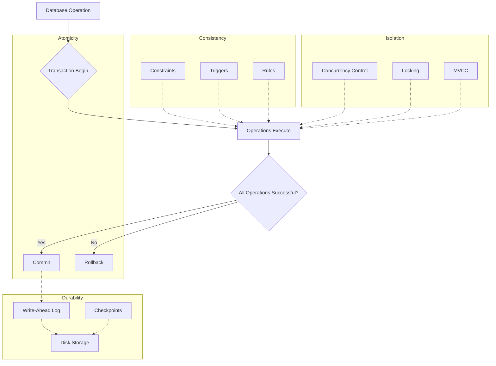

# PostgreSQL ACID Properties

## Introduction

When working with databases, especially in applications where data integrity is crucial (like financial systems, inventory management, or user accounts), you need a reliable way to handle operations. PostgreSQL, like other relational database management systems, implements a concept known as **ACID properties** to ensure reliability in its transaction processing.

ACID is an acronym that stands for **Atomicity**, **Consistency**, **Isolation**, and **Durability**. These four properties guarantee that database transactions are processed reliably, even in cases of system failures, concurrent access, and other challenges.

In this guide, we'll explore each ACID property in PostgreSQL, understand why they matter, and see how they work in practice with code examples.

## What is a Transaction?

Before diving into ACID properties, let's clarify what a transaction is:

A transaction is a sequence of database operations that are treated as a single logical unit of work. Either all operations in the transaction are completed successfully (committed), or none of them take effect (rolled back).

In PostgreSQL, transactions are created using the following syntax:

```sql
BEGIN;
-- SQL operations here
COMMIT;  -- or ROLLBACK; to undo changes
```

Now, let's explore each ACID property and how PostgreSQL implements them.

## Atomicity

### What is Atomicity?

Atomicity guarantees that each transaction is treated as a single "atomic" unit, which either succeeds completely or fails completely. There are no partial transactions.

### Why it Matters

Without atomicity, a failure during a transaction could leave your database in an inconsistent state. For example, if you're transferring money between two accounts and the system fails after debiting one account but before crediting the other, money would effectively disappear.

### PostgreSQL Implementation

PostgreSQL implements atomicity through its transaction mechanism and Write-Ahead Logging (WAL) system.

### Practical Example

Let's look at a bank transfer scenario:

```sql
BEGIN;
-- Deduct $100 from Account A
UPDATE accounts SET balance = balance - 100 WHERE account_id = 'A';

-- Add $100 to Account B
UPDATE accounts SET balance = balance + 100 WHERE account_id = 'B';

-- If everything looks good
COMMIT;
-- Or if there's a problem
-- ROLLBACK;
```

If any error occurs between the beginning and commit, you can use `ROLLBACK` to undo all changes, maintaining atomicity.

Let's see what happens if we try to transfer more money than available and have a constraint:

```sql
BEGIN;

-- This account has a balance of $50
UPDATE accounts SET balance = balance - 100 WHERE account_id = 'A';

-- This will fail if we have a CHECK constraint ensuring balance >= 0
-- ERROR:  new row for relation "accounts" violates check constraint "balance_must_be_positive"

ROLLBACK;  -- The entire transaction is undone
```

## Consistency

### What is Consistency?

Consistency ensures that a transaction brings the database from one valid state to another valid state, maintaining all predefined rules like constraints, cascades, and triggers.

### Why it Matters

Consistency protects the integrity of your data by ensuring that all database rules are enforced and no invalid data can be stored.

### PostgreSQL Implementation

PostgreSQL enforces consistency through:
- Constraints (CHECK, UNIQUE, NOT NULL, FOREIGN KEY)
- Triggers
- Stored procedures

### Practical Example

Let's see consistency in action with constraints:

```sql
-- First, let's create a table with constraints
CREATE TABLE accounts (
    account_id VARCHAR(10) PRIMARY KEY,
    holder_name VARCHAR(100) NOT NULL,
    balance DECIMAL(10,2) CHECK (balance >= 0),
    account_type VARCHAR(20) CHECK (account_type IN ('checking', 'savings'))
);

-- Now let's try a transaction that would violate a constraint
BEGIN;

INSERT INTO accounts 
VALUES ('ACC123', 'John Doe', 1000.00, 'checking');

-- This violates the CHECK constraint on account_type
INSERT INTO accounts 
VALUES ('ACC124', 'Jane Smith', 500.00, 'business'); 
-- Will result in: ERROR: new row for relation "accounts" violates check constraint "accounts_account_type_check"

COMMIT;
```

The entire transaction fails, and no changes are committed, preserving consistency.

## Isolation

### What is Isolation?

Isolation ensures that concurrent transactions execute as if they were running one at a time (serially), even though they may actually run in parallel for better performance.

### Why it Matters

Without proper isolation, concurrent transactions can interfere with each other, leading to problems like:
- **Dirty reads**: Reading uncommitted data from another transaction
- **Non-repeatable reads**: Getting different results when reading the same data twice
- **Phantom reads**: When newly inserted rows appear in a transaction's result set upon requery

### PostgreSQL Isolation Levels

PostgreSQL provides four isolation levels:

1. **READ UNCOMMITTED** (behaves like READ COMMITTED in PostgreSQL)
2. **READ COMMITTED** (default)
3. **REPEATABLE READ**
4. **SERIALIZABLE** (strongest isolation)

You can set the isolation level with:

```sql
BEGIN TRANSACTION ISOLATION LEVEL [LEVEL_NAME];
```

### Practical Example

Let's demonstrate isolation with two concurrent transactions:

Transaction 1:
```sql
BEGIN TRANSACTION ISOLATION LEVEL READ COMMITTED;

-- Initial check of account balance
SELECT balance FROM accounts WHERE account_id = 'A';
-- Output: 1000.00

-- Wait 5 seconds to simulate processing time...

-- Check again to make decision
SELECT balance FROM accounts WHERE account_id = 'A';
-- Output might now be 900.00 if Transaction 2 has run and committed!

COMMIT;
```

Transaction 2 (runs concurrently):
```sql
BEGIN;

-- Update account balance
UPDATE accounts SET balance = balance - 100 WHERE account_id = 'A';

COMMIT;
```

With the default `READ COMMITTED` isolation, Transaction 1 sees the changes from Transaction 2 after they're committed.

If we want to prevent this and ensure consistent reads throughout the transaction, we could use:

```sql
BEGIN TRANSACTION ISOLATION LEVEL REPEATABLE READ;

-- Initial check of account balance
SELECT balance FROM accounts WHERE account_id = 'A';
-- Output: 1000.00

-- Even if Transaction 2 commits during this time, the next query will still show 1000.00
SELECT balance FROM accounts WHERE account_id = 'A';
-- Output: 1000.00

COMMIT;
```

## Durability

### What is Durability?

Durability guarantees that once a transaction is committed, it remains committed even in the case of system failure (power outage, crash, etc.). Committed data is stored permanently.

### Why it Matters

Without durability, you could lose critical data during system failures, leading to inconsistent states and data loss.

### PostgreSQL Implementation

PostgreSQL ensures durability through:
1. **Write-Ahead Logging (WAL)**: Changes are written to a log before they're written to the actual database files
2. **Checkpoints**: Regular flushing of data to permanent storage
3. **Configurable synchronous commit levels**

### Practical Example

The durability property is handled internally by PostgreSQL, but you can configure how strict it should be with the `synchronous_commit` parameter:

```sql
-- Maximum durability (default)
SET synchronous_commit = on;

-- Maximum performance, slight risk of data loss on crash
SET synchronous_commit = off;
```

With the default setting, you can be confident that after seeing a successful COMMIT message, your data is safely stored, even if the server crashes immediately after.

## ACID Properties in Action: A Complete Example

Let's tie everything together with a more complete example showing a banking application with multiple accounts and transfers:

```sql
-- Create our banking schema
CREATE TABLE accounts (
    account_id VARCHAR(10) PRIMARY KEY,
    holder_name VARCHAR(100) NOT NULL,
    balance DECIMAL(10,2) CHECK (balance >= 0),
    account_type VARCHAR(20) CHECK (account_type IN ('checking', 'savings'))
);

CREATE TABLE transactions (
    tx_id SERIAL PRIMARY KEY,
    from_account VARCHAR(10) REFERENCES accounts(account_id),
    to_account VARCHAR(10) REFERENCES accounts(account_id),
    amount DECIMAL(10,2) CHECK (amount > 0),
    tx_timestamp TIMESTAMP DEFAULT CURRENT_TIMESTAMP
);

-- Insert some test data
INSERT INTO accounts VALUES 
('A001', 'Alice Anderson', 1000.00, 'checking'),
('B002', 'Bob Brown', 500.00, 'savings');

-- Function to transfer money with ACID guarantees
CREATE OR REPLACE FUNCTION transfer_money(
    sender VARCHAR(10),
    recipient VARCHAR(10),
    transfer_amount DECIMAL(10,2)
) RETURNS BOOLEAN AS $$
DECLARE
    sender_balance DECIMAL(10,2);
BEGIN
    -- Start transaction
    BEGIN;
    
    -- Check sender balance
    SELECT balance INTO sender_balance FROM accounts 
    WHERE account_id = sender FOR UPDATE;
    
    IF sender_balance < transfer_amount THEN
        ROLLBACK;
        RAISE NOTICE 'Insufficient funds';
        RETURN FALSE;
    END IF;
    
    -- Update sender account
    UPDATE accounts 
    SET balance = balance - transfer_amount 
    WHERE account_id = sender;
    
    -- Update recipient account
    UPDATE accounts 
    SET balance = balance + transfer_amount 
    WHERE account_id = recipient;
    
    -- Record the transaction
    INSERT INTO transactions (from_account, to_account, amount)
    VALUES (sender, recipient, transfer_amount);
    
    -- Commit the transaction
    COMMIT;
    
    RETURN TRUE;
END;
$$ LANGUAGE plpgsql;

-- Now let's use it
SELECT transfer_money('A001', 'B002', 200.00);
-- Expected output: true

-- Verify the results
SELECT * FROM accounts;
-- A001 should now have 800.00
-- B002 should now have 700.00

SELECT * FROM transactions;
-- Should show the recorded transaction
```

In this complete example:
- **Atomicity**: The entire transfer process (debit, credit, and recording) happens as one unit
- **Consistency**: The CHECK constraints ensure no negative balances
- **Isolation**: The `FOR UPDATE` lock prevents concurrent modifications to the same account
- **Durability**: Once committed, the transfer remains in the database permanently

## Visualizing ACID Properties

Let's visualize how ACID properties protect your data:



## Summary

PostgreSQL's ACID properties provide a solid foundation for reliable data management:

- **Atomicity**: Transactions are all-or-nothing, preventing partial operations
- **Consistency**: Database remains in a valid state, following all defined rules
- **Isolation**: Concurrent transactions don't interfere with each other
- **Durability**: Committed data is permanently stored, even after system failures

These properties make PostgreSQL a robust choice for applications where data integrity is critical, such as financial systems, inventory management, and user databases.

## Practice Exercises

1. Create a banking system with accounts, customers, and transactions tables with appropriate constraints.
2. Write a transaction that transfers money between accounts and ensures all ACID properties are maintained.
3. Experiment with different isolation levels and observe their effects on concurrent transactions.
4. Create a trigger that maintains referential integrity between tables.
5. Write a function that performs a complex operation atomically.

## Additional Resources

- [PostgreSQL Documentation on Transactions](https://www.postgresql.org/docs/current/tutorial-transactions.html)
- [PostgreSQL Concurrency Control](https://www.postgresql.org/docs/current/mvcc-intro.html)
- [PostgreSQL Write-Ahead Logging](https://www.postgresql.org/docs/current/wal-intro.html)