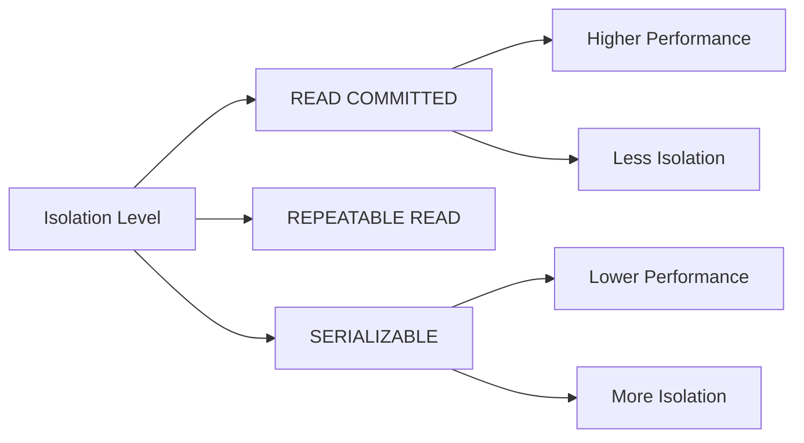

# PostgreSQL Transaction Performance

## Introduction

Transaction performance is a critical aspect of database management in PostgreSQL. Whether you're building a small application or scaling to handle millions of requests, how you design and implement transactions can dramatically impact your database's efficiency and responsiveness.

In this guide, we'll explore how to optimize transaction performance in PostgreSQL, identify common bottlenecks, and implement best practices that help maintain data integrity while maximizing throughput.

## Why Transaction Performance Matters

Transactions in PostgreSQL ensure data consistency by grouping operations that must succeed or fail as a unit. However, they come with performance trade-offs:

- **Resource Usage**: Each transaction consumes memory and processing power
- **Concurrency**: Poorly designed transactions can lead to contention and blocking
- **Scalability**: As user load increases, transaction performance becomes more critical

## Key Factors Affecting Transaction Performance

### 1. Transaction Size and Duration

One of the most significant factors affecting performance is how large and long-lived your transactions are.

#### Long-Running Transactions

Long-running transactions can cause several problems:

- They hold locks for extended periods, blocking other transactions
- They prevent VACUUM from cleaning up dead tuples, leading to table bloat
- They increase the risk of conflicts with other transactions

```sql
-- ❌ Problematic: Long-running transaction
BEGIN;
-- ... many operations or long processing time
-- ... possibly minutes or hours
COMMIT;

-- ✅ Better: Smaller, focused transactions
BEGIN;
-- Small set of related operations
COMMIT;
```

### 2. Transaction Isolation Levels

PostgreSQL provides four transaction isolation levels, each with different performance characteristics:

- **READ UNCOMMITTED**: Not actually implemented in PostgreSQL (treated as READ COMMITTED)
- **READ COMMITTED**: Default level, offers good performance with reasonable isolation
- **REPEATABLE READ**: Prevents non-repeatable reads, but has higher overhead
- **SERIALIZABLE**: Strongest isolation, but with significant performance impact

```sql
-- Setting a transaction isolation level
BEGIN;
SET TRANSACTION ISOLATION LEVEL READ COMMITTED;
-- ... your operations
COMMIT;
```



### 3. Connection Pooling

Creating database connections is expensive. Connection pooling can significantly improve transaction performance by reusing connections:

```sql
-- Without pooling, each transaction might create a new connection
-- With pooling, connections are reused
```

Popular connection poolers for PostgreSQL include:
- PgBouncer
- Pgpool-II
- Built-in connection pooling in application frameworks

### 4. Indexing Strategy

Proper indexing is crucial for transaction performance:

```sql
-- Create an index to speed up transactions that query by email
CREATE INDEX idx_users_email ON users(email);

-- Composite index for common query patterns
CREATE INDEX idx_orders_user_date ON orders(user_id, order_date);
```

When designing indexes for transaction performance:
- Index columns used in WHERE clauses and JOIN conditions
- Consider partial indexes for specific subsets of data
- Be careful not to over-index, as indexes slow down writes

## Common Transaction Performance Bottlenecks

### 1. Row-Level Contention

When multiple transactions try to modify the same rows, they can block each other:

```sql
-- Transaction 1
BEGIN;
UPDATE accounts SET balance = balance - 100 WHERE id = 1;
-- ... other operations
COMMIT;

-- Transaction 2 (will wait until Transaction 1 commits)
BEGIN;
UPDATE accounts SET balance = balance + 50 WHERE id = 1;
-- ... blocked waiting for Transaction 1
COMMIT;
```

#### Solutions:

- Minimize transaction duration
- Use optimistic concurrency control where appropriate
- Consider application-level locking for highly contended resources

### 2. Table Locks

Some operations like schema changes lock entire tables:

```sql
-- Locks the table against concurrent writes
ALTER TABLE users ADD COLUMN last_login TIMESTAMP;
```

#### Solutions:

- Perform schema changes during maintenance windows
- Use pg_repack for zero-downtime table reordering
- In PostgreSQL 11+, use `ADD COLUMN` with defaults without full table rewrites

### 3. Checkpoint Tuning

Checkpoints flush dirty pages to disk and can cause I/O spikes:

```sql
-- Check current checkpoint settings
SHOW checkpoint_timeout;
SHOW max_wal_size;

-- Adjust settings (in postgresql.conf or via ALTER SYSTEM)
ALTER SYSTEM SET checkpoint_timeout = '15min';
ALTER SYSTEM SET max_wal_size = '2GB';
```

## Practical Examples: Optimizing Transaction Performance

### Example 1: Batch Processing

Processing records in batches rather than individually can dramatically improve performance:

```sql
-- ❌ Inefficient: Processing one record at a time
DO $$
DECLARE
  r RECORD;
BEGIN
  FOR r IN SELECT * FROM large_table
  LOOP
    -- Process each record in its own transaction
    UPDATE another_table SET processed = TRUE WHERE id = r.id;
    COMMIT;
  END LOOP;
END $$;

-- ✅ Better: Batch processing
BEGIN;
UPDATE another_table 
SET processed = TRUE 
WHERE id IN (SELECT id FROM large_table LIMIT 1000);
COMMIT;

-- Continue with next batch...
```

### Example 2: Using COPY for Bulk Inserts

For large data imports, `COPY` is much faster than individual `INSERT` statements:

```sql
-- ❌ Slow: Individual inserts
INSERT INTO users (name, email) VALUES ('User 1', 'user1@example.com');
INSERT INTO users (name, email) VALUES ('User 2', 'user2@example.com');
-- ... many more inserts

-- ✅ Fast: Using COPY
COPY users (name, email) FROM '/path/to/users.csv' WITH CSV HEADER;
```

### Example 3: Optimizing with Prepared Statements

Prepared statements improve performance by allowing PostgreSQL to plan queries once and execute them many times:

```sql
-- Prepare the statement once
PREPARE update_user(int, text) AS
UPDATE users SET last_login = NOW() WHERE id = $1 AND status = $2;

-- Execute it many times with different parameters
EXECUTE update_user(101, 'active');
EXECUTE update_user(102, 'active');
EXECUTE update_user(103, 'active');
```

## Monitoring Transaction Performance

PostgreSQL offers several ways to monitor transaction performance:

### Using pg_stat_activity

```sql
-- View active transactions
SELECT pid, query_start, state, query
FROM pg_stat_activity
WHERE state != 'idle'
ORDER BY query_start;
```

### Finding Blocking Transactions

```sql
SELECT blocked_locks.pid AS blocked_pid,
       blocking_locks.pid AS blocking_pid,
       blocked_activity.query AS blocked_query,
       blocking_activity.query AS blocking_query
FROM pg_catalog.pg_locks blocked_locks
JOIN pg_catalog.pg_locks blocking_locks 
    ON blocked_locks.transactionid = blocking_locks.transactionid
    AND blocked_locks.pid != blocking_locks.pid
JOIN pg_catalog.pg_stat_activity blocked_activity 
    ON blocked_activity.pid = blocked_locks.pid
JOIN pg_catalog.pg_stat_activity blocking_activity 
    ON blocking_activity.pid = blocking_locks.pid
WHERE NOT blocked_locks.granted;
```

## Best Practices for Transaction Performance

1. **Keep transactions short and focused**
   - Avoid mixing read-only and write operations when possible
   - Don't include user interaction or external API calls in transactions

2. **Choose the right isolation level**
   - Use READ COMMITTED (the default) unless you have specific needs
   - Only use SERIALIZABLE when absolute consistency is required

3. **Use connection pooling**
   - Implement a connection pool at the application level or using a tool like PgBouncer

4. **Optimize queries within transactions**
   - Ensure proper indexing
   - Avoid unnecessary joins or subqueries
   - Use EXPLAIN ANALYZE to identify slow queries

5. **Consider database partitioning**
   - Horizontal partitioning can reduce contention and improve performance

6. **Use advisory locks for application-level locking**
   - They can help coordinate access without blocking database operations

```sql
-- Acquiring an advisory lock (will not block others from accessing the table)
SELECT pg_advisory_lock(123);
-- Do your work
SELECT pg_advisory_unlock(123);
```

## Summary

Optimizing PostgreSQL transaction performance involves understanding the trade-offs between consistency, isolation, and performance. By keeping transactions small and focused, choosing appropriate isolation levels, leveraging connection pooling, and implementing proper indexing strategies, you can significantly improve your database's throughput and responsiveness.

Remember that transaction performance optimization is often an iterative process:
1. Measure current performance
2. Identify bottlenecks
3. Apply targeted optimizations
4. Measure again to validate improvements

## Additional Resources

- PostgreSQL Documentation on [Transactions](https://www.postgresql.org/docs/current/transaction-iso.html)
- Book: "PostgreSQL 14 Administration Cookbook" by Simon Riggs and Gianni Ciolli
- Tool: pgBadger for PostgreSQL log analysis
- Extension: pg_stat_statements for query performance monitoring

## Exercises

1. Set up a test database and experiment with different transaction isolation levels. Measure the performance impact using `EXPLAIN ANALYZE`.

2. Implement a connection pooling solution like PgBouncer and compare the performance of your application before and after.

3. Identify a transaction in your application that frequently blocks others. Refactor it using the techniques discussed in this guide and measure the improvement.

4. Write a script to monitor long-running transactions in your database and alert when they exceed a threshold.