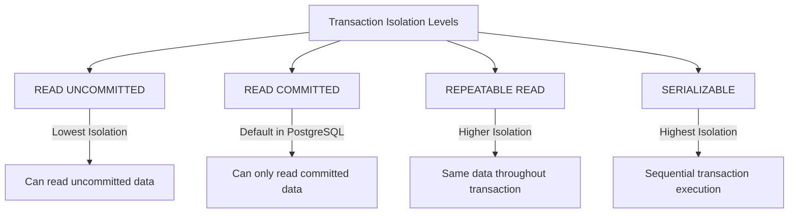

# PostgreSQL BEGIN TRANSACTION

## Introduction

Transactions are a fundamental concept in database management systems that allow you to group multiple operations into a single, atomic unit of work. In PostgreSQL, a transaction begins with the `BEGIN` statement and ends with either a `COMMIT` (to save changes) or `ROLLBACK` (to discard changes).

This concept is crucial for maintaining data integrity, especially when multiple related changes need to be applied together or not at all. In this tutorial, we'll explore how to use the `BEGIN TRANSACTION` statement in PostgreSQL and understand its importance in database operations.

## Basic Syntax

The basic syntax for starting a transaction in PostgreSQL is:

```sql
BEGIN;
-- or
BEGIN TRANSACTION;
-- or
BEGIN WORK;
```

All three variations are equivalent and start a new transaction block.

## Understanding Transactions

Before diving into examples, let's understand what transactions are and why they matter:

1. **Atomicity**: All operations in a transaction either complete successfully or none of them do.
2. **Consistency**: A transaction brings the database from one valid state to another.
3. **Isolation**: Transactions operate independently of other transactions.
4. **Durability**: Once a transaction is committed, it remains so even in case of system failure.

These four properties are commonly referred to as ACID properties.

## Basic Transaction Example

Let's look at a simple example of a transaction that transfers money from one account to another:

```sql
BEGIN;

-- Deduct $100 from account 1
UPDATE accounts 
SET balance = balance - 100 
WHERE account_id = 1;

-- Add $100 to account 2
UPDATE accounts 
SET balance = balance + 100 
WHERE account_id = 2;

COMMIT;
```

If either update fails, the entire transaction will be rolled back, ensuring that money is neither created nor destroyed in the process.

## Error Handling in Transactions

What happens when an error occurs within a transaction? Let's see:

```sql
BEGIN;

-- This will succeed
UPDATE products 
SET stock = stock - 1 
WHERE product_id = 101;

-- This will fail if price is already negative
UPDATE products 
SET price = price - 50 
WHERE price < 40;

COMMIT;
```

If the second update causes an error (for example, due to a constraint violation), PostgreSQL will abort the rest of the transaction. The first update will not take effect unless you explicitly handle the error or use savepoints (discussed later).

## Transaction Isolation Levels

PostgreSQL supports different isolation levels that determine how transactions interact with each other:



You can set the isolation level when beginning a transaction:

```sql
BEGIN TRANSACTION ISOLATION LEVEL SERIALIZABLE;
-- Transaction commands here
COMMIT;
```

PostgreSQL's default isolation level is `READ COMMITTED`.

## Nested Transactions with Savepoints

While PostgreSQL doesn't support true nested transactions, it provides savepoints that allow partial rollbacks:

```sql
BEGIN;

UPDATE inventory SET quantity = quantity - 1 WHERE item_id = 1;

SAVEPOINT update_inventory;

-- This operation might fail
UPDATE orders SET status = 'shipped' WHERE order_id = 1001;

-- If the above fails, we can roll back to the savepoint
ROLLBACK TO update_inventory;

-- Try another approach
UPDATE order_history SET notes = 'Shipping delayed' WHERE order_id = 1001;

COMMIT;
```

## Practical Use Cases

### 1. User Registration System

When creating a new user, you might need to:
1. Insert a record into the `users` table
2. Create default settings in the `user_settings` table
3. Add initial permissions in the `user_permissions` table

Using a transaction ensures that either all operations succeed or none do:

```sql
BEGIN;

INSERT INTO users (username, email, password_hash) 
VALUES ('new_user', 'user@example.com', 'hashed_password')
RETURNING user_id INTO @new_user_id;

INSERT INTO user_settings (user_id, theme, notifications_enabled) 
VALUES (@new_user_id, 'default', true);

INSERT INTO user_permissions (user_id, permission_level) 
VALUES (@new_user_id, 'basic');

COMMIT;
```

### 2. Inventory Management

When processing an order, you need to update inventory and create order records:

```sql
BEGIN;

-- Check if enough stock exists
SELECT quantity INTO @current_stock FROM inventory WHERE product_id = 123;

IF @current_stock >= 5 THEN
    -- Reduce inventory
    UPDATE inventory SET quantity = quantity - 5 WHERE product_id = 123;
    
    -- Create order
    INSERT INTO orders (customer_id, order_date, status)
    VALUES (456, CURRENT_TIMESTAMP, 'pending')
    RETURNING order_id INTO @new_order_id;
    
    -- Add order items
    INSERT INTO order_items (order_id, product_id, quantity, price)
    VALUES (@new_order_id, 123, 5, 25.99);
    
    COMMIT;
ELSE
    -- Not enough stock
    ROLLBACK;
END IF;
```

## Performance Considerations

Transactions have performance implications that you should be aware of:

1. **Transaction Duration**: Keep transactions as short as possible to reduce lock contention.
2. **Number of Operations**: Including too many operations in a single transaction can lead to lock escalation.
3. **Isolation Level Impact**: Higher isolation levels provide more consistency but may reduce concurrency.

## Common Pitfalls and Best Practices

### Pitfalls to Avoid

1. **Forgetting to COMMIT or ROLLBACK**: This can lead to idle transactions holding locks.
2. **Transaction Too Large**: Including too many operations can lead to performance issues.
3. **Not Handling Errors**: Errors within transactions need proper handling to ensure data integrity.

### Best Practices

1. **Keep Transactions Short**: Focus on logically related operations only.
2. **Use Appropriate Isolation Levels**: Choose the level that suits your specific consistency needs.
3. **Handle Errors Properly**: Implement error handling to deal with failures gracefully.
4. **Consider Connection Pooling**: In application code, be mindful of how transactions interact with connection pooling.

## Summary

The `BEGIN TRANSACTION` statement in PostgreSQL marks the starting point of a transaction block, allowing you to group multiple database operations into a single atomic unit. This provides data integrity, consistency, and error recovery capabilities that are essential for robust database applications.

Transactions are particularly important when multiple related changes must succeed or fail together, such as financial transfers, inventory updates with order creation, or user registration processes involving multiple tables.

By understanding how to properly implement and manage transactions, you'll build more reliable and consistent database applications.

## Further Practice

Try these exercises to reinforce your understanding:

1. Create a transaction that inserts a new product and its categories in separate tables.
2. Write a transaction that transfers funds between accounts, but only if the source account has sufficient funds.
3. Experiment with different isolation levels to see how they affect concurrent operations.
4. Implement a transaction with savepoints and partial rollbacks to handle complex error scenarios.

## Additional Resources

- [PostgreSQL Official Documentation on Transactions](https://www.postgresql.org/docs/current/tutorial-transactions.html)
- [ACID Properties in Database Systems](https://www.postgresql.org/docs/current/transaction-iso.html)
- [Transaction Isolation Levels in PostgreSQL](https://www.postgresql.org/docs/current/transaction-iso.html)