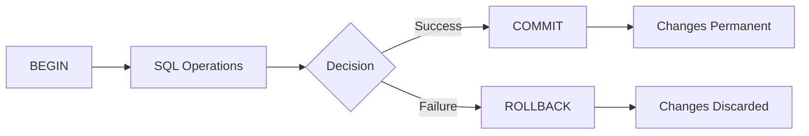

# PostgreSQL COMMIT

## Introduction

When working with databases, ensuring data integrity is crucial. PostgreSQL, like many relational database management systems, uses transactions to maintain data consistency. A transaction is a sequence of one or more SQL operations that are executed as a single unit of work. The `COMMIT` command plays a vital role in this process by making the changes within a transaction permanent in the database.

In this guide, we'll explore how the `COMMIT` command works in PostgreSQL, why it's important, and how to use it effectively in your database operations.

## Understanding Transactions in PostgreSQL

Before diving into `COMMIT`, let's briefly understand what transactions are in PostgreSQL:

A transaction is a unit of work that either completely succeeds or completely fails. This property, known as atomicity, ensures that your database remains in a consistent state even if errors occur.



A PostgreSQL transaction follows these basic steps:
1. Start with `BEGIN` (or `START TRANSACTION`)
2. Execute one or more SQL statements
3. End with either `COMMIT` (to save changes) or `ROLLBACK` (to discard changes)

## The COMMIT Command

The `COMMIT` command permanently saves all changes made during the current transaction and makes them visible to other database sessions. Once committed, the changes cannot be undone through a `ROLLBACK` command.

### Basic Syntax

```sql
COMMIT;
-- or
COMMIT TRANSACTION;
-- or
COMMIT WORK;
```

All three forms are functionally identical in PostgreSQL.

## When to Use COMMIT

You should use `COMMIT` when:

1. You've completed all the operations in your transaction
2. The database is in a consistent state
3. You want to make your changes permanent
4. You want to release locks acquired during the transaction

## Examples of Using COMMIT

### Example 1: Basic Transaction

Let's start with a simple example of creating a table and inserting data within a transaction:

```sql
BEGIN;

CREATE TABLE employees (
    id SERIAL PRIMARY KEY,
    name VARCHAR(100),
    department VARCHAR(100),
    salary NUMERIC(10, 2)
);

INSERT INTO employees (name, department, salary)
VALUES ('John Doe', 'Engineering', 75000.00);

COMMIT;
```

**Output:**
```
BEGIN
CREATE TABLE
INSERT 0 1
COMMIT
```

After executing the `COMMIT` command, the table creation and data insertion become permanent in the database.

### Example 2: Multiple Related Operations

Transactions are especially useful when multiple related operations need to succeed or fail together:

```sql
BEGIN;

-- Create a new order
INSERT INTO orders (customer_id, order_date, total_amount)
VALUES (101, CURRENT_DATE, 1250.00)
RETURNING id INTO order_id;

-- Add order items
INSERT INTO order_items (order_id, product_id, quantity, price)
VALUES 
    (order_id, 1, 2, 500.00),
    (order_id, 3, 1, 250.00);

-- Update inventory
UPDATE products SET stock = stock - 2 WHERE id = 1;
UPDATE products SET stock = stock - 1 WHERE id = 3;

COMMIT;
```

In this example, we create an order, add order items, and update the inventory. The `COMMIT` ensures that all these operations are applied together, maintaining data consistency.

### Example 3: Transaction with Error Handling

Here's how you might implement error handling with transactions in a PostgreSQL function:

```sql
CREATE OR REPLACE FUNCTION transfer_funds(
    sender_id INT,
    recipient_id INT,
    amount NUMERIC
) RETURNS BOOLEAN AS $$
DECLARE
    sender_balance NUMERIC;
BEGIN
    -- Start transaction
    BEGIN;
    
    -- Check sender's balance
    SELECT balance INTO sender_balance FROM accounts WHERE id = sender_id;
    
    IF sender_balance < amount THEN
        ROLLBACK;
        RETURN FALSE;
    END IF;
    
    -- Update sender's account
    UPDATE accounts 
    SET balance = balance - amount 
    WHERE id = sender_id;
    
    -- Update recipient's account
    UPDATE accounts 
    SET balance = balance + amount 
    WHERE id = recipient_id;
    
    -- Commit the transaction
    COMMIT;
    
    RETURN TRUE;
EXCEPTION
    WHEN OTHERS THEN
        -- If any error occurs, rollback and return false
        ROLLBACK;
        RETURN FALSE;
END;
$$ LANGUAGE plpgsql;
```

In this function, `COMMIT` is only executed if all operations succeed without errors.

## Auto-Commit Mode

By default, PostgreSQL operates in "auto-commit" mode, where each SQL statement is treated as a separate transaction that is automatically committed upon completion. However, when working with multiple related operations, explicitly defining transactions with `BEGIN` and `COMMIT` gives you more control.

To check if you're in auto-commit mode in psql:

```sql
\echo :AUTOCOMMIT
```

## COMMIT vs. ROLLBACK

Understanding the difference between `COMMIT` and `ROLLBACK` is crucial:

| COMMIT | ROLLBACK |
|--------|----------|
| Makes changes permanent | Discards all changes made during the transaction |
| Releases locks acquired during the transaction | Releases locks acquired during the transaction |
| Cannot be undone | Used when errors occur or when changes should not be saved |
| Ends the current transaction | Ends the current transaction |

## Best Practices for Using COMMIT

1. **Keep Transactions Short**: Long-running transactions can lead to performance issues by holding locks for extended periods.

2. **Group Related Operations**: Include only logically related operations in a single transaction.

3. **Handle Errors Properly**: Always include error handling to ensure transactions are either committed or rolled back appropriately.

4. **Be Mindful of Concurrency**: Understand how transactions affect concurrent access to your database.

5. **Consider Savepoints**: For complex transactions, use savepoints (`SAVEPOINT`) to allow partial rollbacks.

6. **Avoid Excessive Transactions**: Don't wrap each statement in its own transaction when multiple statements are related.

## Common Issues and Troubleshooting

### Transaction Hanging

If a transaction seems to be hanging, it might be waiting for locks. You can check active transactions with:

```sql
SELECT * FROM pg_stat_activity WHERE state = 'active';
```

### Implicit Transactions

Some client libraries or ORMs might start transactions implicitly. Always check your client's documentation to understand its transaction behavior.

### Forgetting to COMMIT

Forgetting to commit changes is a common mistake. Changes will remain invisible to other sessions until committed, and they might be lost if the session terminates unexpectedly.

## Summary

The `COMMIT` command is an essential part of transaction management in PostgreSQL. It allows you to:

- Make changes permanent in the database
- Group related operations to ensure data consistency
- Release locks acquired during a transaction
- Complete the transaction process

Understanding how and when to use `COMMIT` is crucial for maintaining data integrity in your PostgreSQL database applications.

## Exercises

1. Create a transaction that adds a new customer and their initial order in a single atomic operation.

2. Write a transaction that updates inventory levels across multiple products and includes checks to prevent negative stock levels.

3. Implement a banking-style transfer function that uses transactions to ensure money is neither created nor destroyed during transfers.

## Additional Resources

- [PostgreSQL Official Documentation on Transactions](https://www.postgresql.org/docs/current/tutorial-transactions.html)
- [PostgreSQL ACID Properties](https://www.postgresql.org/docs/current/transaction-iso.html)
- [Transaction Isolation Levels in PostgreSQL](https://www.postgresql.org/docs/current/transaction-iso.html)