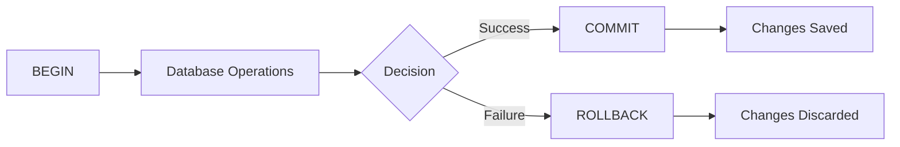

# PostgreSQL ROLLBACK

## Introduction

In PostgreSQL, a **ROLLBACK** command is used to undo changes made in the current transaction and restore the database to its state before the transaction began. This is one of the fundamental operations in transaction management that helps maintain data integrity.

When working with databases, especially in production environments, the ability to cancel operations and revert to a previous state is critical. PostgreSQL's ROLLBACK gives you this power, allowing you to experiment with changes and discard them if necessary.

## Transaction Basics

Before diving into ROLLBACK, let's understand what a transaction is.

A transaction is a sequence of database operations that are treated as a single logical unit of work. In PostgreSQL, a transaction begins with the `BEGIN` command and ends with either `COMMIT` (to save changes) or `ROLLBACK` (to discard changes).

The core principle is "all or nothing" - either all operations in a transaction succeed, or none of them do.



## ROLLBACK Syntax

The basic syntax for ROLLBACK in PostgreSQL is straightforward:

```sql
ROLLBACK;
```

or the more explicit form:

```sql
ROLLBACK TRANSACTION;
```

Both commands have the same effect: they undo all changes made within the current transaction.

## How ROLLBACK Works

When you issue a ROLLBACK command:

1. All changes made since the beginning of the transaction (`BEGIN`) are discarded
2. Any locks acquired during the transaction are released
3. The transaction ends, returning the database to its state before the transaction started
4. The system is ready for a new transaction

## Basic Examples

Let's look at some examples of ROLLBACK in action:

### Example 1: Simple ROLLBACK

```sql
BEGIN;
INSERT INTO customers (first_name, last_name, email) 
VALUES ('John', 'Doe', 'john.doe@example.com');
-- Oh wait, we made a mistake!
ROLLBACK;
```

In this example, the INSERT operation is cancelled and no new record is added to the `customers` table.

### Example 2: Viewing the Effects

Let's see how ROLLBACK impacts the database state:

```sql
-- Initial state
SELECT COUNT(*) FROM products;
-- Output: 100

BEGIN;
DELETE FROM products WHERE price < 10;
SELECT COUNT(*) FROM products;
-- Output: 75 (25 products were deleted)

-- Let's undo that
ROLLBACK;

-- Check count again
SELECT COUNT(*) FROM products;
-- Output: 100 (all products restored)
```

This example demonstrates how ROLLBACK restores the database to its original state.

## Practical Use Cases

### Use Case 1: Data Modification Safety

When making complex changes to important data, wrapping operations in a transaction with potential ROLLBACK provides a safety net:

```sql
BEGIN;

UPDATE accounts SET balance = balance - 1000 WHERE account_id = 123;
UPDATE accounts SET balance = balance + 1000 WHERE account_id = 456;

-- Verify the changes
SELECT account_id, balance FROM accounts WHERE account_id IN (123, 456);

-- If something looks wrong
ROLLBACK;
-- or if everything looks good
-- COMMIT;
```

### Use Case 2: Testing Data Modifications

During development or when writing scripts, you can use transactions to test changes without risk:

```sql
BEGIN;

-- Complex series of operations
ALTER TABLE users ADD COLUMN date_of_birth DATE;
UPDATE users SET date_of_birth = '2000-01-01' WHERE date_of_birth IS NULL;
CREATE INDEX idx_users_dob ON users(date_of_birth);

-- Check results
\d users

-- Since this is just a test
ROLLBACK;
```

### Use Case 3: Error Handling in Application Code

In application code (like Node.js with the `pg` library):

```javascript
const { Pool } = require('pg');
const pool = new Pool();

async function transferFunds(fromAccount, toAccount, amount) {
  const client = await pool.connect();
  
  try {
    await client.query('BEGIN');
    
    await client.query(
      'UPDATE accounts SET balance = balance - $1 WHERE account_id = $2',
      [amount, fromAccount]
    );
    
    await client.query(
      'UPDATE accounts SET balance = balance + $1 WHERE account_id = $2',
      [amount, toAccount]
    );
    
    await client.query('COMMIT');
    return true;
  } catch (e) {
    await client.query('ROLLBACK');
    console.error('Error during transaction, rolled back.', e);
    return false;
  } finally {
    client.release();
  }
}
```

## ROLLBACK TO SAVEPOINT

PostgreSQL also supports saving intermediate states within a transaction using **savepoints**. This allows for more granular control over what parts of a transaction to roll back.

### Savepoint Syntax

```sql
-- Create a savepoint
SAVEPOINT savepoint_name;

-- Roll back to a specific savepoint
ROLLBACK TO SAVEPOINT savepoint_name;
-- or the shorter form
ROLLBACK TO savepoint_name;

-- Remove a savepoint
RELEASE SAVEPOINT savepoint_name;
```

### Savepoint Example

```sql
BEGIN;

INSERT INTO orders (customer_id, order_date) VALUES (1001, CURRENT_DATE);
-- Get the new order ID
SELECT currval('orders_id_seq') AS new_order_id;
-- Let's say this returned 5001

SAVEPOINT after_order_created;

INSERT INTO order_items (order_id, product_id, quantity) 
VALUES (5001, 101, 5);
INSERT INTO order_items (order_id, product_id, quantity) 
VALUES (5001, 102, 3);

-- Oh no, wrong products!
ROLLBACK TO after_order_created;

-- Now add the correct items
INSERT INTO order_items (order_id, product_id, quantity) 
VALUES (5001, 201, 2);
INSERT INTO order_items (order_id, product_id, quantity) 
VALUES (5001, 202, 1);

COMMIT;
```

In this example, we:
1. Create an order
2. Set a savepoint
3. Add incorrect items
4. Roll back to the savepoint (keeping the order but removing incorrect items)
5. Add the correct items
6. Commit everything

## Common Scenarios for Using ROLLBACK

### 1. Validation Failures

```sql
BEGIN;

UPDATE users SET email = 'new.email@example.com' WHERE user_id = 123;

-- Check if email is valid format or not already used
SELECT COUNT(*) FROM users WHERE email = 'new.email@example.com';
-- If count > 1, there's a duplicate

ROLLBACK; -- if validation fails
-- or COMMIT if everything is fine
```

### 2. Maintaining Referential Integrity

```sql
BEGIN;

DELETE FROM departments WHERE department_id = 10;

-- Check if there are still employees in this department
SELECT COUNT(*) FROM employees WHERE department_id = 10;
-- If count > 0, we have orphaned records

ROLLBACK; -- if there are still employees
-- or handle employees first, then COMMIT
```

### 3. Transaction Timeouts and Deadlocks

PostgreSQL automatically rolls back transactions that encounter deadlocks or exceed configured timeout limits. This helps prevent database hangs and keeps the system responsive.

## Best Practices

1. **Keep Transactions Short**: Long-running transactions hold locks and can impact database performance.

2. **Be Specific**: Only include necessary operations in a transaction to minimize lock contention.

3. **Error Handling**: Always implement proper error handling with ROLLBACK in application code.

4. **Test Transactions**: Test rollback scenarios explicitly during development to ensure they work as expected.

5. **Savepoints**: Use savepoints for complex transactions where partial rollbacks might be needed.

6. **Transaction Isolation**: Understand PostgreSQL's transaction isolation levels and their impact on concurrency.

## Limitations and Considerations

- **Autonomous Transactions**: PostgreSQL doesn't support autonomous transactions (nested independent transactions).

- **DDL in Transactions**: Unlike some databases, PostgreSQL allows DDL (CREATE TABLE, etc.) in transactions that can be rolled back.

- **Performance Impact**: Rolling back large transactions can be resource-intensive.

- **Auto-commit**: By default, each SQL statement runs in its own transaction. Explicitly use BEGIN to group statements.

## Common Errors and Troubleshooting

### "ROLLBACK: no transaction in progress"

This error occurs when you try to ROLLBACK without a corresponding BEGIN:

```sql
ROLLBACK; -- Error if no transaction is active
```

### Transactions Ending Unexpectedly

Certain errors automatically trigger a rollback. For example, unique constraint violations:

```sql
BEGIN;
INSERT INTO users (username) VALUES ('existing_user'); -- If this username already exists
-- PostgreSQL will automatically roll back on error
```

## Summary

The ROLLBACK command is a powerful feature in PostgreSQL that allows you to undo changes made during a transaction. It helps maintain data integrity by ensuring that incomplete or incorrect operations don't affect the database state.

Key points to remember:
- ROLLBACK discards all changes made since BEGIN
- Savepoints allow for partial rollbacks within a transaction
- Always implement proper error handling with ROLLBACK in application code
- Keep transactions as short as possible to minimize lock contention

By effectively using ROLLBACK, you can write safer, more reliable database operations and recover gracefully from errors.

## Exercises

1. Create a table called `practice_rollback` with columns `id` (integer) and `data` (text). Write a transaction that inserts 3 rows, then rolls back. Verify that no data was actually inserted.

2. Create a transaction with two savepoints. Make changes after each savepoint, then roll back to the first savepoint. Commit the transaction and observe which changes persisted.

3. Write a function in your preferred programming language that performs a database operation within a transaction and handles errors with ROLLBACK.

## Additional Resources

- [PostgreSQL Official Documentation on Transactions](https://www.postgresql.org/docs/current/tutorial-transactions.html)
- [Transaction Isolation in PostgreSQL](https://www.postgresql.org/docs/current/transaction-iso.html)
- [Understanding PostgreSQL Concurrency](https://www.postgresql.org/docs/current/mvcc.html)