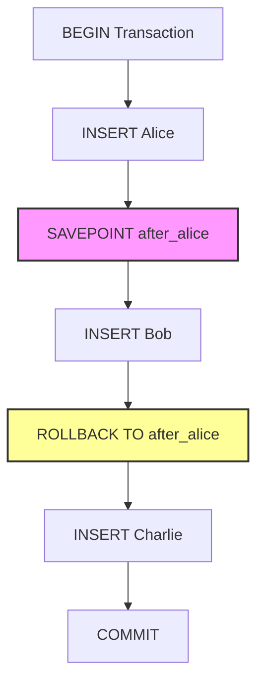

# PostgreSQL SAVEPOINT

## Introduction

In database operations, especially complex ones involving multiple steps, it's often necessary to have finer control over transaction management than simple commits and rollbacks. PostgreSQL's `SAVEPOINT` feature addresses this need by allowing you to create checkpoints within a transaction.

Think of a `SAVEPOINT` as creating a bookmark within your transaction. If something goes wrong after setting a savepoint, you can return to that bookmark without having to undo everything from the beginning of the transaction.

This tutorial will guide you through the concept of savepoints in PostgreSQL, explain when and how to use them, and demonstrate their practical applications with real-world examples.

## Basic Concepts

### What is a SAVEPOINT?

A `SAVEPOINT` establishes a marker within a transaction that you can later roll back to. This gives you more granular control over which parts of a transaction to keep or discard.

### Key SAVEPOINT Commands

PostgreSQL provides three primary commands for working with savepoints:

1. `SAVEPOINT savepoint_name` - Creates a new savepoint
2. `ROLLBACK TO SAVEPOINT savepoint_name` - Rolls back to a specific savepoint
3. `RELEASE SAVEPOINT savepoint_name` - Removes a savepoint (but keeps changes made up to that point)

Let's explore these commands with examples.

## Creating and Using SAVEPOINTs

### Basic Syntax

```sql
-- Start a transaction
BEGIN;

-- Perform some operations
INSERT INTO accounts(id, name, balance) VALUES(1, 'Alice', 1000);

-- Create a savepoint
SAVEPOINT after_alice;

-- Perform more operations
INSERT INTO accounts(id, name, balance) VALUES(2, 'Bob', 500);

-- Return to the savepoint (undo Bob's insert)
ROLLBACK TO SAVEPOINT after_alice;

-- Continue with different operations
INSERT INTO accounts(id, name, balance) VALUES(3, 'Charlie', 750);

-- Commit the transaction
COMMIT;
```

In this example, after the rollback to the savepoint, only Alice and Charlie will be inserted into the database. Bob's insert was undone by the rollback to the savepoint.

### SAVEPOINT Behavior Visualization



## Practical Examples

### Example 1: Error Handling in Batch Processing

Imagine you're processing a batch of customer orders, and you want to ensure that if one order fails, you don't lose the work done for previous orders.

```sql
BEGIN;

-- Process first order
INSERT INTO order_items (order_id, product_id, quantity) VALUES (1001, 101, 2);
UPDATE inventory SET stock = stock - 2 WHERE product_id = 101;

-- Create a savepoint after first order
SAVEPOINT after_order_1;

-- Try to process second order
INSERT INTO order_items (order_id, product_id, quantity) VALUES (1002, 102, 5);

-- Check if we have enough inventory for second order
DO $$
DECLARE
    available_stock INT;
BEGIN
    SELECT stock INTO available_stock FROM inventory WHERE product_id = 102;
    
    IF available_stock < 5 THEN
        -- Not enough stock, rollback to the savepoint
        RAISE NOTICE 'Not enough inventory for product 102. Rolling back order 1002.';
        ROLLBACK TO SAVEPOINT after_order_1;
    ELSE
        -- Update inventory for second order
        UPDATE inventory SET stock = stock - 5 WHERE product_id = 102;
        RAISE NOTICE 'Order 1002 processed successfully.';
    END IF;
END $$;

-- Process third order regardless of what happened with the second
INSERT INTO order_items (order_id, product_id, quantity) VALUES (1003, 103, 1);
UPDATE inventory SET stock = stock - 1 WHERE product_id = 103;

COMMIT;
```

In this example, if there's not enough inventory for the second order, we roll back to the savepoint, effectively undoing just that order while keeping the first order's changes intact. We then continue with processing the third order.

### Example 2: Implementing a Multi-step Form with Validation

When implementing a web application with a multi-step form (like a registration process), savepoints can be useful for database operations:

```sql
BEGIN;

-- Step 1: Create user account
INSERT INTO users (username, email, password_hash) 
VALUES ('newuser', 'user@example.com', 'hashed_password_here');

-- Save this point
SAVEPOINT user_created;

-- Step 2: Try to create user profile
INSERT INTO user_profiles (user_id, full_name, bio) 
VALUES (currval('users_id_seq'), 'New User', 'This is my bio');

-- Step 3: Try to set user preferences
BEGIN;
    INSERT INTO user_preferences (user_id, theme, notifications_enabled) 
    VALUES (currval('users_id_seq'), 'dark', true);
EXCEPTION WHEN OTHERS THEN
    -- If setting preferences fails, roll back to after creating the profile
    ROLLBACK TO SAVEPOINT user_created;
    
    -- And try a different approach for the profile
    INSERT INTO user_profiles (user_id, full_name) 
    VALUES (currval('users_id_seq'), 'New User');
    -- (No bio this time - simplified profile)
END;

COMMIT;
```

This example shows how you might handle a multi-step form submission where certain steps might fail, but you want to preserve earlier steps and try alternative approaches.

## Advanced SAVEPOINT Concepts

### Nesting SAVEPOINTs

You can create multiple savepoints within a transaction, allowing for nested levels of rollback:

```sql
BEGIN;

INSERT INTO logs (message) VALUES ('Starting process');
SAVEPOINT step_1;

UPDATE accounts SET balance = balance - 100 WHERE id = 1;
SAVEPOINT step_2;

UPDATE accounts SET balance = balance + 100 WHERE id = 2;
SAVEPOINT step_3;

-- Oops, we transferred to the wrong account!
ROLLBACK TO SAVEPOINT step_2;

-- Correct the mistake
UPDATE accounts SET balance = balance + 100 WHERE id = 3;

COMMIT;
```

In this example, we roll back to `step_2`, undoing the transfer to account id=2 while keeping the withdrawal from account id=1, then sending the money to the correct account (id=3).

### Releasing SAVEPOINTs

The `RELEASE SAVEPOINT` command removes a savepoint without rolling back:

```sql
BEGIN;

INSERT INTO products (name, price) VALUES ('Widget', 9.99);
SAVEPOINT after_widget;

INSERT INTO products (name, price) VALUES ('Gadget', 19.99);
SAVEPOINT after_gadget;

-- We're confident in these changes, so release the first savepoint
RELEASE SAVEPOINT after_widget;

INSERT INTO products (name, price) VALUES ('Doohickey', 14.99);

-- If we try to rollback to a released savepoint, it will error
-- ROLLBACK TO SAVEPOINT after_widget; -- This would cause an error

COMMIT;
```

Releasing a savepoint can help manage memory in very large transactions, but is generally optional as all savepoints are automatically released at the end of a transaction.

## Limitations and Considerations

When working with SAVEPOINTs, keep these important considerations in mind:

1. **Transaction Size**: Each savepoint increases the memory used by the transaction. For very large transactions with many savepoints, this can impact performance.

2. **Naming Conventions**: Choose clear, descriptive names for your savepoints to make your code more maintainable.

3. **DDL Operations**: Some DDL (Data Definition Language) operations like `CREATE TABLE` cause an implicit commit in many databases, but PostgreSQL allows them within transactions. However, they cannot be rolled back to a savepoint.

4. **Isolation Levels**: Savepoints work within the context of your transaction's isolation level. They don't change how other concurrent transactions see your data.

5. **Nested Transactions**: PostgreSQL doesn't support true nested transactions, but savepoints can simulate similar behavior.

## Real-world Application: Implementing a Shopping Cart

Let's build a complete example that demonstrates how savepoints can be used in an e-commerce application to handle the checkout process:

```sql
BEGIN;

-- Initialize the order
INSERT INTO orders (customer_id, order_date, status) 
VALUES (123, CURRENT_DATE, 'pending');

-- Store the new order ID
DO $$
DECLARE
    new_order_id INT;
BEGIN
    SELECT currval('orders_id_seq') INTO new_order_id;
    RAISE NOTICE 'Created new order with ID: %', new_order_id;
END $$;

SAVEPOINT order_created;

-- Try to add multiple items to the cart
DO $$
DECLARE
    new_order_id INT;
    item_ids INT[] := ARRAY[101, 102, 103];
    quantities INT[] := ARRAY[2, 1, 3];
    available_stock INT;
    i INT;
BEGIN
    SELECT currval('orders_id_seq') INTO new_order_id;
    
    -- Loop through each item
    FOR i IN 1..array_length(item_ids, 1) LOOP
        -- Create a savepoint before each item
        EXECUTE 'SAVEPOINT before_item_' || i;
        
        -- Check stock
        SELECT stock INTO available_stock FROM inventory WHERE product_id = item_ids[i];
        
        IF available_stock >= quantities[i] THEN
            -- Add item to order
            INSERT INTO order_items (order_id, product_id, quantity) 
            VALUES (new_order_id, item_ids[i], quantities[i]);
            
            -- Update inventory
            UPDATE inventory SET stock = stock - quantities[i] 
            WHERE product_id = item_ids[i];
            
            RAISE NOTICE 'Added product % (quantity: %) to the order', item_ids[i], quantities[i];
        ELSE
            -- Not enough stock, roll back this item only
            EXECUTE 'ROLLBACK TO SAVEPOINT before_item_' || i;
            RAISE NOTICE 'Insufficient stock for product %. Item not added.', item_ids[i];
        END IF;
    END LOOP;
END $$;

-- Calculate order totals
UPDATE orders SET 
    total_amount = (SELECT SUM(oi.quantity * p.price) 
                    FROM order_items oi 
                    JOIN products p ON oi.product_id = p.id 
                    WHERE oi.order_id = currval('orders_id_seq'))
WHERE id = currval('orders_id_seq');

-- Final check: if no items were added, cancel the whole order
DO $$
DECLARE
    item_count INT;
BEGIN
    SELECT COUNT(*) INTO item_count FROM order_items WHERE order_id = currval('orders_id_seq');
    
    IF item_count = 0 THEN
        RAISE NOTICE 'No items could be added to the order. Rolling back.';
        ROLLBACK TO SAVEPOINT order_created;
        UPDATE orders SET status = 'cancelled' WHERE id = currval('orders_id_seq');
    ELSE
        UPDATE orders SET status = 'confirmed' WHERE id = currval('orders_id_seq');
    END IF;
END $$;

COMMIT;
```

This comprehensive example demonstrates how savepoints can handle complex business logic with multiple potential failure points, ensuring data integrity throughout a multi-step process.

## Summary

PostgreSQL's `SAVEPOINT` feature provides fine-grained control within transactions, allowing developers to:

- Create intermediate points in a transaction to which they can roll back
- Handle errors gracefully without discarding an entire transaction
- Implement complex business logic with proper error handling
- Improve application resilience by managing partial failures

SAVEPOINTs are particularly valuable in:
- Batch processing operations
- Multi-step form submissions
- Shopping cart implementations
- Any process where partial success is better than complete failure

By mastering savepoints, you can build more robust applications that handle errors gracefully and provide better user experiences.

## Practice Exercises

1. Create a transaction that inserts 5 records into a table, with savepoints after each insert. Then roll back to the third savepoint and insert different data.

2. Implement a bank transfer between three accounts using savepoints to ensure that if any step fails, the appropriate actions are taken.

3. Build a simulation of a reservation system that uses savepoints to handle booking conflicts.

## Additional Resources

- [PostgreSQL Official Documentation on SAVEPOINT](https://www.postgresql.org/docs/current/sql-savepoint.html)
- [PostgreSQL Transaction Management](https://www.postgresql.org/docs/current/tutorial-transactions.html)
- [Understanding PostgreSQL Transactions and Isolation Levels](https://www.postgresql.org/docs/current/transaction-iso.html)