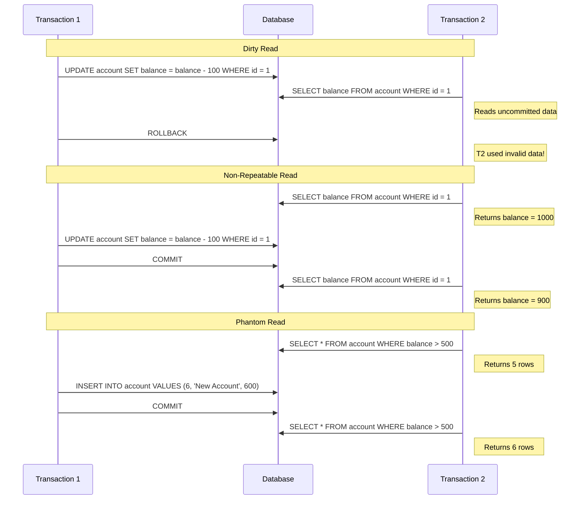

# PostgreSQL Transaction Isolation

## Introduction

When multiple users access a database simultaneously, a system of rules is needed to determine how transactions interact with each other. This system is called **transaction isolation**. PostgreSQL offers four isolation levels, each with different behaviors and guarantees regarding what concurrent transactions can see and do.

In this tutorial, you'll learn:
- What transaction isolation is and why it matters
- The four available isolation levels in PostgreSQL
- Common concurrency problems and how each isolation level handles them
- How to choose the right isolation level for your application

## Understanding Transaction Isolation

Transaction isolation determines how changes made by one transaction are visible to other concurrent transactions. The SQL standard defines four isolation levels, all of which are supported by PostgreSQL:

1. **Read Uncommitted**
2. **Read Committed**
3. **Repeatable Read**
4. **Serializable**

Each level provides different trade-offs between data consistency and performance.

## Common Concurrency Problems

Before diving into isolation levels, let's understand the concurrency problems they're designed to prevent:

### Dirty Read

A transaction reads data written by a concurrent uncommitted transaction.

### Non-Repeatable Read

A transaction reads the same row twice and gets different results because another transaction has modified the row between reads.

### Phantom Read

A transaction re-executes a query returning a set of rows that satisfy a search condition and finds that the set of rows has changed due to another recently-committed transaction.

### Serialization Anomaly

The result of successfully committing a group of transactions is inconsistent with all possible orderings of running those transactions one at a time.

Let's visualize these problems with a Mermaid diagram:



## PostgreSQL Isolation Levels

Now let's explore each isolation level and how it handles these problems:

### Read Uncommitted

In PostgreSQL, this level behaves the same as Read Committed because PostgreSQL doesn't allow dirty reads.

```sql
BEGIN;
SET TRANSACTION ISOLATION LEVEL READ UNCOMMITTED;
-- Your queries here
COMMIT;
```

### Read Committed

This is PostgreSQL's default isolation level. It guarantees that a query will only see data that was committed before the query began.

```sql
BEGIN;
SET TRANSACTION ISOLATION LEVEL READ COMMITTED;

-- Let's see this in action
SELECT balance FROM accounts WHERE id = 1;
-- Suppose this returns 1000

-- Meanwhile, another transaction updates and commits this row

-- If we read again, we might see a different value
SELECT balance FROM accounts WHERE id = 1;
-- This might return 900 if another transaction updated it

COMMIT;
```

Read Committed prevents dirty reads but allows non-repeatable reads and phantom reads.

### Repeatable Read

This level guarantees that any data read during a transaction will stay the same for the duration of the transaction, even if other transactions modify the data.

```sql
BEGIN;
SET TRANSACTION ISOLATION LEVEL REPEATABLE READ;

-- Initial read
SELECT balance FROM accounts WHERE id = 1;
-- Returns 1000

-- Meanwhile, another transaction updates and commits this row

-- Read again
SELECT balance FROM accounts WHERE id = 1;
-- Still returns 1000, even if the row was changed by another transaction

-- But new rows that match our WHERE condition might appear
SELECT * FROM accounts WHERE balance > 500;
-- Might include new rows inserted by other transactions

COMMIT;
```

Repeatable Read prevents dirty reads and non-repeatable reads but allows phantom reads.

### Serializable

The strictest isolation level. It ensures that transactions behave as if they were executed sequentially, one after another, rather than concurrently.

```sql
BEGIN;
SET TRANSACTION ISOLATION LEVEL SERIALIZABLE;

-- Queries here will see a completely consistent snapshot of the database
-- as if no other transactions were running

-- If another transaction would cause a serialization conflict, 
-- one of the transactions will fail with a serialization error

SELECT * FROM accounts WHERE balance > 500;
-- This query would fail if another transaction inserted a row that
-- would have appeared in our results

COMMIT;
```

Serializable prevents all concurrency problems but may cause more transaction failures that need to be retried.

## Isolation Levels Comparison

Here's how each isolation level handles the common concurrency problems:

| Isolation Level | Dirty Read | Non-Repeatable Read | Phantom Read | Serialization Anomaly |
|-----------------|------------|---------------------|--------------|----------------------|
| Read Uncommitted | Prevented | Possible | Possible | Possible |
| Read Committed | Prevented | Possible | Possible | Possible |
| Repeatable Read | Prevented | Prevented | Possible* | Possible |
| Serializable | Prevented | Prevented | Prevented | Prevented |

*In PostgreSQL, Repeatable Read actually prevents most phantom reads, which exceeds the SQL standard requirements.

## Setting the Isolation Level

You can set the isolation level for an entire transaction:

```sql
-- For a single transaction
BEGIN;
SET TRANSACTION ISOLATION LEVEL REPEATABLE READ;
-- Your queries here
COMMIT;

-- Or set the default for your session
SET SESSION CHARACTERISTICS AS TRANSACTION ISOLATION LEVEL SERIALIZABLE;
```

## Real-World Examples

Let's look at some practical examples where different isolation levels are appropriate:

### Example 1: Reporting Query (Read Committed)

For a simple reporting query that doesn't need perfect consistency:

```sql
BEGIN;
SET TRANSACTION ISOLATION LEVEL READ COMMITTED;

-- Get total sales for the day
SELECT SUM(amount) FROM sales WHERE date = CURRENT_DATE;

-- Get top 5 products
SELECT product_name, SUM(amount) AS total 
FROM sales 
WHERE date = CURRENT_DATE 
GROUP BY product_name 
ORDER BY total DESC 
LIMIT 5;

COMMIT;
```

The report might see small inconsistencies if data is being modified during the query execution, but for many reporting scenarios, this is acceptable.

### Example 2: Fund Transfer (Repeatable Read)

When transferring money between accounts:

```sql
BEGIN;
SET TRANSACTION ISOLATION LEVEL REPEATABLE READ;

-- Check if account has sufficient funds
SELECT balance FROM accounts WHERE id = 123;
-- Returns 1000

-- If sufficient funds, perform the transfer
UPDATE accounts SET balance = balance - 500 WHERE id = 123;
UPDATE accounts SET balance = balance + 500 WHERE id = 456;

COMMIT;
```

Repeatable Read ensures that the account balance doesn't change between when we check it and when we update it.

### Example 3: Flight Booking (Serializable)

When booking airline seats where consistency is critical:

```sql
BEGIN;
SET TRANSACTION ISOLATION LEVEL SERIALIZABLE;

-- Check if seat is available
SELECT * FROM seats WHERE flight_id = 789 AND seat_number = '12A' AND status = 'available';

-- If available, book the seat
UPDATE seats SET status = 'booked', customer_id = 101 WHERE flight_id = 789 AND seat_number = '12A';

COMMIT;
```

If another transaction tries to book the same seat concurrently, one of the transactions will fail with a serialization error, preventing double-booking.

## Handling Serialization Failures

When using Serializable isolation, you need to handle potential failures:

```sql
DO $$
DECLARE
  max_retries CONSTANT INT := 3;
  retry_count INT := 0;
  txn_successful BOOLEAN := FALSE;
BEGIN
  WHILE retry_count < max_retries AND NOT txn_successful LOOP
    BEGIN
      -- Start transaction with serializable isolation
      START TRANSACTION ISOLATION LEVEL SERIALIZABLE;
      
      -- Your transaction logic here
      -- Example: Book a flight seat
      UPDATE seats SET status = 'booked', customer_id = 101 
      WHERE flight_id = 789 AND seat_number = '12A' AND status = 'available';
      
      IF NOT FOUND THEN
        RAISE EXCEPTION 'Seat not available';
      END IF;
      
      COMMIT;
      txn_successful := TRUE;
      
    EXCEPTION WHEN serialization_failure OR deadlock_detected THEN
      -- If serialization failure occurs, rollback and try again
      ROLLBACK;
      retry_count := retry_count + 1;
      PERFORM pg_sleep(random() * 0.1); -- Add small random delay
    END;
  END LOOP;
  
  IF NOT txn_successful THEN
    RAISE EXCEPTION 'Transaction failed after % retries', max_retries;
  END IF;
END $$;
```

## Choosing the Right Isolation Level

Consider these factors when choosing an isolation level:

1. **Data consistency requirements** - How important is it that all transactions see a completely consistent view?
2. **Concurrency needs** - How many simultaneous operations need to run efficiently?
3. **Error handling complexity** - Can your application handle serialization failures and retries?

General recommendations:
- Use **Read Committed** (the default) for most general-purpose operations
- Use **Repeatable Read** when you need consistent reads within a transaction
- Use **Serializable** for financial transactions or other cases where consistency is critical

## Summary

Transaction isolation is a crucial concept in PostgreSQL that determines how concurrent transactions interact. PostgreSQL provides four isolation levels with different trade-offs between consistency and performance:

- **Read Uncommitted** (same as Read Committed in PostgreSQL)
- **Read Committed** (default) - prevents dirty reads
- **Repeatable Read** - prevents dirty reads and non-repeatable reads
- **Serializable** - prevents all concurrency problems but may require retry logic

Understanding these isolation levels helps you design robust database applications that handle concurrent access correctly.

## Exercises

1. Try running concurrent transactions with different isolation levels to observe how they behave.
2. Implement a retry mechanism for serialization failures.
3. Identify the appropriate isolation level for different parts of an application you're working on.
4. Create a test case that demonstrates a phantom read and then modify it to prevent the phantom read using the appropriate isolation level.

## Additional Resources

- [PostgreSQL Documentation on Transaction Isolation](https://www.postgresql.org/docs/current/transaction-iso.html)
- [A Visual Explanation of SQL Isolation Levels](https://www.postgresql.org/files/developer/transactions.pdf)
- [Handling Concurrency in PostgreSQL](https://www.postgresql.org/docs/current/mvcc.html)