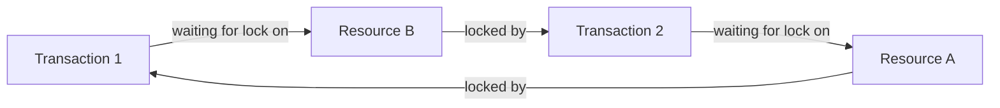

# Understanding PostgreSQL Deadlocks

## Introduction

In multi-user database environments, concurrent transactions accessing the same data can sometimes create a situation where each transaction is waiting for the other to release a resource, resulting in a standstill. This situation is known as a **deadlock**.

PostgreSQL, like all robust database systems, includes mechanisms to detect and resolve deadlocks automatically. However, as a developer, understanding how deadlocks occur and how to prevent them is crucial for building reliable, high-performance applications.

## What is a Deadlock?

A deadlock occurs when two or more transactions are waiting for each other to release locks, creating a cycle of dependencies where none of the transactions can proceed.

Let's visualize this with a simple diagram:



In this classic deadlock scenario:
- Transaction 1 holds a lock on Resource A and needs a lock on Resource B
- Transaction 2 holds a lock on Resource B and needs a lock on Resource A
- Neither transaction can proceed, creating a deadlock

## How PostgreSQL Handles Deadlocks

When a deadlock occurs, PostgreSQL:

1. Automatically detects the deadlock situation
2. Chooses one of the transactions as the "victim"
3. Rolls back the victim transaction
4. Allows the other transaction(s) to proceed
5. Returns an error to the client whose transaction was rolled back

PostgreSQL uses a sophisticated algorithm to determine which transaction to roll back, typically choosing the one that would be least expensive to abort.

## Deadlock Example in PostgreSQL

Let's demonstrate a deadlock with a practical example. Imagine we have a simple banking application with an `accounts` table:

```sql
CREATE TABLE accounts (
    account_id SERIAL PRIMARY KEY,
    account_name VARCHAR(100) NOT NULL,
    balance DECIMAL(15, 2) NOT NULL
);

INSERT INTO accounts (account_name, balance) VALUES 
('Alice', 1000.00),
('Bob', 500.00);
```

Now let's simulate a deadlock using two concurrent transactions:

**Transaction 1 (in session 1):**
```sql
BEGIN;
-- Update Alice's account
UPDATE accounts SET balance = balance - 100.00 WHERE account_name = 'Alice';
-- Wait for 5 seconds to allow Transaction 2 to execute
SELECT pg_sleep(5);
-- Try to update Bob's account (will wait for Transaction 2's lock)
UPDATE accounts SET balance = balance + 100.00 WHERE account_name = 'Bob';
COMMIT;
```

**Transaction 2 (in session 2):**
```sql
BEGIN;
-- Update Bob's account
UPDATE accounts SET balance = balance - 50.00 WHERE account_name = 'Bob';
-- Wait for 2 seconds
SELECT pg_sleep(2);
-- Try to update Alice's account (will wait for Transaction 1's lock)
UPDATE accounts SET balance = balance + 50.00 WHERE account_name = 'Alice';
COMMIT;
```

If you run these two transactions concurrently, PostgreSQL will detect a deadlock and terminate one of them with an error message like:

```
ERROR:  deadlock detected
DETAIL:  Process 1234 waits for ShareLock on transaction 5678; blocked by process 5678.
Process 5678 waits for ShareLock on transaction 1234; blocked by process 1234.
HINT:  See server log for query details.
CONTEXT:  while updating tuple (0,1) in relation "accounts"
```

The server logs will contain more detailed information about the conflicting queries.

## Common Causes of Deadlocks

1. **Random Lock Acquisition Order**: Transactions acquiring locks on the same resources in different orders
2. **Complex Queries**: Queries involving multiple tables with various dependency relationships
3. **Long-Running Transactions**: Transactions that hold locks for extended periods
4. **High Concurrency**: Many simultaneous transactions increasing the likelihood of lock conflicts
5. **Foreign Key Constraints**: Operations that trigger cascading updates or deletes

## Preventing Deadlocks

### 1. Consistent Lock Ordering

One of the most effective ways to prevent deadlocks is to ensure that transactions always acquire locks on resources in the same order:

```sql
-- Good practice: Always update accounts in account_id order
BEGIN;
-- First update the account with lower ID
UPDATE accounts SET balance = balance - 100.00 WHERE account_id = 1;
-- Then update the account with higher ID
UPDATE accounts SET balance = balance + 100.00 WHERE account_id = 2;
COMMIT;
```

### 2. Minimize Transaction Duration

Keep transactions as short as possible to reduce the window for potential conflicts:

```sql
-- Do all required calculations before beginning transaction
DECLARE transfer_amount DECIMAL := 100.00;

-- Start transaction only when ready to update
BEGIN;
UPDATE accounts SET balance = balance - transfer_amount WHERE account_id = 1;
UPDATE accounts SET balance = balance + transfer_amount WHERE account_id = 2;
COMMIT;
```

### 3. Use `SELECT FOR UPDATE` to Lock Rows Early

Acquiring all necessary locks at the beginning of a transaction can prevent deadlocks:

```sql
BEGIN;
-- Lock both rows at the beginning
SELECT * FROM accounts WHERE account_id IN (1, 2) FOR UPDATE;
-- Now perform updates
UPDATE accounts SET balance = balance - 100.00 WHERE account_id = 1;
UPDATE accounts SET balance = balance + 100.00 WHERE account_id = 2;
COMMIT;
```

### 4. Consider Using Advisory Locks

For complex operations, advisory locks let you establish application-level locking patterns:

```sql
BEGIN;
-- Acquire application-level locks for accounts 1 and 2
SELECT pg_advisory_xact_lock(1), pg_advisory_xact_lock(2);
-- Perform operations
UPDATE accounts SET balance = balance - 100.00 WHERE account_id = 1;
UPDATE accounts SET balance = balance + 100.00 WHERE account_id = 2;
COMMIT;
```

### 5. Implement Retry Logic

Since deadlocks can still occur despite precautions, implement retry logic in your application:

```python
def transfer_money(from_account, to_account, amount):
    max_attempts = 3
    attempt = 0
    
    while attempt < max_attempts:
        try:
            with db_connection.transaction():
                # Perform transfer logic here
                return True
        except psycopg2.extensions.TransactionRollbackError as e:
            if "deadlock detected" in str(e):
                attempt += 1
                time.sleep(0.1 * attempt)  # Exponential backoff
            else:
                raise
    
    return False
```

## Detecting and Analyzing Deadlocks

PostgreSQL provides several tools to help identify and analyze deadlocks:

### pg_stat_activity

This view shows currently executing queries and can help identify long-running transactions:

```sql
SELECT pid, age(clock_timestamp(), query_start), usename, query
FROM pg_stat_activity
WHERE state != 'idle'
ORDER BY query_start;
```

### Server Logs

Configure PostgreSQL to log deadlock information:

```sql
-- In postgresql.conf or via ALTER SYSTEM
log_lock_waits = on
deadlock_timeout = 1s  -- Lower for development environments
```

### Lock Monitoring

Check for current locks and waiting transactions:

```sql
SELECT blocked_locks.pid     AS blocked_pid,
         blocked_activity.usename  AS blocked_user,
         blocking_locks.pid     AS blocking_pid,
         blocking_activity.usename AS blocking_user,
         blocked_activity.query    AS blocked_statement,
         blocking_activity.query   AS current_statement_in_blocking_process
   FROM  pg_catalog.pg_locks         blocked_locks
    JOIN pg_catalog.pg_stat_activity blocked_activity  ON blocked_activity.pid = blocked_locks.pid
    JOIN pg_catalog.pg_locks         blocking_locks 
        ON blocking_locks.locktype = blocked_locks.locktype
        AND blocking_locks.database IS NOT DISTINCT FROM blocked_locks.database
        AND blocking_locks.relation IS NOT DISTINCT FROM blocked_locks.relation
        AND blocking_locks.page IS NOT DISTINCT FROM blocked_locks.page
        AND blocking_locks.tuple IS NOT DISTINCT FROM blocked_locks.tuple
        AND blocking_locks.virtualxid IS NOT DISTINCT FROM blocked_locks.virtualxid
        AND blocking_locks.transactionid IS NOT DISTINCT FROM blocked_locks.transactionid
        AND blocking_locks.classid IS NOT DISTINCT FROM blocked_locks.classid
        AND blocking_locks.objid IS NOT DISTINCT FROM blocked_locks.objid
        AND blocking_locks.objsubid IS NOT DISTINCT FROM blocked_locks.objsubid
        AND blocking_locks.pid != blocked_locks.pid
    JOIN pg_catalog.pg_stat_activity blocking_activity ON blocking_activity.pid = blocking_locks.pid
   WHERE NOT blocked_locks.granted;
```

## Real-World Application: Inventory Management System

Let's implement a more complex example of preventing deadlocks in an inventory management system:

```sql
-- Create inventory table
CREATE TABLE inventory (
    item_id SERIAL PRIMARY KEY,
    item_name VARCHAR(100) NOT NULL,
    stock_quantity INTEGER NOT NULL
);

-- Create order_items table
CREATE TABLE order_items (
    order_id INTEGER NOT NULL,
    item_id INTEGER REFERENCES inventory(item_id),
    quantity INTEGER NOT NULL,
    PRIMARY KEY (order_id, item_id)
);

-- Insert sample data
INSERT INTO inventory (item_name, stock_quantity) VALUES 
('Laptop', 20),
('Smartphone', 50),
('Headphones', 100);
```

Here's how to implement a deadlock-resistant order processing function:

```sql
CREATE OR REPLACE FUNCTION process_order(p_order_id INTEGER, p_items JSON)
RETURNS BOOLEAN AS $$
DECLARE
    v_item_id INTEGER;
    v_quantity INTEGER;
    v_item_record RECORD;
    v_items_array JSON[];
BEGIN
    -- Parse items and sort by item_id to ensure consistent lock ordering
    SELECT json_array_elements(p_items) INTO v_items_array;
    
    -- Begin transaction
    BEGIN
        -- Lock all affected inventory rows in item_id order
        FOR v_item_record IN (
            SELECT (json_array_elements(p_items)->>'item_id')::INTEGER AS item_id,
                   (json_array_elements(p_items)->>'quantity')::INTEGER AS quantity
            ORDER BY item_id
        ) LOOP
            -- Lock the row and check inventory
            SELECT item_id, stock_quantity 
            INTO v_item_id, v_quantity
            FROM inventory 
            WHERE item_id = v_item_record.item_id
            FOR UPDATE;
            
            -- Check if enough stock
            IF v_quantity < v_item_record.quantity THEN
                RAISE EXCEPTION 'Insufficient stock for item %', v_item_record.item_id;
            END IF;
        END LOOP;
        
        -- After all locks acquired and validations passed, process the order
        FOR v_item_record IN (
            SELECT (json_array_elements(p_items)->>'item_id')::INTEGER AS item_id,
                   (json_array_elements(p_items)->>'quantity')::INTEGER AS quantity
        ) LOOP
            -- Update inventory
            UPDATE inventory
            SET stock_quantity = stock_quantity - v_item_record.quantity
            WHERE item_id = v_item_record.item_id;
            
            -- Insert order item
            INSERT INTO order_items (order_id, item_id, quantity)
            VALUES (p_order_id, v_item_record.item_id, v_item_record.quantity);
        END LOOP;
        
        RETURN TRUE;
    EXCEPTION
        WHEN OTHERS THEN
            RAISE;
    END;
END;
$$ LANGUAGE plpgsql;
```

Using this function:

```sql
-- Process an order
SELECT process_order(1, '[
    {"item_id": 1, "quantity": 2},
    {"item_id": 3, "quantity": 5}
]');
```

This implementation prevents deadlocks by:
1. Sorting items by ID to ensure consistent lock ordering
2. Acquiring all locks before making any updates
3. Validating the entire order before processing any part of it
4. Using a transaction to ensure atomicity

## Summary

Deadlocks are an inevitable challenge in concurrent database systems, but PostgreSQL provides robust mechanisms to detect and resolve them. As a developer, you can minimize deadlocks by:

- Using consistent lock ordering
- Keeping transactions short and focused
- Acquiring necessary locks early
- Using advisory locks for application-level coordination
- Implementing retry logic for deadlock recovery

Understanding deadlocks and implementing these strategies will help you build more reliable and efficient PostgreSQL-based applications.

## Additional Resources

- [PostgreSQL Documentation on Locking](https://www.postgresql.org/docs/current/explicit-locking.html)
- [PostgreSQL Concurrency with MVCC](https://www.postgresql.org/docs/current/mvcc-intro.html)
- [PostgreSQL Transaction Isolation](https://www.postgresql.org/docs/current/transaction-iso.html)

## Exercises

1. Create a simple banking application with accounts and transfers. Implement consistent lock ordering to prevent deadlocks.

2. Modify the inventory management example to handle batch processing of multiple orders while preventing deadlocks.

3. Implement a retry mechanism in your preferred programming language that catches deadlock exceptions and retries the transaction with exponential backoff.

4. Create a test scenario that deliberately causes deadlocks, then monitor and analyze them using PostgreSQL's lock monitoring queries.

5. Design a high-concurrency application feature and document your deadlock prevention strategy.