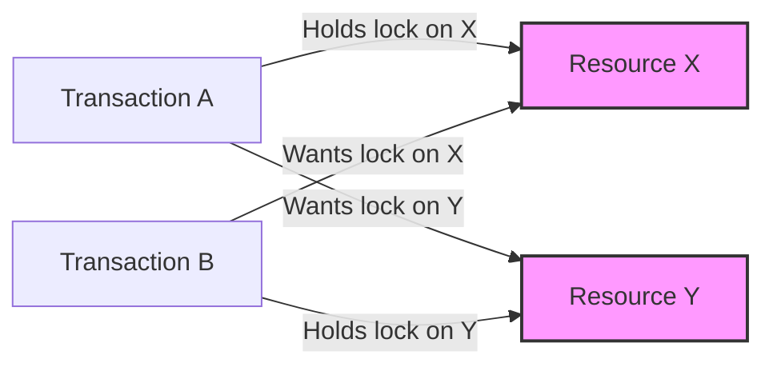

# PostgreSQL Locking

## Introduction

When multiple users or applications interact with a database simultaneously, a system is needed to manage how these concurrent operations access and modify the same data. This is where **locking** comes into play in PostgreSQL.

Locking is a mechanism that PostgreSQL uses to control concurrent access to data objects. It ensures data integrity by preventing multiple transactions from making conflicting changes to the same data at the same time. Without proper locking, your database could end up in an inconsistent state, with partial updates or lost modifications.

In this guide, we'll explore how PostgreSQL implements various locking strategies, when they're acquired, their impact on performance, and how to manage them effectively.

## Types of Locks in PostgreSQL

PostgreSQL implements several types of locks to manage concurrent access. Let's explore the main categories:

### Table-Level Locks

Table-level locks affect operations on an entire table. PostgreSQL supports multiple modes of table-level locks that have different priorities and rules for conflicts.

Here are the most common table-level lock modes:

| Lock Mode | Description | Conflicts With |
|-----------|-------------|---------------|
| ACCESS SHARE | Acquired by SELECT operations | ACCESS EXCLUSIVE |
| ROW SHARE | Acquired by SELECT FOR UPDATE/SHARE | ACCESS EXCLUSIVE |
| ROW EXCLUSIVE | Acquired by UPDATE, DELETE, INSERT | SHARE, SHARE ROW EXCLUSIVE, EXCLUSIVE, ACCESS EXCLUSIVE |
| SHARE | Acquired by CREATE INDEX | ROW EXCLUSIVE, SHARE ROW EXCLUSIVE, EXCLUSIVE, ACCESS EXCLUSIVE |
| SHARE ROW EXCLUSIVE | Used rarely, by some operations | ROW EXCLUSIVE, SHARE, SHARE ROW EXCLUSIVE, EXCLUSIVE, ACCESS EXCLUSIVE |
| EXCLUSIVE | Allows only concurrent ACCESS SHARE locks | ROW SHARE, ROW EXCLUSIVE, SHARE, SHARE ROW EXCLUSIVE, EXCLUSIVE, ACCESS EXCLUSIVE |
| ACCESS EXCLUSIVE | Blocks all concurrent access to the table | All lock modes |

Let's see how to explicitly acquire a table lock:

```sql
-- Acquire a SHARE lock on the 'employees' table
LOCK TABLE employees IN SHARE MODE;

-- Acquire an EXCLUSIVE lock on the 'departments' table
LOCK TABLE departments IN EXCLUSIVE MODE;
```

### Row-Level Locks

Row-level locks affect only specific rows within a table rather than the entire table. These locks are automatically acquired by PostgreSQL when you modify data.

The main types of row-level locks are:

1. **FOR UPDATE**: Locks rows for updating, preventing other transactions from modifying or locking these rows for updates
2. **FOR NO KEY UPDATE**: Similar to FOR UPDATE but less restrictive
3. **FOR SHARE**: Allows concurrent reads but blocks writes to the selected rows
4. **FOR KEY SHARE**: Least restrictive, blocks only updates that would change key values

Example of using row-level locks:

```sql
-- Lock specific rows for updating
BEGIN;
SELECT * FROM employees WHERE department_id = 5 FOR UPDATE;
-- Now these rows are locked until the transaction ends
UPDATE employees SET salary = salary * 1.1 WHERE department_id = 5;
COMMIT;
-- Locks are released when the transaction completes
```

### Advisory Locks

Unlike table and row locks which are tied to database objects, advisory locks are application-defined locks. They're useful when you need to coordinate activities that aren't directly tied to a specific database object.

```sql
-- Acquire an exclusive session-level advisory lock with ID 1001
SELECT pg_advisory_lock(1001);

-- Do some work that requires exclusive access
-- ...

-- Release the lock
SELECT pg_advisory_unlock(1001);

-- Acquire an advisory lock with a two-part key
SELECT pg_advisory_lock(15, 30);  -- Using (15, 30) as the lock identifier
```

Advisory locks can be session-level (persisting until explicitly released) or transaction-level (automatically released at transaction end).

## Deadlocks and How to Handle Them

A deadlock occurs when two or more transactions are waiting for each other to release locks, creating a circular dependency. PostgreSQL automatically detects deadlocks and resolves them by aborting one of the transactions.



Let's look at an example of a deadlock situation:

```sql
-- Terminal 1
BEGIN;
UPDATE accounts SET balance = balance - 100 WHERE id = 1;
-- At this point, Terminal 1 has a lock on row with id=1

-- Terminal 2
BEGIN;
UPDATE accounts SET balance = balance - 200 WHERE id = 2;
-- Terminal 2 now has a lock on row with id=2

-- Terminal 1 tries to update row id=2, but must wait for Terminal 2
UPDATE accounts SET balance = balance + 100 WHERE id = 2;

-- Terminal 2 tries to update row id=1, but must wait for Terminal 1
-- This creates a deadlock!
UPDATE accounts SET balance = balance + 200 WHERE id = 1;

-- PostgreSQL will detect the deadlock and one transaction will fail with:
-- ERROR:  deadlock detected
```

### Strategies to Prevent Deadlocks

1. **Always acquire locks in the same order**
   
   ```sql
   -- Always update lower account IDs first
   BEGIN;
   UPDATE accounts SET balance = balance - 100 WHERE id = LEAST(1, 2);
   UPDATE accounts SET balance = balance + 100 WHERE id = GREATEST(1, 2);
   COMMIT;
   ```

2. **Use lock timeouts to prevent long waiting periods**
   
   ```sql
   -- Set a 3-second lock timeout for this transaction
   SET lock_timeout = '3s';
   BEGIN;
   UPDATE accounts SET balance = balance - 100 WHERE id = 1;
   COMMIT;
   ```

3. **Use transaction isolation levels appropriately**
   
   ```sql
   -- Use a lower isolation level if full serialization is not required
   BEGIN TRANSACTION ISOLATION LEVEL READ COMMITTED;
   -- Perform operations
   COMMIT;
   ```

## Monitoring and Troubleshooting Locks

PostgreSQL provides several system views to monitor locks:

### Viewing Current Locks

To see what locks are currently held in your database:

```sql
SELECT locktype, relation::regclass, mode, transactionid, virtualtransaction, pid, granted
FROM pg_locks
WHERE NOT pid = pg_backend_pid();
```

### Finding Blocking Transactions

When a query is stuck, you can identify which transactions are blocking it:

```sql
SELECT blocked_locks.pid AS blocked_pid,
       blocked_activity.usename AS blocked_user,
       blocking_locks.pid AS blocking_pid,
       blocking_activity.usename AS blocking_user,
       blocked_activity.query AS blocked_statement,
       blocking_activity.query AS blocking_statement
FROM pg_catalog.pg_locks blocked_locks
JOIN pg_catalog.pg_stat_activity blocked_activity ON blocked_locks.pid = blocked_activity.pid
JOIN pg_catalog.pg_locks blocking_locks 
    ON blocked_locks.locktype = blocking_locks.locktype
    AND blocked_locks.database IS NOT DISTINCT FROM blocking_locks.database
    AND blocked_locks.relation IS NOT DISTINCT FROM blocking_locks.relation
    AND blocked_locks.page IS NOT DISTINCT FROM blocking_locks.page
    AND blocked_locks.tuple IS NOT DISTINCT FROM blocking_locks.tuple
    AND blocked_locks.virtualxid IS NOT DISTINCT FROM blocking_locks.virtualxid
    AND blocked_locks.transactionid IS NOT DISTINCT FROM blocking_locks.transactionid
    AND blocked_locks.classid IS NOT DISTINCT FROM blocking_locks.classid
    AND blocked_locks.objid IS NOT DISTINCT FROM blocking_locks.objid
    AND blocked_locks.objsubid IS NOT DISTINCT FROM blocking_locks.objsubid
    AND blocked_locks.pid != blocking_locks.pid
JOIN pg_catalog.pg_stat_activity blocking_activity ON blocking_locks.pid = blocking_activity.pid
WHERE NOT blocked_locks.granted;
```

### Terminating a Blocking Process

If necessary, you can terminate a process that is blocking other queries:

```sql
SELECT pg_terminate_backend(pid) 
FROM pg_stat_activity 
WHERE pid = 12345;  -- Replace with the actual PID
```

## Real-World Applications

### Example 1: Implementing a Reservation System

Consider a ticket booking system where we need to prevent double-booking:

```sql
-- Function to book a seat safely
CREATE OR REPLACE FUNCTION book_seat(seat_id INT, user_id INT) RETURNS BOOLEAN AS $$
BEGIN
    -- Use FOR UPDATE to lock the row while we check availability
    PERFORM * FROM seats 
    WHERE id = seat_id AND is_available = TRUE 
    FOR UPDATE;
    
    -- If no row is returned, seat is not available
    IF NOT FOUND THEN
        RETURN FALSE;
    END IF;
    
    -- Seat is available and locked, now update it
    UPDATE seats SET 
        is_available = FALSE, 
        booked_by = user_id, 
        booked_at = NOW()
    WHERE id = seat_id;
    
    RETURN TRUE;
END;
$$ LANGUAGE plpgsql;

-- Usage example
BEGIN;
SELECT book_seat(101, 5001);  -- Try to book seat 101 for user 5001
COMMIT;
```

This function uses a row-level lock to ensure that even if multiple users attempt to book the same seat simultaneously, only one will succeed.

### Example 2: Implementing a Distributed Counter

Using advisory locks to implement a distributed counter that can be safely incremented from multiple application servers:

```sql
-- Function to safely increment a counter
CREATE OR REPLACE FUNCTION increment_counter(counter_name text) RETURNS INT AS $$
DECLARE
    new_value INT;
BEGIN
    -- Acquire an advisory lock for this counter (using hash of name as lock ID)
    PERFORM pg_advisory_lock(hashtext(counter_name));
    
    -- Update the counter value
    UPDATE counters SET value = value + 1 WHERE name = counter_name
    RETURNING value INTO new_value;
    
    -- Release the lock
    PERFORM pg_advisory_unlock(hashtext(counter_name));
    
    RETURN new_value;
END;
$$ LANGUAGE plpgsql;

-- Usage example
SELECT increment_counter('page_views');
```

This function ensures that even with multiple concurrent calls from different application servers, the counter will be incremented correctly without race conditions.

## Performance Considerations

Locking has important performance implications:

1. **Lock Granularity Trade-offs**
   - Table-level locks are simpler but can cause more contention
   - Row-level locks reduce contention but have higher overhead

2. **Minimizing Lock Duration**
   - Keep transactions short
   - Perform reads before acquiring write locks
   - Use appropriate isolation levels

3. **Monitoring Lock Contention**
   - Check `pg_stat_activity` regularly
   - Set up alerts for long-running transactions
   - Consider using connection pooling with timeout policies

## Summary

PostgreSQL's locking system provides the mechanisms needed to maintain data consistency in multi-user environments. In this guide, we've covered:

- Different types of locks (table-level, row-level, and advisory locks)
- How to explicitly acquire and manage locks
- Deadlocks, how they occur, and strategies to prevent them
- Tools for monitoring and troubleshooting lock situations
- Real-world applications demonstrating locking techniques

Proper understanding and use of PostgreSQL's locking capabilities are essential for developing robust, high-performance database applications that behave correctly under concurrent access.

## Additional Resources

- [PostgreSQL Documentation on Locking](https://www.postgresql.org/docs/current/explicit-locking.html)
- [Understanding PostgreSQL Concurrency](https://www.postgresql.org/docs/current/transaction-iso.html)
- [Advisory Locks in PostgreSQL](https://www.postgresql.org/docs/current/functions-admin.html#FUNCTIONS-ADVISORY-LOCKS)

## Exercises

1. Create a table with sample data and practice using different lock modes. Observe what happens when you try to acquire conflicting locks from different sessions.

2. Implement a simple banking transfer function that uses row-level locking to prevent race conditions when moving money between accounts.

3. Create a test case that deliberately causes a deadlock, then modify it to prevent the deadlock using one of the strategies discussed in this guide.

4. Use advisory locks to implement a simple job queue where multiple workers can safely fetch jobs without processing the same job twice.