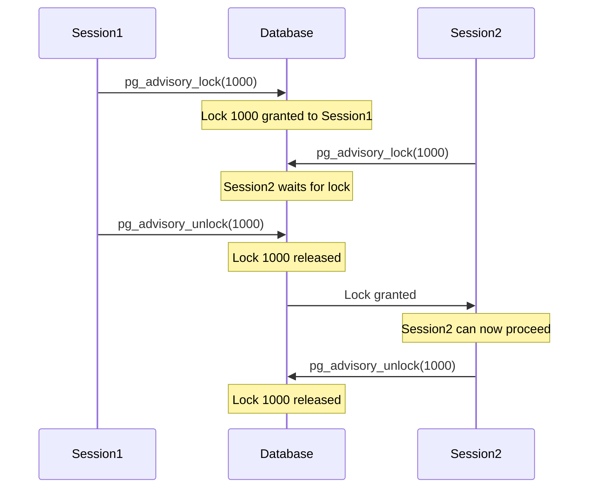

# PostgreSQL Advisory Locks

## Introduction

When building applications that require coordination between multiple processes or transactions, standard row-level locks might not be sufficient. PostgreSQL offers a powerful feature called **Advisory Locks** that allows developers to create application-level locks that aren't tied to specific database objects.

Advisory locks are named "advisory" because PostgreSQL doesn't enforce their usage - it's up to your application code to respect these locks. They provide a lightweight mechanism for coordinating access to resources or operations that might not map directly to database rows or objects.

## What Are Advisory Locks?

Advisory locks are application-defined locks that:

- Are identified by one or two 64-bit integers (lock IDs)
- Can be acquired at session level or transaction level
- Allow applications to implement their own locking strategies
- Don't block database operations like regular locks do
- Are completely separate from table and row locks

## Types of Advisory Locks

PostgreSQL provides several types of advisory locks:

1. **Session-level advisory locks** - remain until explicitly released or the session ends
2. **Transaction-level advisory locks** - automatically released at the end of the current transaction
3. **Shared advisory locks** - allow multiple sessions to hold the same lock simultaneously
4. **Exclusive advisory locks** - only one session can hold the lock at a time

## Advisory Lock Functions

PostgreSQL offers several functions for managing advisory locks:

| Function | Description | Type |
|----------|-------------|------|
| `pg_advisory_lock(id)` | Acquire exclusive session-level lock | Blocking |
| `pg_advisory_lock(id1, id2)` | Acquire exclusive session-level lock using two IDs | Blocking |
| `pg_try_advisory_lock(id)` | Try to acquire exclusive session-level lock | Non-blocking |
| `pg_advisory_unlock(id)` | Release exclusive session-level lock | - |
| `pg_advisory_xact_lock(id)` | Acquire exclusive transaction-level lock | Blocking |
| `pg_try_advisory_xact_lock(id)` | Try to acquire exclusive transaction-level lock | Non-blocking |
| `pg_advisory_lock_shared(id)` | Acquire shared session-level lock | Blocking |
| `pg_try_advisory_lock_shared(id)` | Try to acquire shared session-level lock | Non-blocking |
| `pg_advisory_unlock_shared(id)` | Release shared session-level lock | - |
| `pg_advisory_xact_lock_shared(id)` | Acquire shared transaction-level lock | Blocking |
| `pg_try_advisory_xact_lock_shared(id)` | Try to acquire shared transaction-level lock | Non-blocking |

:::note
Each function has a variant that accepts either a single 64-bit integer or two 32-bit integers. Using two integers can be helpful for creating a hierarchical locking scheme (e.g., one integer for resource type, one for resource ID).
:::

## Basic Usage Examples

### Example 1: Session-Level Exclusive Lock

```sql
-- Acquire a session-level exclusive lock with ID 1000
SELECT pg_advisory_lock(1000);

-- Do some work that requires exclusive access
-- ...

-- Release the lock
SELECT pg_advisory_unlock(1000);
```

### Example 2: Transaction-Level Exclusive Lock

```sql
BEGIN;
-- Acquire a transaction-level exclusive lock with ID 2000
SELECT pg_advisory_xact_lock(2000);

-- Do some work that requires exclusive access
UPDATE accounts SET balance = balance - 100 WHERE id = 1;
UPDATE accounts SET balance = balance + 100 WHERE id = 2;

-- The lock will be automatically released when the transaction ends
COMMIT;
```

### Example 3: Non-Blocking Lock Attempt

```sql
-- Try to acquire a lock, but don't wait if it's not available
SELECT pg_try_advisory_lock(3000) AS lock_acquired;
```

Output:
```
 lock_acquired
---------------
 t
```

If the lock was already held by another session, the output would be:
```
 lock_acquired
---------------
 f
```

### Example 4: Shared Locks

```sql
-- Session 1: Acquire a shared lock
SELECT pg_advisory_lock_shared(4000);

-- Session 2: Can also acquire the same shared lock
SELECT pg_advisory_lock_shared(4000);

-- Session 3: Cannot acquire an exclusive lock until all shared locks are released
SELECT pg_try_advisory_lock(4000) AS lock_acquired;
-- Result: f (false)
```

## Real-World Applications

### 1. Distributed Cron Jobs

When running the same scheduled task across multiple application servers, you can use advisory locks to ensure only one instance runs at a time:

```sql
-- Function to run a job with advisory lock protection
CREATE OR REPLACE FUNCTION run_job_with_lock(job_id integer, max_runtime interval)
RETURNS boolean AS $$
DECLARE
    lock_obtained boolean;
BEGIN
    -- Try to get a lock for this job
    lock_obtained := pg_try_advisory_lock(job_id);
    
    -- If we got the lock, run the job
    IF lock_obtained THEN
        BEGIN
            -- Set a statement timeout to prevent hung jobs
            EXECUTE 'SET statement_timeout TO ''' || max_runtime || '''';
            
            -- Do job work here
            RAISE NOTICE 'Running job %', job_id;
            -- ... job logic ...
            
            -- Release the lock
            PERFORM pg_advisory_unlock(job_id);
            RETURN true;
        EXCEPTION WHEN OTHERS THEN
            -- Make sure we release the lock even on error
            PERFORM pg_advisory_unlock(job_id);
            RAISE;
        END;
    ELSE
        -- Someone else is already running this job
        RAISE NOTICE 'Job % is already running on another instance', job_id;
        RETURN false;
    END IF;
END;
$$ LANGUAGE plpgsql;
```

Usage:
```sql
SELECT run_job_with_lock(101, '5 minutes');
```

### 2. Rate Limiting

Advisory locks can be used to implement a simple rate limiting mechanism:

```sql
CREATE OR REPLACE FUNCTION rate_limit(key text, limit_per_minute integer)
RETURNS boolean AS $$
DECLARE
    key_hash bigint;
    current_count integer;
BEGIN
    -- Convert key to a bigint using hash
    key_hash := ('x' || substr(md5(key), 1, 16))::bit(64)::bigint;
    
    -- Use advisory lock to ensure atomic operation
    PERFORM pg_advisory_lock(key_hash);
    
    BEGIN
        -- Check current count in the last minute
        SELECT COUNT(*) INTO current_count
        FROM rate_limit_log
        WHERE rate_key = key
        AND created_at > NOW() - INTERVAL '1 minute';
        
        IF current_count < limit_per_minute THEN
            -- Add new entry
            INSERT INTO rate_limit_log (rate_key, created_at)
            VALUES (key, NOW());
            
            PERFORM pg_advisory_unlock(key_hash);
            RETURN true;  -- Request allowed
        ELSE
            PERFORM pg_advisory_unlock(key_hash);
            RETURN false;  -- Request rate limited
        END IF;
    EXCEPTION WHEN OTHERS THEN
        -- Ensure we release the lock on error
        PERFORM pg_advisory_unlock(key_hash);
        RAISE;
    END;
END;
$$ LANGUAGE plpgsql;
```

Schema for this function:
```sql
CREATE TABLE rate_limit_log (
    id SERIAL PRIMARY KEY,
    rate_key TEXT NOT NULL,
    created_at TIMESTAMP NOT NULL
);
CREATE INDEX rate_limit_log_key_time_idx ON rate_limit_log (rate_key, created_at);
```

### 3. Mutex for Cache Rebuilding

When multiple processes detect a cache needs rebuilding, we can use advisory locks to ensure only one process does the expensive rebuild:

```sql
-- Function to safely rebuild a cache
CREATE OR REPLACE FUNCTION rebuild_cache_if_needed(cache_key text) RETURNS void AS $$
DECLARE
    cache_id bigint;
    cache_valid boolean;
BEGIN
    -- Convert cache key to a bigint ID for the lock
    cache_id := ('x' || substr(md5(cache_key), 1, 16))::bit(64)::bigint;
    
    -- Check if cache needs rebuilding
    SELECT is_valid INTO cache_valid FROM cache_metadata WHERE key = cache_key;
    
    IF NOT cache_valid THEN
        -- Try to acquire lock for rebuilding
        IF pg_try_advisory_lock(cache_id) THEN
            BEGIN
                -- Double-check cache validity after getting the lock
                -- (another process might have rebuilt it while we were waiting)
                SELECT is_valid INTO cache_valid FROM cache_metadata WHERE key = cache_key;
                
                IF NOT cache_valid THEN
                    -- Rebuild the cache
                    RAISE NOTICE 'Rebuilding cache for %', cache_key;
                    -- ... cache rebuild logic ...
                    
                    -- Update the cache metadata
                    UPDATE cache_metadata SET 
                        is_valid = true,
                        last_updated = NOW()
                    WHERE key = cache_key;
                END IF;
                
                -- Release the lock
                PERFORM pg_advisory_unlock(cache_id);
            EXCEPTION WHEN OTHERS THEN
                -- Ensure we release the lock on error
                PERFORM pg_advisory_unlock(cache_id);
                RAISE;
            END;
        ELSE
            -- Someone else is already rebuilding the cache
            RAISE NOTICE 'Cache % is being rebuilt by another process', cache_key;
        END IF;
    END IF;
END;
$$ LANGUAGE plpgsql;
```

## Visualizing Advisory Locks

Here's a diagram showing how advisory locks coordinate multiple sessions:



## Monitoring Advisory Locks

You can view currently held advisory locks using the `pg_locks` system view:

```sql
SELECT locktype, objid, mode, granted
FROM pg_locks
WHERE locktype = 'advisory';
```

Sample output:
```
 locktype |  objid  |      mode       | granted 
----------+---------+-----------------+---------
 advisory | 1000    | ExclusiveLock   | t
 advisory | 2000    | ShareLock       | t
```

## Best Practices

1. **Use meaningful lock IDs**: Create a consistent mapping between your application resources and lock IDs.

2. **Always release session-level locks**: Unlike transaction-level locks, session-level locks won't be automatically released when transactions end.

3. **Handle lock release in error cases**: Use PL/pgSQL's exception handling to ensure locks are released even on errors.

4. **Consider timeouts**: For blocking lock acquisitions, set statement timeouts to avoid indefinite blocking.

5. **Use lock hierarchies**: When locking multiple related resources, always acquire locks in the same order to avoid deadlocks.

6. **Document lock usage**: Maintain clear documentation of which lock IDs are used for what purposes in your application.

## Common Pitfalls

1. **Forgetting to release locks**: Session-level locks persist until explicitly released or the session ends.

2. **Lock ID collisions**: Multiple unrelated features using the same lock ID can cause unexpected blocking.

3. **Deadlocks**: Acquiring multiple advisory locks in different orders in different sessions can cause deadlocks.

4. **Misunderstanding scope**: Advisory locks exist at the database cluster level, not per database.

## Summary

PostgreSQL Advisory Locks provide a powerful mechanism for implementing application-level concurrency control. They're particularly useful when:

- You need to coordinate access to resources that don't map directly to database rows
- You want lightweight locking without the overhead of table locks
- You need to implement custom locking schemes or distributed synchronization

By using advisory locks effectively, you can solve complex concurrency challenges in distributed systems, prevent race conditions, and ensure the integrity of your application's operations.

## Additional Resources

- [PostgreSQL Documentation: Advisory Locks](https://www.postgresql.org/docs/current/explicit-locking.html#ADVISORY-LOCKS)
- [PostgreSQL Lock Monitoring](https://www.postgresql.org/docs/current/monitoring-locks.html)

## Exercises

1. **Basic Lock Usage**: Write a SQL script that acquires an advisory lock, performs some operation, and then releases the lock.

2. **Deadlock Detection**: Create a scenario with two sessions that could cause a deadlock using advisory locks, then modify it to prevent the deadlock.

3. **Distributed Counter**: Implement a function that safely increments a counter in a table using advisory locks to prevent race conditions.

4. **Timeout Handling**: Modify one of the example functions to include a timeout when acquiring the lock, so it doesn't wait indefinitely.