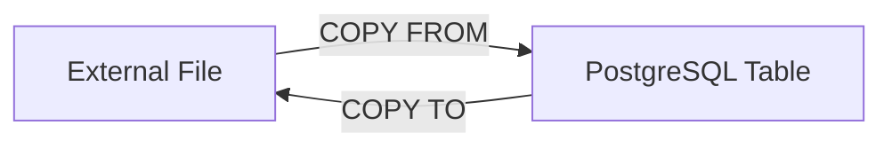

# PostgreSQL COPY Command

## Introduction

The PostgreSQL COPY command is one of the most powerful and efficient ways to import and export data between PostgreSQL tables and external files. Whether you need to load millions of records from a CSV file into your database or export query results to a file for external processing, the COPY command provides a high-performance solution that significantly outperforms regular INSERT statements.

In this tutorial, we'll explore how to use the PostgreSQL COPY command for:
- Importing data from files into database tables
- Exporting data from tables to files
- Customizing data formats and handling options

## Understanding the COPY Command

The COPY command works in two primary directions:



### Basic Syntax

The basic syntax of the COPY command is:

```sql
-- Import data from a file to a table
COPY table_name [(column_list)] FROM source [OPTIONS];

-- Export data from a table to a file
COPY table_name [(column_list)] TO destination [OPTIONS];
```

Where:
- `table_name`: The target PostgreSQL table
- `column_list` (optional): Specific columns to import/export
- `source/destination`: The file path or input/output method
- `OPTIONS`: Format specifications and other parameters

## Importing Data with COPY FROM

### Basic Import from CSV

Let's start with a simple example. Imagine we have a table called `customers`:

```sql
CREATE TABLE customers (
    id SERIAL PRIMARY KEY,
    name VARCHAR(100),
    email VARCHAR(100),
    signup_date DATE
);
```

To import data from a CSV file called `customers.csv`:

```sql
COPY customers(name, email, signup_date) 
FROM '/path/to/customers.csv' 
WITH (FORMAT CSV, HEADER);
```

This command tells PostgreSQL to:
- Import data into the `customers` table
- Take data from the file at `/path/to/customers.csv`
- Interpret the file as CSV format
- Skip the first row (assuming it contains column headers)

### Input and Output

For our example, if `customers.csv` contains:

```
name,email,signup_date
John Doe,john@example.com,2023-01-15
Jane Smith,jane@example.com,2023-02-20
Bob Johnson,bob@example.com,2023-03-05
```

After running the COPY command, your `customers` table would contain:

```
 id |    name     |      email       | signup_date
----+-------------+------------------+-------------
  1 | John Doe    | john@example.com | 2023-01-15
  2 | Jane Smith  | jane@example.com | 2023-02-20
  3 | Bob Johnson | bob@example.com  | 2023-03-05
```

### Client-Side Import with \copy

The COPY command requires superuser privileges when accessing files on the server's filesystem. For regular users, the psql meta-command `\copy` provides a client-side alternative:

```sql
\copy customers(name, email, signup_date) FROM '/local/path/to/customers.csv' WITH (FORMAT CSV, HEADER);
```

The `\copy` command:
- Reads the file from the client machine (where psql is running)
- Transfers the data to the server
- Behaves similarly to COPY but doesn't require superuser privileges

## Exporting Data with COPY TO

### Basic Export to CSV

To export data from a table to a CSV file:

```sql
COPY customers TO '/path/to/export_customers.csv' WITH (FORMAT CSV, HEADER);
```

This exports all rows and columns from the `customers` table to the specified file.

### Exporting Query Results

One powerful feature of COPY is the ability to export the results of a query:

```sql
COPY (
    SELECT name, email 
    FROM customers 
    WHERE signup_date > '2023-02-01'
) TO '/path/to/recent_customers.csv' WITH (FORMAT CSV, HEADER);
```

This would export only the name and email of customers who signed up after February 1, 2023.

## Format Options and Customization

The COPY command supports multiple format options:

### Format Types

```sql
-- CSV format (comma-separated values)
COPY table_name FROM '/path/to/file.csv' WITH (FORMAT CSV);

-- Text format (tab-delimited by default)
COPY table_name FROM '/path/to/file.txt' WITH (FORMAT TEXT);

-- Binary format (most efficient but not human-readable)
COPY table_name FROM '/path/to/file.bin' WITH (FORMAT BINARY);
```

### Customizing Delimiters and Quotes

You can customize field separators, quote characters, and other aspects:

```sql
COPY table_name FROM '/path/to/file.csv' WITH (
    FORMAT CSV,
    DELIMITER ';',
    QUOTE '"',
    ESCAPE '\',
    NULL 'NULL'
);
```

This configures the COPY command to:
- Use semicolons as field separators
- Use double quotes for quoting strings
- Use backslash as the escape character
- Interpret the string 'NULL' as SQL NULL values

## Handling Errors

The COPY command provides options for handling errors:

```sql
-- Skip rows with errors and limit the number of errors
COPY customers FROM '/path/to/customers.csv' WITH (
    FORMAT CSV,
    HEADER,
    DELIMITER ',',
    FORCE_NOT_NULL (name, email),
    FORCE_NULL (signup_date),
    ENCODING 'UTF8'
);
```

## Practical Examples

### Example 1: Importing Data with Transformations

Suppose we want to import data but apply some transformations. We can use a temporary table and SQL operations:

```sql
-- Create a temporary table matching the file structure
CREATE TEMP TABLE temp_import (
    full_name TEXT,
    email TEXT,
    signup_date TEXT
);

-- Import into the temporary table
COPY temp_import FROM '/path/to/raw_data.csv' WITH (FORMAT CSV, HEADER);

-- Insert into the actual table with transformations
INSERT INTO customers (name, email, signup_date)
SELECT 
    full_name,
    LOWER(email),  -- Convert email to lowercase
    TO_DATE(signup_date, 'MM/DD/YYYY')  -- Convert string to proper date
FROM temp_import;

-- Clean up
DROP TABLE temp_import;
```

### Example 2: Exporting for Data Analysis

Export data for analysis in a specific format:

```sql
COPY (
    SELECT 
        c.name,
        c.email,
        COUNT(o.id) AS order_count,
        SUM(o.amount) AS total_spent
    FROM customers c
    LEFT JOIN orders o ON c.id = o.customer_id
    GROUP BY c.id, c.name, c.email
    ORDER BY total_spent DESC
) TO '/path/to/customer_analysis.csv' WITH (FORMAT CSV, HEADER);
```

### Example 3: Periodic Data Export Script

Create a shell script for periodic data exports:

```bash
#!/bin/bash
# Export daily data

TODAY=$(date +"%Y-%m-%d")
OUTPUT_FILE="/exports/daily_sales_${TODAY}.csv"

psql -d mydb -c "\copy (SELECT * FROM sales WHERE date = CURRENT_DATE) TO '${OUTPUT_FILE}' WITH (FORMAT CSV, HEADER);"

# Compress the output
gzip $OUTPUT_FILE
```

## Performance Considerations

The COPY command is designed for performance:

1. **Batch processing**: COPY processes data in large batches, reducing per-row overhead
2. **Transaction efficiency**: A single COPY processes all rows in one transaction
3. **Network efficiency**: Reduces network round-trips compared to individual INSERT statements

For very large imports, consider:
- Dropping indexes before import and recreating them afterward
- Using larger `BUFFER_SIZE` in the COPY options
- Breaking the import into smaller chunks

## Common Issues and Solutions

### Permissions Issues

If you encounter permission errors like:
```
ERROR: could not open file "/path/to/file.csv" for reading: Permission denied
```

Solutions:
- Use `\copy` instead of `COPY` to import from client-side
- Ensure the PostgreSQL server has read/write access to the directory

### Format Errors

For format errors like:
```
ERROR: extra data after last expected column
```

Solutions:
- Check that your column count matches your data
- Verify delimiter settings
- Ensure quote characters are properly escaped in your input data

## Summary

The PostgreSQL COPY command is an essential tool for bulk data import and export operations. It offers:

- High-performance data transfer between files and tables
- Flexible format options for various data sources
- Client-side and server-side processing capabilities

By mastering the COPY command, you can efficiently manage large datasets in your PostgreSQL database and integrate with external data processing systems.

## Additional Resources

- [PostgreSQL Documentation: COPY](https://www.postgresql.org/docs/current/sql-copy.html)
- [Best Practices for Bulk Loading Data in PostgreSQL](https://www.postgresql.org/docs/current/populate.html)

## Exercises

1. Create a table to store product information and use COPY to import a CSV file containing product data.
2. Write a query to export only products in a specific category to a CSV file.
3. Create a script that exports daily transaction data to a timestamped file.
4. Import a tab-delimited file where some fields contain NULL values that need to be properly recognized.
5. Use the COPY command to transfer data between two tables, filtering and transforming the data during the process.