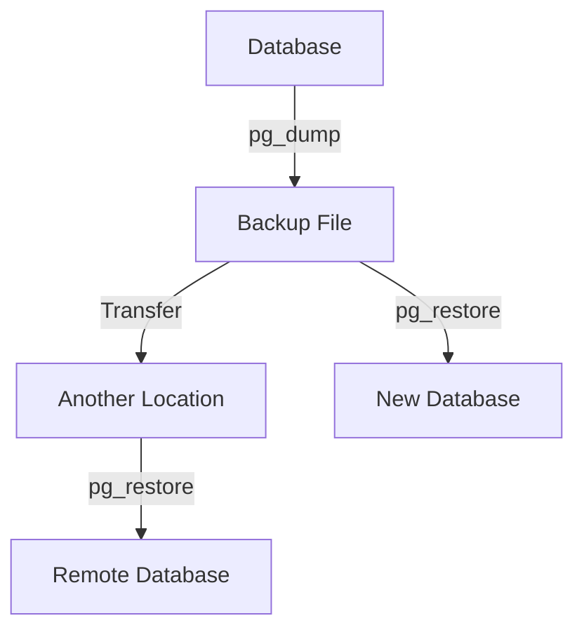

# PostgreSQL pg_dump

## Introduction

When working with databases, having reliable backup strategies is essential for data preservation and disaster recovery. PostgreSQL, a powerful open-source relational database system, provides a built-in utility called `pg_dump` that allows you to extract (or "dump") a PostgreSQL database into a script file or archive file.

`pg_dump` creates a consistent backup by freezing the database state at the moment the backup begins, capturing all data, schema definitions, functions, and other database objects. This makes it an invaluable tool for:

- Creating database backups
- Migrating databases between servers
- Upgrading PostgreSQL versions
- Creating development/testing environments from production data

In this tutorial, we'll explore how to use `pg_dump` effectively, understand its various options, and see practical examples of common backup scenarios.

## Basic Usage

The simplest form of `pg_dump` creates a SQL script that contains the commands needed to reconstruct the database:

```bash
pg_dump dbname > output_file.sql
```

This command connects to the database named `dbname` and outputs a SQL script to `output_file.sql`. When executed, this script will recreate the database structure and populate it with data.

### Example: Creating a Basic Backup

Let's say we have a database called `bookstore` that we want to back up:

```bash
pg_dump bookstore > bookstore_backup.sql
```

Output (partial example of generated SQL file):
```sql
--
-- PostgreSQL database dump
--

-- Dumped from database version 14.5
-- Dumped by pg_dump version 14.5

SET statement_timeout = 0;
SET lock_timeout = 0;
SET client_encoding = 'UTF8';
-- ... (more settings)

CREATE TABLE public.books (
    id integer NOT NULL,
    title character varying(255) NOT NULL,
    author character varying(255) NOT NULL,
    publication_year integer,
    isbn character varying(13)
);

-- ... (more table definitions, data, etc.)
```

## Connection Options

In a real-world scenario, you'll often need to specify connection parameters:

```bash
pg_dump -h hostname -p port -U username -W dbname > output_file.sql
```

Where:
- `-h`: Database server host
- `-p`: Database server port
- `-U`: Username to connect as
- `-W`: Force password prompt

### Example: Backing Up a Remote Database

```bash
pg_dump -h db.example.com -p 5432 -U admin -W bookstore > bookstore_backup.sql
```

You'll be prompted for your password, and then the backup will proceed.

## Output Format Options

`pg_dump` supports various output formats controlled by the `-F` option:

- `-F p`: Plain text SQL script (default)
- `-F c`: Custom format (compressed, most flexible)
- `-F d`: Directory format (creates a directory with one file per table)
- `-F t`: TAR format archive

The custom format (`-F c`) is particularly useful as it's compressed and allows selective restore using `pg_restore`.

### Example: Creating a Custom Format Backup

```bash
pg_dump -F c -f bookstore_backup.dump bookstore
```

This creates a compressed custom-format file that can only be restored using `pg_restore`.

## Selective Backup

You can choose to dump only specific parts of a database:

- `-t table`: Dump only the specified table(s)
- `-n schema`: Dump only the specified schema(s)
- `-T table`: Exclude the specified table(s)
- `-N schema`: Exclude the specified schema(s)

### Example: Backing Up Specific Tables

To back up only the `books` and `authors` tables:

```bash
pg_dump -t books -t authors bookstore > books_authors_backup.sql
```

### Example: Excluding a Schema

To back up everything except the `logs` schema:

```bash
pg_dump -N logs bookstore > bookstore_no_logs.sql
```

## Content Control Options

You can control what content is included in the dump:

- `--data-only`: Dump only the data, not the schema
- `--schema-only`: Dump only the schema, not the data
- `--no-owner`: Skip commands to set ownership of objects
- `--no-privileges` or `--no-acl`: Skip commands to set privileges (GRANT/REVOKE)

### Example: Schema-Only Backup

To back up just the database structure without any data:

```bash
pg_dump --schema-only bookstore > bookstore_schema.sql
```

### Example: Data-Only Backup

To back up just the data without the schema:

```bash
pg_dump --data-only bookstore > bookstore_data.sql
```

## Handling Large Databases

For very large databases, consider these options:

- `-j num`: Use this many parallel jobs for dumping (custom and directory formats only)
- `--exclude-table-data`: Exclude data for specific tables
- Use `pg_dump` with the custom format and then selectively restore tables

### Example: Parallel Backup

```bash
pg_dump -F d -j 4 -f backup_dir bookstore
```

This creates a directory-format backup using 4 parallel jobs for faster backup of large databases.

## Creating a Complete Database Backup Script

Here's a more comprehensive backup script that you might use in production:

```bash
#!/bin/bash

# Configuration
DB_NAME="bookstore"
BACKUP_DIR="/var/backups/postgresql"
TIMESTAMP=$(date +"%Y%m%d_%H%M%S")
BACKUP_FILE="$BACKUP_DIR/$DB_NAME-$TIMESTAMP.dump"

# Create backup directory if it doesn't exist
mkdir -p $BACKUP_DIR

# Create the backup
pg_dump -h localhost -U postgres -F c -b -v -f $BACKUP_FILE $DB_NAME

# Set proper permissions
chmod 600 $BACKUP_FILE

# Delete backups older than 7 days
find $BACKUP_DIR -name "$DB_NAME-*.dump" -type f -mtime +7 -delete

echo "Backup completed: $BACKUP_FILE"
```

This script:
1. Creates a timestamped backup filename
2. Creates a compressed custom-format backup
3. Sets secure file permissions
4. Removes backups older than 7 days
5. Outputs the backup location when complete

## Restoring from pg_dump Backups

While this tutorial focuses on creating backups with `pg_dump`, it's worth mentioning how to restore them:

### Plain SQL Format Restore

For plain SQL format backups:

```bash
psql -d dbname -f backup_file.sql
```

### Custom, Directory, or TAR Format Restore

For other formats, use `pg_restore`:

```bash
pg_restore -d dbname backup_file.dump
```

## Common pg_dump Scenarios

Let's explore some common scenarios where `pg_dump` proves invaluable:

### Scenario 1: Migrating to a New Server

```bash
# On the source server
pg_dump -F c -f database_export.dump source_db

# Transfer the file to the new server, then:
pg_restore -d target_db database_export.dump
```

### Scenario 2: Creating a Development Copy

```bash
# Create structure and data backup, but sanitize user data
pg_dump --exclude-table-data=users_personal_info production_db > dev_db_backup.sql

# Create a separate backup of the users table with sanitized data
# (You'll need to create this sanitized data separately)
pg_dump -t users_personal_info --data-only production_db | 
  sed 's/real_email@example.com/dev_email@example.com/g' > sanitized_users.sql

# Restore both files to create a development database
psql -d dev_db -f dev_db_backup.sql
psql -d dev_db -f sanitized_users.sql
```

### Scenario 3: Regular Automated Backups

Set up a cron job that runs the backup script provided earlier:

```bash
# Run daily at 2 AM
0 2 * * * /path/to/backup_script.sh
```

## Understanding the Workflow

The typical `pg_dump` workflow can be visualized as:



## Best Practices

1. **Regular Automation**: Schedule regular backups using cron jobs or task schedulers.

2. **Test Your Backups**: Periodically verify that your backups can be successfully restored.

3. **Use Custom Format**: The custom format (`-F c`) offers the best compression and flexibility.

4. **Secure Storage**: Store backups in a secure location, preferably off-site or in a different datacenter.

5. **Retention Policy**: Implement a backup retention policy based on your recovery point objectives.

6. **Documentation**: Document your backup and restore procedures for disaster recovery.

7. **Version Alignment**: Ensure your `pg_dump` version is compatible with your PostgreSQL server version.

## Conclusion

PostgreSQL's `pg_dump` utility is a powerful, flexible tool for backing up your databases. Whether you're creating routine backups for disaster recovery, migrating data between servers, or setting up development environments, `pg_dump` provides the capabilities you need.

By understanding the various options and formats available, you can tailor your backup strategy to meet your specific requirements for data security, storage efficiency, and restore flexibility.

## Additional Resources

- [PostgreSQL Official Documentation on pg_dump](https://www.postgresql.org/docs/current/app-pgdump.html)
- [PostgreSQL Backup and Restore Tutorial](https://www.postgresql.org/docs/current/backup.html)

## Practice Exercises

1. Create a backup script that dumps each database in your PostgreSQL server to a separate file.

2. Experiment with different compression levels in custom-format backups to find the optimal balance between backup speed and file size.

3. Set up a backup strategy that creates:
   - Daily backups retained for one week
   - Weekly backups retained for one month
   - Monthly backups retained for one year

4. Practice restoring from your backups to a test database to verify backup integrity.