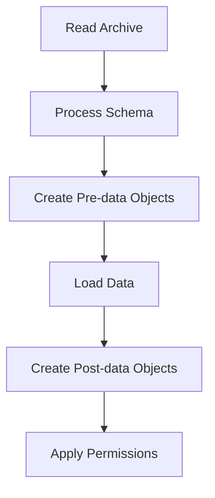

# PostgreSQL pg_restore

## Introduction

In PostgreSQL's suite of database management tools, `pg_restore` stands as a powerful utility designed to restore PostgreSQL databases from archive files created by `pg_dump`. This tool is essential for database administrators and developers who need to recover data, migrate databases between environments, or set up testing scenarios with production-like data.

Unlike simple SQL script restoration, `pg_restore` provides advanced capabilities for handling custom-format and directory-format archives, offering features like parallel processing, selective restoration, and flexible ordering of restored objects. This makes it particularly valuable for managing large databases efficiently.

## Understanding pg_restore

### What is pg_restore?

`pg_restore` is a PostgreSQL utility that reads archive files (created by `pg_dump` using custom or directory format) and restores them to a PostgreSQL database. It's particularly useful because it can:

1. Selectively restore specific database objects
2. Reorder restoration sequences
3. Process multiple jobs in parallel
4. Handle large archives efficiently

### When to Use pg_restore

You should use `pg_restore` when:

- You have archives in custom or directory format created by `pg_dump`
- You need to restore only specific objects from a backup
- You want to leverage parallel processing for faster restoration
- You need to modify objects during restoration (e.g., change ownership)

For plain-text SQL script backups, you would use `psql` instead.

## Basic Usage

The simplest form of the `pg_restore` command looks like this:

```bash
pg_restore -d target_database archive_file
```

For example, to restore an archive named `mydb_backup.dump` to a database named `mydb`:

```bash
pg_restore -d mydb mydb_backup.dump
```

### Common Options

Here are some commonly used options with `pg_restore`:

| Option | Description |
|--------|-------------|
| `-d dbname` | Connect to database `dbname` |
| `-h host` | Database server host |
| `-p port` | Database server port |
| `-U username` | Connect as specified user |
| `-W` | Force password prompt |
| `-c` | Clean (drop) database objects before recreating |
| `-C` | Create the database before restoring |
| `-e` | Exit if an error occurs (default is to continue) |
| `-j jobs` | Use this many parallel jobs for restore |
| `-v` | Verbose mode |
| `-n schema` | Restore only objects in this schema |
| `-t table` | Restore only this table |

## Step-by-Step Examples

Let's walk through some practical examples of using `pg_restore` in different scenarios.

### Example 1: Basic Full Database Restore

Let's restore a complete database from a custom-format backup:

```bash
pg_restore -d target_db -v backup_file.dump
```

The output would look something like:

```
pg_restore: connecting to database "target_db"
pg_restore: creating SCHEMA "public"
pg_restore: creating TABLE "public.users"
pg_restore: creating TABLE "public.products"
pg_restore: creating INDEX "users_email_idx"
pg_restore: creating CONSTRAINT "products_pkey"
pg_restore: setting owner and privileges for TABLE "public.users"
pg_restore: setting owner and privileges for TABLE "public.products"
```

### Example 2: Restore with Cleanup

In this example, we'll clean (drop) existing objects before restoring:

```bash
pg_restore -c -d target_db backup_file.dump
```

This is particularly useful when you want to ensure that the resulting database matches exactly what's in the backup, without any leftover objects.

### Example 3: Parallel Restoration for Large Databases

For large databases, you can significantly speed up the restoration process by using parallel jobs:

```bash
pg_restore -d target_db -j 4 backup_file.dump
```

This command uses 4 parallel jobs to restore the database, which can be much faster on multi-core systems with sufficient I/O capacity.

### Example 4: Selective Restoration

One of the most powerful features of `pg_restore` is the ability to selectively restore objects:

```bash
# Restore only the 'customers' table
pg_restore -d target_db -t customers backup_file.dump

# Restore only objects in the 'sales' schema
pg_restore -d target_db -n sales backup_file.dump
```

### Example 5: Create Database During Restoration

If the target database doesn't exist yet, you can create it during restoration:

```bash
pg_restore -C -d postgres backup_file.dump
```

This creates the database with the same name as in the backup before restoring its contents. Note that the `-d postgres` part connects to the default `postgres` database first.

## Advanced Usage

### List Contents of an Archive

Before restoring, you might want to see what's in the archive:

```bash
pg_restore -l backup_file.dump > backup_contents.lst
```

This creates a list file that shows all the objects in the archive.

### Modifying the Restoration Order

You can edit the list file to:
1. Remove objects you don't want to restore
2. Change the order of restoration

Then use it with the `-L` option:

```bash
pg_restore -d target_db -L backup_contents.lst backup_file.dump
```

### Handling Errors

By default, `pg_restore` continues even if errors occur. To make it stop at the first error:

```bash
pg_restore -d target_db -e backup_file.dump
```

### Changing Object Ownership

You can change the ownership of objects during restoration:

```bash
pg_restore -d target_db --no-owner backup_file.dump
```

This command restores objects without setting ownership, so they'll be owned by the user running the restore.

## Understanding the Restoration Process

When `pg_restore` runs, it processes the backup in several phases:



1. **Pre-data Phase**: Creates schemas, tables, functions, etc.
2. **Data Phase**: Loads the actual data into tables
3. **Post-data Phase**: Creates indexes, triggers, constraints, etc.
4. **Final Phase**: Sets permissions and ownership

This staged approach optimizes the restoration process, especially for large databases.

## Common Issues and Troubleshooting

### Error: Database Already Exists

```
pg_restore: [archiver] Error while PROCESSING TOC:
pg_restore: [archiver] Error from TOC entry 3; 1262 16384 DATABASE mydb postgres
pg_restore: [archiver] could not execute query: ERROR:  database "mydb" already exists
```

**Solution**: Use the `-c` option to drop objects first, or manually drop the database before restoring.

### Permissions Issues

```
pg_restore: [archiver] could not execute query: ERROR:  permission denied for schema public
```

**Solution**: Ensure the user performing the restoration has sufficient permissions, or use `--no-owner` to avoid permission issues.

### Version Compatibility

```
pg_restore: [archiver] unsupported version (1.13) in file header
```

**Solution**: Make sure you're using a version of `pg_restore` compatible with the version of `pg_dump` that created the archive.

## Integration with Scripts and Workflows

### Automating Database Restoration

Here's a simple shell script to automate database restoration:

```bash
#!/bin/bash
# Database restoration script

DB_NAME="production_clone"
BACKUP_FILE="/path/to/backups/latest.dump"
LOG_FILE="/path/to/logs/restore_$(date +%Y%m%d).log"

echo "Starting database restoration at $(date)" > $LOG_FILE

# Drop database if it exists
psql -c "DROP DATABASE IF EXISTS $DB_NAME;" postgres

# Create fresh database
psql -c "CREATE DATABASE $DB_NAME;" postgres

# Restore from backup
pg_restore -v -d $DB_NAME $BACKUP_FILE >> $LOG_FILE 2>&1

echo "Restoration completed at $(date)" >> $LOG_FILE

# Check for errors
if grep -q "ERROR:" $LOG_FILE; then
  echo "Errors occurred during restoration. Check $LOG_FILE for details."
  exit 1
else
  echo "Restoration completed successfully!"
  exit 0
fi
```

### Scheduled Backups and Restorations

For regular testing or development database refreshes, you might set up a cron job:

```bash
# Restore production backup to test environment every Sunday at 1 AM
0 1 * * 0 /path/to/restore_script.sh
```

## Best Practices

When working with `pg_restore`, consider these best practices:

1. **Test Restorations Regularly**: Don't wait until a disaster to test your backup and restore procedures.

2. **Use Parallel Jobs Wisely**: While `-j` can speed up restoration, too many parallel jobs might overwhelm your system.

3. **Consider Network Limitations**: When restoring to remote servers, network bandwidth may become a bottleneck.

4. **Monitor Disk Space**: Ensure you have enough disk space for the restored database and any temporary files.

5. **Use Version-Compatible Tools**: Always use a `pg_restore` version compatible with your PostgreSQL server.

6. **Secure Your Backups**: Archives may contain sensitive data; ensure they're properly secured.

7. **Document Your Procedures**: Maintain clear documentation of your backup and restore procedures.

## Summary

PostgreSQL's `pg_restore` utility is an essential tool for database administrators and developers who need to restore PostgreSQL databases from archive files. Its flexibility in handling different restoration scenarios, from full database restoration to selective object recovery, makes it incredibly valuable in various situations:

- Database migration between environments
- Recovery from failures
- Setting up test environments with production-like data
- Selective data restoration for specific needs

By understanding the various options and techniques available with `pg_restore`, you can efficiently manage your database restoration needs while minimizing downtime and resource usage.

## Additional Resources

- [Official PostgreSQL Documentation on pg_restore](https://www.postgresql.org/docs/current/app-pgrestore.html)
- PostgreSQL Administration Cookbook
- PostgreSQL Backup and Restore Strategies (various online tutorials)

## Exercises

1. Create a backup of a sample database using `pg_dump` with the custom format, then restore it to a different database using `pg_restore`.

2. Practice selective restoration by restoring only specific tables from your backup.

3. Experiment with parallel restoration using different numbers of jobs (`-j` option) and observe the performance differences.

4. Create a list file from your backup, modify it to exclude certain objects, and perform a restoration using this modified list.

5. Write a shell script that automates the backup and restoration process for a development environment.