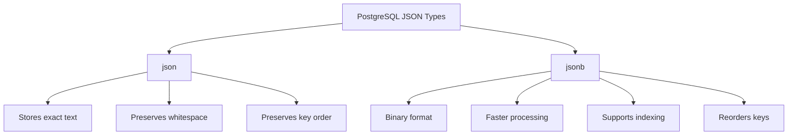

# PostgreSQL JSON Import Export

## Introduction

PostgreSQL has robust support for working with JSON data, making it an excellent choice for applications that need to store and process semi-structured data alongside traditional relational data. This guide will walk you through the process of importing JSON data into PostgreSQL and exporting data as JSON from your database.

JSON (JavaScript Object Notation) provides a flexible way to represent complex data structures without requiring a fixed schema. PostgreSQL offers two JSON data types:

- `json`: Stores an exact copy of the input text
- `jsonb`: Stores data in a decomposed binary format that's more efficient for processing but slightly slower to input

In this tutorial, we'll cover both importing external JSON data into PostgreSQL and exporting your relational data as JSON.

## JSON Data Types in PostgreSQL

Before diving into import/export operations, let's understand the JSON data types available:



### Choosing Between `json` and `jsonb`

When deciding which data type to use:

- Use `json` when you need to preserve the exact format of the original JSON document
- Use `jsonb` when you plan to query or manipulate the data frequently (recommended for most use cases)

## Importing JSON Data into PostgreSQL

Let's explore different methods to import JSON data into PostgreSQL.

### Method 1: Using SQL INSERT Statements

The simplest approach is to insert JSON strings directly:

```sql
CREATE TABLE product_catalog (
    id SERIAL PRIMARY KEY,
    data JSONB
);

INSERT INTO product_catalog (data) VALUES (
    '{"name": "Laptop", "price": 999.99, "specifications": {"cpu": "i7", "ram": "16GB", "storage": "512GB SSD"}}'
);
```

### Method 2: Using the COPY Command with JSON Files

For importing JSON files, you can use PostgreSQL's `COPY` command:

```sql
-- First, create a table to hold the JSON data
CREATE TABLE customer_data (
    id SERIAL PRIMARY KEY,
    customer_info JSONB
);

-- Import from a JSON file (one JSON object per line)
COPY customer_data (customer_info) FROM '/path/to/customers.json';
```

The JSON file should have one complete JSON object per line (JSON Lines format).

### Method 3: Using `\copy` in psql

If you're using the `psql` command-line tool, you can use the `\copy` meta-command:

```
\copy customer_data (customer_info) FROM '/path/to/customers.json'
```

### Method 4: Using External Programs (pg_import)

For more complex scenarios, you might use tools like `pg_import` or custom scripts:

```bash
pg_import --table=customer_data --column=customer_info --file=/path/to/customers.json --format=json
```

### Importing a JSON Array

If your JSON file contains an array of objects, you'll need to split the array:

```sql
-- Create a temporary table to hold the raw JSON
CREATE TEMP TABLE temp_import (data JSONB);

-- Import the entire array as a single JSONB value
COPY temp_import FROM '/path/to/array.json';

-- Insert each array element as a separate row
INSERT INTO customer_data (customer_info)
SELECT jsonb_array_elements(data) FROM temp_import;

-- Clean up
DROP TABLE temp_import;
```

## Accessing and Querying JSON Data

After importing, you can query JSON data using PostgreSQL's JSON operators:

```sql
-- Access a field using the -> operator (returns JSON)
SELECT data->'name' AS product_name FROM product_catalog;

-- Access a field using the ->> operator (returns text)
SELECT data->>'price' AS price FROM product_catalog;

-- Access nested fields
SELECT data->'specifications'->>'cpu' AS cpu FROM product_catalog;

-- Filter based on JSON values
SELECT * FROM product_catalog WHERE data->>'name' = 'Laptop';

-- Filter with nested values
SELECT * FROM product_catalog WHERE data->'specifications'->>'ram' = '16GB';
```

## Exporting PostgreSQL Data as JSON

Now let's look at how to export data from PostgreSQL in JSON format.

### Method 1: Using JSON Functions

PostgreSQL provides several functions to convert data to JSON:

```sql
-- Convert a single row to JSON
SELECT row_to_json(product_catalog) FROM product_catalog WHERE id = 1;

-- Convert a specific column to JSON
SELECT json_build_object('name', name, 'price', price) FROM products;

-- Convert query results to a JSON array
SELECT json_agg(row_to_json(p)) FROM products p;
```

### Method 2: Using the `row_to_json()` Function

For more control over the output:

```sql
-- Create a view with the exact structure you want
CREATE VIEW product_view AS
SELECT 
    id,
    name,
    price,
    description
FROM products;

-- Export the view as JSON
SELECT row_to_json(pv) FROM product_view pv;
```

### Method 3: Using `json_build_object()` for Custom JSON

Create custom JSON structures with selected fields:

```sql
SELECT json_build_object(
    'product_id', id,
    'product_name', name,
    'pricing', json_build_object(
        'regular_price', price,
        'sale_price', sale_price,
        'discount_percentage', ((price - sale_price) / price * 100)
    ),
    'in_stock', available
) AS product_json
FROM products;
```

### Method 4: Exporting to a File

To save JSON data to a file:

```sql
\copy (SELECT json_agg(row_to_json(p)) FROM products p) TO '/path/to/output.json'
```

Or using `psql`:

```bash
psql -d yourdb -c "COPY (SELECT row_to_json(p) FROM products p) TO STDOUT" > output.json
```

## Practical Example: E-commerce Product Catalog

Let's walk through a complete example for an e-commerce product catalog:

### 1. Create the Database Structure

```sql
CREATE TABLE categories (
    id SERIAL PRIMARY KEY,
    name TEXT NOT NULL
);

CREATE TABLE products (
    id SERIAL PRIMARY KEY,
    category_id INTEGER REFERENCES categories(id),
    name TEXT NOT NULL,
    price NUMERIC(10,2) NOT NULL,
    details JSONB
);

-- Insert some sample data
INSERT INTO categories (name) VALUES ('Electronics'), ('Books'), ('Clothing');

INSERT INTO products (category_id, name, price, details) VALUES
(1, 'Smartphone', 699.99, '{"brand": "TechX", "model": "X200", "specs": {"screen": "6.5 inch", "camera": "48MP", "battery": "4000mAh"}}'),
(1, 'Laptop', 1299.99, '{"brand": "ComputeMax", "model": "PowerBook", "specs": {"cpu": "i7", "ram": "16GB", "storage": "1TB SSD"}}'),
(2, 'Programming Guide', 49.99, '{"author": "Jane Smith", "pages": 450, "topics": ["Python", "JavaScript", "SQL"]}');
```

### 2. Export All Products with Categories as JSON

```sql
SELECT json_build_object(
    'products', (
        SELECT json_agg(
            json_build_object(
                'id', p.id,
                'name', p.name,
                'price', p.price,
                'category', c.name,
                'details', p.details
            )
        )
        FROM products p
        JOIN categories c ON p.category_id = c.id
    )
) AS catalog;
```

This produces output like:

```json
{
  "products": [
    {
      "id": 1,
      "name": "Smartphone",
      "price": 699.99,
      "category": "Electronics",
      "details": {
        "brand": "TechX",
        "model": "X200",
        "specs": {
          "screen": "6.5 inch",
          "camera": "48MP",
          "battery": "4000mAh"
        }
      }
    },
    {
      "id": 2,
      "name": "Laptop",
      "price": 1299.99,
      "category": "Electronics",
      "details": {
        "brand": "ComputeMax",
        "model": "PowerBook",
        "specs": {
          "cpu": "i7",
          "ram": "16GB",
          "storage": "1TB SSD"
        }
      }
    },
    {
      "id": 3,
      "name": "Programming Guide",
      "price": 49.99,
      "category": "Books",
      "details": {
        "author": "Jane Smith",
        "pages": 450,
        "topics": ["Python", "JavaScript", "SQL"]
      }
    }
  ]
}
```

### 3. Import Updated Product Data

Imagine we receive updated product information in JSON format:

```sql
-- Create a temp table for the import
CREATE TEMP TABLE product_updates (data JSONB);

-- Insert the JSON data
INSERT INTO product_updates (data) VALUES (
    '[
      {"id": 1, "details": {"brand": "TechX", "model": "X200 Pro", "specs": {"screen": "6.7 inch", "camera": "64MP", "battery": "5000mAh"}}},
      {"id": 2, "details": {"brand": "ComputeMax", "model": "PowerBook Ultra", "specs": {"cpu": "i9", "ram": "32GB", "storage": "2TB SSD"}}}
    ]'::jsonb
);

-- Update the products table with the new information
UPDATE products
SET details = u.details
FROM (
    SELECT 
        (data->>'id')::int AS id,
        data->'details' AS details
    FROM 
        (SELECT jsonb_array_elements(data) AS data FROM product_updates) AS elements
) AS u
WHERE products.id = u.id;
```

## Performance Considerations

When working with JSON in PostgreSQL, keep these tips in mind:

1. **Use `jsonb` for better performance** when querying or manipulating the data
2. **Create indexes on frequently queried JSON fields**:
   ```sql
   CREATE INDEX idx_product_brand ON products ((details->>'brand'));
   ```
3. **Extract frequently accessed JSON fields** into regular columns if you query them often
4. **Be cautious with large JSON documents** as they can impact performance
5. **Use the GIN index for complex queries** on JSONB fields:
   ```sql
   CREATE INDEX idx_product_details ON products USING GIN (details);
   ```

## Common Challenges and Solutions

### Handling Large JSON Files

For very large JSON files, consider:

1. **Splitting the file** into smaller chunks
2. **Using streaming parsers** in your application code
3. **Leveraging COPY with CSV** as an intermediate format

### Dealing with Schema Changes

One advantage of JSON in PostgreSQL is handling evolving schemas:

```sql
-- Add a new field to existing records
UPDATE products
SET details = details || '{"warranty_months": 12}'::jsonb
WHERE details->>'warranty_months' IS NULL;

-- Remove a field from all records
UPDATE products
SET details = details - 'old_field';
```

### Validating JSON Structure

Ensure imported JSON matches your expected structure:

```sql
-- Check if required fields exist
SELECT id, name 
FROM products 
WHERE details->>'brand' IS NULL OR details->>'model' IS NULL;

-- More complex validation with jsonb_path_exists (PostgreSQL 12+)
SELECT id, name
FROM products
WHERE NOT jsonb_path_exists(details, '$.specs.cpu');
```

## Summary

In this guide, we explored how to:

1. **Import JSON data** into PostgreSQL using various methods
2. **Query and manipulate** JSON data within PostgreSQL
3. **Export data as JSON** for external applications
4. Work through **practical examples** of JSON import/export operations

PostgreSQL's JSON capabilities bridge the gap between relational and document databases, allowing you to store flexible, schema-less data alongside structured data. This makes it an excellent choice for modern applications that need to handle diverse data formats.

## Additional Resources

- [PostgreSQL JSON Functions and Operators](https://www.postgresql.org/docs/current/functions-json.html)
- [PostgreSQL JSONB Containment and Existence](https://www.postgresql.org/docs/current/datatype-json.html)
- Practice these concepts by creating an API that reads and writes JSON to your PostgreSQL database

## Exercises

1. Create a table to store a collection of recipes as JSONB data, then write queries to:
   - Find all recipes that include a specific ingredient
   - Count the number of recipes by cuisine type
   - Calculate the average preparation time across all recipes

2. Import a JSON file containing product reviews, then:
   - Find the average rating for each product
   - Extract all comments that mention specific terms
   - Export a summary of review statistics as JSON

3. Create a table with normalized data (e.g., customers and orders), then write a query to export it as a nested JSON structure with customers at the top level and their orders as nested arrays.