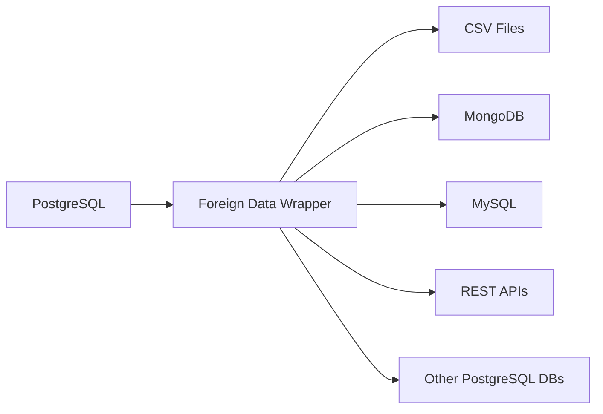

# PostgreSQL Foreign Data Wrappers

## Introduction

Have you ever needed to query data that lives outside your PostgreSQL database? Perhaps you need to pull information from a MongoDB collection, a CSV file on a remote server, or even another PostgreSQL database. This is where **Foreign Data Wrappers (FDWs)** come in.

Foreign Data Wrappers are a powerful feature in PostgreSQL that allow you to access data stored in external data sources as if they were regular PostgreSQL tables. They implement the SQL/MED (Management of External Data) standard, which was introduced in SQL:2003.

In this tutorial, we'll cover:
- What Foreign Data Wrappers are and why they're useful
- How to set up and use the most common FDWs
- Practical examples for real-world use cases
- Best practices and limitations to keep in mind

## What are Foreign Data Wrappers?

Foreign Data Wrappers act as a bridge between PostgreSQL and external data sources. They provide an API that PostgreSQL uses to communicate with external systems, allowing you to run SQL queries against data that lives outside your PostgreSQL instance.



### Key Components

When working with Foreign Data Wrappers, you'll need to understand these components:

1. **Foreign Data Wrapper** - The extension that implements the interface to the external data source
2. **Foreign Server** - A named connection to an external data source
3. **User Mapping** - Maps a PostgreSQL user to credentials for the external system
4. **Foreign Table** - A table definition that maps to data in the external system

## Setting Up Your First Foreign Data Wrapper

Let's start with a common use case: accessing another PostgreSQL database. For this, we'll use the `postgres_fdw` extension which comes built-in with PostgreSQL.

### Step 1: Create the Extension

First, we need to enable the extension:

```sql
CREATE EXTENSION postgres_fdw;
```

### Step 2: Create a Foreign Server

Next, we define a foreign server that points to the external PostgreSQL database:

```sql
CREATE SERVER foreign_server
    FOREIGN DATA WRAPPER postgres_fdw
    OPTIONS (host 'remote-server.example.com', port '5432', dbname 'remote_db');
```

### Step 3: Create a User Mapping

Now, we map our local PostgreSQL user to credentials for the remote database:

```sql
CREATE USER MAPPING FOR local_user
    SERVER foreign_server
    OPTIONS (user 'remote_user', password 'remote_password');
```

### Step 4: Create Foreign Tables

Finally, we create a foreign table that maps to a table in the remote database:

```sql
CREATE FOREIGN TABLE foreign_customers (
    id integer NOT NULL,
    name text NOT NULL,
    email text
)
    SERVER foreign_server
    OPTIONS (schema_name 'public', table_name 'customers');
```

### Step 5: Query the Foreign Table

Now we can query the foreign table just like any local table:

```sql
SELECT * FROM foreign_customers WHERE id > 1000;
```

**Output:**
```
 id   |    name     |        email        
------+-------------+---------------------
 1001 | John Doe    | john.doe@example.com
 1002 | Jane Smith  | jane@example.com
 1003 | Bob Johnson | bob@example.com
```

## Common Foreign Data Wrappers

PostgreSQL supports various Foreign Data Wrappers. Here are some popular ones:

### 1. postgres_fdw

As we've seen, `postgres_fdw` allows you to connect to other PostgreSQL databases.

### 2. file_fdw

The `file_fdw` extension lets you access data in files on the PostgreSQL server's file system.

Here's how to set it up:

```sql
-- Create the extension
CREATE EXTENSION file_fdw;

-- Create the server
CREATE SERVER csv_server FOREIGN DATA WRAPPER file_fdw;

-- Create a foreign table
CREATE FOREIGN TABLE csv_users (
    id integer,
    name text,
    email text
) SERVER csv_server
OPTIONS (
    filename '/path/to/users.csv',
    format 'csv',
    header 'true'
);
```

### 3. mysql_fdw

The `mysql_fdw` extension allows PostgreSQL to connect to MySQL databases:

```sql
-- Install the extension (requires prior installation of the package)
CREATE EXTENSION mysql_fdw;

-- Create the server
CREATE SERVER mysql_server
    FOREIGN DATA WRAPPER mysql_fdw
    OPTIONS (host 'mysql-server.example.com', port '3306');

-- Create user mapping
CREATE USER MAPPING FOR postgres
    SERVER mysql_server
    OPTIONS (username 'mysql_user', password 'mysql_password');

-- Create foreign table
CREATE FOREIGN TABLE mysql_products (
    id int,
    name varchar(100),
    price decimal(10,2)
)
SERVER mysql_server
OPTIONS (dbname 'inventory', table_name 'products');
```

### 4. mongo_fdw

For MongoDB integration:

```sql
-- Install the extension (requires prior installation of the package)
CREATE EXTENSION mongo_fdw;

-- Create the server
CREATE SERVER mongo_server
    FOREIGN DATA WRAPPER mongo_fdw
    OPTIONS (address 'mongodb://mongodb.example.com:27017');

-- Create user mapping
CREATE USER MAPPING FOR postgres
    SERVER mongo_server
    OPTIONS (username 'mongo_user', password 'mongo_password');

-- Create foreign table
CREATE FOREIGN TABLE mongo_users (
    _id name,
    name text,
    email text,
    created_at timestamp
)
SERVER mongo_server
OPTIONS (database 'app', collection 'users');
```

## Real-World Use Cases

Let's explore some practical scenarios where Foreign Data Wrappers shine:

### Case 1: Data Migration

When migrating from another database system to PostgreSQL, you can use FDWs to make the transition smoother:

```sql
-- Step 1: Set up the foreign data wrapper to the source database
-- (Using mysql_fdw as an example)

-- Step 2: Create foreign tables for all tables you want to migrate

-- Step 3: Migrate the data using INSERT INTO ... SELECT
INSERT INTO local_customers
SELECT * FROM mysql_customers;
```

### Case 2: Data Federation

You can create reports that combine data from multiple sources:

```sql
-- Query that joins local and remote data
SELECT 
    c.name AS customer_name,
    o.order_date,
    p.name AS product_name,
    p.price
FROM 
    local_customers c
JOIN 
    foreign_orders o ON c.id = o.customer_id
JOIN 
    mysql_products p ON o.product_id = p.id
WHERE 
    o.order_date > '2023-01-01';
```

### Case 3: Incremental Data Loading

You can use FDWs for ETL processes, loading only new or changed data:

```sql
-- Insert only new records from the foreign table
INSERT INTO local_events
SELECT * FROM foreign_events
WHERE event_date > (SELECT MAX(event_date) FROM local_events);
```

## Writing to Foreign Tables

Most Foreign Data Wrappers also support write operations (INSERT, UPDATE, DELETE), although this depends on the specific wrapper and the external data source's capabilities.

```sql
-- Insert a new record into a foreign table
INSERT INTO foreign_customers (id, name, email)
VALUES (1004, 'Alice Williams', 'alice@example.com');

-- Update a record in a foreign table
UPDATE foreign_customers
SET email = 'new.email@example.com'
WHERE id = 1001;

-- Delete a record from a foreign table
DELETE FROM foreign_customers
WHERE id = 1002;
```

## Performance Considerations

When working with Foreign Data Wrappers, keep these performance tips in mind:

1. **Query Pushdown**: Some FDWs can "push down" certain query conditions to the remote server, which improves performance by reducing the amount of data transferred.

2. **Limit Data Transfer**: Try to filter data at the source by adding WHERE clauses that the FDW can push down.

3. **Indexing**: For frequently accessed foreign tables, ensure the relevant columns in the remote database are indexed.

4. **Materialized Views**: For complex queries or when performance is critical, consider creating materialized views that store the result of foreign table queries locally:

```sql
CREATE MATERIALIZED VIEW local_foreign_customers AS
SELECT * FROM foreign_customers
WHERE active = true;

-- Refresh when needed
REFRESH MATERIALIZED VIEW local_foreign_customers;
```

## Limitations

While Foreign Data Wrappers are powerful, they do have some limitations:

1. **Performance**: Queries on foreign tables are generally slower than on local tables due to network overhead.

2. **Transaction Support**: Some FDWs don't support transactions across local and foreign tables.

3. **Feature Support**: Not all PostgreSQL features are available for foreign tables (e.g., certain constraints).

4. **Security**: Credentials for external systems need to be managed carefully.

## Creating Your Own Foreign Data Wrapper

For advanced users, PostgreSQL allows you to create custom FDWs using the C programming language or extensions like Multicorn (which allows writing FDWs in Python).

This is beyond the scope of this tutorial, but if you're interested, PostgreSQL's documentation provides detailed information on the FDW API.

## Summary

Foreign Data Wrappers are a powerful feature in PostgreSQL that enable you to work with data from various external sources within your database. They provide a unified SQL interface to diverse data sources, making it easier to integrate data from multiple systems.

In this tutorial, we've covered:

- The basics of Foreign Data Wrappers and their components
- Setting up and using common FDWs like postgres_fdw, file_fdw, and others
- Real-world use cases for data integration
- Performance considerations and limitations

With this knowledge, you can now leverage PostgreSQL's Foreign Data Wrappers to build more integrated and flexible data solutions.

## Additional Resources

- [PostgreSQL Official Documentation on Foreign Data Wrappers](https://www.postgresql.org/docs/current/postgres-fdw.html)
- [List of Foreign Data Wrappers](https://wiki.postgresql.org/wiki/Foreign_data_wrappers)

## Exercises

1. Set up `postgres_fdw` to connect to another PostgreSQL database and query a table.
2. Create a foreign table using `file_fdw` to read data from a CSV file.
3. Write a query that joins data from a local table with data from a foreign table.
4. Create a materialized view based on a foreign table and set up a refresh schedule.
5. Explore one of the specialized FDWs (e.g., for MongoDB, Redis, or a REST API) and connect it to your PostgreSQL database.