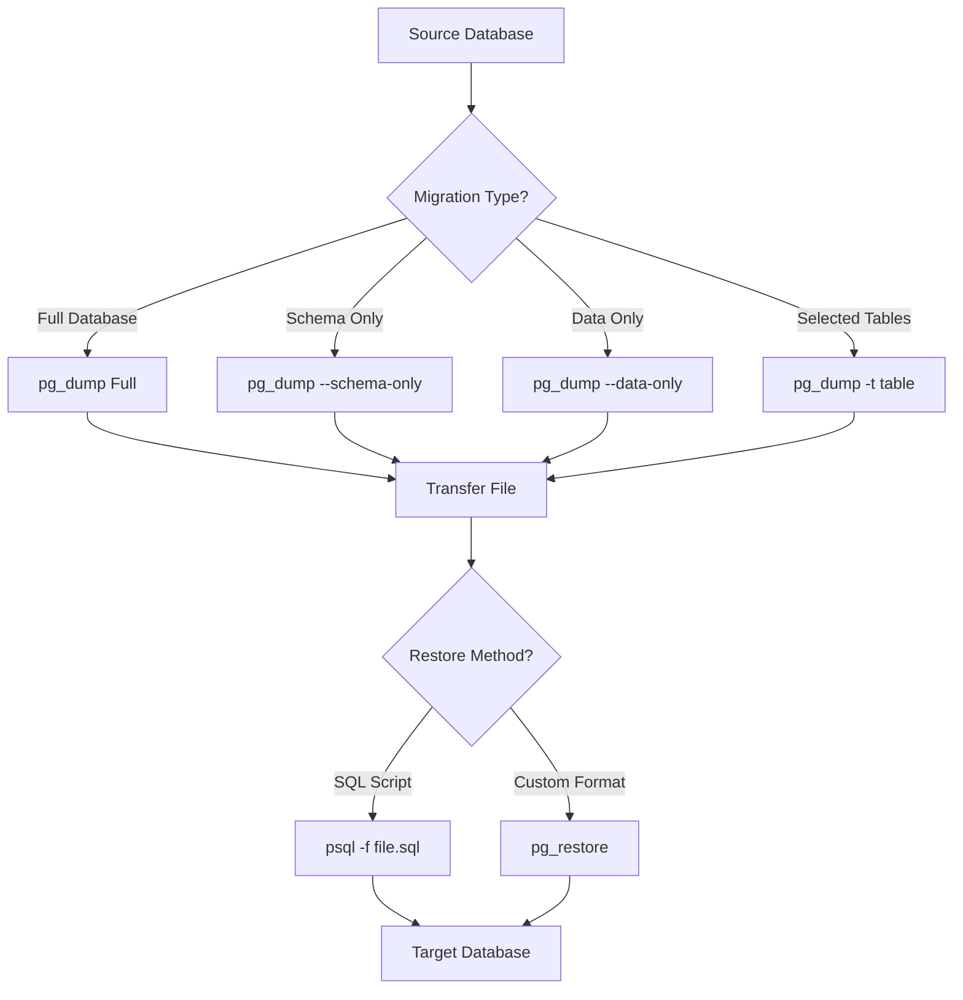

# PostgreSQL Data Migration

## Introduction

Data migration is a critical process in database management that involves transferring data between PostgreSQL databases. Whether you're upgrading your database version, moving to a new server, or restructuring your database architecture, proper migration techniques ensure your data remains intact and consistent.

In this tutorial, we'll explore different approaches to PostgreSQL data migration, from simple command-line tools to more sophisticated migration frameworks. By the end, you'll have a solid understanding of how to safely migrate your PostgreSQL data in various scenarios.

## Why Migrate PostgreSQL Data?

There are several common scenarios where data migration becomes necessary:

- **Version upgrades**: Moving from an older PostgreSQL version to a newer one
- **Server migration**: Transferring databases to a different physical or virtual server
- **Cloud migration**: Moving from on-premises to cloud-based PostgreSQL or between cloud providers
- **Database consolidation**: Combining multiple databases into one
- **Schema changes**: Restructuring your database while preserving data

## Core Migration Tools

### pg_dump and pg_restore

The most fundamental tools for PostgreSQL migration are `pg_dump` and `pg_restore`. These utilities are included with every PostgreSQL installation.

#### Basic Database Dump

```bash
pg_dump -h localhost -U username -d source_database -f backup.sql
```

This command creates a SQL file containing all database objects and data.

#### Compressed Format Dump

```bash
pg_dump -h localhost -U username -d source_database -Fc -f backup.dump
```

The `-Fc` flag creates a compressed custom format file that can be used with pg_restore.

#### Restoring from SQL Dump

```bash
psql -h localhost -U username -d target_database -f backup.sql
```

#### Restoring from Custom Format

```bash
pg_restore -h localhost -U username -d target_database backup.dump
```

### Example: Full Database Migration

Let's walk through a complete migration process:

1. Dump the source database:

```bash
pg_dump -h source_host -U source_user -d source_db -Fc -f migration.dump
```

2. Create a new empty target database:

```bash
psql -h target_host -U target_user -c "CREATE DATABASE target_db;"
```

3. Restore the dump to the target database:

```bash
pg_restore -h target_host -U target_user -d target_db migration.dump
```

## Advanced Migration Techniques

### Schema-Only and Data-Only Migrations

Sometimes you need to migrate just the structure or just the data:

#### Schema-Only Dump

```bash
pg_dump -h localhost -U username -d source_database --schema-only -f schema.sql
```

#### Data-Only Dump

```bash
pg_dump -h localhost -U username -d source_database --data-only -f data.sql
```

### Selective Table Migration

You can migrate specific tables instead of the entire database:

```bash
pg_dump -h localhost -U username -d source_database -t table_name -f table_backup.sql
```

To migrate multiple tables:

```bash
pg_dump -h localhost -U username -d source_database -t table1 -t table2 -f tables_backup.sql
```

### Parallel Processing for Large Databases

For very large databases, you can use parallel processing to speed up the migration:

```bash
pg_dump -h localhost -U username -d source_database -Fc -f backup.dump -j 4
```

And when restoring:

```bash
pg_restore -h localhost -U username -d target_database backup.dump -j 4
```

The `-j` flag specifies the number of parallel jobs to use.

## Migration Strategy Diagram



## Handling Large Table Migrations with COPY

For extremely large tables, using the `COPY` command can be more efficient:

1. Export data from source:

```bash
psql -h source_host -U source_user -d source_db -c "\COPY (SELECT * FROM large_table) TO 'large_table.csv' WITH CSV HEADER"
```

2. Import data to target:

```bash
psql -h target_host -U target_user -d target_db -c "\COPY large_table FROM 'large_table.csv' WITH CSV HEADER"
```

## Real-World Migration Scenario

Let's walk through a complete real-world migration scenario:

### Scenario: Upgrading PostgreSQL from 12 to 15

```bash
# Step 1: Dump the PostgreSQL 12 database
pg_dump -h old_server -U admin -d production_db -Fc -f production_migration.dump

# Step 2: Transfer the dump file to the new server
scp production_migration.dump admin@new_server:/tmp/

# Step 3: Create a new database on PostgreSQL 15
psql -h new_server -U admin -c "CREATE DATABASE production_db_new;"

# Step 4: Restore the dump to the new database
pg_restore -h new_server -U admin -d production_db_new /tmp/production_migration.dump
```

### Handling Migration Errors

If you encounter errors during restoration, you can use these flags:

```bash
pg_restore -h target_host -U target_user -d target_db backup.dump --no-owner --exit-on-error
```

The `--no-owner` flag ignores ownership issues, and `--exit-on-error` stops the process if an error occurs.

## Using pgAdmin for Migrations

If you prefer a GUI approach, pgAdmin provides a user-friendly interface for migrations:

1. Right-click on the source database and select "Backup..."
2. Configure backup settings and format
3. Save the backup file
4. Right-click on the target server and create a new database
5. Right-click on the new database and select "Restore..."
6. Select the backup file and configure restoration options

## Continuous Data Migration

For minimal-downtime migrations, consider these approaches:

### Logical Replication

PostgreSQL's logical replication allows you to replicate changes between databases:

1. Set up a publication in the source database:

```sql
CREATE PUBLICATION pub_migration FOR ALL TABLES;
```

2. Create a subscription in the target database:

```sql
CREATE SUBSCRIPTION sub_migration 
CONNECTION 'host=source_host port=5432 dbname=source_db user=repl_user password=secret' 
PUBLICATION pub_migration;
```

This keeps the target database in sync with the source during migration preparation.

## Best Practices for PostgreSQL Migrations

1. **Test thoroughly**: Always test your migration process in a non-production environment first.

2. **Schedule downtime**: Plan for appropriate downtime during the final switchover.

3. **Create backups**: Back up the source database before migration.

4. **Verify data integrity**: After migration, verify that all data has been transferred correctly:

```sql
-- On source database
SELECT COUNT(*) FROM important_table;

-- On target database
SELECT COUNT(*) FROM important_table;
```

5. **Script your process**: Create repeatable scripts for the entire migration procedure.

6. **Monitor performance**: Watch for performance issues after migration and tune as needed.

## Summary

PostgreSQL data migration is a crucial skill for database administrators and developers. We've covered:

- Basic migration using pg_dump and pg_restore
- Advanced techniques for schema and data migrations
- Handling large databases with parallel processing
- Real-world migration scenarios
- Best practices for successful migrations

By following these techniques and best practices, you can successfully migrate your PostgreSQL databases with minimal disruption and maintain data integrity throughout the process.

## Exercises

1. Create a small test database, dump it using different formats (plain SQL, custom, and directory), and restore each format to understand the differences.

2. Practice migrating only specific tables from a database.

3. Set up logical replication between two PostgreSQL databases and observe how data changes propagate.

4. Write a shell script that automates the entire migration process for a database.

## Additional Resources

- [PostgreSQL Documentation: Backup and Restore](https://www.postgresql.org/docs/current/backup.html)
- [PostgreSQL Documentation: Logical Replication](https://www.postgresql.org/docs/current/logical-replication.html)
- [PostgreSQL Wiki: Migration](https://wiki.postgresql.org/wiki/Migration)