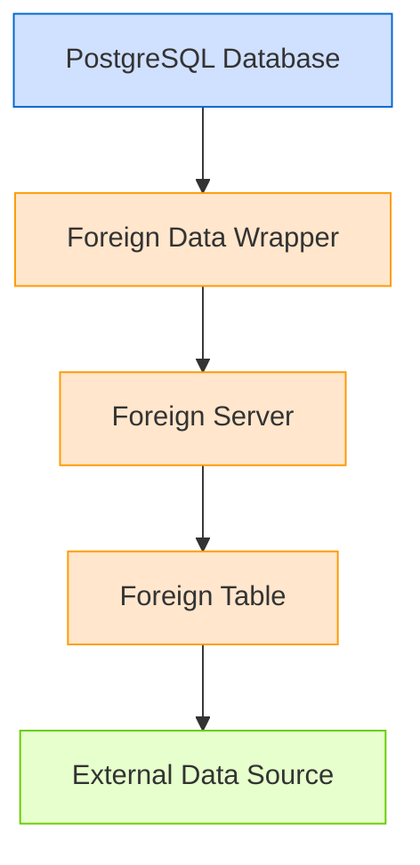

# PostgreSQL External Tables

## Introduction

External tables in PostgreSQL allow you to access data stored outside your database as if it were a regular table. Unlike traditional tables that store data directly in the database, external tables act as interfaces to external data sources, providing a seamless way to query and manipulate external data without importing it into your database.

This approach offers several advantages:
- **Data remains at the source** - No need to duplicate large datasets
- **Real-time access** - Query the most recent data directly from its source
- **Reduced storage requirements** - Only store what you need in your database
- **Unified querying** - Use standard SQL to query both internal and external data

In this guide, we'll explore how to set up and use external tables in PostgreSQL through the Foreign Data Wrapper (FDW) mechanism.

## Understanding Foreign Data Wrappers

PostgreSQL implements external tables through a feature called Foreign Data Wrappers (FDWs). Based on the SQL/MED (Management of External Data) standard, FDWs provide a standardized way to access external data sources.

Here's a simple diagram showing how FDWs work:



The architecture involves several components:
1. **Foreign Data Wrapper** - The driver that knows how to communicate with a specific type of external data source
2. **Foreign Server** - Configuration for connecting to a specific external data source
3. **Foreign Table** - Maps to a table, file, or other data structure in the external data source
4. **User Mapping** - Stores credentials needed to access the external source

## Popular Foreign Data Wrappers

PostgreSQL comes with several built-in FDWs, and many more are available as extensions:

| FDW | Purpose | Sources |
|-----|---------|---------|
| `postgres_fdw` | Connect to other PostgreSQL databases | PostgreSQL databases |
| `file_fdw` | Read data from files on the database server | CSV, text files |
| `dblink` | Execute queries on remote PostgreSQL servers | PostgreSQL databases |
| `mysql_fdw` | Connect to MySQL databases | MySQL databases |
| `mongo_fdw` | Connect to MongoDB collections | MongoDB databases |
| `oracle_fdw` | Connect to Oracle databases | Oracle databases |
| `elasticsearch_fdw` | Query Elasticsearch indexes | Elasticsearch |
| `s3_fdw` | Access files in Amazon S3 buckets | S3 storage |

In this guide, we'll focus on two of the most common FDWs: `file_fdw` for accessing local files and `postgres_fdw` for connecting to other PostgreSQL databases.

## Setting Up File-Based External Tables

Let's start with a common use case: accessing CSV data stored as files on your server.

### Step 1: Enable the file_fdw Extension

First, we need to enable the `file_fdw` extension:

```sql
CREATE EXTENSION file_fdw;
```

### Step 2: Create a Foreign Server

Next, we create a server object that will represent our file system:

```sql
CREATE SERVER file_server FOREIGN DATA WRAPPER file_fdw;
```

### Step 3: Create a Foreign Table

Now, we can create a foreign table that maps to our CSV file:

```sql
CREATE FOREIGN TABLE employees_external (
    id INTEGER,
    name TEXT,
    department TEXT,
    salary NUMERIC
)
SERVER file_server
OPTIONS (
    filename '/path/to/employees.csv',
    format 'csv',
    header 'true',
    delimiter ','
);
```

### Step 4: Query the External Table

Once set up, you can query the external table just like any regular table:

```sql
SELECT * FROM employees_external;
```

**Output:**
```
 id |    name    | department | salary 
----+------------+------------+--------
  1 | John Smith | Sales      |  65000
  2 | Mary Jones | Marketing  |  78000
  3 | David Lee  | IT         |  82000
  4 | Lisa Wong  | Finance    |  76000
```

You can also join external tables with regular tables:

```sql
SELECT e.name, e.department, p.project_name
FROM employees_external e
JOIN projects p ON e.id = p.employee_id;
```

## Working with Remote PostgreSQL Databases

Another common scenario is connecting to tables in another PostgreSQL database.

### Step 1: Enable the postgres_fdw Extension

```sql
CREATE EXTENSION postgres_fdw;
```

### Step 2: Create a Foreign Server

```sql
CREATE SERVER remote_db
FOREIGN DATA WRAPPER postgres_fdw
OPTIONS (
    host 'remote-server.example.com',
    port '5432',
    dbname 'remote_database'
);
```

### Step 3: Create a User Mapping

This stores the credentials needed to connect to the remote database:

```sql
CREATE USER MAPPING FOR local_user
SERVER remote_db
OPTIONS (
    user 'remote_user',
    password 'remote_password'
);
```

### Step 4: Create a Foreign Table

```sql
CREATE FOREIGN TABLE remote_products (
    product_id INTEGER,
    product_name TEXT,
    price NUMERIC,
    category TEXT
)
SERVER remote_db
OPTIONS (
    schema_name 'public',
    table_name 'products'
);
```

### Step 5: Query the Remote Data

```sql
SELECT * FROM remote_products WHERE price < 100;
```

## Creating an Import/Export Workflow

External tables are particularly useful for ETL (Extract, Transform, Load) operations. Here's a practical example of how to use them in an import workflow:

### Example: Monthly Sales Data Import

Suppose you receive monthly sales data as CSV files, and you need to import them into your analytics database:

```sql
-- Create a staging foreign table
CREATE FOREIGN TABLE monthly_sales_staging (
    date DATE,
    product_id INTEGER,
    quantity INTEGER,
    unit_price NUMERIC,
    total_amount NUMERIC
)
SERVER file_server
OPTIONS (
    filename '/path/to/incoming/sales_2023_10.csv',
    format 'csv',
    header 'true',
    delimiter ','
);

-- Create a permanent table for aggregated sales data
CREATE TABLE IF NOT EXISTS sales_summary (
    month DATE,
    product_id INTEGER,
    total_quantity INTEGER,
    revenue NUMERIC,
    CONSTRAINT pk_sales_summary PRIMARY KEY (month, product_id)
);

-- Insert the data with transformation
INSERT INTO sales_summary (month, product_id, total_quantity, revenue)
SELECT 
    DATE_TRUNC('month', date) AS month,
    product_id,
    SUM(quantity) AS total_quantity,
    SUM(total_amount) AS revenue
FROM monthly_sales_staging
GROUP BY DATE_TRUNC('month', date), product_id
ON CONFLICT (month, product_id) DO UPDATE
SET total_quantity = sales_summary.total_quantity + EXCLUDED.total_quantity,
    revenue = sales_summary.revenue + EXCLUDED.revenue;
```

This workflow allows you to import data without permanently storing the raw file contents in your database.

## Advanced Techniques

### Creating a View to Simplify Complex External Data

You can create views on top of foreign tables to simplify access and add business logic:

```sql
CREATE VIEW customer_sales AS
SELECT 
    c.customer_id,
    c.customer_name,
    c.region,
    SUM(s.total_amount) AS total_sales
FROM customers c
JOIN sales_external s ON c.customer_id = s.customer_id
GROUP BY c.customer_id, c.customer_name, c.region;
```

### Using COPY for Bulk Importing from External Tables

You can use the `COPY` command to quickly move data from external tables to local tables:

```sql
-- Create a local table with the same structure
CREATE TABLE employees_local (
    id INTEGER PRIMARY KEY,
    name TEXT,
    department TEXT,
    salary NUMERIC
);

-- Copy data from external table to local table
COPY employees_local FROM PROGRAM 
    'psql -h remote-server -U user -d database -c "COPY (SELECT * FROM employees) TO STDOUT"';
```

### Handling Access Permissions

To control who can access external data, you need to manage permissions:

```sql
-- Grant select permission on foreign table
GRANT SELECT ON employees_external TO analyst_role;

-- Revoke usage permission on foreign server
REVOKE USAGE ON FOREIGN SERVER remote_db FROM restricted_role;
```

## Limitations and Considerations

When working with external tables, keep these limitations in mind:

1. **Performance**: Querying external data is typically slower than querying local tables
2. **Transaction support**: External tables may not fully participate in transactions
3. **Function support**: Not all PostgreSQL functions can be pushed down to external sources
4. **Security**: Credentials for external sources need careful management
5. **Feature differences**: External sources may not support all PostgreSQL features

## Best Practices

- **Use for appropriate scenarios**: External tables work best for data that changes frequently at the source or is too large to duplicate
- **Consider materialized views**: For frequent queries, consider creating materialized views from external data
- **Monitor performance**: External queries may need optimization differently than regular queries
- **Handle errors gracefully**: External sources can become unavailable, so implement error handling
- **Secure credentials**: Use encrypted password storage or connection pooling solutions

## Practical Example: Building a Data Pipeline

Let's create a complete example of a data pipeline that:
1. Reads data from a CSV file
2. Transforms it
3. Stores results in the local database

```sql
-- Step 1: Set up the external table
CREATE EXTENSION IF NOT EXISTS file_fdw;
CREATE SERVER IF NOT EXISTS file_server FOREIGN DATA WRAPPER file_fdw;

CREATE FOREIGN TABLE raw_weather_data (
    station_id TEXT,
    observation_date DATE,
    temperature NUMERIC,
    precipitation NUMERIC,
    humidity NUMERIC,
    wind_speed NUMERIC
)
SERVER file_server
OPTIONS (
    filename '/data/weather_readings.csv',
    format 'csv',
    header 'true',
    delimiter ','
);

-- Step 2: Create local tables for processed data
CREATE TABLE IF NOT EXISTS weather_stations (
    station_id TEXT PRIMARY KEY,
    location TEXT,
    elevation NUMERIC
);

CREATE TABLE IF NOT EXISTS weather_summary (
    station_id TEXT REFERENCES weather_stations(station_id),
    month DATE,
    avg_temperature NUMERIC,
    total_precipitation NUMERIC,
    avg_humidity NUMERIC,
    avg_wind_speed NUMERIC,
    PRIMARY KEY (station_id, month)
);

-- Step 3: Transform and load the data
INSERT INTO weather_summary (
    station_id,
    month,
    avg_temperature,
    total_precipitation,
    avg_humidity,
    avg_wind_speed
)
SELECT 
    station_id,
    DATE_TRUNC('month', observation_date) AS month,
    AVG(temperature) AS avg_temperature,
    SUM(precipitation) AS total_precipitation,
    AVG(humidity) AS avg_humidity,
    AVG(wind_speed) AS avg_wind_speed
FROM raw_weather_data
GROUP BY station_id, DATE_TRUNC('month', observation_date)
ON CONFLICT (station_id, month) DO UPDATE
SET avg_temperature = EXCLUDED.avg_temperature,
    total_precipitation = EXCLUDED.total_precipitation,
    avg_humidity = EXCLUDED.avg_humidity,
    avg_wind_speed = EXCLUDED.avg_wind_speed;
```

This pipeline reads raw weather data, aggregates it by month, and stores the summary in a local table.

## Summary

PostgreSQL external tables, implemented through Foreign Data Wrappers, provide a powerful way to integrate external data sources into your database workflow. They allow you to:

- Access data from various sources (files, other databases, web services)
- Query external data using standard SQL
- Join external and local data seamlessly
- Build efficient data pipelines and ETL processes

While external tables have some limitations compared to local tables, they offer significant benefits in scenarios involving large datasets, frequently changing data, or distributed data architectures.

## Additional Resources

To learn more about PostgreSQL external tables and Foreign Data Wrappers:

- [PostgreSQL Official Documentation on Foreign Data](https://www.postgresql.org/docs/current/ddl-foreign-data.html)
- [PostgreSQL Foreign Data Wrapper Interface](https://www.postgresql.org/docs/current/fdw-helpers.html)
- [List of available Foreign Data Wrappers](https://wiki.postgresql.org/wiki/Foreign_data_wrappers)

## Exercises

1. Create a foreign table that accesses a CSV file containing customer data.
2. Set up a foreign table that connects to another PostgreSQL database and queries product inventory.
3. Build a reporting solution that combines data from a local sales table with customer data from an external source.
4. Create a data validation workflow that compares data in your local database with an external reference database.
5. Implement a logging system that archives log data from your database to external files using foreign tables.