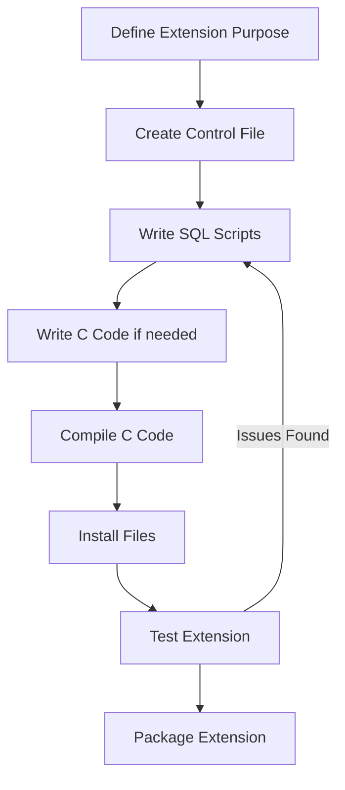

# PostgreSQL Extension Basics

## Introduction

PostgreSQL is renowned for its extensibility, allowing users to enhance its functionality beyond core features. Extensions are packages of SQL objects that can be added to or removed from a PostgreSQL database as single units. They enable you to add new data types, functions, operators, index types, and more without modifying the PostgreSQL core.

This guide will walk you through the basics of PostgreSQL extensions - what they are, how they work, and how to use them effectively in your projects.

## What Are PostgreSQL Extensions?

Extensions are modular packages that extend PostgreSQL's capabilities. Think of them as "plugins" for your database that can be easily installed, updated, or removed. They're powerful because they:

- Allow for clean separation between core PostgreSQL code and additional functionality
- Can be version-controlled independently of the database
- Can be easily shared between different projects and users
- Provide specialized functionality without bloating the core database system

## Core Extension Concepts

Before diving into the practical aspects, let's understand some fundamental concepts:

- **Extension Files**: Extensions consist of SQL scripts, shared libraries, and metadata
- **Extension Catalog**: PostgreSQL tracks installed extensions in the `pg_extension` catalog
- **Extension Control Files**: Files with `.control` extension that define metadata about the extension
- **Version Management**: Extensions support versioning and upgrading

## Popular Built-in Extensions

PostgreSQL comes with several pre-bundled extensions. Here are some of the most commonly used ones:

| Extension | Purpose |
|-----------|---------|
| `pg_stat_statements` | Query performance monitoring |
| `hstore` | Key-value store within PostgreSQL |
| `uuid-ossp` | UUID generation functions |
| `postgis` | Geospatial data support |
| `pgcrypto` | Cryptographic functions |
| `ltree` | Hierarchical tree-like structures |

## Managing Extensions

### Listing Available Extensions

To see what extensions are available for installation in your PostgreSQL instance:

```sql
SELECT * FROM pg_available_extensions;
```

Example output:

```
    name    | default_version | installed_version |                             comment                             
------------+-----------------+-------------------+-----------------------------------------------------------------
 plpgsql    | 1.0             | 1.0               | PL/pgSQL procedural language
 hstore     | 1.8             |                   | data type for storing sets of (key, value) pairs
 pgcrypto   | 1.3             |                   | cryptographic functions
 uuid-ossp  | 1.1             |                   | generate universally unique identifiers (UUIDs)
 ...
```

### Installing an Extension

To install an extension, use the `CREATE EXTENSION` command:

```sql
CREATE EXTENSION hstore;
```

After executing this command, all the objects defined by the extension (functions, data types, etc.) become available in your database.

### Verifying Installed Extensions

To see what extensions are installed in your current database:

```sql
SELECT * FROM pg_extension;
```

Or for a more user-friendly output:

```sql
SELECT extname, extversion FROM pg_extension;
```

Example output:

```
 extname | extversion 
---------+------------
 plpgsql | 1.0
 hstore  | 1.8
```

### Removing an Extension

To remove an extension:

```sql
DROP EXTENSION hstore;
```

This will remove all objects that were created by the extension.

### Extension Schema

By default, extensions create their objects in the current schema (usually `public`). You can specify a different schema when creating an extension:

```sql
CREATE EXTENSION hstore SCHEMA extensions;
```

This helps keep your database organized by separating extension objects from your application objects.

## Real-World Examples

Let's look at some practical examples of using extensions:

### Example 1: Using UUID Generation

The `uuid-ossp` extension provides functions for generating UUIDs, which are useful for primary keys.

```sql
-- Install the extension
CREATE EXTENSION IF NOT EXISTS "uuid-ossp";

-- Create a table using UUID as primary key
CREATE TABLE users (
    id UUID PRIMARY KEY DEFAULT uuid_generate_v4(),
    username VARCHAR(50) NOT NULL,
    email VARCHAR(100) NOT NULL
);

-- Insert a record (UUID will be automatically generated)
INSERT INTO users (username, email)
VALUES ('johndoe', 'john@example.com');

-- Query to see the generated UUID
SELECT * FROM users;
```

Output:

```
                  id                  | username |      email       
--------------------------------------+----------+------------------
 6c84fb90-12c4-11e1-840d-7b25c5ee775a | johndoe  | john@example.com
```

### Example 2: Working with JSON Data

PostgreSQL's `json` and `jsonb` types are part of the core system, but you can enhance their functionality with the `jsonb_plperl` extension:

```sql
-- Install the extension
CREATE EXTENSION IF NOT EXISTS "plperl";
CREATE EXTENSION IF NOT EXISTS "jsonb_plperl";

-- Create a table with JSONB data
CREATE TABLE product_catalog (
    id SERIAL PRIMARY KEY,
    product_data JSONB
);

-- Insert sample data
INSERT INTO product_catalog (product_data) VALUES
('{"name": "Laptop", "price": 1200, "specs": {"ram": "16GB", "storage": "512GB"}}');

-- Use jsonb functions to query data
SELECT 
    id,
    product_data->>'name' AS product_name,
    (product_data->>'price')::numeric AS price,
    product_data->'specs'->>'ram' AS ram
FROM product_catalog;
```

Output:

```
 id | product_name | price |  ram  
----+--------------+-------+-------
  1 | Laptop       |  1200 | 16GB
```

### Example 3: Implementing Full-Text Search with pg_trgm

The `pg_trgm` extension improves text search capabilities:

```sql
-- Install the extension
CREATE EXTENSION IF NOT EXISTS pg_trgm;

-- Create a table
CREATE TABLE articles (
    id SERIAL PRIMARY KEY,
    title TEXT,
    content TEXT
);

-- Insert some sample data
INSERT INTO articles (title, content) VALUES
('PostgreSQL Basics', 'Learn the basics of PostgreSQL database management.'),
('Advanced PostgreSQL', 'Explore advanced features of PostgreSQL including extensions.'),
('Database Design', 'Principles of good database design and normalization.');

-- Create a GIN index for faster text search
CREATE INDEX idx_articles_content_trgm ON articles USING gin (content gin_trgm_ops);

-- Perform a similarity search
SELECT title, content, similarity(content, 'basics of PostgreSQL database') AS sim
FROM articles
WHERE content % 'basics of PostgreSQL database'
ORDER BY sim DESC;
```

Output:

```
      title       |                        content                         |   sim   
------------------+--------------------------------------------------------+---------
 PostgreSQL Basics | Learn the basics of PostgreSQL database management.    | 0.5625
 Advanced PostgreSQL | Explore advanced features of PostgreSQL including extensions. | 0.28125
```

## Creating Your Own Extensions

While using existing extensions is common, you might need to create your own. Here's a simple example of creating a basic extension:

1. Create a control file `my_extension.control`:

```
# my_extension control file
comment = 'My first PostgreSQL extension'
default_version = '1.0'
relocatable = true
```

2. Create an SQL script `my_extension--1.0.sql`:

```sql
-- complain if script is sourced in psql, rather than via CREATE EXTENSION
\echo Use "CREATE EXTENSION my_extension" to load this file. \quit

CREATE FUNCTION hello_world() 
RETURNS text AS $$
BEGIN
    RETURN 'Hello from my custom extension!';
END;
$$ LANGUAGE plpgsql;
```

3. Install the extension files in the PostgreSQL extension directory:

```bash
cp my_extension.control $(pg_config --sharedir)/extension/
cp my_extension--1.0.sql $(pg_config --sharedir)/extension/
```

4. Create the extension in your database:

```sql
CREATE EXTENSION my_extension;
```

5. Test your extension:

```sql
SELECT hello_world();
```

Output:

```
         hello_world         
-----------------------------
 Hello from my custom extension!
```

## Extension Development Workflow

When developing extensions, follow this general workflow:



## Common Extension Pitfalls and Best Practices

When working with PostgreSQL extensions, be aware of these common issues:

1. **Version compatibility**: Extensions may only work with specific PostgreSQL versions
2. **Dependencies**: Some extensions require other extensions to be installed first
3. **Schema conflicts**: Be cautious about extension objects conflicting with your database objects
4. **Upgrade considerations**: Always back up your database before upgrading extensions

Best practices:

1. Always specify `IF NOT EXISTS` when creating extensions in scripts
2. Use dedicated schemas for extensions to avoid namespace conflicts
3. Test extensions in a development environment before production
4. Keep track of installed extensions as part of your database documentation

## Summary

PostgreSQL extensions provide a powerful way to enhance your database's functionality without modifying the core code. In this guide, we've covered:

- What extensions are and why they're useful
- How to list, install, and manage extensions
- Real-world examples of common extensions
- Basic steps for creating your own extensions

By leveraging extensions, you can customize PostgreSQL to perfectly fit your application's needs while maintaining a clean separation between core functionality and customizations.

## Additional Resources

- [PostgreSQL Documentation on Extensions](https://www.postgresql.org/docs/current/extend-extensions.html)
- [PostgreSQL Extension Network (PGXN)](https://pgxn.org/)
- [Writing PostgreSQL Extensions](https://www.postgresql.org/docs/current/extend-pgxs.html)

## Exercises

1. Install the `hstore` extension and create a table that uses the hstore data type to store product attributes.
2. Use the `pg_stat_statements` extension to identify the slowest queries in your database.
3. Create a simple custom extension that adds date formatting functions to your database.
4. Research and implement a solution using the `ltree` extension to manage hierarchical data like an organizational structure.