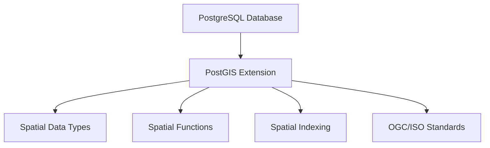

# PostgreSQL PostGIS

## Introduction

PostGIS is a powerful extension for PostgreSQL that adds support for geographic objects and spatial operations. It transforms your PostgreSQL database into a spatial database, allowing you to store, index, and query location data as easily as any other data type. Whether you're building mapping applications, analyzing geographic patterns, or working with location-based services, PostGIS provides the tools you need to handle spatial data efficiently.

In this guide, we'll explore what PostGIS is, how to set it up, and how to perform basic spatial operations using SQL. We'll also look at some real-world applications to help you understand the practical benefits of using PostGIS.

## What is PostGIS?

PostGIS extends PostgreSQL with:

- **Spatial data types** like points, lines, polygons, and more complex geometries
- **Spatial functions** for measuring distances, areas, checking if geometries overlap, etc.
- **Spatial indexing** for efficient queries on geographic data
- **Support for common geospatial standards** like OGC (Open Geospatial Consortium) and ISO



## Getting Started with PostGIS

### Prerequisites

Before we begin, make sure you have:

- PostgreSQL installed and running (version 9.6 or later recommended)
- Administrative access to your PostgreSQL instance

### Installing PostGIS

The installation process varies depending on your operating system:

#### On Ubuntu/Debian

```bash
sudo apt update
sudo apt install postgis postgresql-12-postgis-3
```

#### On macOS (using Homebrew)

```bash
brew install postgis
```

#### On Windows

The easiest way is to use the PostgreSQL installer from EnterpriseDB, which includes a "Spatial Extensions" option during installation.

### Enabling PostGIS in Your Database

Once PostGIS is installed, you need to enable it in your database:

```sql
-- Connect to your database first
CREATE EXTENSION postgis;
CREATE EXTENSION postgis_topology;
```

To verify the installation, run:

```sql
SELECT PostGIS_version();
```

Example output:
```
 postgis_version
-----------------
 3.1.4
```

## Basic Spatial Data Types

PostGIS introduces several data types to handle spatial information. The two most common are:

### Geometry

The `geometry` data type is used for planar (flat) coordinate systems. It's suitable for smaller areas where the Earth's curvature is negligible.

```sql
-- Create a table with a geometry column
CREATE TABLE landmarks (
    id SERIAL PRIMARY KEY,
    name VARCHAR(100),
    location GEOMETRY(POINT, 4326)
);

-- Insert a point (longitude, latitude)
INSERT INTO landmarks (name, location)
VALUES ('Eiffel Tower', ST_GeomFromText('POINT(2.2945 48.8584)', 4326));
```

### Geography

The `geography` data type is used for geodetic (spherical) coordinate systems. It's better for calculations spanning large distances where the Earth's curvature matters.

```sql
-- Create a table with a geography column
CREATE TABLE world_cities (
    id SERIAL PRIMARY KEY,
    name VARCHAR(100),
    location GEOGRAPHY(POINT)
);

-- Insert a point (longitude, latitude)
INSERT INTO world_cities (name, location)
VALUES ('New York', ST_GeographyFromText('POINT(-74.006 40.7128)'));
```

:::note
The number `4326` in the examples above refers to the SRID (Spatial Reference Identifier) for the WGS84 coordinate system, which is what GPS uses.
:::

## Basic Spatial Operations

PostGIS provides numerous functions for working with spatial data. Here are some of the most common:

### Creating Geometry Objects

```sql
-- Create a point
SELECT ST_MakePoint(-122.4194, 37.7749);

-- Create a line
SELECT ST_MakeLine(
    ST_MakePoint(-122.4194, 37.7749),
    ST_MakePoint(-74.006, 40.7128)
);

-- Create a polygon (a triangle)
SELECT ST_MakePolygon(
    ST_MakeLine(ARRAY[
        ST_MakePoint(0, 0),
        ST_MakePoint(1, 1),
        ST_MakePoint(1, 0),
        ST_MakePoint(0, 0)
    ])
);
```

### Distance Calculations

```sql
-- Calculate distance between two points (in degrees)
SELECT ST_Distance(
    ST_GeomFromText('POINT(-122.4194 37.7749)', 4326),  -- San Francisco
    ST_GeomFromText('POINT(-74.006 40.7128)', 4326)     -- New York
);

-- Calculate distance in meters using geography type
SELECT ST_Distance(
    ST_GeographyFromText('POINT(-122.4194 37.7749)'),  -- San Francisco
    ST_GeographyFromText('POINT(-74.006 40.7128)')     -- New York
);
```

Example output for the second query:
```
  st_distance
----------------
 4123679.32291502
```

This tells us the distance is approximately 4,123.68 kilometers between San Francisco and New York.

### Spatial Relationships

```sql
-- Check if one geometry contains another
SELECT ST_Contains(
    ST_GeomFromText('POLYGON((0 0, 0 2, 2 2, 2 0, 0 0))'),
    ST_GeomFromText('POINT(1 1)')
);  -- Returns true

-- Check if geometries intersect
SELECT ST_Intersects(
    ST_GeomFromText('LINESTRING(0 0, 2 2)'),
    ST_GeomFromText('LINESTRING(0 2, 2 0)')
);  -- Returns true
```

### Area and Length Calculations

```sql
-- Calculate area (for polygon)
SELECT ST_Area(ST_GeomFromText('POLYGON((0 0, 0 1, 1 1, 1 0, 0 0))'));
-- Returns 1 (square unit)

-- Calculate length (for linestring)
SELECT ST_Length(ST_GeomFromText('LINESTRING(0 0, 3 4)'));
-- Returns 5 (Pythagorean theorem: sqrt(3² + 4²) = 5)
```

## Spatial Indexing

One of the key advantages of PostGIS is its ability to efficiently query spatial data using indexes:

```sql
-- Create a spatial index
CREATE INDEX landmarks_location_idx ON landmarks USING GIST (location);

-- This query will now use the spatial index
SELECT name FROM landmarks
WHERE ST_DWithin(
    location,
    ST_GeomFromText('POINT(2.3488 48.8534)', 4326),
    0.01  -- Approximately 1 km at this latitude
);
```

## Real-World Examples

Let's explore some practical applications of PostGIS:

### Example 1: Finding Nearby Points of Interest

Imagine you're building a travel app that shows attractions near a user's location:

```sql
-- Create a table for points of interest
CREATE TABLE poi (
    id SERIAL PRIMARY KEY,
    name VARCHAR(100),
    category VARCHAR(50),
    location GEOGRAPHY(POINT)
);

-- Add some sample data
INSERT INTO poi (name, category, location) VALUES
('Eiffel Tower', 'monument', ST_GeographyFromText('POINT(2.2945 48.8584)')),
('Louvre Museum', 'museum', ST_GeographyFromText('POINT(2.3377 48.8606)')),
('Notre-Dame Cathedral', 'religious', ST_GeographyFromText('POINT(2.3499 48.8529)')),
('Luxembourg Gardens', 'park', ST_GeographyFromText('POINT(2.3371 48.8462)')),
('Sacré-Cœur Basilica', 'religious', ST_GeographyFromText('POINT(2.3431 48.8867)'));

-- Find all attractions within 2 km of a location (user's position)
SELECT name, category, 
       ST_Distance(location, ST_GeographyFromText('POINT(2.3488 48.8534)')) AS distance
FROM poi
WHERE ST_DWithin(location, ST_GeographyFromText('POINT(2.3488 48.8534)'), 2000)
ORDER BY distance;
```

Example output:
```
         name         | category  |     distance
----------------------+-----------+------------------
 Notre-Dame Cathedral | religious |    55.54222147
 Louvre Museum        | museum    |   832.92374569
 Luxembourg Gardens   | park      |   847.73023884
 Eiffel Tower         | monument  | 4133.35055161
```

### Example 2: Geofencing

Let's say you want to check if a delivery is within a service area:

```sql
-- Create a service area table with polygon boundaries
CREATE TABLE service_areas (
    id SERIAL PRIMARY KEY,
    name VARCHAR(100),
    boundary GEOGRAPHY(POLYGON)
);

-- Insert a sample service area (simplified polygon for central Paris)
INSERT INTO service_areas (name, boundary) VALUES
('Central Paris', ST_GeographyFromText('POLYGON((
    2.3200 48.8650, 2.3700 48.8650, 
    2.3700 48.8450, 2.3200 48.8450, 
    2.3200 48.8650
))'));

-- Check if a delivery address is within the service area
SELECT name 
FROM service_areas
WHERE ST_Contains(
    boundary::geometry, 
    ST_GeographyFromText('POINT(2.3488 48.8534)')::geometry
);
```

Example output:
```
     name
---------------
 Central Paris
```

### Example 3: Route Analysis

You can also analyze routes and paths:

```sql
-- Create a table for roads
CREATE TABLE roads (
    id SERIAL PRIMARY KEY,
    name VARCHAR(100),
    path GEOMETRY(LINESTRING, 4326)
);

-- Insert some sample roads
INSERT INTO roads (name, path) VALUES
('Champs-Élysées', ST_GeomFromText('LINESTRING(2.2950 48.8738, 2.3161 48.8709)', 4326)),
('Rue de Rivoli', ST_GeomFromText('LINESTRING(2.3286 48.8610, 2.3653 48.8566)', 4326));

-- Find total length of all roads in kilometers
SELECT SUM(ST_Length(path::geography)) / 1000 AS total_length_km 
FROM roads;
```

Example output:
```
 total_length_km
----------------
     4.23516789
```

## Advanced Features

PostGIS offers many advanced capabilities that we can only briefly mention here:

- **Raster Support**: Store and analyze raster data like satellite imagery
- **3D Support**: Work with 3D geometries using the `ST_3D` functions
- **Topology**: Build and analyze topological relationships
- **Geocoding**: Convert addresses to coordinates (requires additional extensions)
- **Routing**: Calculate optimal paths (requires pgRouting extension)

## Summary

PostGIS transforms PostgreSQL into a powerful spatial database that can handle a wide range of geographic data processing tasks. In this guide, we've covered:

- How to install and set up PostGIS
- Basic spatial data types (geometry and geography)
- Fundamental spatial operations
- Real-world examples demonstrating practical applications

With these fundamentals, you're now ready to start integrating spatial capabilities into your PostgreSQL applications!

## Additional Resources

- [Official PostGIS Documentation](https://postgis.net/documentation/)
- [PostGIS in Action (Book)](https://www.manning.com/books/postgis-in-action-third-edition)
- [OpenStreetMap Data in PostGIS](https://switch2osm.org/loading-osm-data/)

## Exercises

1. Set up PostGIS in your local PostgreSQL database and verify the installation.
2. Create a table to store the locations of your favorite places and insert at least five points.
3. Write a query to find which of your favorite places are within 10 kilometers of your home/office.
4. Define a polygon representing a neighborhood and check which of your favorite places fall within it.
5. Calculate the total area of the polygon in square kilometers.