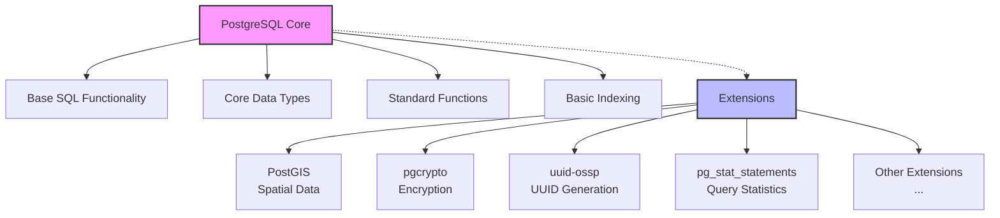

# PostgreSQL Installing Extensions

## Introduction

PostgreSQL is a powerful, open-source relational database system known for its reliability, feature robustness, and performance. One of PostgreSQL's greatest strengths is its extensibility - the ability to enhance its functionality through extensions. Extensions are add-on modules that provide additional features, from simple utility functions to complex data types, indexing methods, and even foreign data wrappers that connect to other databases.

This guide will walk you through the process of working with PostgreSQL extensions: finding them, installing them, configuring them, and managing them. By the end, you'll be comfortable adding powerful capabilities to your PostgreSQL database to solve specific problems in your applications.

## What are PostgreSQL Extensions?

PostgreSQL extensions are packages that add functionality to the core PostgreSQL database system. Think of them as plugins or modules that extend what PostgreSQL can do without modifying the core database engine. Extensions can provide:

- New data types
- New operators and functions
- Additional indexing methods
- Foreign data wrappers
- Procedural languages
- Authentication methods
- And much more!

Here's a simplified diagram of how extensions fit into the PostgreSQL architecture:



## Finding Available Extensions

Before installing extensions, you need to know what's available. PostgreSQL comes with several extensions pre-bundled in the `contrib` directory, and many more are available from third-party sources.

### Viewing Pre-installed Extensions

To see what extensions are already available in your PostgreSQL installation, connect to your database and run:

```sql
SELECT * FROM pg_available_extensions;
```

Example output:

```
    name     | default_version | installed_version |                             comment
-------------+-----------------+-------------------+-------------------------------------------------------------------
 adminpack   | 2.1             |                   | administrative functions for PostgreSQL
 amcheck     | 1.3             |                   | functions for verifying relation integrity
 autoinc     | 1.0             |                   | functions for autoincrementing fields
 bloom       | 1.0             |                   | bloom access method - signature file based index
 btree_gin   | 1.3             |                   | support for indexing common datatypes in GIN
 btree_gist  | 1.6             |                   | support for indexing common datatypes in GiST
 citext      | 1.6             |                   | data type for case-insensitive character strings
 ...
```

### Popular PostgreSQL Extensions

Here are some commonly used PostgreSQL extensions:

1. **PostGIS** - Adds support for geographic objects, allowing for location queries to be run in SQL
2. **pgcrypto** - Provides cryptographic functions
3. **uuid-ossp** - Generates universally unique identifiers (UUIDs)
4. **hstore** - Implements key-value store
5. **pg_stat_statements** - Tracks execution statistics of all SQL statements
6. **pg_trgm** - Provides functions and operators for determining the similarity of text
7. **tablefunc** - Includes functions that manipulate tables, including crosstab
8. **ltree** - Implements a data type for hierarchical tree-like structures
9. **pgvector** - Adds vector similarity search for machine learning applications
10. **plv8** - Implements JavaScript procedural language

## Installing Extensions

Installing a PostgreSQL extension is typically a two-step process:

1. Install the extension files into your PostgreSQL installation
2. Create the extension in your database

### Step 1: Installing Extension Files

#### Extensions from contrib

Many extensions come pre-bundled with PostgreSQL in the `contrib` directory. If you've installed PostgreSQL from packages, these may already be installed or available through your package manager.

On Debian/Ubuntu:

```bash
sudo apt-get update
sudo apt-get install postgresql-contrib
```

On Red Hat/CentOS/Fedora:

```bash
sudo dnf install postgresql-contrib
```

On macOS with Homebrew:

```bash
brew install postgresql
```

(Homebrew includes contrib modules by default)

#### Third-party Extensions

For extensions not included in contrib, you'll need to install them separately. Let's take PostGIS as an example:

On Debian/Ubuntu:

```bash
sudo apt-get install postgresql-14-postgis-3
```

On Red Hat/CentOS/Fedora:

```bash
sudo dnf install postgis30_14
```

On macOS with Homebrew:

```bash
brew install postgis
```

> Note: The specific package name may vary depending on your PostgreSQL version and the extension version. Always check the documentation for the extension you're installing.

### Step 2: Creating the Extension in Your Database

Once the extension files are installed, you need to create the extension in each database where you want to use it.

Connect to your database with `psql` or your preferred client, and run:

```sql
CREATE EXTENSION extension_name;
```

For example, to install the `hstore` extension:

```sql
CREATE EXTENSION hstore;
```

#### With Schema Specification

You can specify a schema where the extension's objects will be created:

```sql
CREATE EXTENSION hstore SCHEMA extensions;
```

This places all objects from the extension in the `extensions` schema instead of the default (usually `public`).

#### With Version Control

You can specify a version:

```sql
CREATE EXTENSION hstore VERSION '2.0';
```

### Verifying Installation

To verify that an extension is installed, you can query the `pg_extension` catalog:

```sql
SELECT * FROM pg_extension;
```

Example output:

```
 extname  | extowner | extnamespace | extrelocatable | extversion | extconfig | extcondition 
----------+----------+--------------+----------------+------------+-----------+--------------
 plpgsql  |       10 |           11 | f              | 1.0        |           | 
 hstore   |       10 |         2200 | t              | 1.7        |           | 
```

Or check for a specific extension:

```sql
SELECT * FROM pg_extension WHERE extname = 'hstore';
```

## Managing Extensions

### Updating Extensions

When a new version of an extension is available, you can update it with:

```sql
ALTER EXTENSION extension_name UPDATE;
```

To update to a specific version:

```sql
ALTER EXTENSION extension_name UPDATE TO 'new_version';
```

### Removing Extensions

To remove an extension:

```sql
DROP EXTENSION extension_name;
```

If there are dependencies on the extension, you can force the removal:

```sql
DROP EXTENSION extension_name CASCADE;
```

> Warning: This will also drop any objects that depend on the extension, which could lead to data loss. Use with caution.

### Extension Dependencies

Some extensions depend on others. You may need to install them in the correct order:

```sql
CREATE EXTENSION btree_gist;
CREATE EXTENSION pg_trgm;
```

## Real-world Examples

Let's look at some practical examples of installing and using popular extensions.

### Example 1: UUID Generation with uuid-ossp

The `uuid-ossp` extension provides functions to generate UUIDs, which are useful for primary keys in distributed systems.

```sql
-- Install the extension
CREATE EXTENSION IF NOT EXISTS "uuid-ossp";

-- Create a table using UUID as primary key
CREATE TABLE users (
    id UUID PRIMARY KEY DEFAULT uuid_generate_v4(),
    username VARCHAR(50) UNIQUE NOT NULL,
    email VARCHAR(100) UNIQUE NOT NULL,
    created_at TIMESTAMP WITH TIME ZONE DEFAULT CURRENT_TIMESTAMP
);

-- Insert a user with an automatically generated UUID
INSERT INTO users (username, email) VALUES ('johndoe', 'john@example.com');

-- Query to see the result
SELECT * FROM users;
```

Output:

```
                  id                  |  username  |      email       |          created_at          
--------------------------------------+------------+------------------+------------------------------
 f47ac10b-58cc-4372-a567-0e02b2c3d479 | johndoe    | john@example.com | 2023-07-15 10:42:23.935+00
```

### Example 2: Full-text Search Enhancement with pg_trgm

The `pg_trgm` extension improves text search capabilities by enabling similarity matching and better indexing for LIKE/ILIKE operations.

```sql
-- Install the extension
CREATE EXTENSION IF NOT EXISTS pg_trgm;

-- Create a table with text data
CREATE TABLE products (
    id SERIAL PRIMARY KEY,
    name VARCHAR(100) NOT NULL,
    description TEXT
);

-- Insert some sample data
INSERT INTO products (name, description) VALUES 
('Smartphone X', 'A high-end smartphone with advanced features'),
('Laptop Pro', 'Professional laptop for developers and designers'),
('Wireless Earbuds', 'Bluetooth earbuds with noise cancellation');

-- Create a GIN index for faster text searches
CREATE INDEX idx_products_name_trgm ON products USING gin (name gin_trgm_ops);
CREATE INDEX idx_products_description_trgm ON products USING gin (description gin_trgm_ops);

-- Perform a similarity search
SELECT name, description, similarity(name, 'Smartphones') AS sim
FROM products
WHERE name % 'Smartphones'  -- % operator checks for similarity
ORDER BY sim DESC;
```

Output:

```
     name     |                 description                  |   sim   
--------------+----------------------------------------------+---------
 Smartphone X | A high-end smartphone with advanced features | 0.42857
```

### Example 3: Encryption with pgcrypto

The `pgcrypto` extension provides cryptographic functions for data security.

```sql
-- Install the extension
CREATE EXTENSION IF NOT EXISTS pgcrypto;

-- Create a table for sensitive data
CREATE TABLE user_credentials (
    id SERIAL PRIMARY KEY,
    username VARCHAR(50) UNIQUE NOT NULL,
    password_hash TEXT NOT NULL
);

-- Insert a user with encrypted password
INSERT INTO user_credentials (username, password_hash)
VALUES (
    'alice',
    crypt('secure_password', gen_salt('bf'))  -- Use Blowfish algorithm
);

-- Check if a password is correct
SELECT username 
FROM user_credentials
WHERE username = 'alice' 
  AND password_hash = crypt('secure_password', password_hash);
```

Output (if password is correct):

```
 username 
----------
 alice
```

### Example 4: Hierarchical Data with ltree

The `ltree` extension allows you to work with tree-structured data efficiently.

```sql
-- Install the extension
CREATE EXTENSION IF NOT EXISTS ltree;

-- Create a table for categories with hierarchical structure
CREATE TABLE categories (
    id SERIAL PRIMARY KEY,
    name VARCHAR(100) NOT NULL,
    path ltree NOT NULL,
    UNIQUE (path)
);

-- Insert hierarchical data
INSERT INTO categories (name, path) VALUES
('Electronics', 'electronics'),
('Computers', 'electronics.computers'),
('Laptops', 'electronics.computers.laptops'),
('Gaming Laptops', 'electronics.computers.laptops.gaming'),
('Desktop PCs', 'electronics.computers.desktops'),
('Smartphones', 'electronics.smartphones'),
('Clothing', 'clothing'),
('Men''s', 'clothing.mens'),
('Women''s', 'clothing.womens');

-- Create an index for tree operations
CREATE INDEX categories_path_idx ON categories USING gist(path);

-- Query for all subcategories of computers
SELECT id, name, path FROM categories
WHERE path <@ 'electronics.computers'
ORDER BY path;
```

Output:

```
 id |     name      |             path             
----+---------------+------------------------------
  2 | Computers     | electronics.computers
  3 | Laptops       | electronics.computers.laptops
  4 | Gaming Laptops | electronics.computers.laptops.gaming
  5 | Desktop PCs   | electronics.computers.desktops
```

## Extension Development

For advanced users interested in creating their own extensions, PostgreSQL provides a comprehensive framework.

A basic extension structure looks like:

```
my_extension/
├── my_extension.control    # Metadata
├── my_extension--1.0.sql   # SQL script for version 1.0
├── Makefile                # Build instructions
└── README                  # Documentation
```

The `.control` file contains metadata:

```
# my_extension.control
comment = 'My custom PostgreSQL extension'
default_version = '1.0'
relocatable = true
```

And the SQL script contains the objects to create:

```sql
-- my_extension--1.0.sql
CREATE SCHEMA my_extension;

CREATE FUNCTION my_extension.hello_world()
RETURNS text AS $$
BEGIN
    RETURN 'Hello, World from my extension!';
END;
$$ LANGUAGE plpgsql;
```

Building and installing custom extensions is beyond the scope of this guide, but PostgreSQL's documentation provides detailed instructions.

## Troubleshooting Extensions

Here are some common issues and solutions when working with extensions:

### Extension Not Available

If `CREATE EXTENSION` fails with "extension not found":

1. Check if the extension files are installed:
```bash
# For Debian/Ubuntu
dpkg -l | grep postgresql | grep contrib
   ```

2. Verify the extension is in pg_available_extensions
```sql
SELECT * FROM pg_available_extensions WHERE name = 'extension_name';
   ```

3. Make sure the extension is compatible with your PostgreSQL version

### Permission Issues

Extensions often need to be created by superusers:

```sql
-- Check your role
SELECT current_user, current_setting('is_superuser');
```

If you're not a superuser, you might need to connect as one or get a superuser to create the extension for you.

### Version Conflicts

If you encounter version conflicts when updating:

```sql
-- Check current version
SELECT extversion FROM pg_extension WHERE extname = 'extension_name';

-- List available versions
SELECT * FROM pg_available_extension_versions WHERE name = 'extension_name';
```

You might need to install additional packages to get the required version.

## Best Practices

Here are some recommendations for working with PostgreSQL extensions:

1. **Document your extensions**: Keep track of what extensions you install and why
2. **Use version control**: Specify versions in your `CREATE EXTENSION` statements
3. **Test in development first**: Always test extensions in a non-production environment
4. **Include extensions in your backup strategy**: Ensure your backup procedures preserve extension data
5. **Use IF NOT EXISTS**: Prevent errors in scripts with `CREATE EXTENSION IF NOT EXISTS`
6. **Consider security implications**: Some extensions may introduce security considerations
7. **Check extension compatibility** before upgrading PostgreSQL

## Summary

PostgreSQL extensions significantly enhance the functionality of your database, allowing you to adapt it to your specific needs without modifying the core system. In this guide, we've covered:

- What PostgreSQL extensions are and how they integrate with the database
- How to find, install, and manage extensions
- Practical examples of commonly used extensions
- Troubleshooting common issues
- Best practices for working with extensions

With this knowledge, you can confidently extend your PostgreSQL databases to support a wide range of specialized features, from geographic data processing to advanced text search, encryption, and much more.

## Additional Resources

- [PostgreSQL Documentation: Extensions](https://www.postgresql.org/docs/current/extend-extensions.html)
- [PostgreSQL Extension Network](https://pgxn.org/) - A repository of PostgreSQL extensions
- [PostgreSQL Contrib Modules](https://www.postgresql.org/docs/current/contrib.html)
- [Building PostgreSQL Extensions](https://www.postgresql.org/docs/current/extend-pgxs.html)

## Exercises

1. **Basic Extension Installation**: Install the `hstore` extension and create a simple table that uses the hstore data type to store key-value pairs.

2. **UUID Implementation**: Set up a users table with UUID primary keys using the `uuid-ossp` extension and implement a registration system.

3. **Full-text Search**: Create a product catalog with the `pg_trgm` extension and implement a search function that finds products based on partial word matches.

4. **Secure Storage**: Use the `pgcrypto` extension to build a secure credential storage system that properly hashes passwords.

5. **Geographic Data**: If your system supports it, install PostGIS and create a simple location-based application that finds points of interest within a certain distance.

6. **Extension Management**: Write a script that checks for installed extensions, compares them against a required list, and installs any missing ones.

7. **Advanced**: Create your own simple extension that adds a custom function to calculate business days between two dates, excluding weekends and holidays.