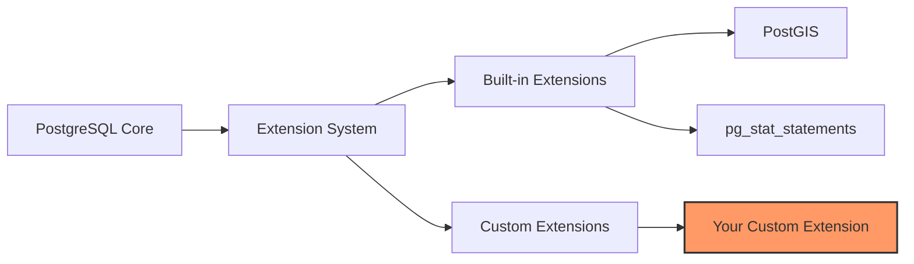

# PostgreSQL Custom Extensions

## Introduction

PostgreSQL is known for its extensibility, allowing developers to add new functionality without modifying the core database system. Extensions are packages that add new features to PostgreSQL, from simple functions to entirely new data types and index methods. While PostgreSQL comes with many built-in extensions, creating custom extensions lets you tailor the database to your specific needs.

In this tutorial, we'll explore how to create, install, and use custom PostgreSQL extensions. You'll learn the fundamentals of extension development and see how you can leverage this powerful feature to enhance your database applications.

## What are PostgreSQL Extensions?

Extensions are modular packages that add functionality to PostgreSQL. They can:

- Add new functions, operators, and data types
- Create new index types or storage methods
- Implement foreign data wrappers to connect to external data sources
- Extend SQL syntax with new commands
- Improve performance monitoring and administrative tools



## Prerequisites

Before creating a custom extension, you'll need:

- PostgreSQL 9.1 or newer installed (preferably the latest version)
- Basic understanding of C programming (for C-based extensions)
- PostgreSQL development headers and build tools
- SQL knowledge for writing extension functions

## Creating a Simple SQL Extension

Let's start with a basic extension that adds some useful date/time functions.

### Step 1: Create the Extension Files

First, create a directory for your extension:

```bash
mkdir -p dateutilsext/sql
mkdir -p dateutilsext/expected
cd dateutilsext
```

### Step 2: Create the Control File

Create a file named `dateutilsext.control` with the following content:

```
# dateutilsext extension
comment = 'Date and time utility functions'
default_version = '1.0.0'
relocatable = true
```

### Step 3: Write the SQL Script

In the `sql` directory, create a file named `dateutilsext--1.0.0.sql`:

```sql
-- complain if script is sourced in psql, rather than via CREATE EXTENSION
\echo Use "CREATE EXTENSION dateutilsext" to load this file. \quit

-- Create function to get the first day of the month
CREATE OR REPLACE FUNCTION first_day_of_month(date_value DATE)
RETURNS DATE AS $$
BEGIN
    RETURN DATE_TRUNC('month', date_value)::DATE;
END;
$$ LANGUAGE plpgsql IMMUTABLE STRICT;

-- Create function to get the last day of the month
CREATE OR REPLACE FUNCTION last_day_of_month(date_value DATE)
RETURNS DATE AS $$
BEGIN
    RETURN (DATE_TRUNC('month', date_value) + INTERVAL '1 month - 1 day')::DATE;
END;
$$ LANGUAGE plpgsql IMMUTABLE STRICT;

-- Create function to calculate business days between two dates
CREATE OR REPLACE FUNCTION business_days_between(start_date DATE, end_date DATE)
RETURNS INTEGER AS $$
DECLARE
    days INTEGER := 0;
    current_date DATE := start_date;
BEGIN
    IF start_date > end_date THEN
        RETURN 0;
    END IF;
    
    WHILE current_date <= end_date LOOP
        -- Check if it's a weekday (not Saturday or Sunday)
        IF EXTRACT(DOW FROM current_date) NOT IN (0, 6) THEN
            days := days + 1;
        END IF;
        current_date := current_date + INTERVAL '1 day';
    END LOOP;
    
    RETURN days;
END;
$$ LANGUAGE plpgsql IMMUTABLE STRICT;
```

### Step 4: Create a Makefile

Create a `Makefile` in the extension's root directory:

```makefile
EXTENSION = dateutilsext
DATA = sql/dateutilsext--1.0.0.sql

PG_CONFIG = pg_config
PGXS := $(shell $(PG_CONFIG) --pgxs)
include $(PGXS)
```

### Step 5: Build and Install the Extension

Now build and install your extension:

```bash
make
sudo make install
```

### Step 6: Test Your Extension

Connect to PostgreSQL and create the extension:

```sql
CREATE EXTENSION dateutilsext;

-- Test the functions
SELECT first_day_of_month('2023-07-15');
```

Expected output:
```
 first_day_of_month 
--------------------
 2023-07-01
(1 row)
```

```sql
SELECT last_day_of_month('2023-07-15');
```

Expected output:
```
 last_day_of_month 
-------------------
 2023-07-31
(1 row)
```

```sql
SELECT business_days_between('2023-07-01', '2023-07-15');
```

Expected output:
```
 business_days_between 
-----------------------
                    10
(1 row)
```

## Creating a C-based Extension

For more complex extensions or when performance is critical, you can write extensions in C. Let's create a simple extension that adds a function to calculate the factorial of a number.

### Step 1: Create the Extension Directory Structure

```bash
mkdir -p factorialext/{sql,src,expected}
cd factorialext
```

### Step 2: Create the Control File

Create `factorialext.control`:

```
# factorial extension
comment = 'Functions for calculating factorials'
default_version = '1.0.0'
relocatable = true
```

### Step 3: Write the C Source

Create `src/factorial.c`:

```c
#include "postgres.h"
#include "fmgr.h"
#include "utils/builtins.h"

PG_MODULE_MAGIC;

/* Function declaration */
PG_FUNCTION_INFO_V1(factorial);

/* Implementation of factorial calculation */
Datum
factorial(PG_FUNCTION_ARGS)
{
    int32 n = PG_GETARG_INT32(0);
    int64 result = 1;
    int i;
    
    if (n < 0)
        ereport(ERROR,
                (errcode(ERRCODE_NUMERIC_VALUE_OUT_OF_RANGE),
                 errmsg("factorial of a negative number is not defined")));
    
    if (n > 20)
        ereport(ERROR,
                (errcode(ERRCODE_NUMERIC_VALUE_OUT_OF_RANGE),
                 errmsg("factorial result will overflow")));
    
    for (i = 2; i <= n; i++)
        result *= i;
    
    PG_RETURN_INT64(result);
}
```

### Step 4: Create the SQL Interface

Create `sql/factorialext--1.0.0.sql`:

```sql
-- complain if script is sourced in psql, rather than via CREATE EXTENSION
\echo Use "CREATE EXTENSION factorialext" to load this file. \quit

-- Create the factorial function
CREATE FUNCTION factorial(integer)
RETURNS bigint
AS 'MODULE_PATHNAME', 'factorial'
LANGUAGE C STRICT IMMUTABLE;

-- Add comment
COMMENT ON FUNCTION factorial(integer) IS 'Calculate factorial of a number';
```

### Step 5: Create a Makefile

Create a `Makefile` in the root directory:

```makefile
EXTENSION = factorialext
DATA = sql/factorialext--1.0.0.sql
MODULES = src/factorial

PG_CONFIG = pg_config
PGXS := $(shell $(PG_CONFIG) --pgxs)
include $(PGXS)
```

### Step 6: Build and Install

```bash
make
sudo make install
```

### Step 7: Test the Extension

Connect to PostgreSQL and test your extension:

```sql
CREATE EXTENSION factorialext;

-- Calculate some factorials
SELECT factorial(5);
```

Expected output:
```
 factorial 
-----------
       120
(1 row)
```

```sql
SELECT factorial(10);
```

Expected output:
```
 factorial 
-----------
   3628800
(1 row)
```

## Upgrading Extensions

As you develop your extension, you'll likely need to add new features or fix bugs. PostgreSQL's extension system makes upgrading easy.

### Creating an Upgrade Script

Let's add a new function to our `dateutilsext` extension:

1. Create a new SQL script for the upgrade:

```bash
cd dateutilsext
touch sql/dateutilsext--1.0.0--1.1.0.sql
```

2. Add the new function to the upgrade script:

```sql
-- Add a new function to get the quarter of a date
CREATE OR REPLACE FUNCTION get_quarter(date_value DATE)
RETURNS INTEGER AS $$
BEGIN
    RETURN EXTRACT(QUARTER FROM date_value);
END;
$$ LANGUAGE plpgsql IMMUTABLE STRICT;
```

3. Update the control file to include the new version:

```
# dateutilsext extension
comment = 'Date and time utility functions'
default_version = '1.1.0'
relocatable = true
```

4. Update the Makefile to include the new script:

```makefile
EXTENSION = dateutilsext
DATA = sql/dateutilsext--1.0.0.sql sql/dateutilsext--1.0.0--1.1.0.sql

PG_CONFIG = pg_config
PGXS := $(shell $(PG_CONFIG) --pgxs)
include $(PGXS)
```

5. Build and install:

```bash
make
sudo make install
```

6. Upgrade the extension in the database:

```sql
ALTER EXTENSION dateutilsext UPDATE TO '1.1.0';

-- Test the new function
SELECT get_quarter('2023-07-15');
```

Expected output:
```
 get_quarter 
-------------
           3
(1 row)
```

## Packaging Extensions

To share your extension with others, you should package it properly:

1. Create a README file with installation instructions
2. Include documentation for each function
3. Add a LICENSE file
4. Create tests for your extension
5. Use version control (git) to manage your code

Your extension directory structure should look like:

```
my_extension/
├── README.md
├── LICENSE
├── Makefile
├── my_extension.control
├── sql/
│   ├── my_extension--1.0.0.sql
│   └── my_extension--1.0.0--1.1.0.sql
├── src/
│   └── my_extension.c
└── test/
    └── sql/
        └── basic_tests.sql
```

## Real-world Examples

### Example 1: Custom Data Type

Let's look at a simplified example of how you might create a custom data type for ISBN (International Standard Book Number):

```sql
-- Create a custom ISBN type
CREATE TYPE isbn;

-- Create I/O functions
CREATE FUNCTION isbn_in(cstring) RETURNS isbn
AS 'MODULE_PATHNAME', 'isbn_in'
LANGUAGE C STRICT IMMUTABLE;

CREATE FUNCTION isbn_out(isbn) RETURNS cstring
AS 'MODULE_PATHNAME', 'isbn_out'
LANGUAGE C STRICT IMMUTABLE;

-- Create the type
CREATE TYPE isbn (
   INTERNALLENGTH = 16,
   INPUT = isbn_in,
   OUTPUT = isbn_out
);

-- Create an equality operator
CREATE FUNCTION isbn_eq(isbn, isbn) RETURNS boolean
AS 'MODULE_PATHNAME', 'isbn_eq'
LANGUAGE C STRICT IMMUTABLE;

CREATE OPERATOR = (
   LEFTARG = isbn,
   RIGHTARG = isbn,
   PROCEDURE = isbn_eq,
   COMMUTATOR = =
);
```

### Example 2: Custom Index Method

While simplified, this shows the general approach for a custom index method:

```c
/* Register the index access method */
Datum
btree_isbn_handler(PG_FUNCTION_ARGS)
{
    IndexAmRoutine *amroutine = makeNode(IndexAmRoutine);

    amroutine->amstrategies = BTMaxStrategyNumber;
    amroutine->amsupport = BTNProcs;
    amroutine->amcanorder = true;
    amroutine->amcanorderbyop = false;
    amroutine->amcanbackward = true;
    amroutine->amcanunique = true;
    amroutine->amcanmulticol = true;
    amroutine->amoptionalkey = true;
    amroutine->amsearcharray = true;
    amroutine->amsearchnulls = false;
    amroutine->amstorage = false;
    amroutine->amclusterable = true;
    amroutine->ampredlocks = true;
    amroutine->amcanparallel = true;
    amroutine->amcaninclude = true;
    amroutine->amusemaintenanceworkmem = false;
    amroutine->amparallelvacuumoptions =
        VACUUM_OPTION_PARALLEL_BULKDEL | VACUUM_OPTION_PARALLEL_COND_CLEANUP;
    amroutine->amkeytype = InvalidOid;

    /* Set the implementation functions */
    amroutine->ambuild = btbuild;
    /* ... other function pointers ... */

    PG_RETURN_POINTER(amroutine);
}
```

## Common Patterns and Best Practices

When developing PostgreSQL extensions, follow these best practices:

1. **Keep Extensions Focused**: Each extension should do one thing well.

2. **Proper Error Handling**: Use PostgreSQL's error reporting mechanisms:
   ```c
   if (error_condition)
       ereport(ERROR,
               (errcode(ERRCODE_SPECIFIC_ERROR),
                errmsg("Something went wrong: %s", details)));
   ```

3. **Memory Management**: Use PostgreSQL's memory contexts:
   ```c
   MemoryContext oldContext = MemoryContextSwitchTo(aggContext);
   /* allocate memory here */
   MemoryContextSwitchTo(oldContext);
   ```

4. **Security**: Validate all inputs, especially when using user-provided values in dynamic SQL.

5. **Documentation**: Document your extension thoroughly, both in the code and in separate documentation.

6. **Testing**: Create comprehensive tests for your extension functionality.

7. **Version Compatibility**: Be clear about which PostgreSQL versions your extension supports.

## Summary

In this tutorial, you've learned:

- What PostgreSQL extensions are and why they're useful
- How to create simple SQL-based extensions
- How to develop more complex C-based extensions
- Techniques for upgrading extensions
- Best practices for extension development

Custom extensions are a powerful way to enhance PostgreSQL with functionality specific to your application needs. They allow you to maintain a clean separation between your custom code and the database core, making your system more maintainable and upgradable.

## Further Resources

To continue learning about PostgreSQL extensions:

- [PostgreSQL Documentation on Extension Building](https://www.postgresql.org/docs/current/extend-extensions.html)
- [PostgreSQL C Language Functions](https://www.postgresql.org/docs/current/xfunc-c.html)
- [PGXN: PostgreSQL Extension Network](https://pgxn.org/)

## Exercises

1. Modify the `dateutilsext` extension to add a function that calculates age in years, months, and days.

2. Create a new extension that provides functions for working with IP addresses (validating, converting between formats, etc.).

3. Extend the factorial extension to use arbitrary precision numbers (numeric type) to handle larger factorials.

4. Create an extension that implements a custom aggregate function, such as a weighted average or a percentile calculation.

5. Build an extension that adds a new operator for array operations not covered by PostgreSQL's built-in operators.