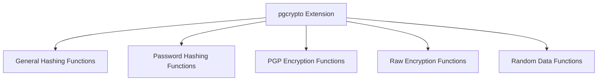

# PostgreSQL pgcrypto Extension

## Introduction

The `pgcrypto` extension is one of PostgreSQL's most powerful security-focused extensions. It provides cryptographic functions directly within your database, allowing you to implement encryption, hashing, and other security measures without relying on external applications. This is particularly useful when you need to store sensitive information securely or implement authentication mechanisms directly in your database.

In this tutorial, we'll explore the capabilities of the `pgcrypto` extension, from basic setup to practical applications for securing your data.

## Prerequisites

- PostgreSQL 9.1 or higher installed
- Basic knowledge of SQL and PostgreSQL
- Database administrator privileges (to install extensions)

## Installing the pgcrypto Extension

Before using any `pgcrypto` functions, you need to install the extension in your database:

```sql
CREATE EXTENSION pgcrypto;
```

You can verify the installation by checking the available extensions:

```sql
SELECT * FROM pg_extension WHERE extname = 'pgcrypto';
```

If successful, you should see a row containing information about the pgcrypto extension.

## Key Features of pgcrypto

The pgcrypto extension provides several categories of cryptographic functions:



Let's explore each of these categories with practical examples.

## General Hashing Functions

Hashing is a one-way function that converts input of any size into a fixed-size string. pgcrypto provides several hashing algorithms:

### MD5 Hashing

```sql
SELECT digest('hello world', 'md5') AS md5_hash;
```

**Output:**
```
               md5_hash                
--------------------------------------
 \x5eb63bbbe01eeed093cb22bb8f5acdc3
```

### SHA-1 Hashing

```sql
SELECT digest('hello world', 'sha1') AS sha1_hash;
```

**Output:**
```
                  sha1_hash                  
--------------------------------------------
 \x2aae6c35c94fcfb415dbe95f408b9ce91ee846ed
```

### SHA-256 Hashing

```sql
SELECT digest('hello world', 'sha256') AS sha256_hash;
```

**Output:**
```
                              sha256_hash                              
----------------------------------------------------------------------
 \xb94d27b9934d3e08a52e52d7da7dabfac484efe37a5380ee9088f7ace2efcde9
```

### Converting Hash Output to Hexadecimal

For better readability, you can convert the binary hash to hexadecimal:

```sql
SELECT encode(digest('hello world', 'sha256'), 'hex') AS sha256_hex;
```

**Output:**
```
                              sha256_hex                              
---------------------------------------------------------------------
 b94d27b9934d3e08a52e52d7da7dabfac484efe37a5380ee9088f7ace2efcde9
```

## Password Hashing Functions

For storing user passwords, pgcrypto provides specialized functions that incorporate salting and multiple iterations, making them resistant to brute-force attacks.

### Using crypt() for Password Hashing

The `crypt()` function supports multiple algorithms:

- `bf` (Blowfish)
- `md5`
- `xdes` (Extended DES)
- `des` (Standard DES)

Blowfish is recommended for its strength and configurability:

```sql
-- Generate a hashed password using Blowfish with 8 rounds
SELECT crypt('my_secure_password', gen_salt('bf', 8)) AS hashed_password;
```

**Output:**
```
                  hashed_password                  
-------------------------------------------------
 $2a$08$Hv3LF15Ud1UgFGSugFT0z.7O0hEYV0vXiVGCpPdY4GhQpxPLV88m.
```

### Verifying Passwords

To verify a password against a stored hash:

```sql
-- First, store a hashed password
CREATE TABLE users (
    id SERIAL PRIMARY KEY,
    username VARCHAR(50) UNIQUE NOT NULL,
    password_hash TEXT NOT NULL
);

-- Insert a user with a hashed password
INSERT INTO users (username, password_hash) 
VALUES ('john_doe', crypt('secret_password', gen_salt('bf', 8)));

-- Verify a password (correct password)
SELECT username FROM users 
WHERE username = 'john_doe' 
AND password_hash = crypt('secret_password', password_hash);
```

**Output (when password is correct):**
```
 username 
----------
 john_doe
```

If the password is incorrect, the query will return no rows.

## PGP Encryption Functions

PGP (Pretty Good Privacy) provides both symmetric and asymmetric encryption options. pgcrypto implements a subset of the OpenPGP standard.

### Symmetric PGP Encryption

Symmetric encryption uses the same key for both encryption and decryption:

```sql
-- Encrypt data with a password
SELECT pgp_sym_encrypt('Confidential information', 'my_secret_key') AS encrypted_data;
```

**Output:**
```
                                                      encrypted_data                                                    
-----------------------------------------------------------------------------------------------------------------------
 \xc30d04070302ccd7a4988f16a106cca63e25f0bf1f42082beb793ca64c0e7b0358359854db9ca85c75d86edc89eb60834e1b0f5b6f7c5b495...
```

### Decrypting PGP Encrypted Data

```sql
-- Decrypt the data
SELECT pgp_sym_decrypt(
  '\xc30d04070302ccd7a4988f16a106cca63e25f0bf1f42082beb793ca64c0e7b0358359854db9ca85c75d86edc89eb60834e1b0f5b6f7c5b495...',
  'my_secret_key'
) AS decrypted_data;
```

**Output:**
```
    decrypted_data     
----------------------
 Confidential information
```

### Text Format for Encrypted Data

For easier storage and transfer, you can encode the output:

```sql
-- Encrypt and encode in ASCII armor
SELECT pgp_sym_encrypt_bytea('Sensitive data', 'my_key', 'compress-algo=2, cipher-algo=aes256') AS armored_data;
```

**Output:**
```
-----BEGIN PGP MESSAGE-----
Version: PostgreSQL pgplib 1.0

jA0ECQMCgB7MrKhX4Uf/0j8BLATmbMjZ3USC3dvDLGhwM5HzDvM0/I78i+qj
HKsZ6cA5TGqwkoGAOu8s
=IHoQ
-----END PGP MESSAGE-----
```

## Raw Encryption Functions

For more direct control over encryption, pgcrypto provides raw encryption functions.

### AES (Advanced Encryption Standard)

```sql
-- Encrypt data with AES
SELECT encrypt(
  'Secret message', 
  'encryption_key', 
  'aes-cbc/pad:pkcs'
) AS aes_encrypted;
```

**Output:**
```
         aes_encrypted         
-------------------------------
 \xe75a20541c455c3a09bef7db...
```

### Decrypting AES Encrypted Data

```sql
-- Decrypt AES encrypted data
SELECT decrypt(
  '\xe75a20541c455c3a09bef7db...', 
  'encryption_key', 
  'aes-cbc/pad:pkcs'
) AS decrypted_text;
```

**Output:**
```
  decrypted_text  
-----------------
 Secret message
```

## Generating Random Data

pgcrypto provides functions for generating cryptographically strong random data:

```sql
-- Generate 10 bytes of random data
SELECT gen_random_bytes(10) AS random_bytes;
```

**Output:**
```
      random_bytes      
------------------------
 \x7d8f3e9b5a2c1d6f4a8e
```

For a random UUID:

```sql
-- Generate a UUID using random bytes
SELECT encode(gen_random_bytes(16), 'hex') AS random_uuid;
```

**Output:**
```
               random_uuid                
-----------------------------------------
 a4b7c9d2e5f8a1b3c6d9e2f5a8b1c4d7e0f3a6
```

## Practical Applications

Let's explore some real-world applications of pgcrypto:

### 1. Secure User Authentication System

```sql
-- Create users table with secure password storage
CREATE TABLE secure_users (
    user_id SERIAL PRIMARY KEY,
    username VARCHAR(50) UNIQUE NOT NULL,
    email VARCHAR(100) UNIQUE NOT NULL,
    password_hash TEXT NOT NULL,
    created_at TIMESTAMP WITH TIME ZONE DEFAULT CURRENT_TIMESTAMP
);

-- Function to register a new user
CREATE OR REPLACE FUNCTION register_user(
    p_username VARCHAR(50),
    p_email VARCHAR(100),
    p_password VARCHAR(100)
) RETURNS INTEGER AS $$
DECLARE
    v_user_id INTEGER;
BEGIN
    INSERT INTO secure_users (username, email, password_hash)
    VALUES (
        p_username,
        p_email,
        crypt(p_password, gen_salt('bf', 10))
    )
    RETURNING user_id INTO v_user_id;
    
    RETURN v_user_id;
END;
$$ LANGUAGE plpgsql;

-- Function to authenticate a user
CREATE OR REPLACE FUNCTION authenticate_user(
    p_username VARCHAR(50),
    p_password VARCHAR(100)
) RETURNS BOOLEAN AS $$
DECLARE
    v_count INTEGER;
BEGIN
    SELECT COUNT(*)
    INTO v_count
    FROM secure_users
    WHERE username = p_username
    AND password_hash = crypt(p_password, password_hash);
    
    RETURN v_count > 0;
END;
$$ LANGUAGE plpgsql;
```

**Usage:**
```sql
-- Register a new user
SELECT register_user('alice', 'alice@example.com', 'secure_password123');

-- Authenticate a user
SELECT authenticate_user('alice', 'secure_password123'); -- Returns TRUE
SELECT authenticate_user('alice', 'wrong_password');     -- Returns FALSE
```

### 2. Storing Encrypted Sensitive Data

```sql
-- Create a table for storing encrypted customer data
CREATE TABLE customer_data (
    customer_id SERIAL PRIMARY KEY,
    name VARCHAR(100) NOT NULL,
    encrypted_ssn BYTEA NOT NULL,
    encrypted_credit_card BYTEA NOT NULL,
    created_at TIMESTAMP WITH TIME ZONE DEFAULT CURRENT_TIMESTAMP
);

-- Function to insert a new customer with encrypted data
CREATE OR REPLACE FUNCTION insert_customer(
    p_name VARCHAR(100),
    p_ssn VARCHAR(20),
    p_credit_card VARCHAR(20),
    p_encryption_key VARCHAR(100)
) RETURNS INTEGER AS $$
DECLARE
    v_customer_id INTEGER;
BEGIN
    INSERT INTO customer_data (
        name,
        encrypted_ssn,
        encrypted_credit_card
    )
    VALUES (
        p_name,
        pgp_sym_encrypt(p_ssn, p_encryption_key),
        pgp_sym_encrypt(p_credit_card, p_encryption_key)
    )
    RETURNING customer_id INTO v_customer_id;
    
    RETURN v_customer_id;
END;
$$ LANGUAGE plpgsql;

-- Function to retrieve decrypted customer data
CREATE OR REPLACE FUNCTION get_customer_data(
    p_customer_id INTEGER,
    p_encryption_key VARCHAR(100)
) RETURNS TABLE (
    name VARCHAR(100),
    ssn VARCHAR(20),
    credit_card VARCHAR(20)
) AS $$
BEGIN
    RETURN QUERY
    SELECT 
        c.name,
        pgp_sym_decrypt(c.encrypted_ssn, p_encryption_key)::VARCHAR AS ssn,
        pgp_sym_decrypt(c.encrypted_credit_card, p_encryption_key)::VARCHAR AS credit_card
    FROM customer_data c
    WHERE c.customer_id = p_customer_id;
END;
$$ LANGUAGE plpgsql;
```

**Usage:**
```sql
-- Insert a customer with encrypted data
SELECT insert_customer('John Smith', '123-45-6789', '4111-1111-1111-1111', 'my_encryption_key');

-- Retrieve decrypted customer data
SELECT * FROM get_customer_data(1, 'my_encryption_key');
```

## Best Practices and Security Considerations

When using pgcrypto, keep these best practices in mind:

1. **Key Management**: Store encryption keys securely, separate from the database.

2. **Algorithm Selection**:
   - For password hashing, use Blowfish (`bf`) with at least 8 rounds.
   - For general encryption, AES-256 is recommended.

3. **Salt Generation**: Always use `gen_salt()` for password hashing to ensure unique salts.

4. **Performance Considerations**: Cryptographic operations are CPU-intensive; consider the performance impact for high-volume operations.

5. **Backup Security**: Encrypted data in backups remains encrypted, but password hashes could potentially be attacked offline.

6. **Role-Based Access**: Limit access to cryptographic functions to specific database roles:

```sql
-- Create role with limited permissions
CREATE ROLE crypto_user;
GRANT USAGE ON SCHEMA public TO crypto_user;
GRANT EXECUTE ON FUNCTION crypt(text, text) TO crypto_user;
GRANT EXECUTE ON FUNCTION gen_salt(text) TO crypto_user;
```

## Summary

The pgcrypto extension provides a comprehensive suite of cryptographic functions that enable you to implement robust security measures directly within your PostgreSQL database. From password hashing and data encryption to random number generation, pgcrypto offers the tools needed to protect sensitive information without relying on external applications.

Key takeaways:
- Use `crypt()` with Blowfish for secure password storage
- Implement PGP encryption for sensitive data
- Apply raw encryption functions for specialized needs
- Generate cryptographically strong random data when needed
- Follow best practices for key management and algorithm selection

By leveraging the power of pgcrypto, you can significantly enhance the security of your PostgreSQL database applications while keeping your implementation clean and maintainable.

## Additional Resources

Here are some exercises to strengthen your understanding of pgcrypto:

1. Create a table to store encrypted messages between users, with the ability to decrypt only messages intended for the current user.
2. Implement a secure password reset function using time-limited tokens created with pgcrypto.
3. Build a function that validates the strength of a password using pgcrypto's hashing functions.
4. Create a data anonymization function that replaces sensitive information with hashed values while preserving referential integrity.

For further reading:
- PostgreSQL Official Documentation on pgcrypto
- The OpenPGP standard (RFC 4880)
- NIST guidelines for cryptographic algorithms