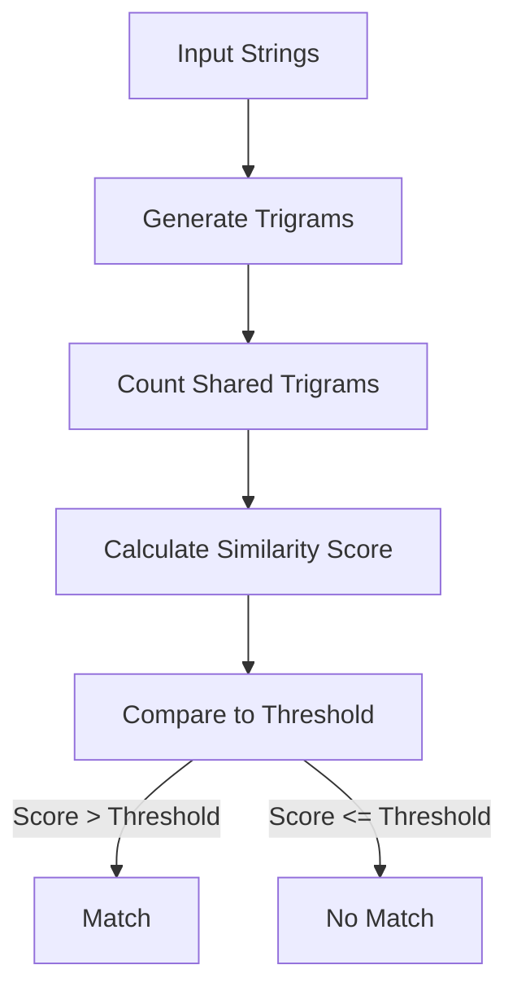

# PostgreSQL pg_trgm Extension

## Introduction

Have you ever needed to implement a search feature that finds results even when users make typos? Or perhaps you wanted to find records with names that sound similar but are spelled differently? The `pg_trgm` extension in PostgreSQL is designed precisely for these scenarios.

The `pg_trgm` (trigram) extension provides functions and operators for determining the similarity of text based on trigram matching. A trigram is a group of three consecutive characters taken from a string. By comparing the number of trigrams that two strings share, we can determine how similar they are.

In this tutorial, we'll explore how to:
- Install and enable the pg_trgm extension
- Use similarity functions and operators
- Create efficient indexes for text search
- Implement practical applications like fuzzy search

## Enabling the pg_trgm Extension

Before using pg_trgm functions, you need to enable the extension in your database:

```sql
CREATE EXTENSION pg_trgm;
```

You can verify the installation with:

```sql
SELECT * FROM pg_extension WHERE extname = 'pg_trgm';
```

Expected output:
```
  extname  | extowner |  extnamespace  | extrelocatable | extversion | extconfig | extcondition
-----------+----------+----------------+----------------+------------+-----------+--------------
 pg_trgm   |       10 |            2200 | f              | 1.6        |           |
```

## Understanding Trigrams

Let's understand what trigrams are using the `show_trgm` function:

```sql
SELECT show_trgm('hello');
```

Expected output:
```
              show_trgm
--------------------------------------
 {"  h"," he",ell,hel,llo,"lo "}
```

The output shows all the trigrams for the word "hello". Note that PostgreSQL pads the beginning and end of the string with two spaces when generating trigrams, which is why you see trigrams like "  h" and "lo ".

## Similarity Functions

The pg_trgm extension provides several key functions:

### 1. similarity()

This function returns a number between 0 and 1 that indicates how similar two strings are. The higher the number, the more similar the strings:

```sql
SELECT similarity('hello', 'helo');
```

Expected output:
```
 similarity
------------
      0.5
```

### 2. word_similarity()

Similar to `similarity()`, but focuses on matching whole words rather than the entire text:

```sql
SELECT word_similarity('hello world', 'hello');
```

Expected output:
```
 word_similarity
----------------
              1
```

### 3. strict_word_similarity()

A stricter version of `word_similarity()` that requires more precise matching:

```sql
SELECT strict_word_similarity('hello world', 'hello');
```

Expected output:
```
 strict_word_similarity
-----------------------
                   0.8
```

## Similarity Operators

The pg_trgm extension also provides several operators:

| Operator | Description |
|----------|-------------|
| `%` | Similarity operator (returns true if similarity is greater than the current threshold) |
| `<->` | Distance operator (returns the "distance" between strings, which is 1 - similarity) |
| `<<%` | Word similarity prefix operator |
| `%>>` | Word similarity suffix operator |
| `<%` | Strict word similarity prefix operator |
| `%>` | Strict word similarity suffix operator |

Example:

```sql
SELECT 'hello' % 'helo';
```

Expected output:
```
 ?column?
----------
 t
```

This indicates that "hello" and "helo" are considered similar according to the current similarity threshold.

## Setting the Similarity Threshold

You can adjust the similarity threshold that determines when strings are considered a match:

```sql
-- View the current threshold
SELECT show_limit();

-- Set a new threshold (0 to 1)
SELECT set_limit(0.3);
```

The default threshold is typically 0.3, meaning strings with 30% or more similarity will be considered matches.

## Creating a Table for Examples

Let's create a sample table to demonstrate pg_trgm in action:

```sql
CREATE TABLE products (
    id SERIAL PRIMARY KEY,
    name VARCHAR(100),
    description TEXT
);

INSERT INTO products (name, description) VALUES
('Smartphone X1', 'High-end smartphone with 6.5" display'),
('Smartfone X2', 'Premium smartphone with 6.7" display'),
('Smart Phone X3', 'Budget friendly smart phone with 6.1" display'),
('Laptop Pro', 'Professional laptop for developers'),
('Tablet Ultra', 'Ultra-thin tablet for professionals'),
('Tablet Mini', 'Compact tablet for reading and browsing'),
('SmartWatch', 'Fitness tracking smart watch with heart rate monitor'),
('Smart TV', '4K Smart television with AI features'),
('Phone Case', 'Protective case for smartphones'),
('Phone Charger', 'Fast charging adapter for phones');
```

## Creating Trigram Indexes

One of the most powerful features of pg_trgm is its ability to create indexes for text similarity queries. These indexes can dramatically improve the performance of similarity searches.

There are two main types of indexes you can create using pg_trgm:

### GIN Index (Generalized Inverted Index)

Optimized for static data with less frequent updates:

```sql
CREATE INDEX idx_products_name_gin ON products USING gin (name gin_trgm_ops);
CREATE INDEX idx_products_description_gin ON products USING gin (description gin_trgm_ops);
```

### GiST Index (Generalized Search Tree)

Better for data that changes frequently but slightly slower for searches:

```sql
CREATE INDEX idx_products_name_gist ON products USING gist (name gist_trgm_ops);
```

## Practical Examples

Now let's explore some practical applications of pg_trgm:

### Fuzzy Search

Find products even when users misspell the search term:

```sql
-- Search for "smartphone" with potential misspellings
SELECT name, similarity(name, 'smertphone') AS sim
FROM products
WHERE name % 'smertphone'
ORDER BY sim DESC;
```

Expected output:
```
      name       |  sim  
-----------------+-------
 Smartphone X1   | 0.421
 Smartfone X2    | 0.368
 Smart Phone X3  | 0.333
```

### Finding Similar Product Descriptions

```sql
-- Find products with descriptions similar to a given phrase
SELECT name, description, similarity(description, 'professional tablet') AS sim
FROM products
WHERE description % 'professional tablet'
ORDER BY sim DESC;
```

Expected output:
```
     name     |              description              |  sim  
--------------+---------------------------------------+-------
 Tablet Ultra | Ultra-thin tablet for professionals   | 0.542
 Tablet Mini  | Compact tablet for reading and browsing | 0.346
```

### Autocomplete Implementation

You can implement autocomplete functionality using the word similarity operators:

```sql
-- Autocomplete based on prefix matching
SELECT name
FROM products
WHERE name <<% 'Smar'
ORDER BY similarity(name, 'Smar') DESC;
```

Expected output:
```
      name      
----------------
 Smartphone X1
 Smartfone X2
 Smart Phone X3
 SmartWatch
 Smart TV
```

### Combining with Regular Expressions

For even more powerful searches, you can combine pg_trgm with regular expressions:

```sql
-- Find products where the name contains the word "phone" (case insensitive)
-- and is similar to "smart"
SELECT name
FROM products
WHERE 
    name ~* 'phone' AND 
    name % 'smart'
ORDER BY similarity(name, 'smart') DESC;
```

Expected output:
```
      name      
----------------
 Smart Phone X3
 Smartphone X1
```

## Performance Comparison

Let's compare the performance of a regular text search versus a trigram-indexed search:

```sql
-- Without index (will perform sequential scan)
EXPLAIN ANALYZE
SELECT name FROM products WHERE name ILIKE '%smartp%';

-- With trigram index
EXPLAIN ANALYZE
SELECT name FROM products WHERE name % 'smartp';
```

For a large table, you'd see that the trigram index significantly improves performance by avoiding sequential scans.

## How pg_trgm Works Behind the Scenes

The pg_trgm extension works by:

1. Breaking strings into trigrams
2. Counting the number of shared trigrams
3. Calculating similarity based on the formula:
   - similarity = (number of shared trigrams) / (total unique trigrams in both strings)



## Common Use Cases

Here are some real-world applications for pg_trgm:

1. **Search engines** - Implementing "Did you mean" suggestions
2. **CRM systems** - Preventing duplicate customer entries
3. **Product catalogs** - Enabling fuzzy search for products
4. **Address verification** - Finding similar addresses
5. **Content management** - Identifying similar articles or posts

## Limitations and Considerations

- **Performance**: While trigram indexes are efficient, they consume more space than regular indexes.
- **Language sensitivity**: Trigram matching works best with Latin-based languages.
- **Threshold tuning**: You may need to experiment with different similarity thresholds for your specific use case.
- **String length**: Very short strings (less than 3 characters) will have fewer trigrams, which may affect similarity calculations.

## Summary

The pg_trgm extension provides powerful tools for text similarity matching in PostgreSQL. By leveraging trigram-based functions and operators, you can implement fuzzy search, autocomplete, and duplicate detection features in your applications.

Key takeaways:
- Trigrams are groups of three consecutive characters
- Similarity is measured by the ratio of shared trigrams
- GIN and GiST indexes dramatically improve performance
- The similarity threshold can be adjusted to control matching precision

## Additional Resources

- [PostgreSQL Official Documentation on pg_trgm](https://www.postgresql.org/docs/current/pgtrgm.html)
- [PostgreSQL Text Search in Depth](https://www.postgresql.org/docs/current/textsearch.html)

## Exercises

1. Create a table of customer names and implement a search that finds customers even when their names are misspelled.
2. Build an autocomplete feature for a product search using word similarity operators.
3. Compare the performance of GIN versus GiST indexes for your specific dataset.
4. Experiment with different similarity thresholds to find the optimal balance between precision and recall for your use case.
5. Implement a "potential duplicates" detector that finds records that might be duplicates based on similarity.