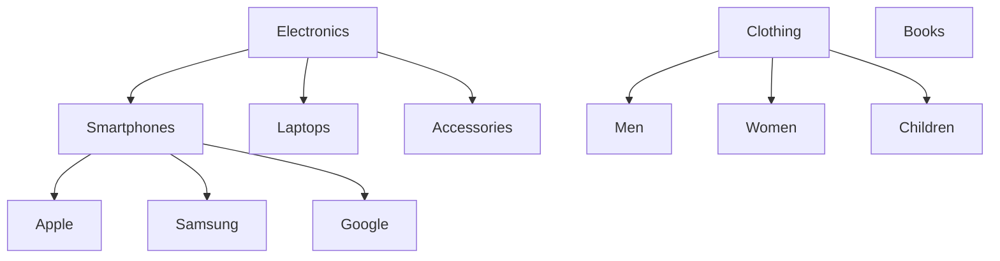

# PostgreSQL ltree Extension

## Introduction

The `ltree` extension is one of PostgreSQL's powerful but lesser-known features that provides specialized support for representing and querying hierarchical tree-like data structures in a relational database. If you've ever struggled with storing and querying hierarchical data like categories, organizational structures, file systems, or taxonomies in PostgreSQL, the `ltree` extension offers an elegant and efficient solution.

In this guide, we'll explore how to:
- Install and enable the `ltree` extension
- Create and structure hierarchical data
- Query and manipulate tree structures
- Apply `ltree` to real-world scenarios

## What is ltree?

The `ltree` data type represents a path in a tree-like structure as a series of labels separated by dots (`.`). For example, a file path like `/home/user/documents` might be represented as `root.home.user.documents` in `ltree` format.

Each label in an `ltree` path must follow these rules:
- Can contain alphanumeric characters (a-z, A-Z, 0-9)
- Can contain underscores and dashes
- Must be less than 256 bytes in length

The key advantage of `ltree` is that it provides special operators and functions that allow efficient querying of hierarchical relationships, like finding all descendants or ancestors of a node.

## Setting Up ltree

### Installation

To use the `ltree` extension, you first need to enable it in your PostgreSQL database:

```sql
CREATE EXTENSION ltree;
```

If you get an error saying the extension is not available, you may need to install the PostgreSQL contrib package on your system.

### Creating a Table with ltree

Let's create a simple table to represent a category hierarchy:

```sql
CREATE TABLE categories (
    id SERIAL PRIMARY KEY,
    name VARCHAR(100) NOT NULL,
    path ltree NOT NULL
);

-- Create a GiST index on the path for efficient hierarchical queries
CREATE INDEX categories_path_idx ON categories USING GIST (path);
```

## Basic ltree Operations

### Inserting Hierarchical Data

Let's insert some sample data to represent a product category hierarchy:

```sql
-- Insert top-level categories
INSERT INTO categories (name, path) VALUES 
('Electronics', 'electronics'),
('Clothing', 'clothing'),
('Books', 'books');

-- Insert subcategories for Electronics
INSERT INTO categories (name, path) VALUES 
('Smartphones', 'electronics.smartphones'),
('Laptops', 'electronics.laptops'),
('Accessories', 'electronics.accessories');

-- Insert subcategories for Smartphones
INSERT INTO categories (name, path) VALUES 
('Apple', 'electronics.smartphones.apple'),
('Samsung', 'electronics.smartphones.samsung'),
('Google', 'electronics.smartphones.google');

-- Insert subcategories for Clothing
INSERT INTO categories (name, path) VALUES 
('Men', 'clothing.men'),
('Women', 'clothing.women'),
('Children', 'clothing.children');
```

### Querying the Hierarchy

The `ltree` extension provides several operators for querying hierarchical relationships:

#### Finding Descendants

To find all subcategories under 'Electronics':

```sql
SELECT name, path FROM categories WHERE path <@ 'electronics';
```

Result:
```
       name       |             path             
------------------+------------------------------
 Electronics      | electronics
 Smartphones      | electronics.smartphones
 Laptops          | electronics.laptops
 Accessories      | electronics.accessories
 Apple            | electronics.smartphones.apple
 Samsung          | electronics.smartphones.samsung
 Google           | electronics.smartphones.google
```

#### Finding Ancestors

To find all parent categories of 'Samsung' smartphones:

```sql
SELECT name, path FROM categories WHERE path @> 'electronics.smartphones.samsung';
```

Result:
```
    name     |             path             
-------------+------------------------------
 Electronics | electronics
 Smartphones | electronics.smartphones
 Samsung     | electronics.smartphones.samsung
```

#### Finding Nodes at a Specific Level

To find all categories at the second level:

```sql
SELECT name, path FROM categories WHERE nlevel(path) = 2;
```

Result:
```
     name     |         path          
--------------+-----------------------
 Smartphones  | electronics.smartphones
 Laptops      | electronics.laptops
 Accessories  | electronics.accessories
 Men          | clothing.men
 Women        | clothing.women
 Children     | clothing.children
```

## Advanced ltree Operations

### Path Manipulation

The `ltree` extension provides functions to manipulate paths:

#### Subpath Extraction

```sql
-- Extract the first two levels of the path
SELECT path, subpath(path, 0, 2) FROM categories WHERE path = 'electronics.smartphones.apple';
```

Result:
```
             path             |     subpath      
------------------------------+------------------
 electronics.smartphones.apple | electronics.smartphones
```

#### Concatenating Paths

```sql
-- Concatenate two paths
SELECT 'new_root' || subpath('electronics.smartphones', 1) AS new_path;
```

Result:
```
    new_path    
---------------
 new_root.smartphones
```

### Pattern Matching

The `ltree` extension supports pattern matching with the `~` operator:

```sql
-- Find all categories with 'smartphone' in their path
SELECT name, path FROM categories WHERE path ~ '*.smartphones.*';
```

Result:
```
   name   |             path             
----------+------------------------------
 Apple    | electronics.smartphones.apple
 Samsung  | electronics.smartphones.samsung
 Google   | electronics.smartphones.google
```

## Real-World Applications

### Application 1: Dynamic Navigation Menu

Let's create a function that generates a navigation menu from our category hierarchy:

```sql
CREATE OR REPLACE FUNCTION get_menu(parent_path ltree DEFAULT NULL) 
RETURNS TABLE (id INTEGER, name VARCHAR, path ltree, level INTEGER) AS $$
BEGIN
    IF parent_path IS NULL THEN
        RETURN QUERY
        SELECT c.id, c.name, c.path, nlevel(c.path) AS level
        FROM categories c
        WHERE nlevel(c.path) = 1
        ORDER BY c.path;
    ELSE
        RETURN QUERY
        SELECT c.id, c.name, c.path, nlevel(c.path) AS level
        FROM categories c
        WHERE c.path <@ parent_path AND nlevel(c.path) = nlevel(parent_path) + 1
        ORDER BY c.path;
    END IF;
END;
$$ LANGUAGE plpgsql;
```

Usage:

```sql
-- Get top-level categories
SELECT * FROM get_menu();

-- Get subcategories of Electronics
SELECT * FROM get_menu('electronics');
```

First query result:
```
 id |    name     |    path     | level 
----+-------------+-------------+-------
  1 | Electronics | electronics |     1
  2 | Clothing    | clothing    |     1
  3 | Books       | books       |     1
```

Second query result:
```
 id |     name     |         path          | level 
----+--------------+-----------------------+-------
  4 | Smartphones  | electronics.smartphones |     2
  5 | Laptops      | electronics.laptops    |     2
  6 | Accessories  | electronics.accessories |     2
```

### Application 2: Breadcrumb Navigation

Let's create a function to generate breadcrumb navigation for a given category:

```sql
CREATE OR REPLACE FUNCTION get_breadcrumbs(category_path ltree)
RETURNS TABLE (id INTEGER, name VARCHAR, path ltree, level INTEGER) AS $$
BEGIN
    RETURN QUERY
    WITH RECURSIVE breadcrumbs AS (
        SELECT subpath(category_path, 0, 1) AS crumb_path, 1 AS level
        UNION ALL
        SELECT subpath(category_path, 0, b.level + 1), b.level + 1
        FROM breadcrumbs b
        WHERE nlevel(category_path) >= b.level + 1
    )
    SELECT c.id, c.name, c.path, b.level
    FROM breadcrumbs b
    JOIN categories c ON c.path = b.crumb_path
    ORDER BY b.level;
END;
$$ LANGUAGE plpgsql;
```

Usage:

```sql
-- Get breadcrumbs for Samsung smartphones
SELECT * FROM get_breadcrumbs('electronics.smartphones.samsung');
```

Result:
```
 id |     name     |             path             | level 
----+--------------+------------------------------+-------
  1 | Electronics  | electronics                  |     1
  4 | Smartphones  | electronics.smartphones      |     2
  8 | Samsung      | electronics.smartphones.samsung |     3
```

## Visualizing Hierarchies

We can visualize our category hierarchy using Mermaid:



## Performance Considerations

For optimal performance with `ltree`:

1. **Create appropriate indexes**: GiST indexes are recommended for most hierarchical queries:
   ```sql
   CREATE INDEX categories_path_gist_idx ON categories USING GIST (path);
   ```

2. **Consider a B-tree index** for equality operations:
   ```sql
   CREATE INDEX categories_path_btree_idx ON categories USING BTREE (path);
   ```

3. **Avoid excessive nesting**: While `ltree` can handle deep hierarchies, excessive nesting (more than a few dozen levels) might impact performance.

4. **Optimize path labels**: Keep path labels short to reduce storage and improve performance.

## Common ltree Operators and Functions

Here's a reference table of common `ltree` operators and functions:

| Operator/Function | Description | Example |
|-------------------|-------------|---------|
| `<@` | Is left a descendant of right? | `'a.b.c' <@ 'a.b'` returns true |
| `@>` | Is left an ancestor of right? | `'a.b' @> 'a.b.c'` returns true |
| `~` | Does left match right ltxtquery? | `'a.b' ~ 'a.b'` returns true |
| `?` | Does left match right lquery? | `'a.b.c' ? 'a.*.c'` returns true |
| `nlevel()` | Count levels in path | `nlevel('a.b.c')` returns 3 |
| `subpath()` | Extract subpath | `subpath('a.b.c',1,2)` returns 'b.c' |
| `index()` | Find position of subpath | `index('a.b.c.d','b.c')` returns 1 |
| `lca()` | Lowest common ancestor | `lca('a.b.c.d','a.b.e')` returns 'a.b' |

## Summary

The PostgreSQL `ltree` extension provides an elegant and efficient way to work with hierarchical data in a relational database. By storing tree structures as paths and leveraging specialized operators and functions, you can easily:

- Represent complex hierarchies like category trees, organizational charts, or file systems
- Perform efficient queries to find ancestors, descendants, or siblings
- Create dynamic navigation menus, breadcrumbs, and other hierarchical UI elements
- Maintain and modify hierarchical structures without complex recursive queries

While other approaches like adjacency lists or nested sets exist for working with hierarchical data, `ltree` offers a unique combination of simplicity, performance, and PostgreSQL integration that makes it ideal for many applications.

## Exercises

1. Create a table to represent a file system hierarchy using `ltree`, and write queries to:
   - Find all files in a specific directory
   - List all parent directories of a file
   - Count the number of files in each directory level

2. Modify the category example to support moving a category along with all its subcategories to a different parent.

3. Create a function that generates a visual representation of the hierarchy using ASCII characters (like a tree command in Unix).

## Additional Resources

- [PostgreSQL Documentation on ltree](https://www.postgresql.org/docs/current/ltree.html)
- [PostgreSQL: Up and Running](https://www.oreilly.com/library/view/postgresql-up-and/9781492063483/) has a chapter on working with hierarchical data
- [Postgres Weekly Newsletter](https://postgresweekly.com/) often features articles about PostgreSQL extensions

By mastering the `ltree` extension, you've added a powerful tool to your PostgreSQL toolkit that will help you efficiently model and query hierarchical relationships in your applications.