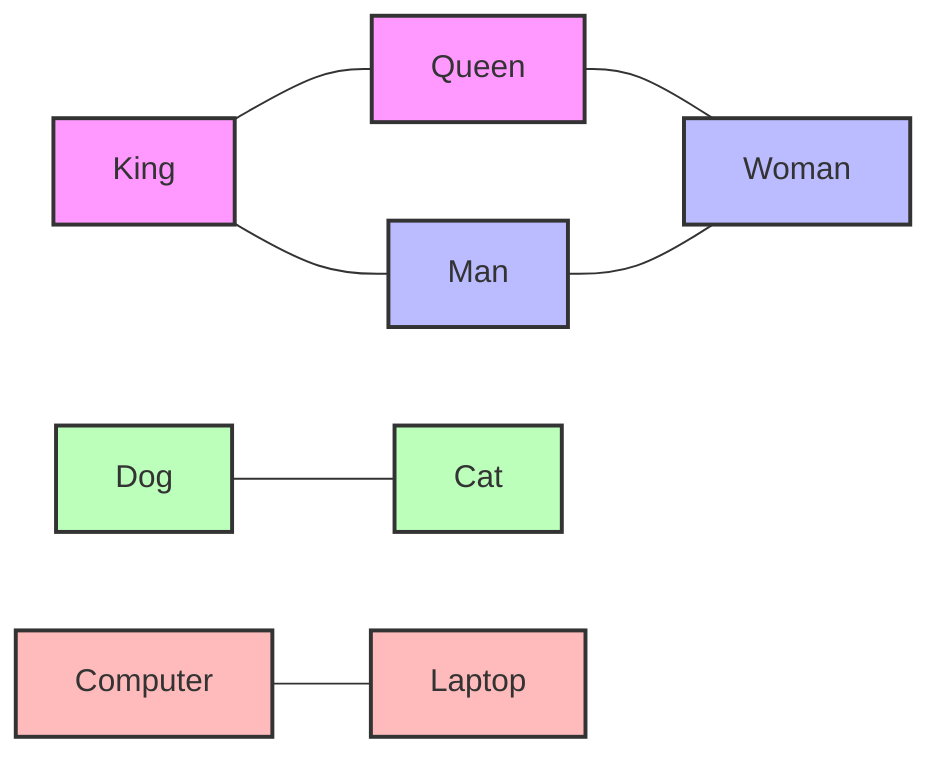

# PostgreSQL pgvector

## Introduction

pgvector is a powerful extension for PostgreSQL that adds support for vector similarity search. It enables you to store vector embeddings directly in your PostgreSQL database and perform efficient similarity searches on them. This capability is increasingly important in modern applications, particularly those involving machine learning, natural language processing, image recognition, and recommendation systems.

In this tutorial, we'll explore what vector databases are, why pgvector was developed, how to set it up, and how to use it in your applications. By the end, you'll have a solid understanding of how to leverage pgvector for your machine learning and AI projects.

## What are Vector Embeddings?

Before diving into pgvector, let's understand what vector embeddings are:

Vector embeddings are numerical representations of data (text, images, audio, etc.) in a multi-dimensional space. These vectors capture semantic meaning and relationships between items. For example:

- In **text processing**, words or documents are converted into vectors where similar meanings have vectors that are close to each other in the vector space.
- In **image recognition**, images are transformed into vectors that represent their visual features.
- In **recommendation systems**, both users and items can be represented as vectors to find matches.

Here's a simple visualization of how words might be embedded in a 2D vector space:



In reality, these embeddings typically have hundreds or thousands of dimensions, but the concept remains the same: similar items are closer together in the vector space.

## Why pgvector?

Traditional databases excel at exact matching and range queries but struggle with similarity searches. Vector databases solve this problem by specializing in similarity-based search operations.

pgvector bridges this gap by adding vector similarity capabilities directly to PostgreSQL. This brings several advantages:

1. **Integration with existing data** - Keep your vectors alongside your regular data
2. **Familiarity** - Use the SQL you already know
3. **Transactional safety** - Benefit from PostgreSQL's ACID guarantees
4. **Cost-efficiency** - Avoid running a separate vector database service

## Setting Up pgvector

Let's start by setting up pgvector in your PostgreSQL database:

### Installation

First, you'll need to install the extension:

```bash
# On Ubuntu/Debian
sudo apt-get install postgresql-14-pgvector

# On macOS with Homebrew
brew install pgvector

# Build from source
git clone --branch v0.5.1 https://github.com/pgvector/pgvector.git
cd pgvector
make
make install
```

### Enabling the Extension

Next, connect to your database and create the extension:

```sql
CREATE EXTENSION vector;
```

You can verify the installation with:

```sql
SELECT * FROM pg_extension WHERE extname = 'vector';
```

If successful, you should see:

```
 extname | extowner | extnamespace | extrelocatable | extversion | extconfig | extcondition 
---------+----------+--------------+----------------+------------+-----------+--------------
 vector  |       10 |         2200 | f              | 0.5.1      |           | 
```

## Creating Vector Columns

Now that pgvector is installed, let's create a table with a vector column:

```sql
-- Create a table to store document embeddings
CREATE TABLE documents (
    id SERIAL PRIMARY KEY,
    content TEXT,
    embedding vector(384)  -- 384-dimensional vector
);
```

The `vector(n)` type specifies an n-dimensional vector. Popular embedding models have different dimensions:
- OpenAI text-embedding-3-small: 1536 dimensions
- BERT base: 768 dimensions
- Sentence Transformers models: various dimensions (384 in this example)

## Inserting Vector Data

You can insert vectors as arrays:

```sql
-- Insert a vector directly
INSERT INTO documents (content, embedding) 
VALUES ('PostgreSQL database tutorial', '[0.1, 0.2, 0.3, ..., 0.384]'::vector);
```

More typically, you'll generate embeddings in your application code and then insert them:

```python
import psycopg2
from sentence_transformers import SentenceTransformer

# Connect to PostgreSQL
conn = psycopg2.connect("dbname=testdb user=postgres")
cur = conn.cursor()

# Load a pre-trained model
model = SentenceTransformer('all-MiniLM-L6-v2')  # 384-dimensional embeddings

# Text to embed
texts = [
    "PostgreSQL database tutorial",
    "Vector databases for machine learning",
    "How to query databases efficiently"
]

# Generate embeddings and insert into database
for text in texts:
    embedding = model.encode(text)  # This creates the vector
    embedding_list = embedding.tolist()
    
    # Format as a PostgreSQL array string
    embedding_str = str(embedding_list).replace('[', '{').replace(']', '}')
    
    cur.execute(
        "INSERT INTO documents (content, embedding) VALUES (%s, %s)",
        (text, embedding_str)
    )

conn.commit()
cur.close()
conn.close()
```

## Vector Similarity Search

pgvector supports three distance metrics for similarity search:

1. **Euclidean distance (L2)** - `<->`: Measures the straight-line distance between two points
2. **Negative inner product** - `<#>`: Used for raw similarity scores
3. **Cosine distance** - `<=>`: Measures the angle between vectors (most common for text embeddings)

### Basic Similarity Queries

Let's perform a simple similarity search:

```sql
-- Find the 5 most similar documents to a given embedding using cosine distance
SELECT content, embedding <=> '[0.12, 0.23, 0.34, ..., 0.45]'::vector AS distance
FROM documents
ORDER BY distance
LIMIT 5;
```

### Searching Similar Documents

A more practical approach is to find documents similar to an existing one:

```sql
-- Find documents similar to document with ID 1
SELECT d2.id, d2.content, d1.embedding <=> d2.embedding AS distance
FROM documents d1, documents d2
WHERE d1.id = 1 AND d1.id != d2.id
ORDER BY distance
LIMIT 5;
```

### Hybrid Search

One of pgvector's strengths is combining vector similarity with traditional SQL filters:

```sql
-- Find similar documents that also contain a specific keyword
SELECT content, embedding <=> '[0.12, 0.23, 0.34, ..., 0.45]'::vector AS distance
FROM documents
WHERE content ILIKE '%database%'
ORDER BY distance
LIMIT 5;
```

## Improving Search Performance

As your vector database grows, you'll need to optimize for performance.

### Creating Indices

pgvector supports three index types:

1. **HNSW (Hierarchical Navigable Small World)** - Fastest search, higher build time and memory usage
2. **IVFFlat (Inverted File with Flat Compression)** - Good balance of speed and accuracy
3. **IVFPQ (IVF with Product Quantization)** - Compact but less accurate

Let's create an HNSW index for cosine distance:

```sql
-- Create an HNSW index for cosine distance
CREATE INDEX ON documents USING hnsw (embedding vector_cosine_ops)
WITH (m = 16, ef_construction = 64);
```

Parameters:
- `m`: Maximum number of connections per node (higher = better recall, more memory)
- `ef_construction`: Size of the dynamic candidate list during construction (higher = better recall, slower build)

For IVFFlat:

```sql
-- Create an IVFFlat index for cosine distance with 100 lists
CREATE INDEX ON documents USING ivfflat (embedding vector_cosine_ops)
WITH (lists = 100);
```

The `lists` parameter determines how many clusters to use. A general guideline is `sqrt(n/4)` for n rows.

### Index Parameters

You can check the current index parameters with:

```sql
\d documents
```

Which should show something like:

```
                         Table "public.documents"
  Column   |  Type   | Collation | Nullable |             Default              
-----------+---------+-----------+----------+----------------------------------
 id        | integer |           | not null | nextval('documents_id_seq'::regclass)
 content   | text    |           |          | 
 embedding | vector  |           |          | 
Indexes:
    "documents_pkey" PRIMARY KEY, btree (id)
    "documents_embedding_idx" hnsw (embedding vector_cosine_ops) WITH (m='16', ef_construction='64')
```

## Approximate Nearest Neighbor (ANN) Search

For even faster searches with large datasets, you can use approximate nearest neighbor search:

```sql
-- Set the number of lists to probe (balance between speed and accuracy)
SET ivfflat.probes = 10;

-- For HNSW index, set the ef_search parameter
SET hnsw.ef_search = 100;

-- Perform an approximate search
SELECT content, embedding <=> '[0.12, 0.23, 0.34, ..., 0.45]'::vector AS distance
FROM documents
ORDER BY distance
LIMIT 5;
```

Higher values of `probes` or `ef_search` give more accurate results but slower performance.

## Real-World Application: Semantic Search

Let's build a simple semantic search system for a document database:

```python
import psycopg2
from sentence_transformers import SentenceTransformer
import numpy as np

class SemanticSearch:
    def __init__(self, db_params):
        self.conn = psycopg2.connect(**db_params)
        self.model = SentenceTransformer('all-MiniLM-L6-v2')
    
    def setup_database(self):
        with self.conn.cursor() as cur:
            cur.execute("CREATE EXTENSION IF NOT EXISTS vector")
            cur.execute("""
                CREATE TABLE IF NOT EXISTS documents (
                    id SERIAL PRIMARY KEY,
                    title TEXT,
                    content TEXT,
                    embedding vector(384)
                )
            """)
            # Create an index
            cur.execute("""
                CREATE INDEX IF NOT EXISTS documents_embedding_idx 
                ON documents USING hnsw (embedding vector_cosine_ops)
                WITH (m = 16, ef_construction = 64)
            """)
            self.conn.commit()
    
    def add_document(self, title, content):
        # Generate embedding for the document
        text_to_embed = f"{title} {content}"
        embedding = self.model.encode(text_to_embed)
        
        # Store in database
        with self.conn.cursor() as cur:
            cur.execute(
                "INSERT INTO documents (title, content, embedding) VALUES (%s, %s, %s)",
                (title, content, embedding.tolist())
            )
            self.conn.commit()
    
    def search(self, query, limit=5):
        # Generate embedding for the query
        query_embedding = self.model.encode(query)
        
        # Search for similar documents
        with self.conn.cursor() as cur:
            cur.execute("""
                SELECT id, title, content, embedding <=> %s AS distance
                FROM documents
                ORDER BY distance
                LIMIT %s
            """, (query_embedding.tolist(), limit))
            
            results = []
            for id, title, content, distance in cur.fetchall():
                results.append({
                    'id': id,
                    'title': title,
                    'content': content[:100] + '...' if len(content) > 100 else content,
                    'relevance': 1 - distance  # Convert distance to similarity score
                })
            
            return results
    
    def close(self):
        self.conn.close()

# Example usage:
if __name__ == "__main__":
    # Database connection parameters
    db_params = {
        "dbname": "testdb",
        "user": "postgres",
        "password": "password",
        "host": "localhost"
    }
    
    search_engine = SemanticSearch(db_params)
    search_engine.setup_database()
    
    # Add some documents
    search_engine.add_document(
        "PostgreSQL Tutorial", 
        "PostgreSQL is a powerful, open source object-relational database system."
    )
    search_engine.add_document(
        "Vector Search Guide", 
        "Vector search enables similarity-based matching of data across high-dimensional spaces."
    )
    search_engine.add_document(
        "Machine Learning Basics", 
        "Machine learning allows computers to learn from data and improve over time."
    )
    
    # Search for documents
    results = search_engine.search("database systems")
    
    # Display results
    print("Search results for 'database systems':")
    for i, result in enumerate(results, 1):
        print(f"{i}. {result['title']} (Relevance: {result['relevance']:.2f})")
        print(f"   {result['content']}")
    
    search_engine.close()
```

## Advanced Topics

### Upsert Operations with Vectors

For updating existing embeddings:

```sql
-- Upsert a document's embedding
INSERT INTO documents (id, content, embedding)
VALUES (1, 'Updated PostgreSQL tutorial', '[0.11, 0.22, 0.33, ..., 0.44]'::vector)
ON CONFLICT (id) 
DO UPDATE SET content = EXCLUDED.content, embedding = EXCLUDED.embedding;
```

### Working with Arrays of Vectors

You can also store arrays of vectors:

```sql
-- Create a table with an array of vectors
CREATE TABLE products (
    id SERIAL PRIMARY KEY,
    name TEXT,
    feature_embeddings vector(512)[]  -- Array of 512-dimensional vectors
);

-- Insert array of vectors
INSERT INTO products (name, feature_embeddings)
VALUES ('Smartphone', ARRAY['[0.1, 0.2, ..., 0.5]'::vector, '[0.6, 0.7, ..., 0.9]'::vector]);
```

### Binary Vector Quantization

For large datasets, pgvector supports Product Quantization (PQ) to compress vectors:

```sql
-- Create a table with compressed vectors
CREATE TABLE compressed_docs (
    id SERIAL PRIMARY KEY,
    content TEXT,
    embedding vector(384) USING PQ
);
```

This significantly reduces memory usage but with some loss in accuracy.

## Performance Considerations

When working with pgvector, keep these performance tips in mind:

1. **Choose the right index type** for your use case:
- HNSW for highest search speed
- IVFFlat for balance of speed/accuracy
- IVFPQ for large datasets with space constraints

2. **Tune index parameters** (m, ef_construction, lists) based on your dataset size and similarity requirements

3. **Use batch operations** for inserting many vectors

4. **Monitor memory usage** - vector indices can consume significant RAM

5. **Consider dimensionality reduction** techniques like PCA if your vectors have very high dimensions

## Summary

pgvector transforms PostgreSQL into a capable vector database, allowing you to:

1. Store vector embeddings directly in your PostgreSQL database
2. Perform efficient similarity searches using various distance metrics
3. Create specialized indices to accelerate vector queries
4. Combine traditional SQL filtering with vector similarity
5. Build AI-powered applications like semantic search, recommendation systems, and more

By leveraging pgvector, you can add powerful AI capabilities to your applications while maintaining the benefits of PostgreSQL's robustness and familiarity.

## Additional Resources

- [Official pgvector GitHub repository](https://github.com/pgvector/pgvector)
- [PostgreSQL Documentation](https://www.postgresql.org/docs/)
- [OpenAI Embeddings Documentation](https://platform.openai.com/docs/guides/embeddings)
- [Sentence Transformers Library](https://www.sbert.net/)

## Exercises

1. **Basic Setup**: Install pgvector and create a table with a vector column.

2. **Text Embeddings**: Generate embeddings for a set of text documents using a library like sentence-transformers and store them in PostgreSQL.

3. **Similarity Search**: Implement a simple search function that finds the most similar documents to a query string.

4. **Performance Testing**: Compare the performance of different index types (HNSW, IVFFlat) on a dataset of at least 10,000 vectors.

5. **Hybrid Search**: Build a search system that combines keyword filtering with vector similarity for more precise results.

6. **Advanced Application**: Create a content recommendation system that suggests related articles based on vector similarity.