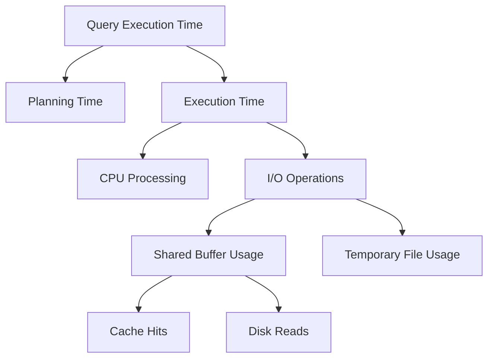

# PostgreSQL pg_stat_statements

## Introduction

Have you ever wondered which SQL queries are slowing down your PostgreSQL database? The `pg_stat_statements` extension is your answer! This powerful extension tracks execution statistics for all SQL statements executed by your server, giving you visibility into query performance that would otherwise be difficult to obtain.

In this guide, we'll explore how to set up, use, and analyze data from the `pg_stat_statements` extension to optimize your database performance. By the end, you'll have a solid understanding of how to identify problematic queries and improve your application's database interactions.

## What is pg_stat_statements?

`pg_stat_statements` is an official PostgreSQL extension that tracks execution statistics for all SQL statements. Unlike regular PostgreSQL logs that only show query text, this extension collects detailed metrics about each query's execution including:

- How many times a query was executed
- Total, mean, and maximum time spent on each query
- Number of rows affected
- Buffer usage statistics
- Temporary file usage

Think of it as a fitness tracker for your database - it measures how hard your queries are working and helps identify which ones need optimization.

## Prerequisites

Before we begin, make sure you have:

- PostgreSQL installed (version 9.2 or later)
- Administrative access to your PostgreSQL server
- Basic knowledge of SQL commands

## Setting Up pg_stat_statements

### Step 1: Install the Extension

The extension is typically included with standard PostgreSQL installations, but we need to activate it. Connect to your database using `psql` or another PostgreSQL client and run:

```sql
CREATE EXTENSION pg_stat_statements;
```

If successful, PostgreSQL will respond with:

```
CREATE EXTENSION
```

### Step 2: Configure postgresql.conf

To enable the extension to collect data, you need to modify your `postgresql.conf` file. Add or update these settings:

```
# Add pg_stat_statements to shared_preload_libraries
shared_preload_libraries = 'pg_stat_statements'

# Configure the module (optional but recommended)
pg_stat_statements.max = 10000  # maximum number of statements to track
pg_stat_statements.track = all  # track all statements, including nested ones
```

### Step 3: Restart PostgreSQL

After modifying the configuration, restart your PostgreSQL server for the changes to take effect:

```bash
# For systems using systemd
sudo systemctl restart postgresql

# For Debian/Ubuntu systems with specific version
sudo service postgresql restart

# For macOS with Homebrew
brew services restart postgresql
```

### Step 4: Verify Installation

To confirm the extension is working properly, connect to your database and run:

```sql
SELECT * FROM pg_available_extensions WHERE name = 'pg_stat_statements';
```

You should see output like:

```
        name        | default_version | installed_version |                        comment
--------------------+-----------------+-------------------+--------------------------------------------------------
 pg_stat_statements | 1.10            | 1.10              | track planning and execution statistics of all SQL statements executed
```

## Using pg_stat_statements

Now that the extension is set up, let's learn how to use it to analyze query performance.

### Basic Query to View Statement Statistics

The extension creates a view called `pg_stat_statements` that you can query:

```sql
SELECT 
    queryid,
    query,
    calls,
    total_exec_time,
    min_exec_time,
    max_exec_time,
    mean_exec_time,
    stddev_exec_time,
    rows
FROM pg_stat_statements
ORDER BY total_exec_time DESC
LIMIT 10;
```

This query shows your top 10 most time-consuming queries with execution statistics.

### Understanding the Output

Let's break down the key columns in the result:

- `queryid` - A hash identifier for the normalized query
- `query` - The SQL text of the query (with parameters replaced by $1, $2, etc.)
- `calls` - How many times the query has been executed
- `total_exec_time` - Total time spent executing this query (in milliseconds)
- `mean_exec_time` - Average execution time (in milliseconds)
- `rows` - Total number of rows retrieved or affected by the query

For newer PostgreSQL versions (13+), you'll also see additional fields like:

- `total_plan_time` - Time spent planning the query
- `shared_blks_hit` and `shared_blks_read` - Buffer cache hits and reads
- `temp_blks_written` - Temporary files created

## Practical Examples

Let's explore some common use cases for `pg_stat_statements`:

### Example 1: Finding Slow Queries

To identify queries that are taking the most time on average:

```sql
SELECT 
    substring(query, 1, 100) AS short_query,
    round(mean_exec_time::numeric, 2) AS avg_time_ms,
    calls,
    round(total_exec_time::numeric, 2) AS total_time_ms
FROM pg_stat_statements
WHERE calls > 100  -- Ignore rarely run queries
ORDER BY mean_exec_time DESC
LIMIT 10;
```

This query helps you find slow operations that might benefit from optimization, even if they don't consume the most total time.

### Example 2: Identifying High-Impact Queries

To find queries that have the highest overall impact (combining execution time and frequency):

```sql
SELECT 
    substring(query, 1, 100) AS short_query,
    calls,
    round(total_exec_time::numeric, 2) AS total_time_ms,
    round(mean_exec_time::numeric, 2) AS avg_time_ms,
    round((100 * total_exec_time / sum(total_exec_time) OVER ()), 2) AS percent_overall
FROM pg_stat_statements
ORDER BY total_exec_time DESC
LIMIT 10;
```

This shows which queries consume the highest percentage of your database's execution time.

### Example 3: Finding I/O Intensive Queries

In PostgreSQL 13+, you can identify queries with high disk I/O:

```sql
SELECT 
    substring(query, 1, 100) AS short_query,
    calls,
    shared_blks_hit,
    shared_blks_read,
    shared_blks_hit + shared_blks_read AS total_blocks,
    round((shared_blks_hit::numeric / (shared_blks_hit + shared_blks_read)) * 100, 2) AS hit_percent
FROM pg_stat_statements
WHERE shared_blks_read > 1000
ORDER BY shared_blks_read DESC
LIMIT 10;
```

This helps identify queries that might benefit from additional indexing or memory tuning.

## Visualizing Query Performance

To better understand query performance patterns, let's create a diagram showing how different factors contribute to overall query execution time:



## Maintenance and Reset

The `pg_stat_statements` view accumulates statistics until you explicitly reset it. To clear the statistics:

```sql
SELECT pg_stat_statements_reset();
```

This is useful when you want to measure performance changes after optimization or during specific application activities.

## Common Issues and Troubleshooting

### Missing Extension Error

If you see an error like:

```
ERROR: relation "pg_stat_statements" does not exist
```

Make sure:
1. The extension is properly installed (`CREATE EXTENSION pg_stat_statements;`)
2. You've added it to `shared_preload_libraries` in `postgresql.conf`
3. You've restarted the PostgreSQL server

### Memory Consumption

If the extension is consuming too much memory, adjust these settings in `postgresql.conf`:

```
pg_stat_statements.max = 5000  # Lower the number of tracked statements
pg_stat_statements.track = top  # Track only top-level statements to reduce memory usage
```

## Best Practices for Using pg_stat_statements

1. **Periodic Analysis**: Schedule regular checks of your top queries to catch performance regressions early.

2. **Reset Before Testing**: Reset statistics before testing changes to get accurate measurements.

3. **Focus on High-Impact Queries**: Rather than optimizing every slow query, focus on those with the highest total impact (high frequency × high average time).

4. **Look for Patterns**: Sometimes similar queries have similar problems. Look for patterns in slow queries.

5. **Combine with EXPLAIN**: When you find a slow query, use PostgreSQL's `EXPLAIN ANALYZE` to dive deeper into execution plans.

## Summary

The `pg_stat_statements` extension is an invaluable tool for PostgreSQL performance tuning. By providing detailed statistics on query execution, it helps identify performance bottlenecks that might otherwise go unnoticed.

In this guide, we've learned:
- How to set up and configure the extension
- How to query it for performance insights
- How to identify slow, frequent, and resource-intensive queries
- Best practices for database performance monitoring

With these skills, you can significantly improve your application's database performance by targeting optimization efforts where they'll have the most impact.

## Additional Resources

To further develop your PostgreSQL performance tuning skills:

1. Explore the official PostgreSQL documentation on [pg_stat_statements](https://www.postgresql.org/docs/current/pgstatstatements.html)
2. Learn about PostgreSQL's [EXPLAIN](https://www.postgresql.org/docs/current/sql-explain.html) command for detailed query plan analysis
3. Study other PostgreSQL monitoring extensions like `pg_stat_activity` and `auto_explain`

## Practice Exercises

1. Install and configure `pg_stat_statements` on your development database
2. Run a variety of queries, then analyze which ones consume the most resources
3. Identify your top 3 most time-consuming queries and practice optimizing them
4. Create a periodic monitoring script that emails you when certain queries exceed performance thresholds