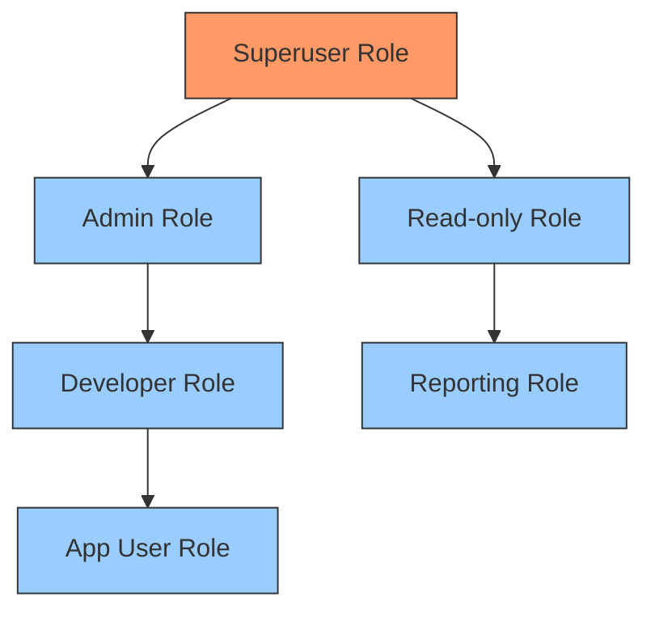

# PostgreSQL User Management

## Introduction

Managing users in PostgreSQL is a fundamental aspect of database administration that focuses on controlling access to your database systems. PostgreSQL uses a robust role-based access control system that governs which users can connect to databases and what actions they can perform once connected.

In this guide, we'll explore the concepts and practical aspects of PostgreSQL user management, including creating roles, granting privileges, configuring authentication methods, and implementing best practices for security. Whether you're setting up a database for development or production, understanding user management is crucial for maintaining the security and integrity of your data.

## Understanding PostgreSQL Roles

In PostgreSQL, the concept of a "user" is implemented through "roles." A role can represent an individual user or a group of users, depending on how it's configured.

### Key Concepts

- **Roles vs Users**: In PostgreSQL, there's technically no difference between a "role" and a "user". The `CREATE USER` command is actually an alias for `CREATE ROLE` with login privileges.
- **Role Attributes**: Roles can have various attributes that determine what they can do.
- **Role Membership**: Roles can be members of other roles, allowing for group-style permissions.

Let's visualize the relationship between roles:



## Creating and Managing Roles

### Creating a New Role

To create a new role in PostgreSQL, you can use the `CREATE ROLE` command:

```sql
CREATE ROLE app_user WITH LOGIN PASSWORD 'secure_password';
```

This creates a basic role with login capabilities. Let's break down the various options available:

```sql
CREATE ROLE role_name [WITH] option [...]

-- Options include:
-- SUPERUSER | NOSUPERUSER
-- CREATEDB | NOCREATEDB
-- CREATEROLE | NOCREATEROLE
-- INHERIT | NOINHERIT
-- LOGIN | NOLOGIN
-- PASSWORD 'password'
-- VALID UNTIL 'timestamp'
-- IN ROLE role_name [, ...]
-- ADMIN role_name [, ...]
```

### Example: Creating Different Types of Roles

```sql
-- Create a superuser
CREATE ROLE admin_user WITH SUPERUSER LOGIN PASSWORD 'admin_password';

-- Create a read-only user
CREATE ROLE reader WITH LOGIN PASSWORD 'reader_password';

-- Create a role that can create databases
CREATE ROLE db_creator WITH CREATEDB LOGIN PASSWORD 'creator_password';

-- Create a role without login privileges (used for grouping)
CREATE ROLE developers NOLOGIN;
```

### Viewing Existing Roles

To see all roles in your PostgreSQL instance:

```sql
SELECT rolname, rolsuper, rolcreatedb, rolcreaterole, rolcanlogin
FROM pg_roles;
```

Example output:

```
    rolname    | rolsuper | rolcreatedb | rolcreaterole | rolcanlogin
---------------+----------+-------------+---------------+-------------
 postgres      | t        | t           | t             | t
 admin_user    | t        | t           | t             | t
 reader        | f        | f           | f             | t
 db_creator    | f        | t           | f             | t
 developers    | f        | f           | f             | f
```

### Altering Roles

You can modify role attributes using the `ALTER ROLE` command:

```sql
-- Change password
ALTER ROLE app_user WITH PASSWORD 'new_secure_password';

-- Add database creation privilege
ALTER ROLE app_user WITH CREATEDB;

-- Revoke superuser privilege
ALTER ROLE admin_user WITH NOSUPERUSER;

-- Set password expiration
ALTER ROLE app_user VALID UNTIL '2023-12-31';
```

### Dropping Roles

To remove a role:

```sql
DROP ROLE app_user;
```

If the role owns any database objects, you'll need to either drop those objects or reassign ownership before dropping the role:

```sql
-- First, reassign objects
REASSIGN OWNED BY app_user TO new_owner;

-- Then drop objects owned by the role
DROP OWNED BY app_user;

-- Finally, drop the role
DROP ROLE app_user;
```

## Role Membership and Group Roles

PostgreSQL allows you to create role hierarchies, where roles can be members of other roles and inherit their privileges.

### Creating Group Roles

```sql
-- Create a group role for developers
CREATE ROLE dev_team NOLOGIN;

-- Grant privileges to the group role
GRANT CONNECT ON DATABASE app_db TO dev_team;
GRANT USAGE ON SCHEMA public TO dev_team;
GRANT SELECT, INSERT, UPDATE, DELETE ON ALL TABLES IN SCHEMA public TO dev_team;

-- Add users to the group
GRANT dev_team TO dev1, dev2, dev3;
```

### Inheritance

By default, a role inherits the privileges of roles it is a member of. You can control this with the `INHERIT` attribute:

```sql
-- Create a role that doesn't inherit privileges
CREATE ROLE auditor WITH NOINHERIT LOGIN PASSWORD 'auditor_password';

-- Make auditor a member of read_all group
GRANT read_all TO auditor;
```

With `NOINHERIT`, the `auditor` role will need to explicitly set the role to use its privileges:

```sql
-- User logs in as auditor, then:
SET ROLE read_all;

-- To revert:
RESET ROLE;
```

## Granting and Revoking Privileges

PostgreSQL has a detailed privilege system that controls what actions roles can perform on objects.

### Common Privileges

- `SELECT`: Ability to read data
- `INSERT`: Ability to add new data
- `UPDATE`: Ability to modify existing data
- `DELETE`: Ability to remove data
- `TRUNCATE`: Ability to empty a table
- `REFERENCES`: Ability to create foreign keys
- `TRIGGER`: Ability to create triggers
- `CREATE`: Ability to create objects
- `CONNECT`: Ability to connect to a database
- `TEMPORARY`: Ability to create temporary tables
- `EXECUTE`: Ability to execute functions

### Granting Privileges on Tables

```sql
-- Grant read access to a table
GRANT SELECT ON table_name TO role_name;

-- Grant all privileges on a table
GRANT ALL PRIVILEGES ON table_name TO role_name;

-- Grant insert and update on specific columns
GRANT INSERT, UPDATE (column1, column2) ON table_name TO role_name;

-- Grant privileges on all tables in a schema
GRANT SELECT, INSERT ON ALL TABLES IN SCHEMA schema_name TO role_name;
```

### Revoking Privileges

```sql
-- Revoke a specific privilege
REVOKE UPDATE ON table_name FROM role_name;

-- Revoke all privileges
REVOKE ALL PRIVILEGES ON table_name FROM role_name;
```

### Privileges with Grant Option

The `WITH GRANT OPTION` clause allows the recipient to grant the same privileges to others:

```sql
GRANT SELECT ON table_name TO role_name WITH GRANT OPTION;
```

### Default Privileges

You can set default privileges for newly created objects:

```sql
-- Set default privileges for tables created by a role
ALTER DEFAULT PRIVILEGES FOR ROLE db_owner IN SCHEMA public
GRANT SELECT ON TABLES TO read_only_role;
```

## Real-World Example: Setting Up User Roles for a Web Application

Let's walk through setting up roles for a typical web application with separate concerns:

```sql
-- Create a role for the application's database owner
CREATE ROLE app_owner WITH LOGIN PASSWORD 'owner_password' CREATEDB;

-- Create a role for the application's backend service
CREATE ROLE app_service WITH LOGIN PASSWORD 'service_password';

-- Create a role for read-only access (reporting)
CREATE ROLE app_reader WITH LOGIN PASSWORD 'reader_password';

-- Create the database and set ownership
CREATE DATABASE my_application OWNER app_owner;

-- Connect to the new database
\c my_application

-- Create schema and basic tables (as app_owner)
CREATE TABLE users (
    id SERIAL PRIMARY KEY,
    username VARCHAR(100) UNIQUE NOT NULL,
    email VARCHAR(255) UNIQUE NOT NULL,
    password_hash VARCHAR(255) NOT NULL,
    created_at TIMESTAMP WITH TIME ZONE DEFAULT NOW()
);

CREATE TABLE products (
    id SERIAL PRIMARY KEY,
    name VARCHAR(255) NOT NULL,
    description TEXT,
    price DECIMAL(10, 2) NOT NULL,
    inventory_count INTEGER NOT NULL DEFAULT 0
);

-- Grant appropriate privileges to service role
GRANT CONNECT ON DATABASE my_application TO app_service;
GRANT USAGE ON SCHEMA public TO app_service;
GRANT SELECT, INSERT, UPDATE, DELETE ON ALL TABLES IN SCHEMA public TO app_service;
GRANT USAGE, SELECT ON ALL SEQUENCES IN SCHEMA public TO app_service;

-- Grant read-only access to reader role
GRANT CONNECT ON DATABASE my_application TO app_reader;
GRANT USAGE ON SCHEMA public TO app_reader;
GRANT SELECT ON ALL TABLES IN SCHEMA public TO app_reader;

-- Set default privileges for future tables
ALTER DEFAULT PRIVILEGES FOR ROLE app_owner IN SCHEMA public
GRANT SELECT, INSERT, UPDATE, DELETE ON TABLES TO app_service;

ALTER DEFAULT PRIVILEGES FOR ROLE app_owner IN SCHEMA public
GRANT SELECT ON TABLES TO app_reader;

ALTER DEFAULT PRIVILEGES FOR ROLE app_owner IN SCHEMA public
GRANT USAGE, SELECT ON SEQUENCES TO app_service;
```

## Authentication Methods

PostgreSQL supports various authentication methods, configured in the `pg_hba.conf` file.

### Common Authentication Methods

1. **Password Authentication**:
   - `md5`: Password is sent in MD5-hashed form
   - `scram-sha-256`: More secure password-based authentication (recommended)
   - `password`: Plain text passwords (avoid in production)

2. **Peer Authentication**: Uses operating system username (local connections only)

3. **Ident Authentication**: Uses operating system username (remote connections)

4. **Certificate Authentication**: Uses SSL client certificates

### Example pg_hba.conf Configuration

Here's an example `pg_hba.conf` configuration that showcases different authentication methods:

```
# TYPE  DATABASE        USER            ADDRESS                 METHOD
# Local connections
local   all             postgres                                peer
local   all             all                                     scram-sha-256
# IPv4 connections
host    all             all             127.0.0.1/32            scram-sha-256
# IPv6 connections
host    all             all             ::1/128                 scram-sha-256
# Remote connections
host    production      app_service     192.168.1.0/24          scram-sha-256
host    all             admin_user      192.168.1.10/32         scram-sha-256
# Allow replication connections from localhost
host    replication     replicator      127.0.0.1/32            scram-sha-256
```

### Reloading Configuration

After modifying the `pg_hba.conf` file, you need to reload the configuration:

```sql
SELECT pg_reload_conf();
```

Or from the command line:

```bash
pg_ctl reload
```

## Best Practices for PostgreSQL User Management

1. **Follow the Principle of Least Privilege**
   - Grant only the permissions necessary for each role to perform its function
   - Use read-only roles for reporting and analytics users

2. **Use Strong Password Policies**
   - Enforce strong passwords for all roles
   - Consider using password expiration for sensitive roles
   ```sql
   ALTER ROLE admin_user WITH PASSWORD 'strong_password' VALID UNTIL '2023-12-31';
   ```

3. **Implement Role Hierarchies**
   - Create group roles for common permission sets
   - Add users to appropriate groups rather than granting permissions directly

4. **Regularly Audit Roles and Permissions**
   - Review existing roles and their permissions periodically
   - Check for unused roles or excessive privileges
   ```sql
   SELECT r.rolname, r.rolsuper, r.rolcreatedb, 
          r.rolcreaterole, r.rolcanlogin,
          ARRAY(SELECT b.rolname
                FROM pg_catalog.pg_auth_members m
                JOIN pg_catalog.pg_roles b ON (m.roleid = b.oid)
                WHERE m.member = r.oid) as memberof
   FROM pg_catalog.pg_roles r
   ORDER BY 1;
   ```

5. **Use Connection Limits for Roles**
   - Prevent denial of service by limiting concurrent connections
   ```sql
   ALTER ROLE app_service CONNECTION LIMIT 100;
   ```

6. **Separate Owner and Service Roles**
   - Use different roles for ownership and application access
   - This provides better security and cleaner privilege management

7. **Use SSL for Remote Connections**
   - Configure PostgreSQL to use SSL for all remote connections
   - Set `hostssl` entries in `pg_hba.conf` to enforce SSL

8. **Monitor Authentication Attempts**
   - Enable logging of failed authentication attempts
   - Regularly review logs for suspicious activity

## Troubleshooting Common Issues

### Permission Denied Errors

If you see "permission denied" errors, check:
1. Role exists and has login privilege
2. Role has appropriate permissions on the database objects
3. Connection is coming from an allowed address (check `pg_hba.conf`)

```sql
-- Check if role exists and has login privilege
SELECT rolname, rolcanlogin FROM pg_roles WHERE rolname = 'app_user';

-- Check permissions on a specific table
SELECT grantee, privilege_type 
FROM information_schema.role_table_grants 
WHERE table_name = 'users';
```

### Authentication Failures

For authentication failures:
1. Verify the password is correct
2. Check the authentication method in `pg_hba.conf`
3. Ensure the configuration has been reloaded

### Connection Limit Reached

If you hit connection limits:
```sql
-- Check connection limit for a role
SELECT rolname, rolconnlimit FROM pg_roles WHERE rolname = 'app_service';

-- See current connections by role
SELECT usename, count(*) FROM pg_stat_activity GROUP BY usename;

-- Increase the connection limit if needed
ALTER ROLE app_service CONNECTION LIMIT 200;
```

## Summary

PostgreSQL's user management system, built around roles and privileges, provides a flexible and secure way to control access to your databases. By understanding how to create and manage roles, grant appropriate privileges, and implement proper authentication methods, you can ensure your database remains secure while still being accessible to authorized users.

Key points to remember:
- Use roles for both individual users and groups
- Follow the principle of least privilege
- Implement role hierarchies for easier management
- Regularly audit roles and permissions
- Use strong authentication methods

PostgreSQL's robust permission system allows you to implement complex security policies that can adapt to the needs of any application, from simple development databases to enterprise-level systems with strict compliance requirements.

## Additional Resources

- [PostgreSQL Documentation: Database Roles](https://www.postgresql.org/docs/current/user-manag.html)
- [PostgreSQL Documentation: Client Authentication](https://www.postgresql.org/docs/current/client-authentication.html)
- [PostgreSQL Documentation: Privileges](https://www.postgresql.org/docs/current/ddl-priv.html)

## Exercises

1. Create a database for a blog application with three roles: blog_owner, blog_writer, and blog_reader. Set appropriate permissions for each role.

2. Write SQL commands to audit which roles have been granted superuser privileges on your system.

3. Create a role hierarchy for an e-commerce application with admin, inventory, sales, and customer service roles, each with appropriate permissions.

4. Configure `pg_hba.conf` to allow remote connections from a specific IP range using password authentication for a specific role.

5. Create a script that automates the process of creating a new database with proper ownership and permissions for a new project.