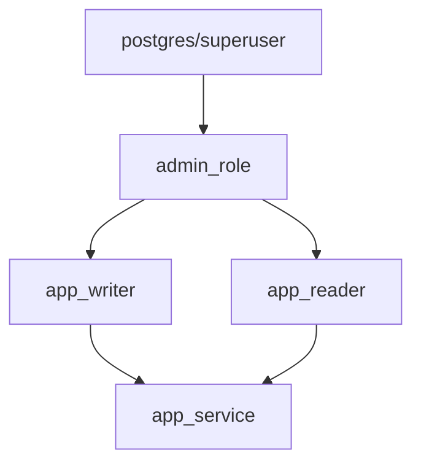

# PostgreSQL Roles and Privileges

## Introduction

Database security is a critical aspect of any application. Controlling who can access your database and what operations they can perform is essential for protecting sensitive data and maintaining system integrity. PostgreSQL provides a robust security model through its **roles** and **privileges** system.

In this guide, you'll learn how PostgreSQL manages access control, how to create and manage roles, assign privileges, and implement common security patterns for your database applications.

## Understanding PostgreSQL Roles

In PostgreSQL, a **role** is an entity that can own database objects and have database privileges. Roles can represent individual users or groups of users, depending on how you set them up.

### Key Concepts

- **Roles vs Users**: In older PostgreSQL versions, there was a distinction between "users" (which could log in) and "groups" (which couldn't). Since PostgreSQL 8.1, these have been unified into the concept of "roles" with an optional login privilege.
- **Role Attributes**: Roles can have various attributes that define what they can do at a system level.
- **Privileges**: Roles can be granted specific permissions on database objects.
- **Role Membership**: Roles can be members of other roles, inheriting their privileges.

### Creating Roles

The basic syntax for creating a role is:

```sql
CREATE ROLE role_name [WITH options];
```

Where `options` can include:

```sql
SUPERUSER | NOSUPERUSER
CREATEDB | NOCREATEDB
CREATEROLE | NOCREATEROLE
LOGIN | NOLOGIN
PASSWORD 'password'
```

Let's create some example roles:

```sql
-- Create an administrative role that can login
CREATE ROLE admin WITH LOGIN CREATEDB CREATEROLE PASSWORD 'secure_password';

-- Create a role for application access
CREATE ROLE app_user WITH LOGIN PASSWORD 'app_password';

-- Create a group role for read-only access
CREATE ROLE readonly NOLOGIN;
```

You can also use the more specific `CREATE USER` command, which is equivalent to `CREATE ROLE` with the `LOGIN` attribute:

```sql
CREATE USER john WITH PASSWORD 'john_password';
-- Equivalent to:
-- CREATE ROLE john WITH LOGIN PASSWORD 'john_password';
```

### Viewing Existing Roles

To see all roles in your PostgreSQL instance:

```sql
SELECT rolname, rolsuper, rolcreatedb, rolcreaterole, rolcanlogin 
FROM pg_roles;
```

Example output:

```
  rolname  | rolsuper | rolcreatedb | rolcreaterole | rolcanlogin
-----------+----------+-------------+---------------+-------------
 postgres  | t        | t           | t             | t
 admin     | f        | t           | t             | t
 app_user  | f        | f           | f             | t
 readonly  | f        | f           | f             | f
 john      | f        | f           | f             | t
```

### Altering Roles

You can modify an existing role with the `ALTER ROLE` command:

```sql
-- Add the CREATEDB attribute to john
ALTER ROLE john CREATEDB;

-- Change a password
ALTER ROLE app_user WITH PASSWORD 'new_secure_password';

-- Remove the ability to create databases
ALTER ROLE john NOCREATEDB;
```

### Dropping Roles

To remove a role:

```sql
DROP ROLE john;
```

Note that you cannot drop a role if it owns objects or has been granted permissions on other objects. You must first reassign or drop those objects.

```sql
-- This will fail if john owns objects
DROP ROLE john;

-- To see what objects john owns
SELECT tablename FROM pg_tables WHERE tableowner = 'john';
```

## Role Membership and Inheritance

PostgreSQL allows roles to be members of other roles, similar to groups in operating systems. This enables hierarchical privilege management.

### Granting Membership

To make a role a member of another role:

```sql
GRANT group_role TO member_role;
```

For example:

```sql
-- Make john a member of the readonly role
GRANT readonly TO john;

-- Make multiple roles members of readonly
GRANT readonly TO app_user, analyst;
```

### Setting Up Inheritance

By default, a role does not automatically inherit the privileges of roles it is a member of. To enable inheritance:

```sql
-- When creating a new role
CREATE ROLE analyst WITH LOGIN INHERIT PASSWORD 'analyst_pwd';

-- For an existing role
ALTER ROLE john INHERIT;
```

With inheritance enabled, a role automatically has the privileges of all roles it is a member of.

### Viewing Membership

To see role memberships:

```sql
SELECT r.rolname, m.rolname AS member_of
FROM pg_roles r
JOIN pg_auth_members ON (r.oid = pg_auth_members.member)
JOIN pg_roles m ON (pg_auth_members.roleid = m.oid);
```

Example output:

```
 rolname |  member_of
---------+-------------
 john    | readonly
 app_user| readonly
 analyst | readonly
```

## Database Privileges

Privileges control what actions a role can perform on database objects. PostgreSQL has a comprehensive privilege system that allows fine-grained access control.

### Types of Privileges

PostgreSQL supports the following privilege types for different objects:

| Privilege | Applicable Objects | Description |
|-----------|-------------------|-------------|
| SELECT | Tables, Views, Sequences | Ability to read data |
| INSERT | Tables, Views | Ability to add data |
| UPDATE | Tables, Views | Ability to modify data |
| DELETE | Tables, Views | Ability to remove data |
| TRUNCATE | Tables | Ability to empty a table |
| REFERENCES | Tables | Ability to create foreign keys |
| TRIGGER | Tables | Ability to create triggers |
| CREATE | Databases, Schemas, Tables | Ability to create new objects |
| CONNECT | Databases | Ability to connect to a database |
| TEMPORARY | Databases | Ability to create temporary tables |
| EXECUTE | Functions | Ability to execute functions |
| USAGE | Languages, Schemas, Sequences | Ability to use objects |
| ALL PRIVILEGES | Any | All applicable privileges |

### Granting Privileges

To grant privileges, use the `GRANT` command:

```sql
GRANT privilege_list ON object_type object_name TO role_name;
```

Examples:

```sql
-- Grant SELECT on a table
GRANT SELECT ON TABLE customers TO readonly;

-- Grant multiple privileges
GRANT SELECT, INSERT, UPDATE ON TABLE products TO app_user;

-- Grant ALL privileges
GRANT ALL PRIVILEGES ON TABLE orders TO admin;

-- Grant privileges on all tables in a schema
GRANT SELECT ON ALL TABLES IN SCHEMA public TO readonly;

-- Grant privileges on future tables
ALTER DEFAULT PRIVILEGES IN SCHEMA public
GRANT SELECT ON TABLES TO readonly;
```

### Revoking Privileges

To remove privileges, use the `REVOKE` command:

```sql
REVOKE privilege_list ON object_type object_name FROM role_name;
```

Examples:

```sql
-- Revoke a specific privilege
REVOKE INSERT ON TABLE products FROM app_user;

-- Revoke all privileges
REVOKE ALL PRIVILEGES ON TABLE orders FROM app_user;
```

### Viewing Privileges

To check what privileges have been granted:

```sql
-- View privileges on a specific table
\dp customers

-- Or with a query
SELECT grantee, privilege_type 
FROM information_schema.role_table_grants 
WHERE table_name='customers';
```

Example output:

```
     grantee     | privilege_type
-----------------+----------------
 postgres        | INSERT
 postgres        | SELECT
 postgres        | UPDATE
 postgres        | DELETE
 postgres        | TRUNCATE
 postgres        | REFERENCES
 postgres        | TRIGGER
 readonly        | SELECT
 app_user        | SELECT
 app_user        | INSERT
 app_user        | UPDATE
```

## Real-World Role and Privilege Patterns

Let's explore some common patterns for setting up roles and privileges in real-world applications.

### Application Role Hierarchy

Here's how you might set up roles for a typical web application:



Implementation:

```sql
-- Create the roles
CREATE ROLE admin_role WITH NOLOGIN;
CREATE ROLE app_writer WITH NOLOGIN;
CREATE ROLE app_reader WITH NOLOGIN;
CREATE ROLE app_service WITH LOGIN PASSWORD 'service_pwd';

-- Set up the hierarchy
GRANT app_reader TO app_writer;
GRANT app_writer TO admin_role;
GRANT app_reader TO app_service;

-- Set up privileges
GRANT CONNECT ON DATABASE myapp TO app_reader;
GRANT USAGE ON SCHEMA public TO app_reader;
GRANT SELECT ON ALL TABLES IN SCHEMA public TO app_reader;
GRANT INSERT, UPDATE, DELETE ON ALL TABLES IN SCHEMA public TO app_writer;

-- Set default privileges for future tables
ALTER DEFAULT PRIVILEGES IN SCHEMA public
GRANT SELECT ON TABLES TO app_reader;

ALTER DEFAULT PRIVILEGES IN SCHEMA public
GRANT INSERT, UPDATE, DELETE ON TABLES TO app_writer;
```

### Microservice Architecture

For microservice architectures, you might create specific roles for each service:

```sql
-- Create roles for different services
CREATE ROLE auth_service WITH LOGIN PASSWORD 'auth_pwd';
CREATE ROLE order_service WITH LOGIN PASSWORD 'order_pwd';
CREATE ROLE product_service WITH LOGIN PASSWORD 'product_pwd';

-- Grant specific privileges to each service
-- Auth service needs access to users and authentication tables
GRANT SELECT, INSERT, UPDATE ON TABLE users, user_sessions TO auth_service;

-- Order service needs access to orders and related tables
GRANT SELECT, INSERT, UPDATE, DELETE ON TABLE orders, order_items TO order_service;
GRANT SELECT ON TABLE products, customers TO order_service;

-- Product service needs access to product information
GRANT SELECT, INSERT, UPDATE, DELETE ON TABLE products, categories TO product_service;
```

### Row-Level Security

For more fine-grained control, PostgreSQL supports Row-Level Security (RLS), allowing you to restrict which rows a role can access:

```sql
-- Enable row-level security on the table
ALTER TABLE customers ENABLE ROW LEVEL SECURITY;

-- Create a policy that limits access to customers in the user's region
CREATE POLICY region_access ON customers
FOR SELECT
USING (region = current_setting('app.current_region'));

-- Create a function to set the current region
CREATE FUNCTION set_region(text) RETURNS void AS $$
BEGIN
    PERFORM set_config('app.current_region', $1, false);
END;
$$ LANGUAGE plpgsql;

-- Usage example (in application code):
SELECT set_region('europe');
SELECT * FROM customers; -- Will only show European customers
```

## Best Practices for Role and Privilege Management

1. **Follow the principle of least privilege**: Grant only the minimum necessary privileges.

2. **Use role hierarchy**: Create group roles for common privilege sets and grant them to user roles.

3. **Revoke public privileges**: By default, the `public` role has some privileges. Consider revoking these:

```sql
REVOKE CREATE ON SCHEMA public FROM PUBLIC;
REVOKE ALL ON DATABASE mydatabase FROM PUBLIC;
```

4. **Audit privileges regularly**: Periodically review who has access to what.

5. **Use connection pooling with role switching**: Tools like PgBouncer allow you to use a single database connection but switch roles.

6. **Separate ownership from usage**: Have admin roles own objects but grant specific privileges to application roles.

7. **Document your role structure**: Keep documentation of your role hierarchy and privilege grants.

8. **Use password policies**: Enforce strong passwords and regular rotation for login roles.

## Common Issues and Troubleshooting

### Permission Denied Errors

If you're getting "permission denied" errors:

1. Check the role's privileges:
```sql
SELECT * FROM information_schema.role_table_grants 
WHERE grantee='app_user' AND table_name='customers';
```

2. Verify role membership:
```sql
SELECT r.rolname, m.rolname AS member_of
FROM pg_roles r
LEFT JOIN pg_auth_members ON (r.oid = pg_auth_members.member)
LEFT JOIN pg_roles m ON (pg_auth_members.roleid = m.oid)
WHERE r.rolname = 'app_user';
```

3. Check if inheritance is enabled:
```sql
SELECT rolname, rolinherit FROM pg_roles WHERE rolname = 'app_user';
```

### Object Ownership Problems

If you're trying to drop a role but it owns objects:

1. Find objects owned by the role:
```sql
SELECT n.nspname as schema, c.relname as name, 
       CASE c.relkind WHEN 'r' THEN 'table' 
                      WHEN 'v' THEN 'view' 
                      WHEN 'm' THEN 'materialized view'
                      WHEN 'i' THEN 'index' 
                      WHEN 'S' THEN 'sequence'
                      WHEN 's' THEN 'special' END as type
FROM pg_catalog.pg_class c
JOIN pg_catalog.pg_namespace n ON n.oid = c.relnamespace
WHERE c.relowner = (SELECT oid FROM pg_roles WHERE rolname = 'john');
```

2. Reassign ownership:
```sql
REASSIGN OWNED BY john TO admin;
```

3. Then drop the role:
```sql
DROP ROLE john;
```

## Summary

PostgreSQL's role and privilege system provides a flexible and powerful way to manage database access control. By understanding roles, privileges, and role membership, you can implement sophisticated security models that balance security with usability.

The key concepts to remember are:

- **Roles** can represent users or groups and can have system-level attributes
- **Privileges** control access to database objects
- **Role membership** allows for hierarchical privilege inheritance
- **Row-Level Security** provides fine-grained access control within tables

By following best practices and implementing appropriate role structures, you can ensure that your PostgreSQL databases remain secure while providing necessary access to applications and users.

## Additional Resources

- [PostgreSQL Documentation on Role Management](https://www.postgresql.org/docs/current/user-manag.html)
- [PostgreSQL Documentation on Privileges](https://www.postgresql.org/docs/current/ddl-priv.html)
- [PostgreSQL Documentation on Row Security Policies](https://www.postgresql.org/docs/current/ddl-rowsecurity.html)

## Exercises

1. Create a role hierarchy for a blog application with admin, editor, and reader roles.

2. Implement row-level security on a "posts" table so that editors can only edit their own posts but can view all posts.

3. Create a script to audit all privileges granted to a specific role, including privileges inherited from other roles.

4. Design a role structure for a multi-tenant application where each tenant's data should be isolated from others.