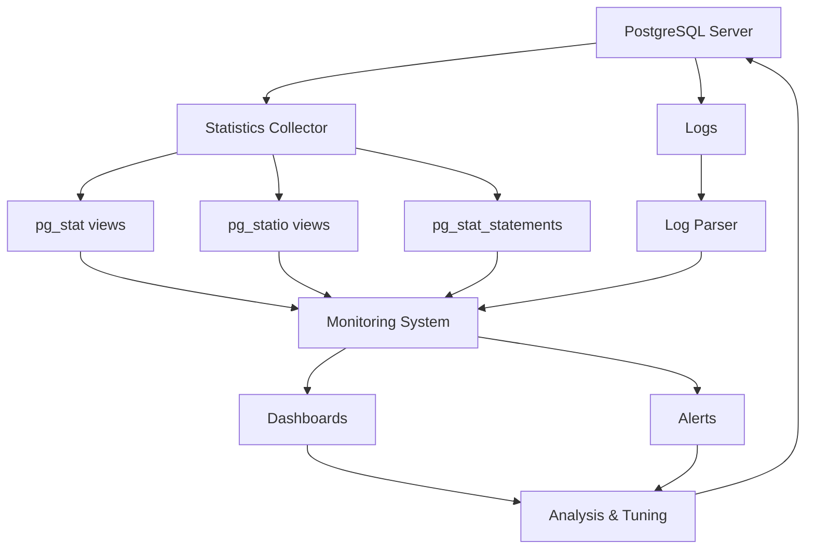

# PostgreSQL Monitoring

## Introduction

Monitoring is a critical aspect of PostgreSQL database administration that ensures your database systems remain healthy, performant, and reliable. By implementing effective monitoring practices, you can identify potential issues before they become serious problems, optimize performance, plan for capacity needs, and maintain high availability for your applications.

In this guide, we'll explore various aspects of PostgreSQL monitoring, from built-in tools to external solutions, helping you establish a comprehensive monitoring strategy for your PostgreSQL deployments.

## Why Monitor PostgreSQL?

Before diving into the tools and techniques, let's understand why monitoring is essential:

- **Performance optimization**: Identify and resolve bottlenecks
- **Capacity planning**: Anticipate resource needs before they become critical
- **Troubleshooting**: Quickly diagnose and resolve issues
- **Security**: Detect suspicious activities and unauthorized access
- **Availability**: Ensure your database meets service level agreements (SLAs)
- **Data integrity**: Verify that backup and recovery mechanisms work correctly

## Key PostgreSQL Metrics to Monitor

Effective monitoring begins with understanding which metrics matter most:

### 1. Connection Metrics

- **Current connections**: The number of active connections
- **Connection utilization**: Percentage of max_connections being used
- **Failed connection attempts**: Potential security issues or application problems

### 2. Database Activity

- **Transactions per second**: Overall database workload
- **Query execution time**: Identify slow queries
- **Cache hit ratio**: Efficiency of buffer cache usage
- **Dead tuples**: Indicate need for VACUUM

### 3. Resource Utilization

- **CPU usage**: Overall system load
- **Memory usage**: Buffer cache and work memory consumption
- **Disk I/O**: Read/write operations and latency
- **Storage space**: Database size growth and available space

### 4. Replication (if applicable)

- **Replication lag**: Delay between primary and replicas
- **WAL generation rate**: Activity level on the primary

## Built-in PostgreSQL Monitoring Tools

PostgreSQL provides several built-in features for monitoring:

### The Statistics Collector

PostgreSQL's statistics collector gathers information about server activity. This data is accessible through various system views:

```sql
-- Check current activity
SELECT * FROM pg_stat_activity;

-- Connection stats
SELECT 
    max_conn,
    used,
    res_for_super,
    max_conn - used - res_for_super AS available
FROM 
    (SELECT count(*) AS used FROM pg_stat_activity) t1,
    (SELECT setting::int AS max_conn FROM pg_settings WHERE name = 'max_connections') t2,
    (SELECT setting::int AS res_for_super FROM pg_settings WHERE name = 'superuser_reserved_connections') t3;
```

### pg_stat Views

PostgreSQL offers numerous statistical views that provide insights into database operations:

```sql
-- Database-wide statistics
SELECT * FROM pg_stat_database WHERE datname = current_database();

-- Table statistics
SELECT 
    schemaname, 
    relname, 
    seq_scan, 
    seq_tup_read, 
    idx_scan, 
    idx_tup_fetch,
    n_tup_ins, 
    n_tup_upd, 
    n_tup_del
FROM 
    pg_stat_user_tables
ORDER BY 
    (seq_scan + idx_scan) DESC
LIMIT 10;

-- Index usage statistics
SELECT 
    schemaname, 
    relname, 
    indexrelname, 
    idx_scan, 
    idx_tup_read, 
    idx_tup_fetch
FROM 
    pg_stat_user_indexes
ORDER BY 
    idx_scan DESC
LIMIT 10;
```

### pg_statio Views

These views provide I/O statistics for tables and indexes:

```sql
-- Check table I/O statistics
SELECT 
    schemaname, 
    relname, 
    heap_blks_read, 
    heap_blks_hit, 
    CASE WHEN heap_blks_read + heap_blks_hit = 0 THEN 0
    ELSE 100 * heap_blks_hit / (heap_blks_read + heap_blks_hit) END AS hit_ratio
FROM 
    pg_statio_user_tables
ORDER BY 
    heap_blks_read + heap_blks_hit DESC
LIMIT 10;
```

### pg_stat_statements

The `pg_stat_statements` extension tracks execution statistics for all SQL statements:

```sql
-- Enable pg_stat_statements (add to postgresql.conf)
-- shared_preload_libraries = 'pg_stat_statements'
-- pg_stat_statements.track = all

-- After restart, create the extension
CREATE EXTENSION pg_stat_statements;

-- Query top 10 time-consuming queries
SELECT 
    query, 
    calls, 
    total_time, 
    total_time / calls AS avg_time,
    rows, 
    100.0 * shared_blks_hit / nullif(shared_blks_hit + shared_blks_read, 0) AS hit_percent
FROM 
    pg_stat_statements
ORDER BY 
    total_time DESC
LIMIT 10;
```

## Using PostgreSQL Logs for Monitoring

PostgreSQL logs provide valuable information for monitoring and troubleshooting:

### Configuring Logging

Edit your `postgresql.conf` to enable useful logging parameters:

```
# Basic settings
log_destination = 'csvlog'
logging_collector = on
log_directory = 'pg_log'
log_filename = 'postgresql-%Y-%m-%d_%H%M%S.log'
log_rotation_age = 1d
log_rotation_size = 100MB

# What to log
log_min_duration_statement = 1000  # Log queries taking more than 1 second
log_checkpoints = on
log_connections = on
log_disconnections = on
log_lock_waits = on
log_temp_files = 0
```

### Analyzing Logs

You can use tools like `pgBadger` to analyze PostgreSQL logs and generate comprehensive reports:

```bash
# Install pgBadger (on Debian/Ubuntu)
sudo apt-get install pgbadger

# Generate a report
pgbadger /var/log/postgresql/postgresql-14-main.log -o report.html
```

## External Monitoring Tools

Several tools can help you monitor PostgreSQL more effectively:

### pgAdmin

pgAdmin provides a user-friendly interface for monitoring and managing PostgreSQL databases:

- Dashboard with key metrics
- Server activity reports
- Query analysis tools

### Prometheus and Grafana

A powerful combination for monitoring and visualizing PostgreSQL metrics:

1. Install the PostgreSQL Prometheus exporter:

```bash
# On Debian/Ubuntu
apt-get install prometheus-postgres-exporter

# Configure the exporter
cat > /etc/default/prometheus-postgres-exporter << EOF
DATA_SOURCE_NAME="host=/var/run/postgresql user=postgres"
EOF

# Start the service
systemctl start prometheus-postgres-exporter
```

2. Configure Prometheus to scrape the PostgreSQL metrics:

```yaml
scrape_configs:
  - job_name: 'postgres'
    static_configs:
      - targets: ['localhost:9187']
```

3. Import a PostgreSQL dashboard in Grafana for visualization.

### Workflow Diagram

Here's a simplified workflow for setting up PostgreSQL monitoring:



## Setting Up Automated Alerts

Monitoring is most effective when paired with alerting. Here's how to set up basic alerts using a simple bash script:

```bash
#!/bin/bash

# Database connection parameters
DB_HOST="localhost"
DB_NAME="postgres"
DB_USER="postgres"

# Alert thresholds
MAX_CONN_THRESHOLD=80  # Percentage of max connections
LONG_RUNNING_THRESHOLD=3600  # Queries running longer than 1 hour
DISK_SPACE_THRESHOLD=90  # Disk usage percentage

# Check connection usage
conn_percent=$(psql -h $DB_HOST -U $DB_USER -d $DB_NAME -t -c "
SELECT 100 * count(*)::float / setting::float 
FROM pg_stat_activity, pg_settings 
WHERE pg_settings.name = 'max_connections'
GROUP BY setting;
")

if (( $(echo "$conn_percent > $MAX_CONN_THRESHOLD" | bc -l) )); then
    echo "ALERT: Connection usage at $conn_percent% (threshold: $MAX_CONN_THRESHOLD%)"
    # Add notification logic (email, Slack, etc.)
fi

# Check for long-running queries
long_queries=$(psql -h $DB_HOST -U $DB_USER -d $DB_NAME -t -c "
SELECT count(*) 
FROM pg_stat_activity 
WHERE state = 'active' 
  AND (now() - query_start) > interval '$LONG_RUNNING_THRESHOLD seconds';
")

if [ $long_queries -gt 0 ]; then
    echo "ALERT: $long_queries queries running longer than $(($LONG_RUNNING_THRESHOLD / 3600)) hour(s)"
    # Add notification logic
fi

# Check disk space
disk_usage=$(df -h /var/lib/postgresql | tail -1 | awk '{print $5}' | sed 's/%//')

if [ $disk_usage -gt $DISK_SPACE_THRESHOLD ]; then
    echo "ALERT: Disk usage at $disk_usage% (threshold: $DISK_SPACE_THRESHOLD%)"
    # Add notification logic
fi
```

Save this script as `pg_monitor.sh`, make it executable (`chmod +x pg_monitor.sh`), and add it to your crontab to run regularly.

## Best Practices for PostgreSQL Monitoring

1. **Start with baselines**: Establish normal performance patterns before setting thresholds

2. **Monitor all layers**: From hardware to queries, ensure comprehensive visibility

3. **Automate responses**: Set up automated actions for common issues:
   ```bash
   # Example: Kill queries running longer than 2 hours
   psql -c "SELECT pg_terminate_backend(pid) FROM pg_stat_activity WHERE state = 'active' AND (now() - query_start) > interval '2 hours';"
   ```

4. **Implement historical tracking**: Store metrics to analyze trends over time

5. **Document your monitoring setup**: Ensure team members understand the monitoring infrastructure

6. **Test your alerts**: Verify that notifications work correctly before you need them

## Practical Example: Identifying and Fixing a Slow Query

Let's walk through a real-world example of using monitoring to identify and fix a performance issue:

1. **Identify the slow query using pg_stat_statements**:

```sql
SELECT query, total_time / calls as avg_time, calls
FROM pg_stat_statements
ORDER BY avg_time DESC
LIMIT 5;
```

Output:
```
                           query                           | avg_time  | calls 
-----------------------------------------------------------+-----------+-------
 SELECT * FROM orders JOIN order_items ON orders.id = ...  | 2536.789  | 1243
 UPDATE inventory SET stock = stock - 1 WHERE product_id...| 1245.678  | 5678
 SELECT * FROM customers WHERE last_purchase < $1          |  897.456  | 3421
 ...
```

2. **Analyze the query execution plan**:

```sql
EXPLAIN ANALYZE SELECT * FROM orders JOIN order_items ON orders.id = order_items.order_id WHERE orders.created_at > '2023-01-01';
```

Output:
```
Nested Loop  (cost=0.00..12345.67 rows=5678 width=123) (actual time=0.123..2345.678 rows=4567 loops=1)
  ->  Seq Scan on orders  (cost=0.00..1234.56 rows=567 width=89) (actual time=0.012..234.567 rows=456 loops=1)
        Filter: (created_at > '2023-01-01'::date)
  ->  Index Scan using order_items_order_id_idx on order_items  (cost=0.00..12.34 rows=10 width=34) (actual time=0.012..0.345 rows=10 loops=456)
        Index Cond: (order_id = orders.id)
Planning Time: 0.123 ms
Execution Time: 2536.789 ms
```

3. **Add missing indexes**:

```sql
CREATE INDEX idx_orders_created_at ON orders(created_at);
```

4. **Verify improvement**:

```sql
EXPLAIN ANALYZE SELECT * FROM orders JOIN order_items ON orders.id = order_items.order_id WHERE orders.created_at > '2023-01-01';
```

Output:
```
Nested Loop  (cost=0.00..1234.56 rows=5678 width=123) (actual time=0.123..234.567 rows=4567 loops=1)
  ->  Index Scan using idx_orders_created_at on orders  (cost=0.00..123.45 rows=567 width=89) (actual time=0.012..23.456 rows=456 loops=1)
        Index Cond: (created_at > '2023-01-01'::date)
  ->  Index Scan using order_items_order_id_idx on order_items  (cost=0.00..12.34 rows=10 width=34) (actual time=0.012..0.345 rows=10 loops=456)
        Index Cond: (order_id = orders.id)
Planning Time: 0.123 ms
Execution Time: 234.567 ms
```

Query execution time reduced from 2536.789ms to 234.567ms, a ~90% improvement!

## Summary

Effective PostgreSQL monitoring is essential for maintaining a healthy database environment. By tracking key metrics, setting up automated alerts, and regularly analyzing performance data, you can ensure your PostgreSQL databases operate efficiently and reliably.

Remember these key points:

- Monitor a variety of metrics across different database aspects
- Use both built-in tools and specialized monitoring solutions
- Establish baselines before setting alert thresholds
- Document your monitoring setup for your team
- Use monitoring data to drive performance optimizations

## Additional Resources

Here are some resources to deepen your PostgreSQL monitoring knowledge:

- PostgreSQL Documentation: [Monitoring Database Activity](https://www.postgresql.org/docs/current/monitoring.html)
- [Practical PostgreSQL Monitoring](https://pganalyze.com/blog/postgresql-monitoring-cheatsheet)
- [Understanding pg_stat_statements](https://www.postgresql.org/docs/current/pgstatstatements.html)

## Exercises

1. Set up pg_stat_statements on your PostgreSQL server and identify the top 5 time-consuming queries.
2. Create a bash script that monitors replication lag and sends an alert when it exceeds 1 minute.
3. Implement a Prometheus and Grafana monitoring stack for your PostgreSQL server.
4. Analyze your PostgreSQL logs with pgBadger and identify any recurring issues.
5. Create a monitoring dashboard that tracks the growth of your largest tables over time.