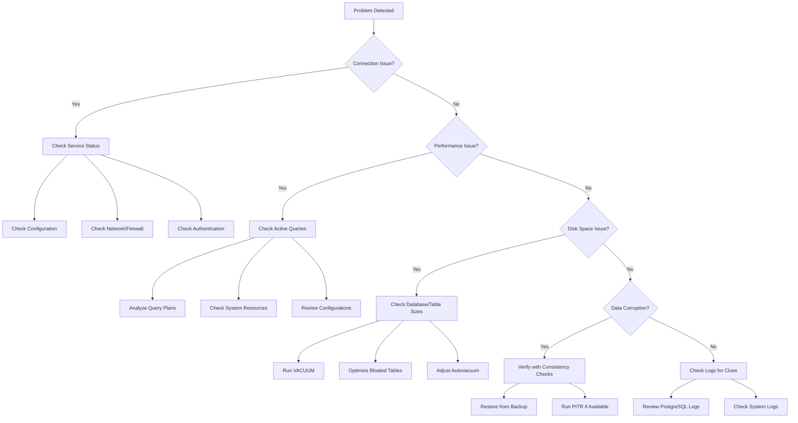

# PostgreSQL Troubleshooting

## Introduction

Even the most well-configured PostgreSQL databases can encounter issues. The ability to quickly identify, diagnose, and resolve problems is an essential skill for any database administrator. This guide will walk you through common PostgreSQL problems and their solutions, providing you with practical troubleshooting techniques to keep your databases running smoothly.

## Connection Issues

Connection problems are among the most common issues PostgreSQL administrators face.

### Issue: Connection Refused

```
psql: error: could not connect to server: Connection refused
    Is the server running on host "localhost" (127.0.0.1) and accepting
    TCP/IP connections on port 5432?
```

**Potential causes and solutions:**

1. **PostgreSQL service is not running**
   
   Check if PostgreSQL is running:

   ```bash
   sudo systemctl status postgresql
   ```

   If not running, start it:

   ```bash
   sudo systemctl start postgresql
   ```

2. **PostgreSQL not listening on expected address**
   
   Check `postgresql.conf` for the `listen_addresses` setting:

   ```bash
   # Verify the current setting
   sudo grep listen_addresses /etc/postgresql/13/main/postgresql.conf
   
   # Update it if needed (to listen on all interfaces)
   listen_addresses = '*'
   ```

3. **Firewall blocking connections**
   
   Allow connections through the firewall:

   ```bash
   sudo ufw allow 5432/tcp
   ```

4. **Client authentication configuration**
   
   Check the `pg_hba.conf` file:

   ```bash
   # Example entry for local connections
   host    all             all             127.0.0.1/32            md5
   ```

### Issue: Authentication Failed

```
psql: error: FATAL: password authentication failed for user "postgres"
```

**Solutions:**

1. **Verify username and password**
   
   Ensure you're using the correct credentials.

2. **Reset PostgreSQL password**

   ```bash
   # Switch to postgres user
   sudo -u postgres psql
   
   # Change password
   ALTER USER postgres WITH PASSWORD 'newpassword';
   ```

## Performance Problems

### Slow Queries

Identify slow queries using the `pg_stat_statements` extension:

1. **Enable the extension**

   ```sql
   CREATE EXTENSION pg_stat_statements;
   ```

2. **Find slow queries**

   ```sql
   SELECT query, calls, total_exec_time, rows, 
          100.0 * total_exec_time / sum(total_exec_time) OVER() AS percent
   FROM pg_stat_statements
   ORDER BY total_exec_time DESC
   LIMIT 10;
   ```

3. **Analyze a problematic query with EXPLAIN ANALYZE**

   ```sql
   EXPLAIN ANALYZE SELECT * FROM large_table WHERE non_indexed_column = 'value';
   ```

4. **Create indexes for better performance**

   ```sql
   CREATE INDEX idx_large_table_column ON large_table(non_indexed_column);
   ```

### High CPU Usage

If PostgreSQL is consuming excessive CPU:

1. **Check for long-running queries**

   ```sql
   SELECT pid, now() - query_start AS duration, query
   FROM pg_stat_activity
   WHERE state = 'active'
   ORDER BY duration DESC;
   ```

2. **Terminate a problematic query if necessary**

   ```sql
   SELECT pg_cancel_backend(pid);  -- Cancel query
   SELECT pg_terminate_backend(pid);  -- Terminate connection
   ```

3. **Optimize database configuration**

   Update `shared_buffers` and `work_mem` in `postgresql.conf`:

   ```
   shared_buffers = 1GB  # 25% of RAM for dedicated servers
   work_mem = 10MB       # Depends on your workload
   ```

## Disk Space Issues

### Database Size Growth

Monitor database and table sizes:

```sql
-- Check database sizes
SELECT pg_database.datname, 
       pg_size_pretty(pg_database_size(pg_database.datname)) AS size
FROM pg_database
ORDER BY pg_database_size(pg_database.datname) DESC;

-- Check table sizes
SELECT relname AS table_name,
       pg_size_pretty(pg_relation_size(relid)) AS table_size
FROM pg_catalog.pg_statio_user_tables
ORDER BY pg_relation_size(relid) DESC;
```

### Solutions for Disk Space Issues

1. **VACUUM to reclaim space**

   ```sql
   -- Basic vacuum
   VACUUM;
   
   -- Aggressive vacuum
   VACUUM FULL;  -- Note: Takes locks and rewrites the whole table
   ```

2. **Identify and remove bloat**

   ```sql
   -- Find bloated tables
   SELECT schemaname, tablename, 
          pg_size_pretty(pg_total_relation_size(schemaname || '.' || tablename)) as total_size,
          pg_size_pretty(pg_relation_size(schemaname || '.' || tablename)) as table_size,
          pg_size_pretty(pg_total_relation_size(schemaname || '.' || tablename) - 
                         pg_relation_size(schemaname || '.' || tablename)) as bloat_size
   FROM pg_tables
   WHERE schemaname NOT IN ('pg_catalog', 'information_schema')
   ORDER BY pg_total_relation_size(schemaname || '.' || tablename) DESC
   LIMIT 10;
   ```

3. **Configure autovacuum properly**

   ```
   # postgresql.conf settings
   autovacuum = on
   autovacuum_vacuum_threshold = 50
   autovacuum_analyze_threshold = 50
   autovacuum_vacuum_scale_factor = 0.1
   autovacuum_analyze_scale_factor = 0.05
   ```

## Data Corruption Issues

### Detecting Corruption

1. **Use pg_dump with verification**

   ```bash
   pg_dump -Fc -v -f backup.dump database_name
   ```

2. **Check table corruption with consistency checks**

   ```sql
   -- Basic check - will return rows if problem exists
   SELECT * FROM my_table WHERE ctid IS NULL;
   ```

### Recovering from Corruption

1. **Use Point-in-Time Recovery (PITR)**

   ```bash
   # Restore from a base backup
   pg_basebackup -D /var/lib/postgresql/13/main/ -U postgres -P -Xs -R
   ```

2. **Restore from backup**

   ```bash
   pg_restore -d database_name backup.dump
   ```

3. **In extreme cases, try to salvage data**

   ```sql
   -- Create a new table with the structure
   CREATE TABLE recovered_table AS 
   SELECT * FROM corrupted_table 
   WHERE ctid IS NOT NULL;
   ```

## Replication Issues

### Replication Lag

Check replication status and lag:

```sql
-- On primary
SELECT client_addr, state, sent_lsn, write_lsn, 
       flush_lsn, replay_lsn, 
       pg_wal_lsn_diff(sent_lsn, replay_lsn) AS lag_bytes
FROM pg_stat_replication;

-- On replica
SELECT now() - pg_last_xact_replay_timestamp() AS replication_lag;
```

### Common Replication Problems and Solutions

1. **Replication slot issues**

   ```sql
   -- Check slots
   SELECT * FROM pg_replication_slots;
   
   -- Create a new slot
   SELECT pg_create_physical_replication_slot('replica_slot_name');
   
   -- Drop an unused slot
   SELECT pg_drop_replication_slot('replica_slot_name');
   ```

2. **WAL files accumulation**

   Check WAL directory size:

   ```bash
   du -sh /var/lib/postgresql/13/main/pg_wal/
   ```

   Adjust `max_wal_size` if needed:

   ```
   max_wal_size = 1GB
   ```

## Transaction ID Wraparound

### Monitoring Transaction ID Usage

```sql
-- Check current transaction ID usage
SELECT datname, age(datfrozenxid) AS xid_age
FROM pg_database
ORDER BY xid_age DESC;
```

### Preventing Wraparound

Run VACUUM FREEZE before reaching critical levels:

```sql
-- Aggressively freeze old XID
VACUUM FREEZE;

-- Check tables needing freeze
SELECT schemaname, relname, n_dead_tup, last_vacuum
FROM pg_stat_all_tables
ORDER BY n_dead_tup DESC;
```

## Troubleshooting Workflow

The following diagram shows a systematic approach to PostgreSQL troubleshooting:



## PostgreSQL Log Analysis

PostgreSQL logs are invaluable for troubleshooting. Find your log file location:

```sql
SHOW log_directory;
SHOW log_filename;
```

Common log levels to check:

```
# in postgresql.conf
log_min_messages = warning
log_min_error_statement = error
log_min_duration_statement = 1000  # log queries taking more than 1 second
```

Common error patterns to look for:

1. `ERROR: deadlock detected`
2. `ERROR: out of memory`
3. `FATAL: terminating connection due to administrator command`
4. `WARNING: transaction ID wraparound`

## Summary

Effective PostgreSQL troubleshooting requires a systematic approach:

1. **Identify the problem** - Use logs, monitoring tools, and user reports
2. **Isolate the cause** - Connection, performance, disk, corruption, or replication issues
3. **Implement a solution** - Apply appropriate fixes based on the root cause
4. **Prevent recurrence** - Update configurations, implement monitoring, and create maintenance procedures

Regular maintenance, monitoring, and a solid backup strategy are the best ways to prevent serious PostgreSQL problems.

## Additional Resources

- [PostgreSQL Official Documentation](https://www.postgresql.org/docs/)
- [PostgreSQL Wiki](https://wiki.postgresql.org/wiki/Main_Page)
- [PostgreSQL Mailing Lists](https://www.postgresql.org/list/)

## Practice Exercises

1. Set up a test PostgreSQL database and intentionally fill the disk to practice handling disk space issues.
2. Create a simple replication setup and practice troubleshooting common replication problems.
3. Write scripts to monitor your PostgreSQL database for common issues and send alerts.
4. Practice performance tuning by analyzing slow queries and implementing optimizations.