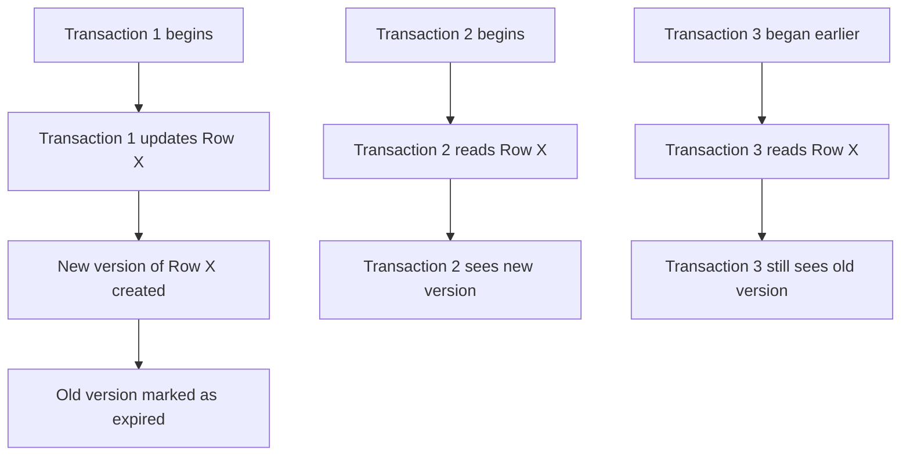

# PostgreSQL Vacuum Process

## Introduction

In PostgreSQL, the VACUUM process is a critical maintenance operation that helps maintain the health and performance of your database. Unlike many other database systems, PostgreSQL uses a process called Multi-Version Concurrency Control (MVCC) to handle concurrent access to data. While MVCC provides numerous benefits for transaction processing, it creates a need for regular cleanup operations—this is where VACUUM comes in.

When you update or delete data in PostgreSQL, the database doesn't immediately reclaim the physical space. Instead, it marks rows as no longer visible to new transactions. Over time, these "dead" rows accumulate and can lead to performance degradation and bloat. The VACUUM process addresses this issue by cleaning up these dead rows and making the space available for reuse.

In this guide, we'll explore how the VACUUM process works, why it's essential, and how to implement effective vacuuming strategies for your PostgreSQL database.

## Understanding MVCC and Table Bloat

Before diving into VACUUM, let's understand why it's necessary by looking at how PostgreSQL handles data modifications.

### Multi-Version Concurrency Control (MVCC)

PostgreSQL uses MVCC to allow multiple transactions to access the database simultaneously without locking each other out. When a row is updated, PostgreSQL doesn't overwrite the original data. Instead:

1. It creates a new version of the row with the updated values
2. It marks the old version as expired (but doesn't delete it)
3. New transactions see only the latest valid version

This diagram illustrates how MVCC works:



### Table Bloat Problem

While MVCC is excellent for concurrency, it leads to a problem called "table bloat":

- Dead rows (expired versions) accumulate in tables
- The table file size grows continuously
- Indexes must track all row versions, even dead ones
- Query performance degrades as the database scans through dead rows

Without regular maintenance, a PostgreSQL database can suffer from:

- Increased disk space usage
- Slower queries and index operations
- Longer backup and restore times
- Higher I/O load for routine operations

## How VACUUM Works

The VACUUM process addresses table bloat by reclaiming storage occupied by dead tuples (rows). Let's explore how it works:

### Basic VACUUM Process

When you run a basic VACUUM command:

1. It scans the specified tables for dead rows
2. It makes the space occupied by dead rows available for reuse by the same table
3. It updates the visibility map and free space map
4. It removes dead row identifiers from indexes

Important note: Basic VACUUM doesn't return disk space to the operating system; it only makes it available for reuse within the same table.

### VACUUM FULL Process

VACUUM FULL is a more aggressive operation that:

1. Creates a new copy of the table without dead rows
2. Drops the old table
3. Renames the new table to the original name
4. Rebuilds all indexes

While VACUUM FULL does return disk space to the operating system, it:
- Requires an exclusive lock on the table
- Can take much longer to complete
- May impact database availability

## Basic VACUUM Commands

Let's look at the basic VACUUM commands you can use:

### Standard VACUUM

```sql
VACUUM table_name;
```

This command reclaims space and makes it available for reuse in the specified table.

### VACUUM with ANALYZE

```sql
VACUUM ANALYZE table_name;
```

This not only vacuums the table but also updates statistics used by the query planner.

### VACUUM FULL

```sql
VACUUM FULL table_name;
```

This rebuilds the table completely, returning disk space to the operating system.

### VACUUM VERBOSE

```sql
VACUUM VERBOSE table_name;
```

This provides detailed information about the vacuum process.

### Example with Output

Here's an example of running VACUUM VERBOSE and its output:

```sql
VACUUM VERBOSE users;
```

Example output:

```
INFO:  vacuuming "public.users"
INFO:  "users": found 1205 removable, 8302 nonremovable row versions in 1000 pages
INFO:  "users": removed 1205 row versions in 984 pages
INFO:  "users": found 215 removable, 98 nonremovable row versions in 47 index pages
INFO:  "users": removed 215 index row versions in 32 pages
INFO:  "users": 0 dead row versions cannot be removed yet, oldest xmin: 15523
INFO:  vacuuming "pg_toast.pg_toast_16385"
INFO:  index "pg_toast_16385_index" now contains 428 row versions in 15 pages
DETAIL:  0 index row versions were removed.
0 index pages have been deleted, 0 are currently reusable.
CPU: user: 0.03 s, system: 0.00 s, elapsed: 0.05 s.
```

## Autovacuum: PostgreSQL's Automated Solution

PostgreSQL includes an autovacuum daemon that runs the VACUUM and ANALYZE processes automatically when needed. This helps maintain database performance without manual intervention.

### How Autovacuum Works

The autovacuum daemon:

1. Wakes up periodically (controlled by `autovacuum_naptime`)
2. Checks tables for vacuum and analyze thresholds
3. Launches worker processes to handle tables that need maintenance
4. Adjusts its behavior based on database activity and configuration settings

### Key Autovacuum Configuration Parameters

Here are important configuration settings for autovacuum:

```sql
-- Check current autovacuum settings
SHOW autovacuum;
SHOW autovacuum_naptime;
SHOW autovacuum_vacuum_threshold;
SHOW autovacuum_analyze_threshold;
SHOW autovacuum_vacuum_scale_factor;
SHOW autovacuum_analyze_scale_factor;
```

Common settings you might adjust in `postgresql.conf`:

```
# Basic autovacuum settings
autovacuum = on                         # Enable autovacuum
autovacuum_naptime = 1min               # Time between runs
autovacuum_max_workers = 3              # Maximum worker processes

# When to vacuum
autovacuum_vacuum_threshold = 50        # Minimum number of row updates
autovacuum_vacuum_scale_factor = 0.2    # Fraction of table size

# When to analyze
autovacuum_analyze_threshold = 50       # Minimum number of row changes
autovacuum_analyze_scale_factor = 0.1   # Fraction of table size

# Performance tuning
autovacuum_vacuum_cost_delay = 20ms     # Vacuum cost delay in milliseconds
autovacuum_vacuum_cost_limit = -1       # Vacuum cost limit (-1 uses vacuum_cost_limit)
```

### Table-Specific Autovacuum Settings

You can also configure autovacuum parameters for specific tables:

```sql
ALTER TABLE users SET (
  autovacuum_vacuum_threshold = 100,
  autovacuum_vacuum_scale_factor = 0.1,
  autovacuum_analyze_threshold = 50,
  autovacuum_analyze_scale_factor = 0.05
);
```

## Monitoring VACUUM Activity

It's important to monitor vacuum operations to ensure they're running efficiently:

### Checking for Bloat

You can use this query to identify tables with significant bloat:

```sql
SELECT
  schemaname,
  tablename,
  ROUND((CASE WHEN n_live_tup > 0
    THEN pg_total_relation_size(relid) / n_live_tup
    ELSE 0
    END)::numeric, 2) AS bytes_per_row,
  pg_size_pretty(pg_total_relation_size(relid)) AS table_size,
  pg_size_pretty(pg_total_relation_size(relid) - 
    pg_relation_size(relid)) AS index_size,
  n_live_tup AS live_rows,
  n_dead_tup AS dead_rows,
  ROUND(n_dead_tup * 100.0 / GREATEST(n_live_tup + n_dead_tup, 1), 2) AS pct_dead
FROM pg_stat_user_tables
WHERE schemaname = 'public'
ORDER BY pct_dead DESC;
```

### Viewing Autovacuum Activity

To see current autovacuum worker activity:

```sql
SELECT datname, usename, pid, state, query, xact_start, query_start
FROM pg_stat_activity
WHERE query LIKE 'autovacuum:%';
```

### Tracking Vacuum Operations

To track when tables were last vacuumed or analyzed:

```sql
SELECT
  schemaname,
  relname,
  last_vacuum,
  last_autovacuum,
  last_analyze,
  last_autoanalyze
FROM pg_stat_user_tables
ORDER BY last_autovacuum DESC NULLS LAST;
```

## Best Practices for VACUUM

Here are some best practices for managing the VACUUM process:

### 1. Size Your Database Server Appropriately

- Ensure sufficient memory for maintenance operations
- Provide enough disk space for temporary bloat during peak times

### 2. Configure Autovacuum Aggressively for Large Tables

For tables with high update/delete rates:

```sql
ALTER TABLE high_churn_table SET (
  autovacuum_vacuum_scale_factor = 0.05,  -- Vacuum after 5% changes
  autovacuum_vacuum_threshold = 1000,     -- Plus at least 1000 rows
  autovacuum_vacuum_cost_delay = 10ms     -- Lower delay for more aggressive vacuum
);
```

### 3. Schedule Manual VACUUM for Maintenance Windows

For very large tables:

```sql
-- Run during low-traffic periods
VACUUM (VERBOSE, ANALYZE) large_table;

-- For critical tables that need more aggressive treatment
VACUUM FULL large_table;
```

### 4. Monitor and Adjust

- Monitor the `pg_stat_user_tables` view regularly
- Watch for tables with high dead tuple counts
- Adjust table-specific settings based on growth patterns

### 5. Prevent Transaction ID Wraparound

Long-running transactions can prevent VACUUM from removing old row versions. Monitor transaction age:

```sql
SELECT datname, age(datfrozenxid) FROM pg_database ORDER BY 2 DESC;
```

If the age approaches 1 billion, consider more aggressive vacuuming.

## Real-World Example: E-commerce Database Maintenance

Let's consider an e-commerce database with tables for products, orders, and order_items. The order_items table has high churn due to frequent insertions and updates.

### Scenario:

- `products` table: Low update frequency
- `orders` table: Moderate update frequency
- `order_items` table: High update/delete frequency

### Implementation Strategy:

1. Set table-specific autovacuum parameters:

```sql
-- Products table has low churn
ALTER TABLE products SET (
  autovacuum_vacuum_scale_factor = 0.2,  -- Default
  autovacuum_vacuum_threshold = 50       -- Default
);

-- Orders table has moderate churn
ALTER TABLE orders SET (
  autovacuum_vacuum_scale_factor = 0.1,
  autovacuum_vacuum_threshold = 100
);

-- Order items table has high churn
ALTER TABLE order_items SET (
  autovacuum_vacuum_scale_factor = 0.05,
  autovacuum_vacuum_threshold = 200,
  autovacuum_vacuum_cost_delay = 5ms     -- More aggressive
);
```

2. Create a monitoring script that runs daily:

```sql
-- Check bloat levels
SELECT tablename, n_live_tup AS live_rows, n_dead_tup AS dead_rows,
  ROUND(n_dead_tup * 100.0 / (n_live_tup + n_dead_tup), 2) AS dead_percentage
FROM pg_stat_user_tables
WHERE schemaname = 'public' AND n_dead_tup > 0
ORDER BY dead_percentage DESC;

-- Check last vacuum times
SELECT relname, last_vacuum, last_autovacuum
FROM pg_stat_user_tables
WHERE schemaname = 'public';
```

3. Schedule a monthly maintenance window for VACUUM FULL on critical tables:

```sql
-- Run during lowest traffic period
VACUUM FULL order_items;
VACUUM FULL orders;
REINDEX TABLE order_items;
REINDEX TABLE orders;
```

## Common VACUUM Issues and Solutions

### Issue 1: Autovacuum Not Running Frequently Enough

**Symptoms:**
- Growing table sizes
- Increasing query times
- High dead tuple counts

**Solution:**
```sql
-- Make autovacuum more aggressive globally
ALTER SYSTEM SET autovacuum_naptime = '30s';
ALTER SYSTEM SET autovacuum_vacuum_scale_factor = 0.1;
ALTER SYSTEM SET autovacuum_max_workers = 6;
SELECT pg_reload_conf();
```

### Issue 2: VACUUM FULL Taking Too Long

**Symptoms:**
- Maintenance operations taking hours
- Table locks preventing access

**Solution:**
Consider using the `pg_repack` extension which can rebuild tables without exclusive locks:

```sql
-- Install the extension
CREATE EXTENSION pg_repack;

-- Repack a table without long locks
pg_repack -t large_table -h localhost -U postgres -d mydb
```

### Issue 3: Transaction ID Wraparound Warnings

**Symptoms:**
- Warnings about transaction ID wraparound
- Messages about database shutdown risk

**Solution:**
```sql
-- Find the problematic tables
SELECT c.oid::regclass as table_name,
       greatest(age(c.relfrozenxid),age(t.relfrozenxid)) as age
FROM pg_class c
LEFT JOIN pg_class t ON c.reltoastrelid = t.oid
WHERE c.relkind IN ('r', 'm')
ORDER BY age DESC LIMIT 10;

-- Aggressive vacuum on those tables
VACUUM FREEZE table_with_old_xids;
```

## Summary

The PostgreSQL VACUUM process is a critical database maintenance function that:

1. Reclaims space from dead rows created by MVCC
2. Prevents database bloat and performance degradation
3. Updates statistics for the query planner
4. Prevents transaction ID wraparound failures

Effective vacuum management involves:
- Understanding how MVCC creates table bloat
- Configuring autovacuum appropriately for your database
- Setting table-specific parameters based on update patterns
- Monitoring bloat and vacuum effectiveness
- Scheduling manual operations for problem tables

By implementing a proper vacuum strategy, you can ensure your PostgreSQL database maintains optimal performance and efficiency over time.

## Additional Resources

- [PostgreSQL Documentation: Routine Vacuuming](https://www.postgresql.org/docs/current/routine-vacuuming.html)
- [PostgreSQL Wiki: Autovacuum](https://wiki.postgresql.org/wiki/Tuning_Your_PostgreSQL_Server)
- Command reference: `man pg_vacuum` on your PostgreSQL server

## Exercises

1. Check your PostgreSQL database for the top 5 tables with the highest percentage of dead rows.
2. Configure custom autovacuum settings for your most frequently updated table.
3. Create a monitoring script that alerts you when any table has more than 20% dead rows.
4. Develop a vacuum strategy for a hypothetical application with tables of varying update frequencies.
5. Experiment with different `autovacuum_vacuum_scale_factor` values and observe the impact on database performance.