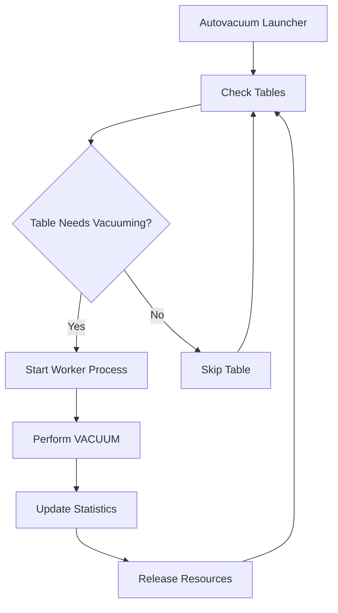

# PostgreSQL Autovacuum

## Introduction

PostgreSQL's autovacuum is an automated maintenance process that keeps your database healthy and performant by reclaiming storage space and updating statistics. Without proper vacuuming, PostgreSQL databases can suffer from bloat, degraded query performance, and in extreme cases, transaction ID wraparound failures.

In this guide, we'll explore:
- What vacuum and autovacuum do
- Why regular vacuuming is critical
- How to configure autovacuum for optimal performance
- Best practices for monitoring and troubleshooting

## Understanding VACUUM in PostgreSQL

### The MVCC Model and Dead Tuples

PostgreSQL uses a Multi-Version Concurrency Control (MVCC) model that creates new versions of rows when data is updated or deleted, rather than overwriting the existing data. This approach provides several benefits:

- Readers don't block writers and vice versa
- Consistent views of data for transactions
- Support for point-in-time recovery

However, this design has a cost: when you update or delete rows, PostgreSQL doesn't immediately reclaim the space. Instead, the old versions (called "dead tuples") remain in the table until a VACUUM operation removes them.

Let's see what happens when we update data:

```sql
-- Create a sample table
CREATE TABLE employee (
  id SERIAL PRIMARY KEY,
  name TEXT,
  department TEXT
);

-- Insert some data
INSERT INTO employee (name, department) VALUES ('Alice', 'Engineering');
INSERT INTO employee (name, department) VALUES ('Bob', 'Marketing');

-- Update a row
UPDATE employee SET department = 'Product' WHERE name = 'Alice';
```

After the UPDATE statement, PostgreSQL creates a new tuple for Alice in the 'Product' department, but the old tuple showing Alice in 'Engineering' still exists as a dead tuple.

### The VACUUM Process

The VACUUM process performs several critical maintenance tasks:

1. Removes dead tuples, making their space available for reuse
2. Updates the visibility map to optimize index-only scans
3. Updates the free space map to help with space allocation

A basic VACUUM command looks like this:

```sql
VACUUM employee;
```

For more intensive cleaning, you can use:

```sql
VACUUM FULL employee;
```

⚠️ **Note**: `VACUUM FULL` rewrites the entire table to a new disk file, removing all dead space. This requires an exclusive lock on the table and can take a long time for large tables.

## Introducing Autovacuum

Rather than manually running VACUUM commands, PostgreSQL provides the autovacuum daemon to automate this maintenance. The autovacuum daemon consists of:

1. **Launcher process**: Starts worker processes
2. **Worker processes**: Perform the actual VACUUM and ANALYZE operations

### How Autovacuum Works

Autovacuum periodically checks each table to determine if vacuuming is needed based on several factors:

1. The number of tuples inserted, updated, or deleted since the last vacuum
2. The percentage of dead tuples relative to the total tuples in the table
3. The risk of transaction ID wraparound

When a table meets the criteria for vacuuming, an autovacuum worker process runs VACUUM on that table.

Let's visualize the autovacuum process:



## Configuring Autovacuum

PostgreSQL provides several configuration parameters to control autovacuum behavior.

### Basic Configuration Parameters

Here are the key parameters in `postgresql.conf`:

```
# Enable/disable autovacuum (should almost always be on)
autovacuum = on

# Number of autovacuum workers
autovacuum_max_workers = 3

# Seconds to sleep between autovacuum runs
autovacuum_naptime = 1min

# Minimum number of tuple updates before vacuum
autovacuum_vacuum_threshold = 50

# Minimum number of tuple updates before analyze
autovacuum_analyze_threshold = 50

# Fraction of table size to add to vacuum threshold
autovacuum_vacuum_scale_factor = 0.2

# Fraction of table size to add to analyze threshold
autovacuum_analyze_scale_factor = 0.1
```

### Understanding Vacuum Thresholds

The autovacuum daemon decides to vacuum a table when:

```
Dead tuples > vacuum_threshold + vacuum_scale_factor * total_tuples
```

For example, with default settings, a table with 1,000 tuples would be vacuumed when:

```
Dead tuples > 50 + 0.2 * 1,000 = 250 dead tuples
```

This means the table would be vacuumed when more than 25% of its tuples are dead.

### Table-Specific Configuration

You can also set autovacuum parameters for specific tables:

```sql
ALTER TABLE employee SET (
  autovacuum_vacuum_threshold = 100,
  autovacuum_vacuum_scale_factor = 0.1,
  autovacuum_analyze_threshold = 100,
  autovacuum_analyze_scale_factor = 0.05
);
```

This is useful for tables with different usage patterns—some tables might need more frequent vacuuming than others.

## Real-World Examples

### Scenario 1: High-Update Tables

For tables with frequent updates, like session or logging tables, you may want more aggressive vacuuming:

```sql
-- For a session table with high update frequency
ALTER TABLE user_sessions SET (
  autovacuum_vacuum_threshold = 1000,
  autovacuum_vacuum_scale_factor = 0.05,
  autovacuum_vacuum_cost_limit = 1000
);
```

This configuration will trigger vacuuming when 5% of the tuples are dead, plus the base threshold of 1,000 tuples. The higher cost limit allows autovacuum to do more work per run.

### Scenario 2: Large, Relatively Static Tables

For large tables that don't change much, you might want less frequent vacuuming:

```sql
-- For a large historical data table
ALTER TABLE historical_data SET (
  autovacuum_vacuum_threshold = 5000,
  autovacuum_vacuum_scale_factor = 0.3,
  autovacuum_vacuum_cost_delay = 20ms
);
```

### Scenario 3: Preventing Transaction ID Wraparound

Transaction ID wraparound is a serious issue that can cause database downtime. To prevent it, you need to ensure your tables are regularly vacuumed:

```sql
-- Check for tables at risk of wraparound
SELECT 
  relname, 
  age(relfrozenxid) AS xid_age,
  2^31 - age(relfrozenxid) AS remaining_xids
FROM pg_class
WHERE relkind = 'r'
ORDER BY xid_age DESC
LIMIT 20;

-- Force vacuum on a critical table
VACUUM FREEZE critical_table;
```

## Monitoring Autovacuum

PostgreSQL provides several ways to monitor autovacuum activity.

### View Current Autovacuum Operations

To see currently running autovacuum processes:

```sql
SELECT pid, datname, usename, query, state, wait_event_type, wait_event
FROM pg_stat_activity
WHERE query LIKE 'autovacuum:%';
```

### Check Vacuum Statistics

To check when tables were last vacuumed or analyzed:

```sql
SELECT relname, last_vacuum, last_autovacuum, last_analyze, last_autoanalyze
FROM pg_stat_user_tables;
```

### Check Table Bloat

This query estimates table bloat:

```sql
SELECT
  schemaname,
  relname,
  n_live_tup,
  n_dead_tup,
  n_dead_tup::float / NULLIF(n_live_tup + n_dead_tup, 0) * 100 AS dead_percentage
FROM pg_stat_user_tables
ORDER BY n_dead_tup DESC
LIMIT 10;
```

## Best Practices for Autovacuum

### Tuning for Different Table Sizes

The default autovacuum settings work well for medium-sized tables but need adjustment for very large or very small tables:

- **For large tables** (10M+ rows): Use lower `scale_factor` values (0.01-0.05)
- **For small tables** (< 10K rows): Use higher `threshold` values

```sql
-- For a very large table
ALTER TABLE large_table SET (
  autovacuum_vacuum_scale_factor = 0.01,
  autovacuum_vacuum_threshold = 5000
);

-- For a small table
ALTER TABLE small_table SET (
  autovacuum_vacuum_scale_factor = 0.4,
  autovacuum_vacuum_threshold = 100
);
```

### Resource Management

Autovacuum can impact database performance if not properly tuned. Some parameters to consider:

```
# Control how aggressively autovacuum works
autovacuum_vacuum_cost_limit = 200
autovacuum_vacuum_cost_delay = 20ms

# Number of simultaneous worker processes
autovacuum_max_workers = 3
```

For critical production databases, consider setting maintenance windows:

```sql
-- Create a scheduled maintenance function
CREATE OR REPLACE FUNCTION maintenance_vacuum()
RETURNS void AS $$
BEGIN
  -- More aggressive vacuum during maintenance window
  SET autovacuum_vacuum_cost_limit TO 2000;
  
  -- Vacuum specific tables
  VACUUM ANALYZE critical_table1;
  VACUUM ANALYZE critical_table2;
  
  -- Reset to normal settings
  RESET autovacuum_vacuum_cost_limit;
END;
$$ LANGUAGE plpgsql;
```

## Common Issues and Solutions

### Autovacuum Not Keeping Up

If dead tuples are accumulating despite autovacuum being enabled:

1. Increase `autovacuum_max_workers`
2. Decrease `autovacuum_vacuum_scale_factor`
3. Increase `autovacuum_vacuum_cost_limit`

```sql
-- In postgresql.conf
autovacuum_max_workers = 6
autovacuum_vacuum_scale_factor = 0.05
autovacuum_vacuum_cost_limit = 1000
```

### Long-Running Vacuums

If vacuum operations take too long:

1. Consider running manual `VACUUM` during off-peak hours
2. Increase `maintenance_work_mem` to improve vacuum performance
3. Consider partitioning large tables

```sql
-- Increase memory for vacuum operations
SET maintenance_work_mem = '1GB';

-- Then vacuum
VACUUM ANALYZE large_table;
```

### Excessive Table Bloat

If tables still experience bloat despite regular vacuuming:

1. Run a manual `VACUUM FULL` during a maintenance window
2. Consider table partitioning for very large tables
3. Implement a data archiving strategy

## Summary

PostgreSQL's autovacuum is an essential maintenance feature that prevents database bloat, maintains performance, and prevents transaction ID wraparound. Key takeaways:

1. Autovacuum should almost always be enabled
2. Default settings work for most databases, but high-traffic or large tables need custom tuning
3. Monitor vacuum activity and table bloat regularly
4. Set table-specific parameters for tables with special needs
5. Plan for occasional manual maintenance during off-peak hours

Understanding and properly configuring autovacuum will help maintain the health and performance of your PostgreSQL databases, reducing unexpected downtime and performance issues.

## Additional Resources

- [PostgreSQL Documentation: Routine Vacuuming](https://www.postgresql.org/docs/current/routine-vacuuming.html)
- [PostgreSQL Documentation: Autovacuum](https://www.postgresql.org/docs/current/runtime-config-autovacuum.html)

## Exercises

1. Check your database for tables with high dead tuple counts:
```sql
SELECT relname, n_dead_tup, n_live_tup 
FROM pg_stat_user_tables
ORDER BY n_dead_tup DESC
LIMIT 10;
```

2. Configure custom autovacuum settings for a table with frequent updates:
```sql
ALTER TABLE frequently_updated_table SET (
  autovacuum_vacuum_scale_factor = 0.05,
  autovacuum_vacuum_threshold = 1000
);
```

3. Monitor autovacuum activity for a day and record which tables are vacuumed most often.

4. Calculate the appropriate autovacuum settings for a table with 100 million rows that receives approximately 1 million updates per day.