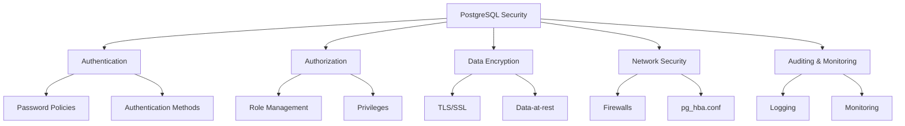

# PostgreSQL Security

PostgreSQL is one of the world's most advanced open-source relational database systems. Like any database, properly securing your PostgreSQL installation is crucial to protect your data from unauthorized access, corruption, or loss.

## Introduction

Database security is a critical aspect of any application infrastructure. PostgreSQL offers robust security features that, when properly configured, provide strong protection for your data. This guide will walk you through the essential security concepts and practices for PostgreSQL databases.



## Authentication: Controlling Access to Your Database

Authentication is the process of verifying the identity of clients attempting to connect to your database.

### Client Authentication Configuration

PostgreSQL manages client authentication through the Host-Based Authentication (HBA) configuration file: `pg_hba.conf`. This file controls which hosts can connect to which databases, which users can connect, and what authentication methods they must use.

Here's a basic structure of entries in the `pg_hba.conf` file:

```
# TYPE  DATABASE  USER  ADDRESS      METHOD
local   all       all                md5
host    all       all   127.0.0.1/32 md5
host    all       all   ::1/128      md5
```

Let's examine each field:

- **TYPE**: Connection type (local, host, hostssl, hostnossl)
- **DATABASE**: Database name(s) this rule applies to
- **USER**: Username(s) this rule applies to
- **ADDRESS**: Client IP address/range (for host, hostssl, hostnossl types)
- **METHOD**: Authentication method (md5, scram-sha-256, trust, reject, etc.)

### Authentication Methods

PostgreSQL supports several authentication methods:

1. **Trust**: No password required (dangerous in production!)
2. **Password-based**:
   - **md5**: MD5-hashed password authentication
   - **scram-sha-256**: More secure password authentication (recommended)
   - **password**: Plain-text passwords (avoid using!)
3. **External Services**:
   - **LDAP**: Authenticate against an LDAP directory
   - **RADIUS**: Remote Authentication Dial-In User Service
   - **PAM**: Pluggable Authentication Modules
4. **System-level**:
   - **ident**: Uses operating system user names
   - **peer**: Similar to ident but for local connections
5. **Other**:
   - **cert**: SSL certificate authentication
   - **gss**: GSSAPI authentication

Example configuration with different methods:

```
# TYPE  DATABASE  USER      ADDRESS        METHOD
local   all       postgres                 peer
local   all       all                      scram-sha-256
host    all       all       10.0.0.0/24    scram-sha-256
host    replication replica  192.168.1.100/32  md5
hostssl prod      app_user  0.0.0.0/0      cert
```

### Setting Up Password Policies

Although PostgreSQL doesn't have built-in password policy enforcement, you can implement policies through extensions or application logic. For example, using the `passwordcheck` extension:

```sql
-- Load the passwordcheck extension
CREATE EXTENSION IF NOT EXISTS passwordcheck;

-- Now passwords will be checked against the policy
```

This extension checks that passwords:
- Are at least 8 characters long
- Contain both letters and numbers
- Are not the same as the username

## Authorization: Managing User Access

Once users are authenticated, authorization controls what they can do within the database.

### Role-Based Access Control

PostgreSQL uses roles for authorization. A role can be a user (can log in) or a group (cannot log in).

```sql
-- Create a login role (user)
CREATE ROLE app_user WITH LOGIN PASSWORD 'secure_password';

-- Create a group role
CREATE ROLE read_only;

-- Grant the read_only role to app_user
GRANT read_only TO app_user;
```

### Privilege Management

PostgreSQL lets you control what actions roles can perform on database objects:

```sql
-- Grant SELECT privilege on all tables in schema public to read_only role
GRANT SELECT ON ALL TABLES IN SCHEMA public TO read_only;

-- Grant INSERT and UPDATE on specific table to app_user
GRANT INSERT, UPDATE ON customer_data TO app_user;

-- Revoke DELETE privilege
REVOKE DELETE ON customer_data FROM app_user;
```

### Row-Level Security (RLS)

PostgreSQL supports row-level security policies to restrict which rows users can see or modify:

```sql
-- Enable row-level security on a table
ALTER TABLE customer_data ENABLE ROW LEVEL SECURITY;

-- Create a policy that users can only see their own organization's data
CREATE POLICY org_isolation ON customer_data
    USING (org_id = current_setting('app.current_org_id')::integer);
```

Example of setting the context variable before querying:

```sql
-- Set the organization context for the current session
SET app.current_org_id = '42';

-- Now queries will only return rows where org_id = 42
SELECT * FROM customer_data;
```

## Data Encryption

Protecting data both in transit and at rest is essential for comprehensive security.

### SSL/TLS Configuration

To encrypt connections between clients and the server:

1. Generate or obtain SSL certificates
2. Configure `postgresql.conf`:

```
ssl = on
ssl_cert_file = 'server.crt'
ssl_key_file = 'server.key'
ssl_ca_file = 'root.crt'  # If using your own CA
```

3. Force SSL for specific connections in `pg_hba.conf`:

```
# TYPE  DATABASE  USER  ADDRESS      METHOD
hostssl all       all   0.0.0.0/0    scram-sha-256
```

### Data-at-Rest Encryption

PostgreSQL doesn't include built-in encryption for data at rest. Consider these approaches:

1. **File system-level encryption**: Use encrypted file systems like LUKS (Linux), BitLocker (Windows), or FileVault (macOS).

2. **Transparent Data Encryption (TDE)**: Use extensions like `pgcrypto` for column-level encryption:

```sql
-- Install pgcrypto extension
CREATE EXTENSION IF NOT EXISTS pgcrypto;

-- Create a table with an encrypted column
CREATE TABLE sensitive_data (
    id SERIAL PRIMARY KEY,
    name TEXT,
    ssn TEXT,
    credit_card_encrypted BYTEA
);

-- Insert encrypted data
INSERT INTO sensitive_data (name, ssn, credit_card_encrypted)
VALUES (
    'John Doe',
    '123-45-6789',
    pgp_sym_encrypt('4111-1111-1111-1111', 'encryption_key')
);

-- Query encrypted data
SELECT 
    name,
    ssn,
    pgp_sym_decrypt(credit_card_encrypted, 'encryption_key') AS credit_card
FROM sensitive_data;
```

## Network Security

Protecting network access to your PostgreSQL server is a critical layer of defense.

### Restricting Network Access

1. **Configure `postgresql.conf` for network listening**:

```
listen_addresses = 'localhost'    # Listen only on localhost
# or
listen_addresses = '192.168.1.100'  # Listen on specific IP
# or
listen_addresses = '*'            # Listen on all interfaces (use with caution)
```

2. **Set up firewall rules** to restrict access to PostgreSQL port (default: 5432)

Example for UFW on Ubuntu:

```bash
sudo ufw allow from 192.168.1.0/24 to any port 5432
```

Example for iptables:

```bash
sudo iptables -A INPUT -p tcp -s 192.168.1.0/24 --dport 5432 -j ACCEPT
sudo iptables -A INPUT -p tcp --dport 5432 -j DROP
```

## Auditing and Monitoring

Regular auditing and monitoring help detect suspicious activities and ensure compliance with security policies.

### Configuring Logging

In `postgresql.conf`, enable logging for security-relevant events:

```
log_destination = 'csvlog'
logging_collector = on
log_directory = 'pg_log'
log_filename = 'postgresql-%Y-%m-%d_%H%M%S.log'

# What to log
log_connections = on
log_disconnections = on
log_duration = on
log_statement = 'ddl'        # Log data definition changes
log_min_error_statement = warning
log_line_prefix = '%m [%p] %q%u@%d '
```

### Monitoring for Suspicious Activity

Set up monitoring to detect:
- Failed login attempts
- Unusual query patterns
- Access to sensitive tables
- Schema changes

Example query to check for failed login attempts:

```sql
SELECT 
    to_timestamp(extract(epoch from log_time)::int) AS time,
    client_addr,
    substring(message from 'user "(.+?)"') AS username,
    message
FROM 
    postgresql_log
WHERE 
    message LIKE 'password authentication failed%'
ORDER BY 
    log_time DESC;
```

## Best Practices and Security Checklist

Use this checklist to ensure your PostgreSQL deployment is secure:

1. **Authentication**
   - [ ] Use strong authentication methods (scram-sha-256 preferred)
   - [ ] Implement strict password policies
   - [ ] Limit superuser access
   - [ ] Regularly rotate passwords

2. **Authorization**
   - [ ] Apply principle of least privilege
   - [ ] Use role-based access control
   - [ ] Implement row-level security for multi-tenant data
   - [ ] Regularly audit role permissions

3. **Encryption**
   - [ ] Enable SSL/TLS for all connections
   - [ ] Use strong TLS protocols (TLSv1.2+ only)
   - [ ] Implement encryption for sensitive columns
   - [ ] Use encrypted backups

4. **Network Security**
   - [ ] Restrict network access using pg_hba.conf
   - [ ] Use firewalls to limit access to PostgreSQL port
   - [ ] Consider using a VPN or SSH tunneling for remote access
   - [ ] Keep PostgreSQL behind application servers, not exposed directly

5. **Monitoring and Maintenance**
   - [ ] Enable comprehensive logging
   - [ ] Set up alerts for suspicious activities
   - [ ] Keep PostgreSQL updated with security patches
   - [ ] Perform regular security audits

6. **Additional Protection**
   - [ ] Use connection pooling to mitigate DoS attacks
   - [ ] Implement rate limiting
   - [ ] Consider using a Web Application Firewall for database-accessing applications

## Common Security Issues and Fixes

### Issue: Default or Weak Passwords

**Fix**: Enforce strong passwords and change defaults immediately

```sql
ALTER ROLE postgres WITH PASSWORD 'complex_unique_password';
```

### Issue: Too Permissive pg_hba.conf

**Fix**: Restrict access in pg_hba.conf

```
# Replace this line
host    all     all     0.0.0.0/0       md5

# With more restrictive lines
host    app_db  app_user  10.0.1.0/24   scram-sha-256
host    all     all       127.0.0.1/32  scram-sha-256
```

### Issue: Exposed PostgreSQL Server on Internet

**Fix**: Use a jump server, VPN, or SSH tunnel for remote access

SSH tunnel example:

```bash
ssh -L 5432:localhost:5432 user@db-server
```

Then connect to `localhost:5432` from your local machine.

## Summary

Implementing proper security measures for your PostgreSQL database is essential to protect your data. By following the principles of authentication, authorization, encryption, and regular monitoring, you can significantly reduce security risks. Remember that security is not a one-time setup but an ongoing process requiring regular updates, audits, and improvements.

## Exercises

1. Set up a PostgreSQL database with password authentication and create roles with different permission levels.
2. Configure SSL/TLS on your PostgreSQL server and test secure connections.
3. Implement row-level security on a table to restrict data access based on user roles.
4. Write a script to monitor and alert on suspicious database activities.
5. Perform a security audit on an existing PostgreSQL installation and create a remediation plan.

## Additional Resources

- [PostgreSQL Official Documentation on Security](https://www.postgresql.org/docs/current/security.html)
- [OWASP Database Security Cheat Sheet](https://cheatsheetseries.owasp.org/cheatsheets/Database_Security_Cheat_Sheet.html)
- [Center for Internet Security (CIS) PostgreSQL Benchmark](https://www.cisecurity.org/benchmark/postgresql/)
- [Practical PostgreSQL Security](https://wiki.postgresql.org/wiki/Security)