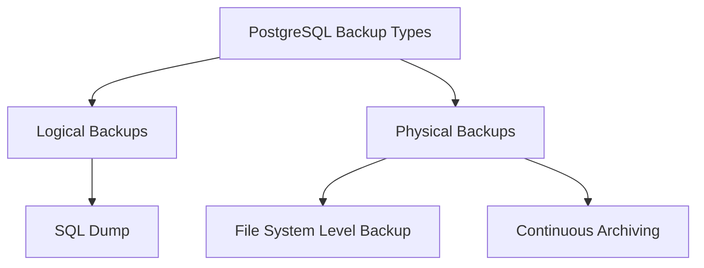

# PostgreSQL Backup Recovery

Database backups are a critical aspect of any robust database management strategy. No matter how reliable your hardware or how skilled your team, data loss can occur due to human errors, hardware failures, software bugs, or even natural disasters. In this guide, we'll explore PostgreSQL backup and recovery techniques to help you protect your valuable data.

## Introduction to PostgreSQL Backup and Recovery

PostgreSQL, as an enterprise-grade database system, provides several built-in mechanisms for creating backups and restoring data. Understanding these options and implementing a solid backup strategy can save you from catastrophic data loss.

### Why Backups Are Essential

- **Disaster Recovery**: Recover from hardware failures, corrupted data, or catastrophic events
- **Human Error Protection**: Restore data after accidental deletions or modifications
- **Point-in-Time Recovery**: Return to a specific moment in database history
- **Data Migration**: Move data between servers or environments
- **Testing and Development**: Create copies of production data for testing purposes

## PostgreSQL Backup Types

There are two fundamental approaches to backing up a PostgreSQL database:



### Logical Backups

Logical backups consist of SQL statements that, when executed, recreate the database objects and data. The primary tool for creating logical backups in PostgreSQL is `pg_dump`.

#### Using pg_dump

`pg_dump` is a utility that generates a file containing SQL commands to recreate a database:

```bash
# Basic backup of a database to a file
pg_dump mydb > mydb_backup.sql

# Create a compressed backup
pg_dump -Fc mydb > mydb_backup.dump

# Backup a single table
pg_dump -t mytable mydb > mytable_backup.sql
```

For backing up multiple databases, you can use `pg_dumpall`:

```bash
# Backup all databases
pg_dumpall > all_databases.sql
```

#### Output Formats

`pg_dump` supports several output formats:

- **Plain Text** (`-F p` or default): Creates an SQL script file
- **Custom** (`-F c`): Creates a compressed file that can be used with `pg_restore`
- **Directory** (`-F d`): Creates a directory with one file per table/object
- **TAR** (`-F t`): Creates a TAR archive suitable for input to `pg_restore`

### Physical Backups

Physical backups involve copying the actual data files that PostgreSQL uses to store the database.

#### File System Level Backup

This approach involves creating a copy of the PostgreSQL data directory:

```bash
# Stop PostgreSQL server
systemctl stop postgresql

# Create a copy of the data directory
tar -cf backup.tar /var/lib/postgresql/data

# Restart PostgreSQL server
systemctl start postgresql
```

:::caution
The database must be shut down during a file system level backup to ensure consistency, unless you use filesystem snapshotting technology that can capture a consistent image while the database is running.
:::

#### Continuous Archiving and Point-in-Time Recovery (PITR)

This method combines a base backup with Write-Ahead Log (WAL) archiving:

1. Configure WAL archiving in `postgresql.conf`:

```
wal_level = replica
archive_mode = on
archive_command = 'cp %p /path/to/archive/%f'
```

2. Create a base backup:

```bash
pg_basebackup -D /backup/path -Ft -z
```

3. PostgreSQL continuously archives WAL files, allowing recovery to any point in time.

## Backup Strategy Best Practices

A robust PostgreSQL backup strategy typically includes:

1. **Regular Full Backups**: Daily or weekly depending on data change frequency
2. **Continuous WAL Archiving**: For point-in-time recovery capability
3. **Backup Verification**: Regularly test restores to ensure backups are valid
4. **Offsite Storage**: Keep copies of backups in multiple physical locations
5. **Backup Retention Policy**: Define how long to keep different types of backups

## PostgreSQL Recovery Techniques

Now let's explore how to recover your data from the various backup types.

### Recovering from Logical Backups

#### Restoring from pg_dump Output

For plain text format backups:

```bash
# Create a new database if needed
createdb newdb

# Restore from the SQL file
psql newdb < mydb_backup.sql
```

For custom, directory, or tar formats, use `pg_restore`:

```bash
# Restore from a custom format dump
pg_restore -d newdb mydb_backup.dump

# Restore specific tables only
pg_restore -d newdb -t mytable mydb_backup.dump

# List the contents of a backup file
pg_restore -l mydb_backup.dump
```

### Recovering from Physical Backups

#### File System Level Backup Recovery

1. Stop the PostgreSQL server
2. Replace the data directory with the backup copy
3. Start the PostgreSQL server

```bash
# Stop PostgreSQL
systemctl stop postgresql

# Extract the backup to the data directory
tar -xf backup.tar -C /

# Start PostgreSQL
systemctl start postgresql
```

#### Point-in-Time Recovery (PITR)

1. Create a `recovery.conf` file in the data directory:

```
restore_command = 'cp /path/to/archive/%f %p'
recovery_target_time = '2023-03-15 14:30:00'
```

2. Start the PostgreSQL server, which will enter recovery mode and restore to the specified point in time.

## Real-World Scenarios

Let's examine some common scenarios and how to handle them:

### Scenario 1: Accidental Table Deletion

Imagine a developer accidentally runs `DROP TABLE customers;` in production.

**Solution**:

```bash
# Restore just the customers table from backup
pg_restore -d mydb -t customers mydb_backup.dump
```

### Scenario 2: Database Corruption

If your database becomes corrupted due to hardware failure:

**Solution**:

1. Stop PostgreSQL
2. Restore the most recent base backup
3. Configure PITR to recover all changes up to the corruption point
4. Start PostgreSQL to begin recovery

### Scenario 3: Regular Development Database Refresh

To create a copy of production data for the development environment:

**Solution**:

```bash
# Create a backup of production
pg_dump -Fc production_db > prod_backup.dump

# Restore to development, cleaning the database first
dropdb dev_db
createdb dev_db
pg_restore -d dev_db prod_backup.dump
```

## Automating Backups

Here's a simple bash script to automate daily backups:

```bash
#!/bin/bash

# Configuration
DB_NAME="mydb"
BACKUP_DIR="/backup/postgresql"
DATE=$(date +%Y-%m-%d)
RETENTION_DAYS=30

# Create backup directory if it doesn't exist
mkdir -p $BACKUP_DIR

# Create backup
pg_dump -Fc $DB_NAME > $BACKUP_DIR/$DB_NAME-$DATE.dump

# Remove old backups
find $BACKUP_DIR -name "*.dump" -mtime +$RETENTION_DAYS -delete

# Log completion
echo "Backup completed: $BACKUP_DIR/$DB_NAME-$DATE.dump" >> $BACKUP_DIR/backup.log
```

Save this script as `pg_backup.sh` and schedule it with cron:

```bash
# Run backup daily at 2 AM
0 2 * * * /path/to/pg_backup.sh
```

## Monitoring and Verifying Backups

It's crucial to verify that your backups are working correctly:

```bash
# Create a test database
createdb test_restore

# Attempt to restore the backup
pg_restore -d test_restore latest_backup.dump

# Run some validation queries
psql test_restore -c "SELECT count(*) FROM users;"

# Drop the test database
dropdb test_restore
```

## Summary

PostgreSQL offers a variety of backup and recovery options to suit different needs:

- **Logical backups** with `pg_dump` are flexible and allow for selective restoration
- **Physical backups** provide faster recovery for large databases
- **Continuous archiving** enables point-in-time recovery capabilities

A comprehensive backup strategy should include regular full backups, WAL archiving, verification procedures, and offsite storage. By implementing these practices, you can ensure your PostgreSQL databases remain protected against data loss.

## Further Resources

To deepen your understanding of PostgreSQL backup and recovery:

- [PostgreSQL Documentation on Backup and Restore](https://www.postgresql.org/docs/current/backup.html)
- [PostgreSQL Continuous Archiving](https://www.postgresql.org/docs/current/continuous-archiving.html)
- [Barman: Backup and Recovery Manager for PostgreSQL](https://pgbarman.org/)

## Exercises

1. Set up a test PostgreSQL database and practice creating backups using different formats of `pg_dump`.
2. Create a bash script that performs a backup and verifies its integrity by restoring to a test database.
3. Configure WAL archiving on a test database and practice performing a point-in-time recovery.
4. Design a backup strategy for a hypothetical application with specific recovery time objectives (RTO) and recovery point objectives (RPO).
5. Research and compare third-party PostgreSQL backup tools like Barman and pgBackRest.