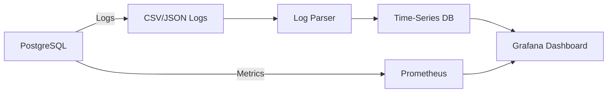

# PostgreSQL Logging

## Introduction

Logging is a critical aspect of database administration that provides insights into database operations, helps troubleshoot issues, and ensures the security and performance of your PostgreSQL database. In this guide, we'll explore how PostgreSQL's logging system works, how to configure it effectively, and how to use logs to maintain a healthy database environment.

PostgreSQL offers a robust and highly customizable logging system that can record various types of information, from simple connection attempts to detailed query execution data. Whether you're a database administrator troubleshooting performance issues or a developer trying to understand database behavior, mastering PostgreSQL's logging capabilities is essential.

## Why Database Logging Matters

Before diving into the technical details, let's understand why logging is crucial for database management:

- **Troubleshooting**: Logs help identify and diagnose problems quickly
- **Performance optimization**: Query logs reveal slow-performing queries that need optimization
- **Security monitoring**: Authentication logs show access patterns and potential security breaches
- **Compliance requirements**: Many regulatory standards require detailed database activity logs
- **Change tracking**: Logs provide an audit trail of database changes

## Log Configuration Basics

PostgreSQL logging is controlled primarily through parameters in the `postgresql.conf` configuration file. Let's start with the fundamental settings.

### Where to Find Logging Parameters

You can locate your `postgresql.conf` file by running:

```sql
SHOW config_file;
```

Most of the logging parameters begin with `log_` which makes them easy to identify. You can view current logging settings with:

```sql
SELECT name, setting 
FROM pg_settings 
WHERE name LIKE 'log%';
```

### Essential Logging Parameters

Here are the key parameters you'll want to configure:

#### 1. Log Destination

```
log_destination = 'stderr'
```

This parameter determines where PostgreSQL sends log output. Common options include:
- `stderr`: Standard error output (default)
- `csvlog`: CSV (Comma-Separated Values) format
- `syslog`: System log
- `eventlog`: Windows event log (Windows only)

You can specify multiple destinations by providing a comma-separated list.

#### 2. Log Directory and Filename

```
log_directory = 'log'
log_filename = 'postgresql-%Y-%m-%d_%H%M%S.log'
```

These parameters define where log files are stored and how they're named. The filename can include strftime pattern escapes (like `%Y` for year) for time-based log rotation.

#### 3. When to Log

```
log_min_messages = warning
log_min_error_statement = error
```

These control which message levels are written to the log:
- `DEBUG5` (most verbose)
- `DEBUG4`
- `DEBUG3`
- `DEBUG2`
- `DEBUG1`
- `INFO`
- `NOTICE`
- `WARNING`
- `ERROR`
- `LOG`
- `FATAL`
- `PANIC` (least verbose)

Each level includes all the levels that follow it. For production systems, `WARNING` or `ERROR` is typically appropriate.

#### 4. What to Log

```
log_connections = on
log_disconnections = on
log_duration = off
log_line_prefix = '%m [%p] %q%u@%d '
```

These parameters control what information is included in each log entry:
- `log_connections`: Records each successful connection
- `log_disconnections`: Records end of a session, including duration
- `log_duration`: Logs the duration of each completed SQL statement
- `log_line_prefix`: Customizes log line format with various placeholders

The `log_line_prefix` parameter is particularly powerful, supporting various escape sequences:
- `%m`: Time with milliseconds
- `%p`: Process ID
- `%q`: Session ID (if not empty)
- `%u`: User name
- `%d`: Database name
- And many others (check PostgreSQL documentation for the complete list)

## Setting Up Statement Logging

One of the most useful logging features is statement logging, which records SQL queries being executed. This is invaluable for performance tuning and debugging.

### Logging Slow Queries

To capture slow-running queries:

```
log_min_duration_statement = 1000  # in milliseconds
```

This will log any query that runs longer than 1 second. Setting this to `-1` disables this feature, while setting it to `0` logs all statements.

### Sample Output

With the configuration above, a slow query might produce a log entry like this:

```
2023-06-15 14:23:45.123 UTC [12345] user@database LOG:  duration: 2543.765 ms  statement: SELECT * FROM large_table WHERE complex_condition = true;
```

This tells you:
- When the query ran
- Which process executed it
- Which user and database were involved
- How long it took (2.54 seconds)
- The actual SQL statement

### Auto-Explain for Query Plans

For more detailed analysis, you can enable `auto_explain` to automatically log execution plans for slow queries:

```
shared_preload_libraries = 'auto_explain'
auto_explain.log_min_duration = 1000
auto_explain.log_analyze = true
```

This requires restarting PostgreSQL to load the extension. Once enabled, slow queries will include their execution plan in the logs.

## Log Rotation and Management

Without proper management, logs can consume all available disk space. PostgreSQL provides built-in log rotation capabilities.

### Configuring Log Rotation

```
log_rotation_age = 1d
log_rotation_size = 100MB
log_truncate_on_rotation = on
```

These settings:
- Create a new log file daily
- Create a new log file when the current one reaches 100MB
- Overwrite files from previous cycles when `log_truncate_on_rotation` is on

### Sample Log Rotation Pattern

With the configuration above and `log_filename = 'postgresql-%Y-%m-%d.log'`, you might see files like:

```
postgresql-2023-06-14.log
postgresql-2023-06-15.log
postgresql-2023-06-16.log
```

When June 14th comes around again next year, the system will overwrite the oldest log file rather than creating endlessly new files.

## Practical Logging Strategies

Different environments require different logging approaches. Here are some recommended configurations for common scenarios.

### Development Environment

In development, you typically want more verbose logging:

```
log_min_messages = debug1
log_min_error_statement = info
log_min_duration_statement = 0  # Log all queries
log_checkpoints = on
log_connections = on
log_disconnections = on
log_lock_waits = on
log_temp_files = 0
```

This configuration helps developers understand exactly what's happening in the database.

### Production Environment

In production, focus on performance impact and capturing only important information:

```
log_min_messages = warning
log_min_error_statement = error
log_min_duration_statement = 1000  # 1 second
log_checkpoints = on
log_connections = on
log_disconnections = on
log_lock_waits = on
log_temp_files = 1MB
```

This balances the need for diagnostic information with performance considerations.

## Analyzing PostgreSQL Logs

Once you have logs, you need to make sense of them. Here are some approaches:

### Using grep for Quick Analysis

Basic searching with grep:

```bash
grep "duration: [0-9]\{4,\}" /var/lib/postgresql/log/postgresql.log
```

This finds queries taking at least 1 second (1000 milliseconds).

### Using pgBadger for Log Analysis

pgBadger is a popular PostgreSQL log analyzer that generates detailed HTML reports.

Installation (on Ubuntu/Debian):

```bash
sudo apt-get install pgbadger
```

Running pgBadger:

```bash
pgbadger /var/lib/postgresql/log/postgresql.log
```

This generates a comprehensive HTML report with:
- Query performance statistics
- Connection statistics
- Error and warning summaries
- Time distribution charts
- and much more

### Log Analysis with SQL

If you use `csvlog` as one of your log destinations, you can directly query your logs using SQL:

```
log_destination = 'stderr, csvlog'
```

PostgreSQL creates CSV log files that you can load into a database table for analysis:

```sql
CREATE TABLE postgres_logs (
    log_time timestamp(3) with time zone,
    user_name text,
    database_name text,
    process_id integer,
    connection_from text,
    session_id text,
    session_line_num bigint,
    command_tag text,
    session_start_time timestamp with time zone,
    virtual_transaction_id text,
    transaction_id bigint,
    error_severity text,
    sql_state_code text,
    message text,
    detail text,
    hint text,
    internal_query text,
    internal_query_pos integer,
    context text,
    query text,
    query_pos integer,
    location text,
    application_name text,
    PRIMARY KEY (session_id, session_line_num)
);

COPY postgres_logs FROM '/var/lib/postgresql/log/postgresql.csv' WITH CSV;
```

Now you can run SQL queries against your logs:

```sql
-- Find the slowest queries
SELECT 
    log_time, 
    database_name, 
    user_name, 
    substring(query from 1 for 100) as query_snippet, 
    EXTRACT(EPOCH FROM (lead(log_time) OVER (PARTITION BY session_id ORDER BY session_line_num) - log_time)) as duration
FROM postgres_logs
WHERE query IS NOT NULL
ORDER BY duration DESC NULLS LAST
LIMIT 10;
```

## Advanced Logging Techniques

### Using Event Triggers

PostgreSQL event triggers can log schema changes:

```sql
CREATE OR REPLACE FUNCTION log_ddl() RETURNS event_trigger AS $$
BEGIN
    RAISE NOTICE 'DDL command executed: %', tg_tag;
END;
$$ LANGUAGE plpgsql;

CREATE EVENT TRIGGER log_ddl_trigger ON ddl_command_end
EXECUTE FUNCTION log_ddl();
```

### Auditing with Triggers

For row-level auditing, you can implement triggers:

```sql
CREATE TABLE audit_log (
    id SERIAL PRIMARY KEY,
    table_name TEXT NOT NULL,
    operation TEXT NOT NULL,
    changed_by TEXT NOT NULL,
    changed_at TIMESTAMP NOT NULL,
    old_data JSONB,
    new_data JSONB
);

CREATE OR REPLACE FUNCTION audit_trigger_func() RETURNS TRIGGER AS $$
BEGIN
    IF TG_OP = 'INSERT' THEN
        INSERT INTO audit_log (table_name, operation, changed_by, changed_at, new_data)
        VALUES (TG_TABLE_NAME, TG_OP, current_user, current_timestamp, row_to_json(NEW));
        RETURN NEW;
    ELSIF TG_OP = 'UPDATE' THEN
        INSERT INTO audit_log (table_name, operation, changed_by, changed_at, old_data, new_data)
        VALUES (TG_TABLE_NAME, TG_OP, current_user, current_timestamp, row_to_json(OLD), row_to_json(NEW));
        RETURN NEW;
    ELSIF TG_OP = 'DELETE' THEN
        INSERT INTO audit_log (table_name, operation, changed_by, changed_at, old_data)
        VALUES (TG_TABLE_NAME, TG_OP, current_user, current_timestamp, row_to_json(OLD));
        RETURN OLD;
    END IF;
END;
$$ LANGUAGE plpgsql;

-- Example of applying the trigger to a table
CREATE TRIGGER users_audit_trigger
AFTER INSERT OR UPDATE OR DELETE ON users
FOR EACH ROW EXECUTE FUNCTION audit_trigger_func();
```

## Visualizing Logging Data

To better understand your logs, consider visualization. Here's a simple workflow diagram showing how PostgreSQL logging data can flow into a monitoring system:



## Troubleshooting Common Logging Issues

### Logs Not Being Written

If logs aren't appearing:

1. Check permissions on the log directory
2. Verify `log_destination` setting
3. Ensure disk space is available
4. Check for errors in server startup messages

### Log Files Growing Too Large

If logs are consuming too much space:

1. Implement proper log rotation
2. Be more selective about what you log
3. Consider external log management solutions
4. Archive old logs to cheaper storage

## Best Practices for PostgreSQL Logging

1. **Set appropriate log levels**: Use more verbose logging in development and more focused logging in production
2. **Configure log rotation**: Prevent logs from filling your disk
3. **Monitor important events**: Always log connections, disconnections, and lock waits
4. **Log slow queries**: Set `log_min_duration_statement` to catch performance issues
5. **Use descriptive prefixes**: Configure `log_line_prefix` to include useful context
6. **Review logs regularly**: Implement a process for log review
7. **Automate analysis**: Use tools like pgBadger to generate regular reports
8. **Centralize logs**: For multiple servers, consider using a centralized logging system
9. **Secure logs**: Treat logs as sensitive data that may contain SQL statements with business logic

## Summary

PostgreSQL's logging system is incredibly flexible and powerful, offering detailed insights into database operations. By properly configuring logging parameters, implementing log rotation, and establishing regular log analysis practices, you can:

- Identify and resolve performance issues
- Monitor database security
- Track database changes
- Comply with regulatory requirements
- Proactively prevent problems

Remember that the ideal logging configuration balances the need for information with performance considerations. Start with the recommendations in this guide, then adjust based on your specific requirements.

## Additional Resources

- [PostgreSQL Official Documentation on Logging](https://www.postgresql.org/docs/current/runtime-config-logging.html)
- [pgBadger Log Analyzer](https://pgbadger.darold.net/)
- [Log Management Tools](https://wiki.postgresql.org/wiki/Log_Management_Tools)

## Exercises

1. Set up logging of slow queries (taking more than 500ms) in your development PostgreSQL instance.
2. Configure log rotation to create new log files daily and when they reach 50MB.
3. Install pgBadger and generate a report from your PostgreSQL logs.
4. Write a SQL query to find the five most time-consuming queries in your database.
5. Implement an audit trigger on an important table in your database.