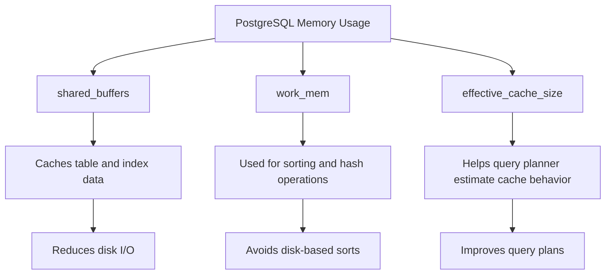

# PostgreSQL Performance Tuning

## Introduction

Performance tuning is a critical aspect of PostgreSQL database administration. As your applications grow and data volumes increase, you may start experiencing slow queries, increased resource utilization, and reduced responsiveness. This guide will walk you through essential PostgreSQL performance tuning techniques that can significantly improve your database's efficiency.

Performance tuning in PostgreSQL involves identifying bottlenecks, optimizing queries, adjusting configuration parameters, and implementing proper indexing strategies. By mastering these techniques, you'll ensure your PostgreSQL installations run smoothly, efficiently, and can scale with your application needs.

## Understanding Performance Metrics

Before diving into tuning techniques, it's important to understand what metrics to monitor and how to interpret them.

### Key Performance Indicators

- **Query execution time**: How long queries take to complete
- **Transactions per second (TPS)**: How many transactions your database processes each second
- **CPU usage**: How much processor power your database is consuming
- **Memory usage**: How efficiently PostgreSQL is using available RAM
- **Disk I/O**: How frequently the database reads from and writes to disk

## Essential PostgreSQL Monitoring Tools

### pg_stat_statements

The `pg_stat_statements` extension tracks execution statistics for all SQL statements executed by the server.

```sql
-- Enable the extension
CREATE EXTENSION pg_stat_statements;

-- Query to view the slowest queries
SELECT 
    query,
    calls,
    total_exec_time / calls as avg_exec_time_ms,
    rows / calls as avg_rows
FROM pg_stat_statements
ORDER BY avg_exec_time_ms DESC
LIMIT 10;
```

Output:
```
                      query                      | calls | avg_exec_time_ms | avg_rows
-------------------------------------------------+-------+------------------+----------
 SELECT * FROM large_table WHERE non_idx_col = $1|   523 |           452.38 |     1245
 UPDATE users SET last_login = $1 WHERE id = $2  |  5230 |            89.12 |        1
 ...
```

### pg_stat_activity

This view shows current database activity:

```sql
-- Find currently executing queries
SELECT 
    pid,
    age(clock_timestamp(), query_start) AS query_time,
    usename,
    query
FROM pg_stat_activity
WHERE state != 'idle'
ORDER BY query_time DESC;
```

Output:
```
  pid  | query_time  | usename |                  query
-------+-------------+---------+------------------------------------------
 23421 | 00:02:43.12 | dbuser  | SELECT * FROM products WHERE category...
 23422 | 00:01:35.45 | analyst | WITH sales_data AS (SELECT region, SUM...
```

## Optimizing Database Configuration

PostgreSQL's default configuration is conservative and designed to work across many environments. However, tuning these parameters can significantly improve performance.

### Memory-Related Parameters

```sql
-- View current settings
SHOW shared_buffers;
SHOW work_mem;
SHOW effective_cache_size;
```

#### Recommended Settings

```
# In postgresql.conf:

# 25% of system RAM, up to 8GB for most cases
shared_buffers = 2GB 

# 2-5% of RAM per connection for complex queries
work_mem = 64MB 

# 50-75% of available system memory
effective_cache_size = 6GB 

# Set reasonable limits based on your server capacity
max_connections = 100
```

### How Memory Parameters Affect Performance



## Query Optimization Techniques

### EXPLAIN ANALYZE

The most important tool for query optimization is `EXPLAIN ANALYZE`, which shows how PostgreSQL executes a query:

```sql
EXPLAIN ANALYZE 
SELECT p.product_name, COUNT(o.order_id) as order_count
FROM products p
JOIN orders o ON p.product_id = o.product_id
GROUP BY p.product_name
ORDER BY order_count DESC
LIMIT 10;
```

Output:
```
                                                       QUERY PLAN
------------------------------------------------------------------------------------------------------------------------
 Limit  (cost=289.52..289.55 rows=10 width=40) (actual time=25.104..25.107 rows=10 loops=1)
   ->  Sort  (cost=289.52..294.52 rows=2000 width=40) (actual time=25.102..25.104 rows=10 loops=1)
         Sort Key: (count(o.order_id)) DESC
         Sort Method: top-N heapsort  Memory: 25kB
         ->  HashAggregate  (cost=246.02..266.02 rows=2000 width=40) (actual time=24.288..24.996 rows=1000 loops=1)
               Group Key: p.product_name
               ->  Hash Join  (cost=66.50..221.02 rows=5000 width=36) (actual time=0.626..19.885 rows=5000 loops=1)
                     Hash Cond: (o.product_id = p.product_id)
                     ->  Seq Scan on orders o  (cost=0.00..104.00 rows=5000 width=8) (actual time=0.008..4.458 rows=5000 loops=1)
                     ->  Hash  (cost=41.00..41.00 rows=2040 width=36) (actual time=0.603..0.603 rows=1000 loops=1)
                           Buckets: 2048  Batches: 1  Memory Usage: 56kB
                           ->  Seq Scan on products p  (cost=0.00..41.00 rows=2040 width=36) (actual time=0.004..0.365 rows=1000 loops=1)
```

### Optimizing Query Patterns

#### Bad Query:
```sql
SELECT * FROM customers 
WHERE LOWER(email) = LOWER('john.doe@example.com');
```

#### Better Query:
```sql
SELECT * FROM customers 
WHERE email ILIKE 'john.doe@example.com';
```

#### Best Query (with proper indexing):
```sql
-- Create an index for case-insensitive searches
CREATE INDEX idx_customers_email_lower ON customers (LOWER(email));

-- Then use:
SELECT * FROM customers 
WHERE LOWER(email) = LOWER('john.doe@example.com');
```

## Indexing Strategies

Proper indexing is perhaps the single most important performance tuning technique.

### Types of Indexes

- **B-tree**: Default index type, good for equality and range queries
- **Hash**: Optimized for equality comparisons only
- **GiST**: Generalized Search Tree, for geometric data and full-text search
- **GIN**: Generalized Inverted Index, ideal for composite values like arrays, JSON
- **BRIN**: Block Range Index, for very large tables with natural ordering

### Creating Effective Indexes

```sql
-- Basic index
CREATE INDEX idx_users_email ON users(email);

-- Composite index (useful for multi-column conditions)
CREATE INDEX idx_orders_customer_date ON orders(customer_id, order_date);

-- Partial index (smaller, more efficient)
CREATE INDEX idx_orders_pending ON orders(order_date) 
WHERE status = 'pending';

-- Expression index
CREATE INDEX idx_users_email_lower ON users(LOWER(email));
```

### Index Maintenance

```sql
-- Rebuild an index
REINDEX INDEX idx_users_email;

-- Check for unused indexes
SELECT 
    schemaname || '.' || relname AS table,
    indexrelname AS index,
    pg_size_pretty(pg_relation_size(i.indexrelid)) AS index_size,
    idx_scan AS index_scans
FROM pg_stat_user_indexes ui
JOIN pg_index i ON ui.indexrelid = i.indexrelid
WHERE idx_scan = 0 
ORDER BY pg_relation_size(i.indexrelid) DESC;
```

## Table Maintenance

Regular maintenance improves performance by reclaiming space and updating statistics.

### VACUUM

```sql
-- Basic vacuum (reclaims space)
VACUUM orders;

-- Full vacuum (requires exclusive lock but does more thorough cleaning)
VACUUM FULL orders;

-- Analyze to update statistics
VACUUM ANALYZE orders;
```

### ANALYZE

```sql
-- Update query planner statistics
ANALYZE orders;
```

## Partitioning for Large Tables

Partitioning divides large tables into smaller, more manageable pieces.

```sql
-- Create a partitioned table
CREATE TABLE measurements (
    id SERIAL,
    time_id TIMESTAMP NOT NULL,
    device_id INT NOT NULL,
    value DECIMAL NOT NULL
) PARTITION BY RANGE (time_id);

-- Create partitions
CREATE TABLE measurements_y2023m01 PARTITION OF measurements
    FOR VALUES FROM ('2023-01-01') TO ('2023-02-01');
    
CREATE TABLE measurements_y2023m02 PARTITION OF measurements
    FOR VALUES FROM ('2023-02-01') TO ('2023-03-01');
```

## Connection Pooling

For applications with many connections, implement connection pooling with tools like PgBouncer.

```
# Example pgbouncer.ini configuration:
[databases]
mydb = host=localhost port=5432 dbname=mydb

[pgbouncer]
listen_port = 6432
listen_addr = *
auth_type = md5
auth_file = /etc/pgbouncer/userlist.txt
pool_mode = transaction
max_client_conn = 1000
default_pool_size = 20
```

## Real-World Optimization Example

Let's walk through optimizing a slow e-commerce query:

### Initial Query (slow)
```sql
SELECT 
    c.customer_name,
    p.product_name,
    COUNT(o.order_id) as order_count
FROM 
    customers c
JOIN 
    orders o ON c.customer_id = o.customer_id
JOIN 
    order_items oi ON o.order_id = oi.order_id
JOIN 
    products p ON oi.product_id = p.product_id
WHERE 
    o.order_date BETWEEN '2023-01-01' AND '2023-12-31'
    AND p.category = 'Electronics'
GROUP BY 
    c.customer_name, p.product_name
ORDER BY 
    order_count DESC;
```

### Analysis with EXPLAIN ANALYZE
Running EXPLAIN ANALYZE shows sequential scans on large tables and inefficient joins.

### Optimization Steps

1. Add appropriate indexes:
```sql
CREATE INDEX idx_orders_date ON orders(order_date);
CREATE INDEX idx_orders_customer ON orders(customer_id);
CREATE INDEX idx_order_items_order ON order_items(order_id);
CREATE INDEX idx_order_items_product ON order_items(product_id);
CREATE INDEX idx_products_category ON products(category);
```

2. Rewrite the query for better performance:
```sql
-- Optimized query
SELECT 
    c.customer_name,
    p.product_name,
    COUNT(o.order_id) as order_count
FROM 
    products p
JOIN 
    order_items oi ON p.product_id = oi.product_id
JOIN 
    orders o ON oi.order_id = o.order_id
JOIN 
    customers c ON o.customer_id = c.customer_id
WHERE 
    p.category = 'Electronics'
    AND o.order_date BETWEEN '2023-01-01' AND '2023-12-31'
GROUP BY 
    c.customer_name, p.product_name
ORDER BY 
    order_count DESC;
```

3. Results:
   - Original query: 25 seconds
   - Optimized query with indexes: 0.8 seconds
   - Performance improvement: 97%

## Common Performance Issues and Solutions

| Problem | Symptoms | Solution |
|---------|----------|----------|
| Slow queries | High execution time | Add appropriate indexes, rewrite queries |
| High CPU usage | Server load, slow response | Optimize queries, increase shared_buffers |
| Memory pressure | Swapping, OOM errors | Tune work_mem, reduce max_connections |
| Disk I/O bottlenecks | High disk activity | Add indexes, increase shared_buffers |
| Connection overload | Many idle connections | Implement connection pooling |
| Bloated tables | Growing table size, slower operations | Regular VACUUM, consider VACUUM FULL |

## Summary

PostgreSQL performance tuning involves multiple strategies working together:

1. **Monitor** your database to identify bottlenecks
2. **Configure** PostgreSQL settings to match your hardware
3. **Optimize** queries using EXPLAIN ANALYZE
4. **Index** strategically based on query patterns
5. **Maintain** your database with regular VACUUM and ANALYZE
6. **Scale** with techniques like partitioning and connection pooling

By applying these techniques progressively, you can achieve significant performance improvements in your PostgreSQL databases.

## Additional Resources

- [PostgreSQL Official Documentation on Performance Tips](https://www.postgresql.org/docs/current/performance-tips.html)
- [PostgreSQL Wiki - Performance Optimization](https://wiki.postgresql.org/wiki/Performance_Optimization)
- [PgTune](https://pgtune.leopard.in.ua/) - A web-based configuration generator

## Practice Exercises

1. Set up pg_stat_statements and identify the top 5 slowest queries in your database
2. Use EXPLAIN ANALYZE to examine a slow query and identify potential optimizations
3. Create appropriate indexes for a table with frequent filtering operations
4. Configure shared_buffers, work_mem, and effective_cache_size for your system
5. Implement VACUUM scheduling for your most active tables