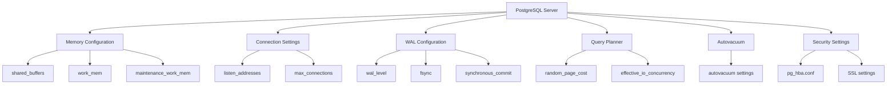

# PostgreSQL Server Configuration

## Introduction

PostgreSQL is a powerful, open-source object-relational database system with over 30 years of active development. One of the key strengths of PostgreSQL is its high level of configurability. Proper server configuration can dramatically improve performance, security, and reliability of your database system.

In this guide, we'll explore the essential PostgreSQL server configuration parameters, how to modify them, and best practices for optimizing your PostgreSQL server for different workloads. Whether you're setting up a development environment or tuning a production server, this guide will help you understand how to configure PostgreSQL effectively.

## Configuration Files Location

PostgreSQL uses several configuration files that control server behavior. The primary ones are:

- **postgresql.conf**: Controls general server parameters
- **pg_hba.conf**: Controls client authentication
- **pg_ident.conf**: Maps external user identities to database users

Let's first understand where these files are located:

```bash
# Find the data directory
psql -c "SHOW data_directory;"

# Sample output
         data_directory         
--------------------------------
 /var/lib/postgresql/14/main
```

Configuration files are typically stored in this data directory. Alternatively, you can find the location of the config file:

```bash
psql -c "SHOW config_file;"

# Sample output
               config_file               
-----------------------------------------
 /etc/postgresql/14/main/postgresql.conf
```

## Understanding postgresql.conf

The `postgresql.conf` file contains parameters that configure the PostgreSQL server. Let's look at some of the most important configuration categories:

### Memory Configuration

```
# Memory Configuration
shared_buffers = 128MB                  # Min recommended: 25% of RAM
work_mem = 4MB                          # Memory for query operations
maintenance_work_mem = 64MB             # Memory for maintenance operations
effective_cache_size = 4GB              # Estimate of available system cache
```

#### Key Parameters Explained:

- **shared_buffers**: Determines how much memory PostgreSQL uses for shared memory buffers. This should typically be set to 25% of system RAM for dedicated database servers.
- **work_mem**: Memory used for sorting and hash operations. Higher values improve performance but can lead to memory issues if too many operations run concurrently.
- **maintenance_work_mem**: Memory allocated for maintenance operations like VACUUM, CREATE INDEX.
- **effective_cache_size**: Tells the optimizer how much memory is available for disk caching. Set this to approximately 70% of total system RAM.

### Connection Settings

```
# Connection Settings
listen_addresses = 'localhost'          # Default: 'localhost', '*' to listen on all interfaces
max_connections = 100                   # Maximum concurrent connections
superuser_reserved_connections = 3      # Connections reserved for superusers
```

#### Key Parameters Explained:

- **listen_addresses**: Specifies which IP addresses to listen on. Use `'*'` to listen on all available IP addresses.
- **max_connections**: Maximum number of concurrent connections. Higher values require more system resources.
- **superuser_reserved_connections**: Connections reserved for superuser accounts when max_connections is reached.

### Write Ahead Log (WAL) Settings

```
# WAL Configuration
wal_level = replica                     # Minimal, replica, or logical
fsync = on                              # Forces synchronization to disk
synchronous_commit = on                 # Immediate fsync at commit
wal_buffers = -1                        # Auto-sized (typically 1/32 of shared_buffers)
```

#### Key Parameters Explained:

- **wal_level**: Determines how much information is written to the WAL. 'minimal' for minimal logging, 'replica' for replication support, 'logical' for logical decoding.
- **fsync**: Ensures data is physically written to disk. Turning it off can cause data corruption in case of a crash.
- **synchronous_commit**: Controls whether transaction commits wait for WAL records to be written to disk.
- **wal_buffers**: Size of shared memory for WAL data. `-1` auto-configures based on shared_buffers.

### Query Planner Settings

```
# Query Planner Configuration
random_page_cost = 4.0                  # Page cost estimate (lower values prefer index scans)
effective_io_concurrency = 2            # Number of concurrent disk I/O operations
```

#### Key Parameters Explained:

- **random_page_cost**: Cost estimate for a non-sequentially fetched disk page. Lower values make the query planner more likely to use index scans.
- **effective_io_concurrency**: Number of concurrent disk I/O operations that PostgreSQL expects can be executed simultaneously.

## Modifying Configuration

There are three ways to modify PostgreSQL configuration:

### 1. Editing Configuration Files

Edit the postgresql.conf file directly:

```bash
sudo nano /etc/postgresql/14/main/postgresql.conf
```

After making changes, restart PostgreSQL:

```bash
sudo systemctl restart postgresql
```

### 2. Using SQL Commands

Some parameters can be changed while the server is running:

```sql
-- Change a setting for the current session only
SET work_mem = '8MB';

-- Change a setting and persist it
ALTER SYSTEM SET work_mem = '8MB';

-- Reload configuration without restart
SELECT pg_reload_conf();
```

### 3. Command Line Options

When starting PostgreSQL, you can override configurations:

```bash
postgres -c "shared_buffers=256MB" -c "max_connections=200"
```

## Configuration for Different Workloads

Different applications require different PostgreSQL configurations. Here are recommendations for common scenarios:

### OLTP (Online Transaction Processing)

OLTP workloads involve many small, concurrent transactions:

```
shared_buffers = 25% of RAM
work_mem = 4-8MB
random_page_cost = 2.0-3.0
effective_cache_size = 70% of RAM
max_connections = Set based on expected concurrent users
```

### OLAP (Online Analytical Processing)

OLAP workloads involve complex queries over large datasets:

```
shared_buffers = 25-40% of RAM
work_mem = 32-64MB (be careful with high concurrent queries)
maintenance_work_mem = 256MB-1GB
effective_cache_size = 70% of RAM
max_parallel_workers_per_gather = 4-8
max_worker_processes = 8-16
```

### Mixed Workloads

For databases that handle both OLTP and OLAP:

```
shared_buffers = 25% of RAM
work_mem = 16-32MB
maintenance_work_mem = 128-256MB
max_parallel_workers_per_gather = 2-4
```

## Security Configuration

Security is crucial for database servers. Here's how to configure PostgreSQL securely:

### Client Authentication

The `pg_hba.conf` file controls client authentication:

```
# TYPE  DATABASE        USER            ADDRESS                 METHOD
local   all             postgres                                peer
local   all             all                                     md5
host    all             all             127.0.0.1/32            md5
host    all             all             ::1/128                 md5
host    all             all             192.168.1.0/24          md5
```

Authentication methods:
- **trust**: Allow connection unconditionally
- **peer**: Use operating system username
- **md5**: Require MD5-encrypted password
- **scram-sha-256**: Use SCRAM-SHA-256 authentication (more secure than MD5)
- **reject**: Reject connections

### SSL Configuration

Enable SSL for encrypted connections:

```
ssl = on
ssl_cert_file = 'server.crt'
ssl_key_file = 'server.key'
ssl_ca_file = 'root.crt'
```

Then in pg_hba.conf, specify SSL requirements:

```
hostssl all             all             0.0.0.0/0               scram-sha-256
```

## Performance Monitoring

After configuring PostgreSQL, it's important to monitor performance to ensure your settings are optimal:

```sql
-- Check statistics for a specific table
SELECT * FROM pg_stat_user_tables WHERE relname = 'my_table';

-- Check cache hit ratio
SELECT 
  sum(heap_blks_read) as heap_read,
  sum(heap_blks_hit)  as heap_hit,
  sum(heap_blks_hit) / (sum(heap_blks_hit) + sum(heap_blks_read)) as ratio
FROM pg_statio_user_tables;

-- Check connection usage
SELECT count(*), state FROM pg_stat_activity GROUP BY state;
```

## Practical Example: Configuring PostgreSQL for a Web Application

Let's walk through configuring PostgreSQL for a medium-sized web application with approximately 1000 concurrent users on a server with 16GB RAM:

```
# Memory settings
shared_buffers = 4GB             # 25% of RAM
work_mem = 8MB                   # Balanced for mixed queries
maintenance_work_mem = 512MB     # For operations like vacuuming
effective_cache_size = 10GB      # Approximately 70% of RAM

# Connection settings
max_connections = 300            # Based on expected users
superuser_reserved_connections = 5  # Reserved for admin

# Performance settings
random_page_cost = 2.0           # Assuming SSD storage
effective_io_concurrency = 8     # For SSD
checkpoint_completion_target = 0.9  # Spread checkpoint I/O 
wal_buffers = 16MB               # Custom WAL buffer size

# Background writer
bgwriter_delay = 200ms           # Default
bgwriter_lru_maxpages = 1000     # More aggressive cleaning

# Logging for monitoring
log_min_duration_statement = 200 # Log slow queries (>200ms)
```

After applying these changes, we would:

1. Restart PostgreSQL
2. Monitor performance using pg_stat views
3. Adjust settings based on observed behavior

## Common Configuration Mistakes to Avoid

1. **Setting shared_buffers too high**: Can cause the OS to swap memory
2. **Setting work_mem too high**: Can cause out-of-memory issues with concurrent queries
3. **Disabling fsync**: Improves performance but risks data corruption
4. **Not adjusting max_connections**: Can lead to connection failures under load
5. **Ignoring autovacuum settings**: Can lead to database bloat and performance degradation

## Autovacuum Configuration

Autovacuum prevents database bloat and maintains statistics:

```
# Autovacuum settings
autovacuum = on                      # Enable autovacuum
log_autovacuum_min_duration = 250    # Log operations taking >250ms
autovacuum_max_workers = 3           # Number of workers
autovacuum_naptime = 1min            # Time between runs
autovacuum_vacuum_threshold = 50     # Minimum number of row updates
autovacuum_vacuum_scale_factor = 0.2 # Percentage of table that must be updated
```

## Visualization of PostgreSQL Configuration Components



## Summary

PostgreSQL server configuration is a powerful way to optimize your database performance, security, and reliability. In this guide, we've covered:

- Essential configuration files and their locations
- Key configuration parameters and their meanings
- How to modify configurations using different methods
- Specialized configurations for different workloads
- Security settings for protecting your database
- Performance monitoring to validate your settings
- Common configuration mistakes to avoid

By understanding these elements, you can tailor PostgreSQL to your specific needs, whether you're running a small development database or a large production environment.

## Additional Resources

- [Official PostgreSQL Documentation on Server Configuration](https://www.postgresql.org/docs/current/runtime-config.html)
- [PgTune](https://pgtune.leopard.in.ua/) - A web-based tool for generating optimized configurations
- [PostgreSQL Wiki - Tuning Your PostgreSQL Server](https://wiki.postgresql.org/wiki/Tuning_Your_PostgreSQL_Server)

## Exercises

1. Use the `SHOW ALL;` command in psql to list all current PostgreSQL settings. Identify five that you might want to change for your specific workload.

2. Create a custom configuration for a PostgreSQL database that will be used for a data warehouse with the following specifications: 32GB RAM, SSD storage, and primarily analytical queries.

3. Using pg_stat views, write queries to monitor the performance of your database after making configuration changes.

4. Set up a test environment with pgbench and experiment with different configuration settings to observe their impact on performance.

5. Configure PostgreSQL for high security, including SSL, strong authentication methods, and appropriate client connection restrictions.