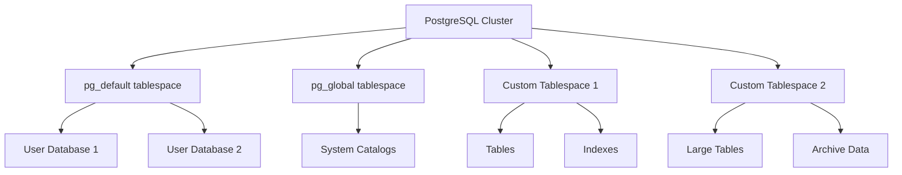

# PostgreSQL Tablespaces

## Introduction

Tablespaces are a PostgreSQL feature that allows database administrators to define locations in the file system where the files representing database objects can be stored. Once created, a tablespace can be referred to by name when creating database objects.

Tablespaces allow you to:
- Distribute database data across different physical storage devices
- Control which data goes on which disk to optimize performance
- Manage disk space more efficiently by relocating tables or indexes
- Overcome disk space limitations on a single volume

This guide will walk you through everything you need to know about PostgreSQL tablespaces, from basic concepts to practical implementation.

## Understanding Tablespaces

### What is a Tablespace?

A tablespace in PostgreSQL is essentially a location on your file system where PostgreSQL stores data files containing database objects such as tables and indexes.

By default, PostgreSQL creates two tablespaces:
- `pg_default`: Stores user data
- `pg_global`: Stores system data

When you don't specify a tablespace while creating a database object, PostgreSQL uses the default tablespace.

### Why Use Tablespaces?

There are several compelling reasons to use custom tablespaces:

1. **Performance optimization**: Place frequently accessed tables on faster storage devices
2. **Disk space management**: Distribute data across multiple disks when a single disk becomes full
3. **Separation of concerns**: Keep different types of data (like archive data vs. active data) on different storage systems
4. **Backup strategy implementation**: Group objects that need different backup frequencies
5. **Cost management**: Store less frequently accessed data on cheaper, slower storage

## Creating and Managing Tablespaces

### Creating a Tablespace

To create a tablespace, you need:
1. A directory owned by the PostgreSQL operating system user
2. The `CREATE TABLESPACE` privilege

Here's the basic syntax:

```sql
CREATE TABLESPACE tablespace_name
LOCATION 'directory_path';
```

Let's create a tablespace for storing high-performance data:

```sql
-- First, create a directory (as the operating system user that runs PostgreSQL)
-- $ mkdir -p /data/postgresql/highperf

-- Then, in PostgreSQL, create the tablespace
CREATE TABLESPACE highperf_space
LOCATION '/data/postgresql/highperf';
```

### Viewing Existing Tablespaces

You can view all tablespaces in your PostgreSQL instance using:

```sql
SELECT spcname, pg_tablespace_location(oid) AS location
FROM pg_tablespace;
```

Output:
```
   spcname    |           location
--------------+------------------------------
 pg_default   | 
 pg_global    | 
 highperf_space | /data/postgresql/highperf
```

### Setting Tablespace Parameters

When creating a tablespace, you can set additional parameters:

```sql
CREATE TABLESPACE archive_space
LOCATION '/data/postgresql/archive'
WITH (random_page_cost = 2.0);
```

This example sets the `random_page_cost` parameter to 2.0 for this tablespace, which tells the query planner that this storage is faster than the default configuration.

## Using Tablespaces

### Creating a Database in a Tablespace

To create a new database in a specific tablespace:

```sql
CREATE DATABASE high_traffic_app
TABLESPACE highperf_space;
```

### Creating Tables in a Tablespace

To create a table in a specific tablespace:

```sql
CREATE TABLE orders (
    order_id SERIAL PRIMARY KEY,
    customer_id INTEGER NOT NULL,
    order_date TIMESTAMP NOT NULL,
    total_amount NUMERIC(10,2)
) TABLESPACE highperf_space;
```

### Creating Indexes in a Tablespace

Indexes can also be placed in specific tablespaces:

```sql
CREATE INDEX idx_orders_customer
ON orders (customer_id)
TABLESPACE highperf_space;
```

### Moving Existing Objects to Different Tablespaces

You can move existing tables to a different tablespace:

```sql
ALTER TABLE orders SET TABLESPACE archive_space;
```

Similarly, for indexes:

```sql
ALTER INDEX idx_orders_customer SET TABLESPACE archive_space;
```

## Practical Examples

### Example 1: Separating Hot and Cold Data

A common practice is to separate frequently accessed ("hot") data from rarely accessed ("cold") data:

```sql
-- Create tablespaces for different data types
CREATE TABLESPACE hot_data
LOCATION '/fast_ssd/postgresql/hot';

CREATE TABLESPACE cold_data
LOCATION '/hdd/postgresql/cold';

-- Create tables in appropriate tablespaces
CREATE TABLE recent_transactions (
    id SERIAL PRIMARY KEY,
    transaction_date TIMESTAMP NOT NULL,
    amount NUMERIC(10,2),
    details TEXT
) TABLESPACE hot_data;

CREATE TABLE historical_transactions (
    id SERIAL PRIMARY KEY,
    transaction_date TIMESTAMP NOT NULL,
    amount NUMERIC(10,2),
    details TEXT
) TABLESPACE cold_data;
```

### Example 2: Optimizing for Read vs. Write Workloads

Different types of storage may be optimized for different operations:

```sql
-- Create tablespaces on different storage types
CREATE TABLESPACE write_optimized
LOCATION '/nvme_storage/postgresql/write';

CREATE TABLESPACE read_optimized
LOCATION '/ssd_array/postgresql/read';

-- Put write-heavy tables on write-optimized storage
CREATE TABLE event_logs (
    log_id SERIAL PRIMARY KEY,
    event_time TIMESTAMP NOT NULL,
    event_type VARCHAR(50),
    payload JSONB
) TABLESPACE write_optimized;

-- Put tables used for reporting on read-optimized storage
CREATE TABLE monthly_reports (
    report_id SERIAL PRIMARY KEY,
    month DATE NOT NULL,
    department VARCHAR(100),
    statistics JSONB
) TABLESPACE read_optimized;
```

### Example 3: Setting Default Tablespace for a Session

You can set the default tablespace for the current session:

```sql
-- Set default tablespace for current session
SET default_tablespace = 'highperf_space';

-- Now you can create objects without specifying tablespace
CREATE TABLE customers (
    id SERIAL PRIMARY KEY,
    name VARCHAR(100),
    email VARCHAR(255)
);  -- This will be created in highperf_space
```

## Best Practices

1. **Plan before implementing**: Consider your workload patterns and storage characteristics
2. **Name tablespaces descriptively**: Use names that reflect their purpose (e.g., `fast_reads`, `archive_storage`)
3. **Monitor tablespace usage**: Regularly check space usage in each tablespace
4. **Balance performance and cost**: Put only the data that needs speed on expensive fast storage
5. **Document your tablespace strategy**: Make sure your team understands which data goes where and why
6. **Backup considerations**: Ensure your backup strategy accounts for data in all tablespaces

## Monitoring Tablespaces

### Checking Tablespace Size

```sql
SELECT spcname AS tablespace_name,
       pg_size_pretty(pg_tablespace_size(spcname)) AS size
FROM pg_tablespace
ORDER BY pg_tablespace_size(spcname) DESC;
```

Output:
```
 tablespace_name |  size
----------------+--------
 pg_default     | 7123 MB
 highperf_space | 2045 MB
 archive_space  | 15 GB
 pg_global      | 580 kB
```

### Finding Objects in a Tablespace

To list all tables in a specific tablespace:

```sql
SELECT schemaname, tablename
FROM pg_tables
WHERE tablespace = 'highperf_space';
```

## Tablespace Architecture

The following diagram illustrates how tablespaces are organized in PostgreSQL:



## Common Issues and Troubleshooting

### Insufficient Permissions

If you encounter permission errors when creating a tablespace:

```
ERROR:  could not create directory "/data/postgresql/new_space": Permission denied
```

Ensure that:
1. The PostgreSQL service account has write access to the parent directory
2. The target directory exists or can be created by the PostgreSQL user
3. SELinux or AppArmor are not blocking access

### Tablespace Cannot Be Dropped

If you try to drop a tablespace that still contains objects:

```
ERROR:  tablespace "highperf_space" is not empty
```

First, identify objects in the tablespace:

```sql
SELECT c.relname, c.relkind
FROM pg_class c
JOIN pg_namespace n ON c.relnamespace = n.oid
WHERE c.reltablespace = (SELECT oid FROM pg_tablespace WHERE spcname = 'highperf_space');
```

Then move or drop those objects before dropping the tablespace.

## Summary

PostgreSQL tablespaces provide a powerful mechanism for managing where your database objects are stored physically. By strategically placing different types of data on appropriate storage media, you can optimize for performance, manage disk space efficiently, and implement more sophisticated backup strategies.

Key points to remember:
- Tablespaces define physical locations for database objects
- They help optimize performance by placing data on appropriate storage
- Creating a tablespace requires a directory and proper permissions
- Different objects (databases, tables, indexes) can be assigned to different tablespaces
- You can move existing objects between tablespaces as needed
- Regular monitoring of tablespace usage is important

## Additional Resources

- [PostgreSQL Official Documentation on Tablespaces](https://www.postgresql.org/docs/current/manage-ag-tablespaces.html)
- [Tablespace Best Practices for High Performance](https://www.postgresql.org/docs/current/performance-tips.html)
- PostgreSQL System Views: `pg_tablespace`, `pg_class`

## Exercises

1. Create two tablespaces: one for frequently accessed data and another for archive data.
2. Create a table in the default tablespace, then move it to your custom tablespace.
3. Write a query to list all tables and their respective tablespaces in your database.
4. Create a small database that uses your custom tablespace by default.
5. Write a script that reports the size of each tablespace and alerts if any exceeds 80% capacity.