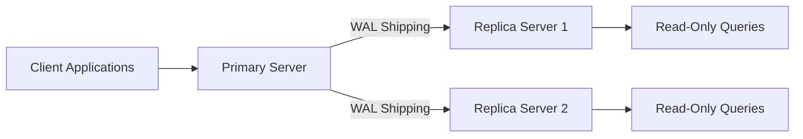
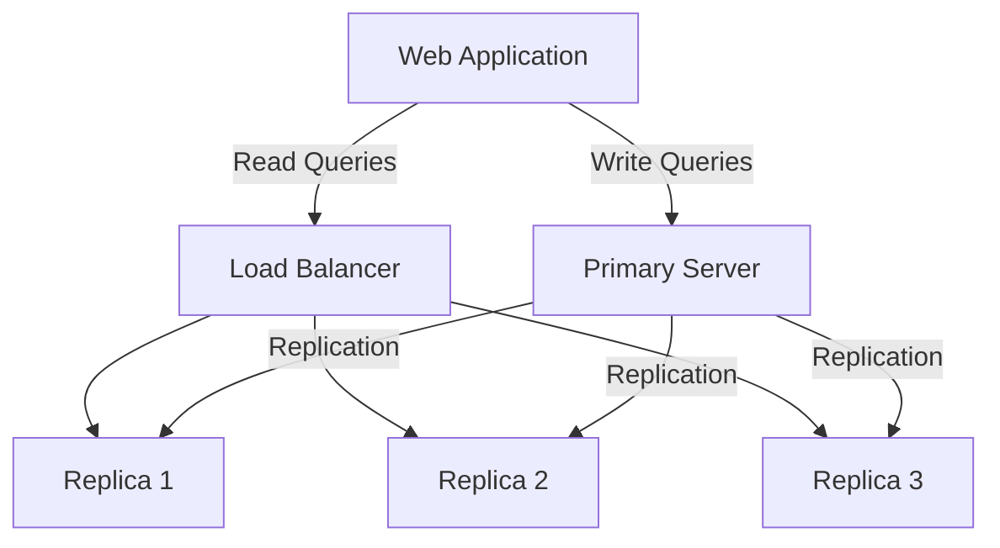

# PostgreSQL Replication

## Introduction

PostgreSQL replication is a critical feature that allows database administrators to create and maintain copies (replicas) of a PostgreSQL database across multiple servers. This functionality serves several important purposes in modern database administration:

- **High Availability**: Ensures your database remains accessible even if one server fails
- **Load Balancing**: Distributes read operations across multiple servers to improve performance
- **Data Backup**: Creates redundant copies of your data for disaster recovery
- **Geographic Distribution**: Places data closer to users in different regions to reduce latency

As a beginner PostgreSQL administrator, understanding replication concepts and implementation is essential for building robust, production-ready database systems. This guide will walk you through the fundamentals of PostgreSQL replication, explain different replication methods, and provide practical examples to get you started.

## Replication Concepts

Before diving into specific replication methods, let's understand some core concepts:

### Primary vs Replica Servers

- **Primary Server** (also called master): The main database server that accepts both read and write operations
- **Replica Server** (also called standby): A server that maintains a copy of the primary's data

### Synchronous vs Asynchronous Replication

- **Synchronous**: The primary server waits for the replica to confirm data has been received before considering a transaction complete
- **Asynchronous**: The primary server doesn't wait for confirmation from replicas, potentially allowing for some data loss in case of failover

### Physical vs Logical Replication

- **Physical Replication**: Copies the actual data files and WAL (Write-Ahead Log) entries byte-for-byte
- **Logical Replication**: Replicates data changes at a logical level (INSERT, UPDATE, DELETE operations)

Let's visualize the basic replication setup:



## Physical Replication

Physical replication in PostgreSQL is primarily implemented using **WAL (Write-Ahead Log)** shipping. When data changes occur on the primary server, these changes are first recorded in the WAL files before being applied to the actual data files. These WAL files can then be sent to replica servers to recreate the same changes.

### Setting Up Physical Replication

Let's walk through the process of setting up basic physical replication between two PostgreSQL servers:

#### 1. Configure the Primary Server

Edit the `postgresql.conf` file on your primary server:

```sql
# Enable WAL archiving
wal_level = replica
max_wal_senders = 10           # Maximum number of concurrent connections from replica servers
wal_keep_segments = 64         # Number of WAL files to keep for replicas
archive_mode = on              # Enable WAL archiving
archive_command = 'cp %p /path/to/archive/%f'  # Command to archive WAL files
```

Edit the `pg_hba.conf` file to allow replica servers to connect:

```
# Allow replication connections from your replica server's IP
host    replication     replication_user    192.168.1.100/32        md5
```

#### 2. Create a Replication User

On the primary server, create a user specifically for replication:

```sql
CREATE ROLE replication_user WITH REPLICATION PASSWORD 'secure_password' LOGIN;
```

#### 3. Prepare the Replica Server

Stop the PostgreSQL service on the replica server:

```bash
sudo systemctl stop postgresql
```

Clear the data directory on the replica:

```bash
sudo rm -rf /var/lib/postgresql/13/main/*
```

#### 4. Create Base Backup

On the primary server, create a base backup that will be used to initialize the replica:

```bash
pg_basebackup -h primary_server_ip -D /var/lib/postgresql/13/main -U replication_user -P -v
```

#### 5. Configure the Replica Server

Create a `standby.signal` file in the data directory (for PostgreSQL 12 and later):

```bash
touch /var/lib/postgresql/13/main/standby.signal
```

Edit the `postgresql.conf` file on the replica server:

```sql
primary_conninfo = 'host=primary_server_ip port=5432 user=replication_user password=secure_password'
hot_standby = on               # Allow read-only queries on replica
```

#### 6. Start the Replica Server

```bash
sudo systemctl start postgresql
```

#### 7. Verify Replication Status

On the primary server, check replication connections:

```sql
SELECT * FROM pg_stat_replication;
```

Example output:

```
 pid | usesysid | usename | application_name | client_addr | client_port |  backend_start  | backend_xmin |   state   | sent_lsn  | write_lsn | flush_lsn | replay_lsn | sync_priority | sync_state 
-----+----------+---------+------------------+-------------+-------------+-----------------+--------------+-----------+-----------+-----------+-----------+------------+---------------+------------
 1234 |    16384 | repuser | walreceiver      | 192.168.1.100 |       56984 | 2025-03-10 10:00:14 |              | streaming | 0/3000060 | 0/3000060 | 0/3000060 | 0/3000060  |             0 | async
```

## Logical Replication

Logical replication was introduced in PostgreSQL 10 and operates by replicating changes at a logical level rather than the physical byte-level changes. This provides more flexibility, such as the ability to replicate individual tables rather than the entire database.

### Setting Up Logical Replication

#### 1. Configure the Primary Server

Edit the `postgresql.conf` file on your primary server:

```sql
wal_level = logical           # Enable logical decoding of WAL
max_replication_slots = 10    # Maximum number of replication slots
max_wal_senders = 10          # Maximum number of concurrent connections from replica servers
```

#### 2. Create a Publication

A publication defines the set of tables whose changes will be sent to subscribers:

```sql
-- Create a publication for all tables
CREATE PUBLICATION my_publication FOR ALL TABLES;

-- Or create a publication for specific tables
CREATE PUBLICATION my_publication FOR TABLE customers, orders;
```

#### 3. Configure the Replica Server

Edit the `postgresql.conf` file:

```sql
max_logical_replication_workers = 4    # Maximum number of logical replication workers
max_worker_processes = 8               # Maximum number of background processes
```

#### 4. Create a Subscription

A subscription connects to a publication and defines which tables will be replicated:

```sql
CREATE SUBSCRIPTION my_subscription 
CONNECTION 'host=primary_server_ip port=5432 dbname=mydatabase user=replication_user password=secure_password' 
PUBLICATION my_publication;
```

#### 5. Verify Logical Replication Status

Check the status of your subscriptions:

```sql
SELECT * FROM pg_stat_subscription;
```

Example output:

```
 subid | subname | pid | relid | received_lsn |      last_msg_send_time       | last_msg_receipt_time | latest_end_lsn |        latest_end_time        
-------+---------+-----+-------+--------------+-------------------------------+------------------------+----------------+-------------------------------
 16389 | my_sub  | 1234 |       | 0/3000060    | 2025-03-10 10:05:00.193196+00 | 2025-03-10 10:05:00.193196+00 | 0/3000060     | 2025-03-10 10:05:00.193196+00
```

## Real-World Applications

Let's explore some practical scenarios where PostgreSQL replication shines:

### Example 1: Load Balancing for Read-Heavy Applications

Many web applications have read-heavy workloads where users frequently retrieve data but update it less often. In this scenario, you can set up one primary server for writes and multiple replicas for reads.



Implementation:

1. Set up physical replication as described earlier
2. Configure your application to direct all write operations to the primary server
3. Use a connection pooler like PgBouncer to distribute read queries across replicas

Example connection management in a Node.js application:

```javascript
const { Pool } = require('pg');

// Primary database for writes
const primaryDb = new Pool({
  host: 'primary-db.example.com',
  database: 'myapp',
  user: 'app_user',
  password: 'secure_password',
  port: 5432,
});

// Replica pool for reads
const replicaPool = new Pool({
  hosts: ['replica1.example.com', 'replica2.example.com', 'replica3.example.com'],
  database: 'myapp',
  user: 'readonly_user',
  password: 'secure_password',
  port: 5432,
});

async function executeQuery(query, params, isWrite = false) {
  const client = isWrite ? await primaryDb.connect() : await replicaPool.connect();
  try {
    return await client.query(query, params);
  } finally {
    client.release();
  }
}
```

### Example 2: High Availability with Automatic Failover

For business-critical applications that can't afford downtime, you can set up automatic failover using tools like **Patroni** or **repmgr**.

Here's a simplified example using repmgr:

1. Install repmgr on all servers:

```bash
sudo apt install postgresql-13-repmgr
```

2. Configure repmgr on each server:

```ini
# repmgr.conf on primary
node_id=1
node_name=node1
conninfo='host=192.168.1.101 user=repmgr dbname=repmgr'
data_directory='/var/lib/postgresql/13/main'
```

3. Register the primary node:

```bash
repmgr primary register
```

4. Set up the standby node:

```bash
repmgr -h 192.168.1.101 -U repmgr -d repmgr standby clone
repmgr standby register
```

5. Configure automatic failover with repmgrd:

```bash
repmgrd -f /etc/repmgr.conf
```

## Monitoring Replication

Proper monitoring is essential to ensure your replication setup is working correctly:

### Monitor Replication Lag

Replication lag occurs when replica servers fall behind the primary server. You can check it with:

```sql
-- On the primary server
SELECT client_addr, 
       pg_wal_lsn_diff(pg_current_wal_lsn(), sent_lsn) AS send_lag_bytes,
       pg_wal_lsn_diff(pg_current_wal_lsn(), write_lsn) AS write_lag_bytes,
       pg_wal_lsn_diff(pg_current_wal_lsn(), flush_lsn) AS flush_lag_bytes,
       pg_wal_lsn_diff(pg_current_wal_lsn(), replay_lsn) AS replay_lag_bytes
FROM pg_stat_replication;
```

Example output:

```
 client_addr  | send_lag_bytes | write_lag_bytes | flush_lag_bytes | replay_lag_bytes 
--------------+----------------+----------------+----------------+-----------------
 192.168.1.100 |             0 |              0 |              0 |              512
```

### Monitor Replication Slots

For logical replication, monitor replication slots to ensure they don't fill up your disk:

```sql
SELECT slot_name, 
       pg_size_pretty(pg_wal_lsn_diff(pg_current_wal_lsn(), restart_lsn)::bigint) AS retained_wal
FROM pg_replication_slots;
```

## Common Issues and Troubleshooting

### 1. Replication Falls Behind

If a replica server is consistently lagging behind:

- Check network bandwidth between servers
- Increase `wal_keep_segments` on the primary
- Verify the replica server has sufficient resources (CPU, memory, disk I/O)

### 2. Replication Stops Working

If replication fails:

```sql
-- Check for errors in the replica's logs
SELECT client_addr, state, error FROM pg_stat_replication;

-- On the replica
SELECT status, received_lsn, latest_end_lsn FROM pg_stat_wal_receiver;
```

### 3. Handling Schema Changes

For logical replication, schema changes require special handling:

```sql
-- On the primary server
ALTER PUBLICATION my_publication REFRESH PUBLICATION;

-- On the replica server
ALTER SUBSCRIPTION my_subscription REFRESH PUBLICATION;
```

## Best Practices

1. **Regular Testing**: Perform failover drills regularly to ensure your high-availability setup works when needed
2. **Documentation**: Keep detailed documentation of your replication setup
3. **Monitoring**: Set up alerts for replication lag and errors
4. **Security**: Use encryption for replication traffic between servers
5. **Backup**: Even with replication, maintain regular backups as an additional safety measure

## Summary

PostgreSQL replication is a powerful feature that enables high availability, load balancing, and disaster recovery for your database systems. In this guide, we've covered:

- The fundamental concepts of replication
- How to set up physical replication using WAL shipping
- How to implement logical replication for more flexible replication scenarios
- Real-world applications with practical examples
- Monitoring and troubleshooting techniques

By implementing PostgreSQL replication, you're taking a significant step toward building robust, scalable database systems that can handle production workloads with confidence.

## Further Learning

To deepen your knowledge of PostgreSQL replication, consider exploring these advanced topics:

1. Synchronous replication for zero data loss setups
2. Multi-master replication solutions like BDR (Bi-Directional Replication)
3. Point-in-time recovery using WAL archives
4. Integration with container orchestration platforms like Kubernetes

## Practice Exercises

1. Set up a physical replication between two PostgreSQL servers
2. Configure logical replication for a specific set of tables
3. Simulate a primary server failure and perform a manual failover
4. Implement a monitoring solution to track replication lag
5. Design a high-availability architecture for a hypothetical e-commerce application