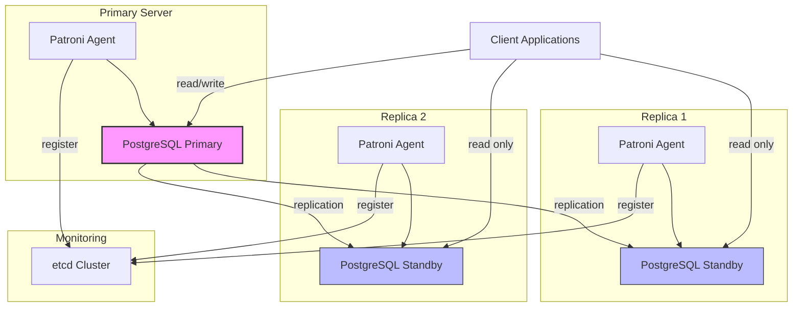
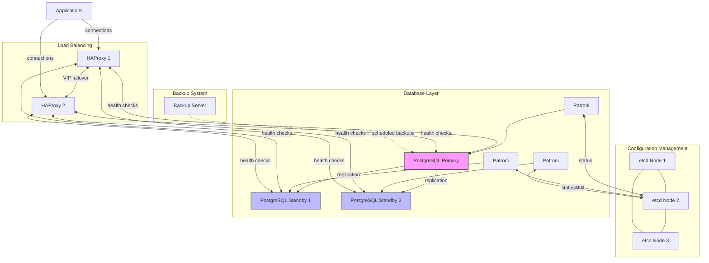

# PostgreSQL High Availability

## Introduction

In today's 24/7 digital world, database downtime can result in significant financial losses, damaged reputation, and poor user experience. High Availability (HA) in PostgreSQL refers to a set of techniques and configurations that ensure your database remains operational and accessible even when hardware fails, network issues occur, or during maintenance activities.

This guide explores the core concepts of PostgreSQL High Availability, various implementation strategies, and practical examples to help you design robust database systems that minimize downtime and maintain data integrity.

## What is High Availability?

High Availability is measured by the percentage of time a system remains operational. This is often expressed as "nines" - for example:

- Two nines (99%) = Up to 3.65 days of downtime per year
- Three nines (99.9%) = Up to 8.76 hours of downtime per year
- Four nines (99.99%) = Up to 52.56 minutes of downtime per year
- Five nines (99.999%) = Up to 5.26 minutes of downtime per year

For most production systems, three or four nines is typically the goal, while critical financial or healthcare systems may aim for five nines.

## Key Metrics in High Availability

Before diving into implementation details, let's understand two crucial metrics:

1. **Recovery Time Objective (RTO)**: The maximum acceptable time to restore system functionality after a failure.
2. **Recovery Point Objective (RPO)**: The maximum acceptable data loss measured in time.

Your HA strategy will be heavily influenced by your specific RTO and RPO requirements.

## PostgreSQL HA Components and Strategies

### 1. Replication

Replication creates and maintains copies of your database to provide redundancy and is the foundation of most HA solutions.

#### Physical Replication

Physical replication copies the entire database at the binary level.

**Streaming Replication** is PostgreSQL's built-in replication mechanism, where changes from the Write-Ahead Log (WAL) are streamed from the primary to one or more standby servers.

```sql
# On primary server postgresql.conf
wal_level = replica
max_wal_senders = 10
wal_keep_segments = 64
```

Create a user with replication privileges:

```sql
CREATE ROLE replicator WITH LOGIN REPLICATION PASSWORD 'strongpassword';
```

Set up authentication in `pg_hba.conf`:

```
# Allow replication connections from the standby server
host replication replicator 192.168.1.100/32 md5
```

On the standby server, use `pg_basebackup` to create an initial copy:

```bash
pg_basebackup -h primary_server -D /var/lib/postgresql/data -U replicator -P -v
```

Configure the standby in `postgresql.conf`:

```
primary_conninfo = 'host=primary_server port=5432 user=replicator password=strongpassword'
```

And create a `standby.signal` file:

```bash
touch /var/lib/postgresql/data/standby.signal
```

#### Logical Replication

Logical replication replicates data changes at the logical level (tables, rows) rather than the physical file level. This was introduced in PostgreSQL 10 and offers more flexibility but less completeness than physical replication.

```sql
-- On primary server:
CREATE PUBLICATION all_tables FOR ALL TABLES;

-- On standby server:
CREATE SUBSCRIPTION my_subscription 
CONNECTION 'host=primary_server port=5432 dbname=mydb user=replicator password=strongpassword' 
PUBLICATION all_tables;
```

### 2. Failover Mechanisms

Failover is the process of switching from the primary to a standby server when the primary fails.

#### Manual Failover

The simplest approach is manual intervention, where a DBA promotes a standby server when needed:

```bash
# On the standby server
pg_ctl promote
```

#### Automated Failover

Several tools can automate the failover process:

**Patroni** is a popular solution that uses a distributed configuration store (like etcd, Consul, or ZooKeeper) to manage PostgreSQL high-availability.

Here's a simplified Patroni configuration:

```yaml
scope: postgres-cluster
name: node1
restapi:
  listen: 0.0.0.0:8008
  connect_address: 192.168.1.101:8008
etcd:
  host: 192.168.1.201:2379
bootstrap:
  dcs:
    ttl: 30
    loop_wait: 10
    retry_timeout: 10
    maximum_lag_on_failover: 1048576
    postgresql:
      use_pg_rewind: true
      parameters:
        max_connections: 100
        shared_buffers: 4GB
        wal_level: replica
        hot_standby: "on"
        max_wal_senders: 10
        max_replication_slots: 10
        wal_keep_segments: 100
  initdb:
    - encoding: UTF8
    - data-checksums
postgresql:
  listen: 0.0.0.0:5432
  connect_address: 192.168.1.101:5432
  data_dir: /var/lib/postgresql/data
  pgpass: /tmp/pgpass
  authentication:
    replication:
      username: replicator
      password: strongpassword
    superuser:
      username: postgres
      password: postgres_password
  parameters:
    unix_socket_directories: '/var/run/postgresql'
```

Let's visualize a Patroni-managed PostgreSQL cluster:



**Repmgr** is another popular failover manager for PostgreSQL:

```bash
# Create a repmgr.conf file
node_id=1
node_name=node1
conninfo='host=192.168.1.101 user=repmgr dbname=repmgr'
data_directory='/var/lib/postgresql/data'
```

**PgPool-II** provides load balancing, connection pooling, and automated failover:

```
# Sample pgpool.conf snippet
backend_hostname0 = 'primary.example.com'
backend_port0 = 5432
backend_weight0 = 1
backend_hostname1 = 'standby.example.com'
backend_port1 = 5432
backend_weight1 = 1
```

### 3. Load Balancing

Load balancers distribute database connections across multiple servers. This improves both performance and availability.

**PgPool-II** can be configured to send write operations to the primary and read operations to standbys:

```
load_balance_mode = on
master_slave_mode = on
master_slave_sub_mode = 'stream'
```

**HAProxy** is another popular option:

```
frontend pgsql
    bind *:5432
    mode tcp
    default_backend postgresql-cluster

backend postgresql-cluster
    mode tcp
    balance roundrobin
    option pgsql-check user repmgr
    server postgres-1 192.168.1.101:5432 check
    server postgres-2 192.168.1.102:5432 check backup
```

### 4. Regular Backups

Even with replication, regular backups are essential:

```bash
# Full backup
pg_basebackup -D /backup/full-$(date +%Y%m%d) -F tar -X fetch -z -v

# Or using pg_dump for logical backups
pg_dump -Fc -v -f /backup/logical-$(date +%Y%m%d).dump dbname
```

## Implementing a Complete HA Solution

Let's build a complete HA solution combining multiple components:

1. **Main Components**:
   - Primary PostgreSQL server
   - Multiple standby servers
   - Load balancer (HAProxy)
   - Failover manager (Patroni)
   - Consistent distributed configuration store (etcd)
   - Regular backup solution

Let's see how this all fits together:



## Practical Example: Setting Up a Simple HA Cluster

Let's walk through a simplified example of setting up a basic HA PostgreSQL cluster using streaming replication and Patroni.

### Step 1: Install PostgreSQL and Patroni on all nodes

```bash
# On all nodes (Ubuntu/Debian)
apt update
apt install -y postgresql-14 python3-pip
pip3 install patroni[etcd] psycopg2-binary
```

### Step 2: Set up etcd cluster

```bash
# Install and configure etcd on separate nodes
apt install -y etcd

# Configure etcd to form a cluster
# Example etcd.conf for node1
ETCD_NAME="etcd1"
ETCD_DATA_DIR="/var/lib/etcd"
ETCD_LISTEN_PEER_URLS="http://192.168.1.201:2380"
ETCD_LISTEN_CLIENT_URLS="http://192.168.1.201:2379,http://127.0.0.1:2379"
ETCD_INITIAL_ADVERTISE_PEER_URLS="http://192.168.1.201:2380"
ETCD_INITIAL_CLUSTER="etcd1=http://192.168.1.201:2380,etcd2=http://192.168.1.202:2380,etcd3=http://192.168.1.203:2380"
ETCD_INITIAL_CLUSTER_STATE="new"
ETCD_INITIAL_CLUSTER_TOKEN="postgres-cluster-token"
ETCD_ADVERTISE_CLIENT_URLS="http://192.168.1.201:2379"
```

### Step 3: Create Patroni configuration on all nodes

For the first node (primary):

```yaml
# /etc/patroni/patroni.yml
scope: postgres-cluster
name: node1
restapi:
  listen: 0.0.0.0:8008
  connect_address: 192.168.1.101:8008
etcd:
  hosts: ["192.168.1.201:2379", "192.168.1.202:2379", "192.168.1.203:2379"]
bootstrap:
  dcs:
    ttl: 30
    loop_wait: 10
    retry_timeout: 10
    maximum_lag_on_failover: 1048576
    postgresql:
      use_pg_rewind: true
      parameters:
        max_connections: 100
        shared_buffers: 1GB
        wal_level: replica
        hot_standby: "on"
        max_wal_senders: 10
        max_replication_slots: 10
        wal_keep_segments: 100
  initdb:
    - encoding: UTF8
    - data-checksums
postgresql:
  listen: 0.0.0.0:5432
  connect_address: 192.168.1.101:5432
  data_dir: /var/lib/postgresql/data
  pgpass: /tmp/pgpass
  authentication:
    replication:
      username: replicator
      password: strongpassword
    superuser:
      username: postgres
      password: postgres_password
  parameters:
    unix_socket_directories: '/var/run/postgresql'
```

For the standby nodes, create similar configurations with different `name` and `connect_address` values.

### Step 4: Create a systemd service for Patroni

```ini
# /etc/systemd/system/patroni.service
[Unit]
Description=Patroni PostgreSQL Cluster
After=network.target

[Service]
User=postgres
Group=postgres
Type=simple
ExecStart=/usr/local/bin/patroni /etc/patroni/patroni.yml
KillMode=process
TimeoutSec=30
Restart=always

[Install]
WantedBy=multi-user.target
```

### Step 5: Start the services

```bash
# Enable and start the service
systemctl enable patroni
systemctl start patroni

# Check status
systemctl status patroni

# View cluster status
patronictl -c /etc/patroni/patroni.yml list
```

### Step 6: Set up HAProxy for load balancing

```
# /etc/haproxy/haproxy.cfg
global
    maxconn 100
    log 127.0.0.1 local0 notice

defaults
    log global
    mode tcp
    retries 2
    timeout client 30m
    timeout connect 4s
    timeout server 30m
    timeout check 5s

listen stats
    mode http
    bind *:7000
    stats enable
    stats uri /

listen postgres
    bind *:5432
    option httpchk
    http-check expect status 200
    default-server inter 3s fall 3 rise 2 on-marked-down shutdown-sessions
    server postgresql_node1 192.168.1.101:5432 maxconn 100 check port 8008
    server postgresql_node2 192.168.1.102:5432 maxconn 100 check port 8008
    server postgresql_node3 192.168.1.103:5432 maxconn 100 check port 8008
```

### Step 7: Test failover

To test a failover scenario:

```bash
# Stop PostgreSQL on the primary
patronictl -c /etc/patroni/patroni.yml pause
systemctl stop patroni

# Check that a standby was promoted
patronictl -c /etc/patroni/patroni.yml list
```

## Common Challenges and Solutions

### Time Synchronization

Ensure all database servers use NTP for time synchronization to prevent replication issues:

```bash
apt install -y ntp
systemctl enable ntp
systemctl start ntp
```

### Network Partition Handling

Configure proper fencing mechanisms to prevent "split-brain" scenarios where multiple nodes think they're primary:

```yaml
# In patroni.yml
watchdog:
  mode: automatic
  device: /dev/watchdog
  safety_margin: 5
```

### Monitoring

Set up comprehensive monitoring using tools like Prometheus and Grafana:

```yaml
# In patroni.yml
postgresql:
  parameters:
    shared_preload_libraries: 'pg_stat_statements'
```

## Best Practices

1. **Regular Testing**: Conduct scheduled failover drills to ensure your HA system works as expected.
   
2. **Backup Verification**: Regularly restore backups to test their validity.
   
3. **Documentation**: Maintain detailed documentation of your HA setup, including configurations and recovery procedures.
   
4. **Monitoring**: Implement comprehensive monitoring to detect issues before they cause outages.
   
5. **Network Redundancy**: Implement redundant network paths between all components.

## Summary

PostgreSQL High Availability is critical for maintaining business continuity. By implementing replication, automated failover, load balancing, and regular backups, you can build a robust system that minimizes downtime and data loss.

Remember that high availability is not just about technology—it's also about processes, monitoring, and regular testing. The right approach depends on your specific requirements, particularly your RTO and RPO goals.

## Additional Resources

- [PostgreSQL Documentation on High Availability](https://www.postgresql.org/docs/current/high-availability.html)
- [Patroni GitHub Repository](https://github.com/zalando/patroni)
- [PgPool-II Documentation](https://www.pgpool.net/docs/latest/en/html/)
- [PostgreSQL Wiki: Replication, Clustering, and Connection Pooling](https://wiki.postgresql.org/wiki/Replication,_Clustering,_and_Connection_Pooling)

## Exercises

1. Set up a simple streaming replication between two PostgreSQL servers.
2. Configure Patroni on a three-node PostgreSQL cluster and test manual failover.
3. Implement a backup strategy with daily base backups and hourly WAL archiving.
4. Configure HAProxy to load balance read queries across multiple PostgreSQL servers.
5. Simulate a primary server failure and document the failover process and recovery steps.