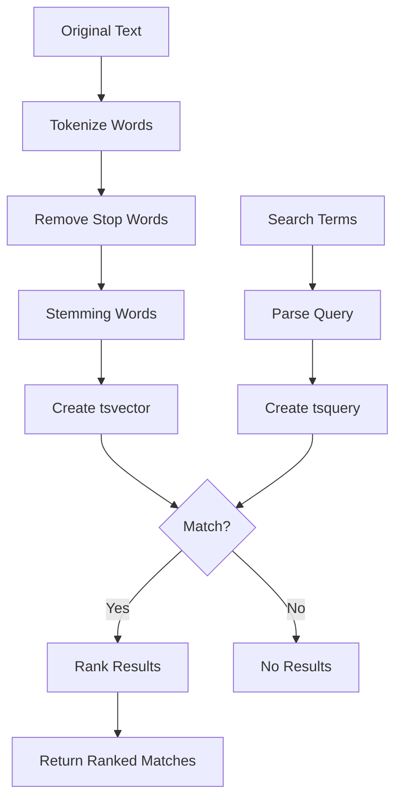

# PostgreSQL Full-Text Search

## Introduction

Full-text search is a powerful feature that allows you to efficiently search through large volumes of text data. Unlike simple `LIKE` or regex queries, PostgreSQL's full-text search provides intelligent text searching with capabilities like:

- Ranking results by relevance
- Stemming (finding variations of words)
- Handling stop words (common words like "the", "and", etc.)
- Supporting multiple languages
- Fast performance even with large text bodies

In this tutorial, we'll explore how PostgreSQL implements full-text search, when to use it, and how to leverage its advanced features in your applications.

## Basic Concepts

### Documents and Queries

In full-text search terminology:

- **Document**: The text data being searched (could be a text column in your database)
- **Query**: The search criteria
- **Search result**: Matching documents, often with a relevance score

### Text Search Data Types

PostgreSQL introduces specialized data types for full-text search:

- `tsvector`: Represents a document in a format optimized for text search
- `tsquery`: Represents a search query

Let's understand these with examples.

## Getting Started with Full-Text Search

### Converting Text to tsvector

Before we can search text efficiently, we need to convert it to the `tsvector` type:

```sql
SELECT to_tsvector('english', 'The quick brown fox jumps over the lazy dog');
```

This produces:

```
'brown':3 'dog':9 'fox':4 'jump':5 'lazi':8 'quick':2
```

Notice how:
- Words are converted to their root form (stemming) - "jumps" → "jump" and "lazy" → "lazi"
- Common words like "the" and "over" are removed
- Each word is stored with its position in the original text

### Creating a Basic Search Query

To search for terms, we use the `tsquery` type:

```sql
SELECT to_tsquery('english', 'jumping & dog');
```

Result:
```
'jump' & 'dog'
```

The input "jumping" was converted to its stem "jump". The `&` represents the AND operator.

### Performing a Basic Search

To search for documents that match a query, we use the `@@` operator:

```sql
SELECT 'The quick brown fox jumps over the lazy dog'::tsvector @@ 'fox & dog'::tsquery;
```

But this won't work correctly because we need to properly parse the original text. Let's use the correct approach:

```sql
SELECT to_tsvector('english', 'The quick brown fox jumps over the lazy dog') @@ 
       to_tsquery('english', 'fox & dog');
```

Result:
```
true
```

The document contains both "fox" and "dog", so it matches the query.

## Creating a Search Table

Let's create a table with full-text search capabilities:

```sql
CREATE TABLE articles (
  id SERIAL PRIMARY KEY,
  title TEXT NOT NULL,
  body TEXT NOT NULL,
  searchable_content TSVECTOR GENERATED ALWAYS AS 
    (to_tsvector('english', title || ' ' || body)) STORED
);

-- Create a GIN index for fast text searches
CREATE INDEX articles_searchable_content_idx ON articles USING GIN (searchable_content);
```

Now, let's add some sample data:

```sql
INSERT INTO articles (title, body) VALUES 
('PostgreSQL Basics', 'PostgreSQL is a powerful, open-source object-relational database system.'),
('Advanced SQL Techniques', 'Learn how to use advanced SQL features including joins, window functions, and CTEs.'),
('Database Performance Tuning', 'Techniques for optimizing PostgreSQL performance including indexing and query optimization.');
```

### Performing Searches on the Table

Simple search for articles about PostgreSQL:

```sql
SELECT id, title 
FROM articles
WHERE searchable_content @@ to_tsquery('english', 'postgresql');
```

Result:
```
 id |         title          
----+------------------------
  1 | PostgreSQL Basics
  3 | Database Performance Tuning
```

## Advanced Search Techniques

### Boolean Operators in Search Queries

PostgreSQL supports boolean operators in search queries:

```sql
-- Articles that contain "postgresql" AND "performance"
SELECT id, title 
FROM articles
WHERE searchable_content @@ to_tsquery('english', 'postgresql & performance');

-- Articles that contain "postgresql" OR "advanced"
SELECT id, title 
FROM articles
WHERE searchable_content @@ to_tsquery('english', 'postgresql | advanced');

-- Articles that contain "postgresql" but NOT "basics"
SELECT id, title 
FROM articles
WHERE searchable_content @@ to_tsquery('english', 'postgresql & !basics');
```

### Phrase Searching

To search for exact phrases:

```sql
SELECT id, title 
FROM articles
WHERE searchable_content @@ to_tsquery('english', 'postgresql <-> basics');
```

The `<->` operator specifies that "postgresql" must be immediately followed by "basics".

### Ranking Search Results

One of the most powerful features of full-text search is the ability to rank results by relevance:

```sql
SELECT id, title, 
       ts_rank(searchable_content, to_tsquery('english', 'postgresql & database')) AS rank
FROM articles
WHERE searchable_content @@ to_tsquery('english', 'postgresql & database')
ORDER BY rank DESC;
```

This will return articles that match the query, ordered by relevance.

### Highlighting Search Matches

PostgreSQL can highlight where matches occur in the text:

```sql
SELECT id, title,
       ts_headline('english', body, to_tsquery('english', 'postgresql'),
                  'StartSel=<b>, StopSel=</b>, MaxWords=50, MinWords=5')
FROM articles
WHERE searchable_content @@ to_tsquery('english', 'postgresql');
```

This will wrap matching terms with `<b>` and `</b>` tags.

## Real-World Application

Let's implement a practical search feature for a blog application:

```sql
-- Create a blog posts table with full-text search
CREATE TABLE blog_posts (
  id SERIAL PRIMARY KEY,
  title TEXT NOT NULL,
  content TEXT NOT NULL,
  author TEXT NOT NULL,
  published_date DATE NOT NULL DEFAULT CURRENT_DATE,
  searchable TSVECTOR GENERATED ALWAYS AS 
    (to_tsvector('english', title || ' ' || content || ' ' || author)) STORED
);

-- Create a GIN index for faster searches
CREATE INDEX blog_posts_searchable_idx ON blog_posts USING GIN (searchable);

-- Insert some sample posts
INSERT INTO blog_posts (title, content, author, published_date) VALUES
('Getting Started with PostgreSQL', 'This guide will help beginners understand the basics of PostgreSQL installation and setup.', 'John Smith', '2023-01-15'),
('10 PostgreSQL Performance Tips', 'Improve your database performance with these essential PostgreSQL optimization techniques.', 'Emma Davis', '2023-02-20'),
('PostgreSQL vs MySQL: Which Should You Choose?', 'A comprehensive comparison of PostgreSQL and MySQL for different use cases and requirements.', 'John Smith', '2023-03-10'),
('Building a REST API with Node.js and PostgreSQL', 'Learn how to create a robust REST API using Node.js with a PostgreSQL database.', 'Sarah Johnson', '2023-03-25');

-- Search function that returns results with snippets and ranking
CREATE OR REPLACE FUNCTION search_blog_posts(search_terms TEXT) 
RETURNS TABLE (
  id INTEGER,
  title TEXT,
  author TEXT,
  published_date DATE,
  snippet TEXT,
  rank FLOAT4
) AS $$
BEGIN
  RETURN QUERY
  SELECT 
    bp.id,
    bp.title,
    bp.author,
    bp.published_date,
    ts_headline('english', bp.content, to_tsquery('english', search_terms),
               'StartSel=<mark>, StopSel=</mark>, MaxFragments=2, MaxWords=30'),
    ts_rank(bp.searchable, to_tsquery('english', search_terms)) AS rank
  FROM blog_posts bp
  WHERE bp.searchable @@ to_tsquery('english', search_terms)
  ORDER BY rank DESC;
END;
$$ LANGUAGE plpgsql;

-- Example usage:
-- SELECT * FROM search_blog_posts('postgresql & performance');
-- Results will include posts about PostgreSQL performance, ranked by relevance with highlighted snippets
```

This example creates a complete search functionality that:
1. Stores blog posts with a searchable vector combining title, content, and author
2. Uses a function to provide a clean interface for searching
3. Returns search results with relevant snippets and ranking

## Language Support

PostgreSQL full-text search supports multiple languages. You can specify the language when creating tsvectors:

```sql
-- English (default)
SELECT to_tsvector('english', 'I am running through the forest');
-- Result: 'forest':6 'run':3 'though':4

-- Spanish
SELECT to_tsvector('spanish', 'Estoy corriendo por el bosque');
-- Result: 'bosqu':5 'corr':2 'por':3

-- French
SELECT to_tsvector('french', 'Je cours à travers la forêt');
-- Result: 'cour':2 'foret':6 'travers':4
```

## Performance Considerations

For optimal full-text search performance:

1. **Always use GIN indexes** for `tsvector` columns
2. Use `STORED` generated columns for frequently searched text
3. For very large tables, consider materializing search vectors with triggers
4. Use `plainto_tsquery()` or `phraseto_tsquery()` for user input to prevent syntax errors

### Advanced Performance Example

For very large tables where updates are not frequent:

```sql
-- Create a materialized view for search
CREATE MATERIALIZED VIEW article_search AS
SELECT id, title, body, 
       to_tsvector('english', title || ' ' || body) AS document
FROM articles;

-- Add index to the materialized view
CREATE INDEX article_search_idx ON article_search USING GIN (document);

-- Refresh when data changes
REFRESH MATERIALIZED VIEW article_search;

-- Search using the materialized view
SELECT id, title
FROM article_search
WHERE document @@ to_tsquery('english', 'postgresql & performance')
ORDER BY ts_rank(document, to_tsquery('english', 'postgresql & performance')) DESC;
```

## Visualizing Full-Text Search

Let's use a Mermaid diagram to visualize the PostgreSQL full-text search process:



## Summary

PostgreSQL's full-text search is a powerful feature that enables sophisticated text searching capabilities:

- It transforms text into optimized `tsvector` format
- Supports complex queries with boolean operators and phrase matching
- Can rank results by relevance
- Provides language-aware stemming and stop word handling
- Offers excellent performance with proper indexing

By implementing full-text search, you can significantly improve search capabilities in your applications without needing separate search engines for basic to moderate use cases.

## Additional Resources and Exercises

### Further Learning

- PostgreSQL official documentation on [Text Search](https://www.postgresql.org/docs/current/textsearch.html)
- Explore the `pg_trgm` extension for fuzzy string matching and similarity searches

### Exercises to Practice

1. Create a books table with fields for title, author, description, and publication year. Implement full-text search across all text fields.

2. Write a query to find all books about "machine learning" or "artificial intelligence" published after 2020, ranked by relevance.

3. Implement a custom ranking function that gives higher weight to matches in the title than in the description.

4. Create a function that takes a search term and returns the top 5 most relevant books with highlighted match snippets.

5. Experiment with different languages in `to_tsvector()` for a multilingual book database.

By mastering PostgreSQL's full-text search capabilities, you'll be able to implement powerful search features in your applications without the complexity of setting up separate search services.