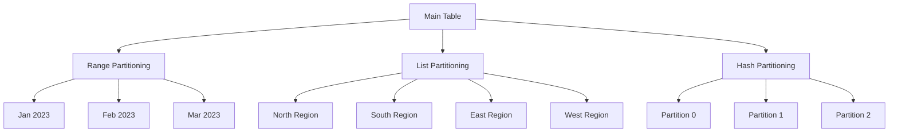

# PostgreSQL Partitioning

## Introduction

Table partitioning is a powerful PostgreSQL feature that allows you to split large tables into smaller, more manageable pieces while maintaining the appearance of a single table to queries. By breaking down massive tables into logical segments, partitioning significantly improves query performance, simplifies maintenance operations, and enhances overall database efficiency.

In this tutorial, we'll explore PostgreSQL's partitioning capabilities, understand when and why to use table partitioning, and implement different partitioning strategies with practical examples.

## Why Use Partitioning?

Before diving into how partitioning works, let's understand why you might want to use it:

- **Improved query performance**: Queries that filter on the partition key can skip irrelevant partitions
- **Faster maintenance operations**: Operations like vacuuming and indexing run on smaller tables
- **Efficient data aging**: Dropping old data becomes as simple as dropping a partition
- **Better storage management**: Different partitions can use different tablespaces

## Partitioning Types in PostgreSQL

PostgreSQL supports three main types of partitioning:

1. **Range Partitioning**: Divides data based on ranges of values (e.g., date ranges)
2. **List Partitioning**: Divides data based on discrete lists of values (e.g., regions)
3. **Hash Partitioning**: Distributes data evenly across partitions using a hash function

Let's visualize the different partitioning types:



## Setting Up a Partitioned Table

Let's create a partitioned table to store sales data. We'll use range partitioning by date:

```sql
-- Create the partitioned table
CREATE TABLE sales (
    sale_id SERIAL,
    sale_date DATE NOT NULL,
    customer_id INTEGER,
    product_id INTEGER,
    quantity INTEGER,
    amount NUMERIC(10, 2)
) PARTITION BY RANGE (sale_date);

-- Create individual partitions
CREATE TABLE sales_q1_2023 PARTITION OF sales
    FOR VALUES FROM ('2023-01-01') TO ('2023-04-01');

CREATE TABLE sales_q2_2023 PARTITION OF sales
    FOR VALUES FROM ('2023-04-01') TO ('2023-07-01');

CREATE TABLE sales_q3_2023 PARTITION OF sales
    FOR VALUES FROM ('2023-07-01') TO ('2023-10-01');

CREATE TABLE sales_q4_2023 PARTITION OF sales
    FOR VALUES FROM ('2023-10-01') TO ('2024-01-01');
```

In this example, we've:
1. Created a `sales` table that's partitioned by the `sale_date` column
2. Created four partitions, one for each quarter of 2023

## Inserting Data into Partitioned Tables

Now let's insert some data into our partitioned table:

```sql
-- Insert data for Q1 2023
INSERT INTO sales (sale_date, customer_id, product_id, quantity, amount)
VALUES 
    ('2023-01-15', 101, 5, 2, 199.98),
    ('2023-02-20', 102, 3, 1, 49.99),
    ('2023-03-05', 103, 7, 3, 299.97);

-- Insert data for Q2 2023
INSERT INTO sales (sale_date, customer_id, product_id, quantity, amount)
VALUES 
    ('2023-04-10', 104, 2, 1, 29.99),
    ('2023-05-22', 105, 8, 2, 159.98),
    ('2023-06-18', 106, 1, 5, 99.95);
```

PostgreSQL automatically routes each row to the appropriate partition based on the `sale_date` value. You can verify this by querying the individual partitions:

```sql
-- Check data in Q1 partition
SELECT * FROM sales_q1_2023;

-- Check data in Q2 partition
SELECT * FROM sales_q2_2023;
```

## List Partitioning Example

For list partitioning, let's create a table to store customer data by region:

```sql
-- Create a list-partitioned table
CREATE TABLE customers (
    customer_id SERIAL,
    name TEXT,
    email TEXT,
    region TEXT NOT NULL
) PARTITION BY LIST (region);

-- Create partitions for different regions
CREATE TABLE customers_north PARTITION OF customers
    FOR VALUES IN ('NORTH', 'NORTHEAST', 'NORTHWEST');

CREATE TABLE customers_south PARTITION OF customers
    FOR VALUES IN ('SOUTH', 'SOUTHEAST', 'SOUTHWEST');

CREATE TABLE customers_east PARTITION OF customers
    FOR VALUES IN ('EAST', 'NORTHEAST', 'SOUTHEAST');

CREATE TABLE customers_west PARTITION OF customers
    FOR VALUES IN ('WEST', 'NORTHWEST', 'SOUTHWEST');
```

Now insert some data:

```sql
-- Insert customer data
INSERT INTO customers (name, email, region)
VALUES
    ('John Doe', 'john@example.com', 'NORTH'),
    ('Jane Smith', 'jane@example.com', 'SOUTH'),
    ('Bob Johnson', 'bob@example.com', 'EAST'),
    ('Alice Brown', 'alice@example.com', 'WEST'),
    ('Charlie Green', 'charlie@example.com', 'NORTHEAST');
```

## Hash Partitioning Example

Hash partitioning is useful when there's no natural way to range or list partition your data:

```sql
-- Create a hash-partitioned table
CREATE TABLE products (
    product_id SERIAL,
    name TEXT,
    category TEXT,
    price NUMERIC(10, 2)
) PARTITION BY HASH (product_id);

-- Create 4 partitions
CREATE TABLE products_p0 PARTITION OF products
    FOR VALUES WITH (MODULUS 4, REMAINDER 0);

CREATE TABLE products_p1 PARTITION OF products
    FOR VALUES WITH (MODULUS 4, REMAINDER 1);

CREATE TABLE products_p2 PARTITION OF products
    FOR VALUES WITH (MODULUS 4, REMAINDER 2);

CREATE TABLE products_p3 PARTITION OF products
    FOR VALUES WITH (MODULUS 4, REMAINDER 3);
```

Insert some product data:

```sql
-- Insert product data
INSERT INTO products (name, category, price)
VALUES
    ('Laptop', 'Electronics', 999.99),
    ('Smartphone', 'Electronics', 699.99),
    ('Coffee Maker', 'Appliances', 49.99),
    ('Headphones', 'Electronics', 199.99),
    ('Blender', 'Appliances', 79.99),
    ('Monitor', 'Electronics', 249.99),
    ('Keyboard', 'Accessories', 59.99),
    ('Mouse', 'Accessories', 29.99);
```

## Query Performance Benefits

One of the main advantages of partitioning is improved query performance. When you run a query that includes the partition key in the WHERE clause, PostgreSQL can use partition pruning to skip irrelevant partitions:

```sql
-- This query only scans the Q1 partition
EXPLAIN ANALYZE
SELECT * FROM sales
WHERE sale_date BETWEEN '2023-01-01' AND '2023-03-31';

-- This query only scans the North region partition
EXPLAIN ANALYZE
SELECT * FROM customers
WHERE region = 'NORTH';
```

When you run these queries with `EXPLAIN ANALYZE`, you'll see that PostgreSQL only scans the relevant partitions, which can significantly reduce query execution time for large tables.

## Managing Partitions

### Adding New Partitions

As your data grows, you may need to add new partitions:

```sql
-- Add a partition for Q1 2024
CREATE TABLE sales_q1_2024 PARTITION OF sales
    FOR VALUES FROM ('2024-01-01') TO ('2024-04-01');
```

### Removing Old Partitions

When you no longer need older data, you can simply drop the corresponding partition:

```sql
-- Drop the Q1 2023 partition
DROP TABLE sales_q1_2023;
```

This is much faster than deleting rows from a non-partitioned table.

### Sub-partitioning

PostgreSQL also supports sub-partitioning, where a partition itself is further partitioned:

```sql
-- Create a table partitioned by year and then by month
CREATE TABLE events (
    event_id SERIAL,
    event_time TIMESTAMP NOT NULL,
    event_type TEXT,
    payload JSONB
) PARTITION BY RANGE (event_time);

-- Create a partition for 2023
CREATE TABLE events_2023 PARTITION OF events
    FOR VALUES FROM ('2023-01-01') TO ('2024-01-01')
    PARTITION BY RANGE (event_time);

-- Create monthly sub-partitions for 2023
CREATE TABLE events_2023_01 PARTITION OF events_2023
    FOR VALUES FROM ('2023-01-01') TO ('2023-02-01');

CREATE TABLE events_2023_02 PARTITION OF events_2023
    FOR VALUES FROM ('2023-02-01') TO ('2023-03-01');

-- Add more monthly partitions as needed
```

## Best Practices

Here are some best practices for working with PostgreSQL partitioning:

1. **Choose the right partition key**: Select a column that will distribute data evenly and is frequently used in WHERE clauses
2. **Plan for growth**: Create partitions proactively for future data
3. **Create indexes on each partition**: Each partition can have its own indexes
4. **Use constraint exclusion**: Ensure your queries use the partition key for maximum efficiency
5. **Monitor partition sizes**: Keep partitions at a reasonable size (not too small, not too large)
6. **Consider automating partition management**: Use tools or procedures to create and drop partitions automatically

## Real-World Use Cases

### Time-Series Data

Partitioning is ideal for time-series data like:

```sql
-- Create a partitioned table for IoT sensor readings
CREATE TABLE sensor_readings (
    reading_id BIGSERIAL,
    sensor_id INTEGER,
    reading_time TIMESTAMP NOT NULL,
    temperature NUMERIC(5, 2),
    humidity NUMERIC(5, 2),
    pressure NUMERIC(8, 2)
) PARTITION BY RANGE (reading_time);

-- Create monthly partitions
CREATE TABLE sensor_readings_2023_01 PARTITION OF sensor_readings
    FOR VALUES FROM ('2023-01-01') TO ('2023-02-01');

CREATE TABLE sensor_readings_2023_02 PARTITION OF sensor_readings
    FOR VALUES FROM ('2023-02-01') TO ('2023-03-01');
```

### Multi-tenant Applications

For SaaS applications with separate tenants:

```sql
-- Create a partitioned table for multi-tenant data
CREATE TABLE tenant_data (
    data_id SERIAL,
    tenant_id INTEGER NOT NULL,
    created_at TIMESTAMP,
    data JSONB
) PARTITION BY LIST (tenant_id);

-- Create partitions for different tenants
CREATE TABLE tenant_data_100 PARTITION OF tenant_data
    FOR VALUES IN (100);

CREATE TABLE tenant_data_200 PARTITION OF tenant_data
    FOR VALUES IN (200);

CREATE TABLE tenant_data_300 PARTITION OF tenant_data
    FOR VALUES IN (300);
```

## Performance Comparison

To see the benefits of partitioning firsthand, let's compare the performance of partitioned vs. non-partitioned tables:

```sql
-- Create a non-partitioned table with 1 million rows
CREATE TABLE sales_non_partitioned AS
SELECT
    generate_series AS sale_id,
    '2023-01-01'::DATE + (random() * 365)::INTEGER AS sale_date,
    (random() * 1000)::INTEGER AS customer_id,
    (random() * 100)::INTEGER AS product_id,
    (random() * 10 + 1)::INTEGER AS quantity,
    (random() * 1000)::NUMERIC(10,2) AS amount
FROM generate_series(1, 1000000);

-- Add an index
CREATE INDEX ON sales_non_partitioned (sale_date);

-- Now run a query on both tables and compare
EXPLAIN ANALYZE
SELECT * FROM sales
WHERE sale_date BETWEEN '2023-01-01' AND '2023-01-31';

EXPLAIN ANALYZE
SELECT * FROM sales_non_partitioned
WHERE sale_date BETWEEN '2023-01-01' AND '2023-01-31';
```

For large tables, you'll typically see significantly better performance with the partitioned table.

## Common Pitfalls and Limitations

While partitioning offers many benefits, be aware of these limitations:

1. **Primary keys must include the partition key**: In a partitioned table, primary keys must include the partitioning column(s)
2. **Foreign key references**: There are limitations on foreign key references to or from partitioned tables
3. **UPDATE operations that change the partition key**: These are more expensive as they require moving data between partitions
4. **Overhead for small tables**: Partitioning adds complexity and may not be beneficial for small tables

## Summary

PostgreSQL partitioning is a powerful technique for managing large tables by breaking them into smaller, manageable pieces. This approach offers significant performance improvements for queries, simplifies maintenance operations, and provides efficient data lifecycle management.

We've covered:
- Three types of partitioning: range, list, and hash
- How to create and manage partitioned tables
- Best practices for using partitioning effectively
- Real-world use cases where partitioning shines

By implementing partitioning in your PostgreSQL database, you can handle larger volumes of data while maintaining excellent query performance.

## Additional Resources

To learn more about PostgreSQL partitioning:

- PostgreSQL official documentation on partitioning
- The `pg_partman` extension for automated partition management
- PostgreSQL performance tuning guides

## Practice Exercises

1. Create a partitioned table to store website traffic data, partitioned by day
2. Implement a partition management strategy that automatically creates partitions for the next month and drops partitions older than a year
3. Compare the performance of COUNT(*) queries on partitioned vs. non-partitioned tables with millions of rows
4. Design a partitioning strategy for a multi-tenant application with varying amounts of data per tenant