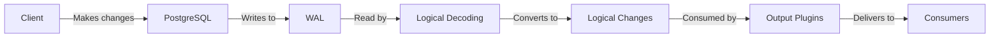

# PostgreSQL Logical Decoding

## Introduction

PostgreSQL logical decoding is a powerful feature that allows you to extract and process committed changes from a PostgreSQL database in a format that's easy to understand and consume. Introduced in PostgreSQL 9.4, logical decoding provides the foundation for change data capture (CDC) systems, enabling applications to react to database changes in real-time without constantly polling the database.

Unlike physical replication which copies entire data files, logical decoding works at a higher level, capturing the logical changes made to your data. This makes it ideal for scenarios like:

- Streaming database changes to external systems
- Building audit trails
- Implementing cross-database or cross-system replication
- Creating event-driven architectures

In this article, we'll explore how logical decoding works, how to set it up, and demonstrate practical examples of using this powerful feature.

## How Logical Decoding Works

At its core, logical decoding leverages PostgreSQL's write-ahead log (WAL) to capture database changes. Here's how the process works:



1. When a transaction commits, PostgreSQL writes the changes to the WAL
2. The logical decoding infrastructure reads these WAL records
3. The changes are converted from physical (block/byte) level to logical (row/table) level
4. Output plugins format these logical changes into specific formats (JSON, SQL, custom formats)
5. Applications consume these changes through replication slots

## Prerequisites

To use logical decoding, you need to:

1. Set up a PostgreSQL database (version 9.4 or higher)
2. Configure your `postgresql.conf` with these settings:

```
wal_level = logical
max_replication_slots = 10  # Adjust based on your needs
max_wal_senders = 10        # Adjust based on your needs
```

3. Restart your PostgreSQL server to apply these changes

## Creating a Replication Slot

A replication slot is a named resource that maintains state information about logical decoding consumers. To create a replication slot:

```sql
SELECT * FROM pg_create_logical_replication_slot('my_slot', 'test_decoding');
```

This command creates a slot named 'my_slot' using the built-in 'test_decoding' output plugin. The output should look like:

```
 slot_name |    lsn    
-----------+-----------
 my_slot   | 0/16A7998
```

## Consuming Changes

Once you have a replication slot, you can start consuming changes. Let's create a simple table and watch the changes:

```sql
-- Create a test table
CREATE TABLE test_logical_decoding (
  id SERIAL PRIMARY KEY,
  name TEXT,
  created_at TIMESTAMP DEFAULT CURRENT_TIMESTAMP
);

-- Make some changes
INSERT INTO test_logical_decoding (name) VALUES ('First entry');
UPDATE test_logical_decoding SET name = 'Updated first entry' WHERE id = 1;
DELETE FROM test_logical_decoding WHERE id = 1;
```

Now, retrieve the changes from the replication slot:

```sql
SELECT * FROM pg_logical_slot_get_changes('my_slot', NULL, NULL);
```

The output will show the changes in a human-readable format:

```
    lsn    |    xid    |                           data                           
-----------+-----------+----------------------------------------------------------
 0/16A7B50 | 565       | BEGIN 565
 0/16A7B50 | 565       | table public.test_logical_decoding: INSERT: id[integer]:1 name[text]:'First entry' created_at[timestamp without time zone]:'2023-06-15 10:30:00'
 0/16A7E20 | 565       | COMMIT 565
 0/16A7E58 | 566       | BEGIN 566
 0/16A7E58 | 566       | table public.test_logical_decoding: UPDATE: id[integer]:1 name[text]:'Updated first entry' created_at[timestamp without time zone]:'2023-06-15 10:30:00'
 0/16A8128 | 566       | COMMIT 566
 0/16A8160 | 567       | BEGIN 567
 0/16A8160 | 567       | table public.test_logical_decoding: DELETE: id[integer]:1
 0/16A8430 | 567       | COMMIT 567
```

This shows every change made to the table, including:
- Transaction boundaries (BEGIN/COMMIT)
- Operation type (INSERT/UPDATE/DELETE)
- Row data

## Using Output Plugins

PostgreSQL comes with the 'test_decoding' plugin for basic testing, but there are more powerful plugins available:

1. **wal2json**: Produces JSON output
2. **pgoutput**: The standard logical replication plugin
3. **decoderbufs**: Produces Protocol Buffer output

Let's see an example with the wal2json plugin (you need to install it first):

```sql
-- Create a slot with wal2json
SELECT * FROM pg_create_logical_replication_slot('json_slot', 'wal2json');

-- Make some changes
INSERT INTO test_logical_decoding (name) VALUES ('JSON test');

-- Get changes in JSON format
SELECT * FROM pg_logical_slot_get_changes('json_slot', NULL, NULL);
```

The output will be in JSON format:

```
    lsn    |    xid    |                           data                           
-----------+-----------+----------------------------------------------------------
 0/16A8468 | 568       | {"change":[]}
 0/16A84A0 | 568       | {"change":[{"kind":"insert","schema":"public","table":"test_logical_decoding","columnnames":["id","name","created_at"],"columntypes":["integer","text","timestamp without time zone"],"columnvalues":[2,"JSON test","2023-06-15 10:35:00"]}]}
 0/16A8770 | 568       | {"change":[]}
```

This structured format is much easier to parse programmatically compared to the text output.

## Real-world Application: Building a Change Data Capture System

Now, let's build a simple Python application that captures changes and sends them to another system:

```python
import psycopg2
import psycopg2.extras
import json
import requests

# Connect to PostgreSQL
conn = psycopg2.connect("dbname=postgres user=postgres")
conn.set_isolation_level(psycopg2.extensions.ISOLATION_LEVEL_AUTOCOMMIT)
cursor = conn.cursor()

# Create replication slot if it doesn't exist
cursor.execute(
    "SELECT slot_name FROM pg_replication_slots WHERE slot_name = 'cdc_slot';"
)
if cursor.fetchone() is None:
    cursor.execute(
        "SELECT * FROM pg_create_logical_replication_slot('cdc_slot', 'wal2json');"
    )

# Continuously consume changes
webhook_url = "https://webhook.example.com/database-changes"

try:
    while True:
        cursor.execute(
            "SELECT * FROM pg_logical_slot_get_changes('cdc_slot', NULL, NULL);"
        )
        
        for record in cursor:
            lsn, xid, data = record
            
            # Skip empty changes
            if data == '{"change":[]}':
                continue
            
            # Parse the JSON data
            change_data = json.loads(data)
            
            # Process each change
            for change in change_data.get("change", []):
                # Send to webhook
                print(f"Sending change: {change}")
                requests.post(
                    webhook_url,
                    json={
                        "table": change["table"],
                        "operation": change["kind"],
                        "data": dict(zip(change["columnnames"], change["columnvalues"]))
                    }
                )
                
        # Sleep briefly to avoid CPU spinning
        import time
        time.sleep(0.1)
        
except KeyboardInterrupt:
    print("CDC process stopped")
```

This script:
1. Connects to PostgreSQL
2. Creates a replication slot if it doesn't exist
3. Continuously consumes changes
4. Parses the JSON data
5. Sends each change to a webhook

This is the foundation of a robust CDC system that can be extended to handle more complex scenarios.

## Managing Replication Slots

It's important to manage your replication slots properly:

### Viewing Existing Slots

```sql
SELECT * FROM pg_replication_slots;
```

### Dropping a Slot

```sql
SELECT pg_drop_replication_slot('my_slot');
```

### Monitoring Slot Lag

```sql
SELECT 
    slot_name,
    pg_size_pretty(pg_wal_lsn_diff(pg_current_wal_lsn(), restart_lsn)) AS lag
FROM pg_replication_slots;
```

If a slot falls behind or isn't consumed regularly, it can prevent WAL files from being removed, potentially filling up your disk space.

## Limitations and Considerations

When using logical decoding, be aware of these limitations:

1. **Performance impact**: Logical decoding adds some overhead to your database
2. **DDL changes**: Most DDL changes (like `ALTER TABLE`) are not captured
3. **Large transactions**: Very large transactions can consume significant memory
4. **Disk space**: Unconsumed changes can prevent WAL cleanup, potentially filling your disk
5. **TOAST data**: By default, TOAST data (large values stored outside the main table) might not be fully decoded

## Summary

PostgreSQL logical decoding is a powerful feature that enables real-time change data capture and event-driven architectures. By capturing committed transactions from the WAL and converting them to a logical format, it allows applications to react to database changes without constant polling.

In this article, we've learned:
- How logical decoding works with the PostgreSQL WAL
- How to configure and create replication slots
- How to consume changes using built-in and third-party output plugins
- How to build a simple CDC application with Python
- How to manage and monitor replication slots

Logical decoding forms the foundation for many advanced PostgreSQL features, including logical replication and third-party CDC tools like Debezium.

## Additional Resources

For further exploration:

- [PostgreSQL Official Documentation on Logical Decoding](https://www.postgresql.org/docs/current/logicaldecoding.html)
- [wal2json GitHub Repository](https://github.com/eulerto/wal2json)
- [Debezium - A distributed platform for change data capture](https://debezium.io/)

## Exercises

1. Set up logical decoding on your local PostgreSQL instance and capture changes to a table.
2. Create a simple application that consumes these changes and logs them to a file.
3. Extend the application to filter changes by table or operation type.
4. Implement a system that uses logical decoding to maintain a denormalized view of your data for faster queries.
5. Try creating a custom output plugin that formats the changes in a specific way for your application.