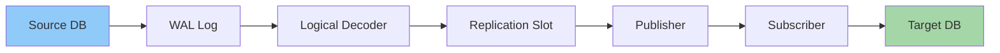
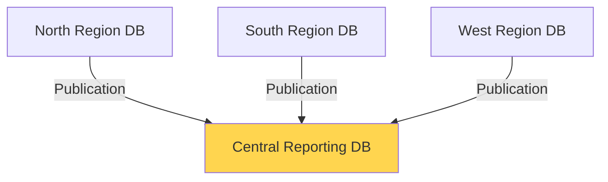

# PostgreSQL Publication Subscription

## Introduction

PostgreSQL's Publication-Subscription model (often abbreviated as "Pub-Sub") is a powerful logical replication feature introduced in PostgreSQL 10. Unlike physical replication that copies entire data files, logical replication allows you to selectively replicate specific tables or databases across PostgreSQL instances, making it an ideal solution for data distribution, migration, and creating read replicas.

In this guide, we'll explore how PostgreSQL's publication-subscription system works, its advantages, and how to implement it in your own database environment.

## What is Logical Replication?

Logical replication works by extracting changes from the source database (in the form of SQL statements) and applying them to the target database. This approach differs from physical replication, which copies data at the storage level.



The key components in PostgreSQL's logical replication are:

1. **Publication**: A collection of tables on the publisher side that you want to replicate
2. **Subscription**: The subscription on the target database that connects to a publication and receives the changes

## Benefits of Publication-Subscription

- **Table-level granularity**: Replicate only specific tables instead of entire databases
- **Cross-version compatibility**: Replicate between different PostgreSQL versions
- **Reduced overhead**: Lower impact on database performance compared to physical replication
- **Selective replication**: Filter which data changes get replicated
- **Real-time data synchronization**: Changes are applied to subscribers as they occur

## Setting Up PostgreSQL Publication-Subscription

Let's walk through a step-by-step example of configuring logical replication between two PostgreSQL databases.

### Prerequisites

1. Two PostgreSQL servers (version 10 or higher)
2. Appropriate network connectivity between the servers
3. PostgreSQL user with replication privileges

### Step 1: Configure the Publisher Database

First, we need to modify the `postgresql.conf` file on the publisher server to enable logical replication:

```sql
# In postgresql.conf
wal_level = logical
max_replication_slots = 10  # Adjust as needed
max_wal_senders = 10        # Adjust as needed
```

After making these changes, restart your PostgreSQL server.

### Step 2: Create a Test Table with Data

Let's create a sample table that we'll replicate to our subscriber:

```sql
-- On publisher database
CREATE TABLE customers (
    id SERIAL PRIMARY KEY,
    name VARCHAR(100),
    email VARCHAR(100),
    created_at TIMESTAMP DEFAULT CURRENT_TIMESTAMP
);

-- Insert some sample data
INSERT INTO customers (name, email) VALUES 
    ('John Doe', 'john@example.com'),
    ('Jane Smith', 'jane@example.com'),
    ('Robert Johnson', 'robert@example.com');
```

### Step 3: Create a Publication

Now, let's create a publication that includes our customers table:

```sql
-- On publisher database
CREATE PUBLICATION customers_pub FOR TABLE customers;
```

You can verify the publication was created:

```sql
-- On publisher database
SELECT * FROM pg_publication;
```

Output:
```
 oid  |     pubname     | pubowner | puballtables | pubinsert | pubupdate | pubdelete | pubtruncate 
------+-----------------+----------+--------------+-----------+-----------+-----------+-------------
 16385 | customers_pub  |       10 | f            | t         | t         | t         | t
```

### Step 4: Configure the Subscriber Database

Now, switch to your subscriber database and create the same table structure:

```sql
-- On subscriber database
CREATE TABLE customers (
    id SERIAL PRIMARY KEY,
    name VARCHAR(100),
    email VARCHAR(100),
    created_at TIMESTAMP DEFAULT CURRENT_TIMESTAMP
);
```

### Step 5: Create a Subscription

Create a subscription that connects to the publisher's publication:

```sql
-- On subscriber database
CREATE SUBSCRIPTION customers_sub
    CONNECTION 'host=publisher_host port=5432 dbname=publisher_db user=replication_user password=your_password'
    PUBLICATION customers_pub;
```

Replace `publisher_host`, `publisher_db`, `replication_user`, and `your_password` with your actual values.

### Step 6: Verify Replication

To verify that the replication is working, insert new data on the publisher and check if it appears on the subscriber:

```sql
-- On publisher database
INSERT INTO customers (name, email) VALUES ('Alice Williams', 'alice@example.com');
```

Then check the subscriber database:

```sql
-- On subscriber database
SELECT * FROM customers;
```

Output:
```
 id |      name       |       email        |         created_at         
----+-----------------+--------------------+----------------------------
  1 | John Doe        | john@example.com   | 2023-03-15 09:42:18.423751
  2 | Jane Smith      | jane@example.com   | 2023-03-15 09:42:18.423751
  3 | Robert Johnson  | robert@example.com | 2023-03-15 09:42:18.423751
  4 | Alice Williams  | alice@example.com  | 2023-03-15 09:45:33.128546
```

## Advanced Publication-Subscription Features

### Replicating Multiple Tables

You can include multiple tables in a publication:

```sql
-- On publisher database
CREATE PUBLICATION all_important_tables 
    FOR TABLE customers, orders, products;
```

### Replicating All Tables

You can also create a publication that includes all tables:

```sql
-- On publisher database
CREATE PUBLICATION all_tables FOR ALL TABLES;
```

### Filtering Replicated Data

You can use column lists to replicate only specific columns:

```sql
-- This feature is available in PostgreSQL 14 and later
CREATE PUBLICATION customers_limited_pub FOR TABLE customers (id, name);
```

### Conflict Resolution

By default, if there are conflicts during replication (e.g., a row with the same primary key already exists), the subscription will stop. You can handle this by setting the conflict resolution policy:

```sql
-- On subscriber database
ALTER SUBSCRIPTION customers_sub SET (conflict_action = 'ignore');
```

Available options include:
- `ignore`: Skip conflicting transactions
- `apply`: Apply the changes regardless (might violate constraints)
- `stop`: Stop replication (default)

## Real-World Use Cases

### Case 1: Distributed Reporting System

Imagine you have multiple regional databases collecting sales data. You can use publications to aggregate all that data into a central data warehouse for reporting:



### Case 2: Database Migration with Minimal Downtime

When migrating to a new database server, you can set up publication-subscription between the old and new servers to keep them in sync during the migration period:

1. Set up publication on the old server
2. Create subscription on the new server
3. Wait for initial synchronization to complete
4. Validate data consistency
5. Switch application connections to the new server

### Case 3: Read Replicas for Scaling

You can offload read operations to subscriber databases while keeping all writes on the publisher:

```sql
-- On subscriber database
-- Make the subscriber read-only
ALTER DATABASE subscriber_db SET default_transaction_read_only = on;
```

This allows you to scale out read operations across multiple database instances.

## Monitoring Replication Status

To check the status of your publications:

```sql
-- On publisher database
SELECT * FROM pg_stat_publication;
```

To check the status of your subscriptions:

```sql
-- On subscriber database
SELECT * FROM pg_stat_subscription;
```

To view replication slots:

```sql
-- On publisher database
SELECT * FROM pg_replication_slots;
```

## Limitations and Considerations

- **Primary Keys**: All replicated tables should have primary keys or unique identifiers
- **DDL Changes**: Schema changes are not automatically replicated
- **Initial Synchronization**: Large tables may take significant time for initial synchronization
- **Conflict Resolution**: You need to plan for potential conflicts
- **Two-Way Replication**: Requires careful setup to avoid replication loops

## Troubleshooting Common Issues

### Subscription Not Receiving Changes

Check the subscription status:

```sql
-- On subscriber database
SELECT subname, subenabled, subconninfo FROM pg_subscription;
```

If `subenabled` is `f`, you can restart it:

```sql
-- On subscriber database
ALTER SUBSCRIPTION customers_sub ENABLE;
```

### Checking for Replication Errors

Look for replication-related errors in the PostgreSQL logs:

```bash
# On both publisher and subscriber servers
grep -i "replication\|logical\|subscription\|publication" /var/log/postgresql/postgresql.log
```

## Summary

PostgreSQL's publication-subscription model provides a flexible and powerful way to implement logical replication. This approach allows you to selectively replicate data between PostgreSQL instances, making it suitable for a wide range of use cases from data distribution to database migration.

Key takeaways:
- Publications define what tables to replicate from the source
- Subscriptions define connections to publications from the target
- Logical replication offers more flexibility than physical replication
- Real-world applications include reporting, scaling, and migration scenarios

## Additional Resources

- [PostgreSQL Documentation: Logical Replication](https://www.postgresql.org/docs/current/logical-replication.html)
- [Monitoring Logical Replication](https://www.postgresql.org/docs/current/monitoring-stats.html#MONITORING-PG-STAT-SUBSCRIPTION-VIEW)
- [Logical Replication Restrictions](https://www.postgresql.org/docs/current/logical-replication-restrictions.html)

## Exercises

1. Set up a publication-subscription system between two PostgreSQL databases on your local machine.
2. Create a publication that replicates only certain rows using a WHERE condition (hint: look into publication tables with row filters in PostgreSQL 15+).
3. Implement a two-way replication setup and develop a strategy to avoid replication loops.
4. Create a script to monitor replication lag between publisher and subscriber.