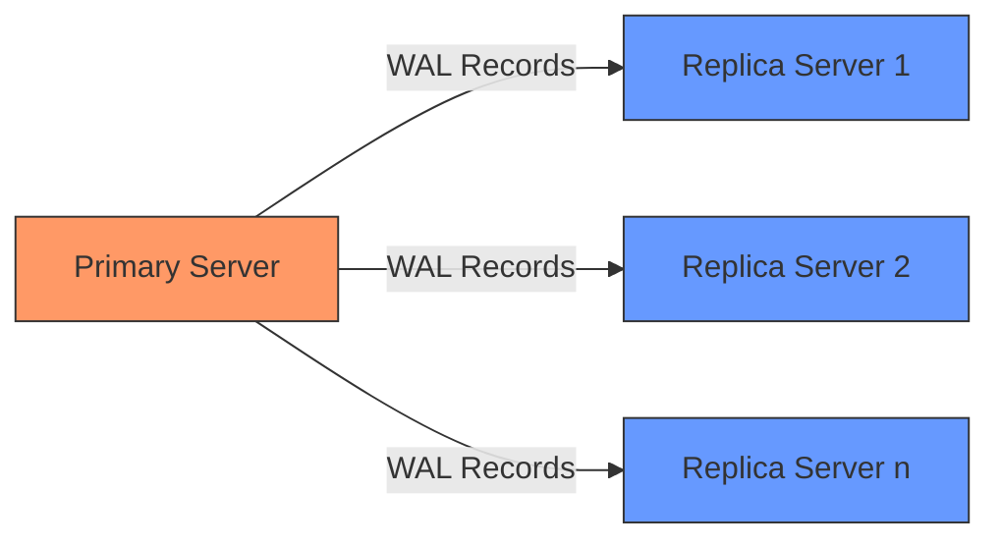
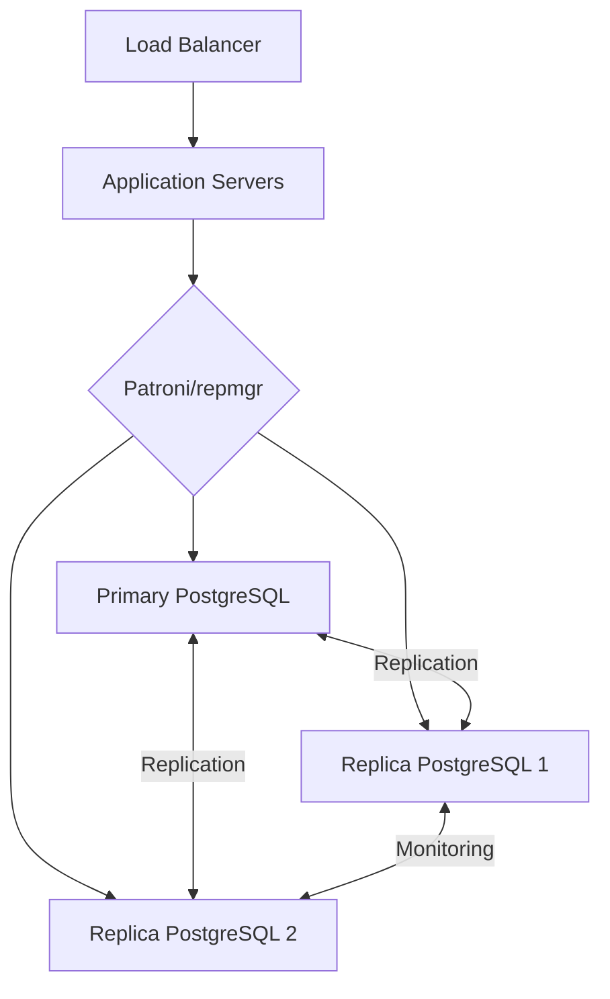
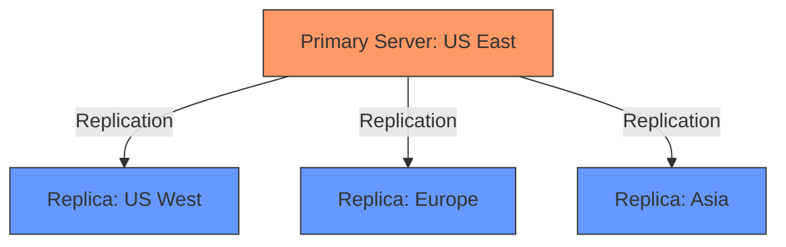
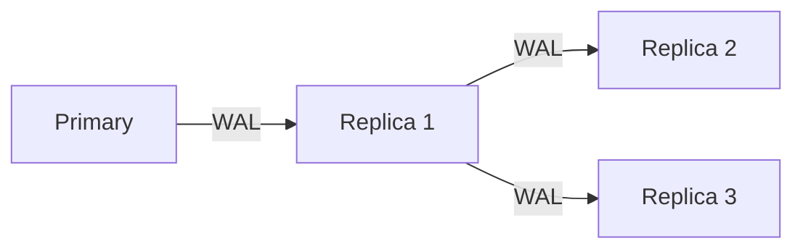

# PostgreSQL Streaming Replication

## Introduction

PostgreSQL streaming replication is a powerful feature that allows you to create and maintain an up-to-date copy (or multiple copies) of your database on separate servers. This technology forms the backbone of many high-availability and disaster recovery solutions in PostgreSQL environments.

In this guide, we'll explore how PostgreSQL streaming replication works, why you might want to use it, and how to set it up step by step. By the end, you'll understand how to implement a robust replication system that can help protect your data and improve your application's reliability.

## What is Streaming Replication?

Streaming replication is a built-in PostgreSQL feature that creates an exact copy of a database from a primary (formerly called "master") server to one or more replica (formerly called "slave") servers. It works by continuously sending a stream of Write-Ahead Log (WAL) records from the primary to the replicas.



### Key Benefits

- **High Availability**: If your primary server fails, a replica can be promoted to become the new primary, minimizing downtime.
- **Load Balancing**: Read queries can be distributed across replicas, reducing the load on the primary server.
- **Data Protection**: Having multiple copies of your database protects against data loss due to hardware failure.
- **Geographic Distribution**: Replicas can be placed in different geographic locations for disaster recovery.

## Prerequisites

Before setting up streaming replication, ensure you have:

1. At least two PostgreSQL servers (same version) installed
2. Network connectivity between the servers
3. Sufficient disk space on the replica servers
4. Administrative access to both servers

## Setting Up Streaming Replication

Let's walk through the process of setting up streaming replication between two PostgreSQL servers:

### Step 1: Configure the Primary Server

First, we need to modify the PostgreSQL configuration on the primary server to enable replication. Edit the `postgresql.conf` file:

```sql
# In postgresql.conf on the primary server
listen_addresses = '*'           # Listen on all available IP addresses
max_wal_senders = 10             # Maximum number of concurrent replication connections
wal_level = replica              # Minimum WAL information needed for replication
max_replication_slots = 10       # Maximum number of replication slots
```

Next, edit the `pg_hba.conf` file to allow replication connections from the replica:

```
# In pg_hba.conf on the primary server
# Allow replication connections from replica server (replace with your replica's IP)
host    replication     replicator     192.168.1.2/32        md5
```

Now restart PostgreSQL to apply the changes:

```bash
sudo systemctl restart postgresql
```

### Step 2: Create a Replication User

On the primary server, create a dedicated user for replication:

```sql
CREATE ROLE replicator WITH REPLICATION LOGIN PASSWORD 'secure_password';
```

### Step 3: Take a Base Backup

Before setting up the replica, we need to take a base backup of the primary server.

First, stop PostgreSQL on the replica server:

```bash
sudo systemctl stop postgresql
```

Clear the replica's data directory (be careful with this command!):

```bash
sudo rm -rf /var/lib/postgresql/14/main/*
```

Now take a base backup from the primary server:

```bash
pg_basebackup -h 192.168.1.1 -D /var/lib/postgresql/14/main -U replicator -P -v --wal-method=stream
```

### Step 4: Configure the Replica Server

Create a `recovery.conf` file in the PostgreSQL data directory on the replica (PostgreSQL 12 and earlier) or create a `standby.signal` file and configure recovery settings in `postgresql.conf` (PostgreSQL 13 and later).

For PostgreSQL 13 and later:

```bash
# Create standby.signal file (empty file that marks this as a replica)
touch /var/lib/postgresql/14/main/standby.signal
```

Edit the `postgresql.conf` file on the replica:

```sql
# In postgresql.conf on the replica server
primary_conninfo = 'host=192.168.1.1 port=5432 user=replicator password=secure_password'
restore_command = 'cp /var/lib/postgresql/14/archive/%f %p'  # Optional, if you're using WAL archiving
```

### Step 5: Start the Replica Server

Start PostgreSQL on the replica server:

```bash
sudo systemctl start postgresql
```

### Step 6: Verify Replication Status

On the primary server, check the replication status:

```sql
SELECT client_addr, state, sent_lsn, write_lsn, flush_lsn, replay_lsn 
FROM pg_stat_replication;
```

Expected output:

```
 client_addr  |   state   |          sent_lsn          |         write_lsn         |         flush_lsn         |         replay_lsn
--------------+-----------+----------------------------+---------------------------+---------------------------+---------------------------
 192.168.1.2  | streaming | 0/3000060                  | 0/3000060                 | 0/3000060                | 0/3000060
```

## Managing Replication

### Monitoring Replication Lag

One of the most important aspects of managing replication is monitoring the lag between primary and replica servers:

```sql
SELECT 
    client_addr, 
    pg_wal_lsn_diff(pg_current_wal_lsn(), replay_lsn) AS lag_bytes
FROM pg_stat_replication;
```

This query shows how far behind the replica is in bytes.

### Promoting a Replica to Primary

If your primary server fails, you can promote a replica to become the new primary:

For PostgreSQL 12 and earlier:

```bash
sudo -u postgres pg_ctl promote -D /var/lib/postgresql/11/main
```

For PostgreSQL 13 and later:

```bash
pg_ctl promote -D /var/lib/postgresql/14/main
```

### Adding Another Replica

You can add more replicas following the same process, taking a backup from either the primary or an existing replica (if cascading replication is enabled).

## Real-World Applications

### Example 1: High-Availability Setup

Consider an e-commerce application that needs to be available 24/7. By implementing streaming replication with two replicas and using a tool like Patroni or repmgr for automatic failover, you can ensure that your database remains available even if the primary server fails.



### Example 2: Read Scaling

For an analytics application that performs many complex queries, you can direct write operations to the primary and distribute read queries across multiple replicas:

```sql
/* On application connection logic */
if (operation_type == 'write') {
    connectTo('primary_server');
} else {
    // Round-robin or random selection among replicas
    connectTo(getRandomReplica());
}
```

### Example 3: Geographically Distributed Setup

For a global application, you might set up replicas in different regions to reduce query latency for users:



## Common Issues and Troubleshooting

### Replication Slot Problems

If a replica stops for too long and its replication slot accumulates too many WAL segments:

```sql
-- Check replication slot status
SELECT slot_name, pg_size_pretty(pg_wal_lsn_diff(pg_current_wal_lsn(), restart_lsn)) AS retained_wal
FROM pg_replication_slots;
```

Solution: Drop unused replication slots or add more disk space.

### Network Interruptions

If network connectivity is lost between servers, replication will pause and resume automatically when the connection is restored. However, if WAL archiving is not configured properly, the replica might not be able to catch up if it falls too far behind.

Solution: Implement WAL archiving as a fallback mechanism.

## Advanced Features

### Synchronous Replication

By default, PostgreSQL uses asynchronous replication, where transactions are committed on the primary without waiting for replicas. For stronger consistency guarantees, you can enable synchronous replication:

```sql
# In postgresql.conf on the primary
synchronous_standby_names = 'replica1'  # Name of the synchronous replica
```

With this setting, transactions won't commit on the primary until they're also written to the specified replica's disk.

### Cascading Replication

Replicas can stream WAL records to other replicas, reducing the load on the primary:



To set up cascading replication, configure a replica to allow connections from other replicas and set the `hot_standby` parameter to `on`.

## Summary

PostgreSQL streaming replication provides a powerful and flexible mechanism for maintaining copies of your database across multiple servers. It's essential for high availability, load balancing, and disaster recovery strategies.

In this guide, we've covered:
- The basics of streaming replication
- Step-by-step setup instructions
- Monitoring and management techniques
- Real-world applications and architectures
- Troubleshooting common issues
- Advanced features like synchronous and cascading replication

With these tools and knowledge, you can build robust database infrastructures that meet the demands of modern applications.

## Additional Resources

Here are some exercises to reinforce your understanding:

1. **Exercise**: Set up streaming replication in a local environment using Docker containers.
2. **Exercise**: Simulate a primary server failure and practice manual promotion of a replica.
3. **Exercise**: Implement a script to monitor replication lag and send alerts when it exceeds a threshold.

For more in-depth learning, consider exploring:
- PostgreSQL's logical replication feature
- Third-party tools like Patroni, repmgr, and PgPool-II
- Point-in-time recovery (PITR) techniques