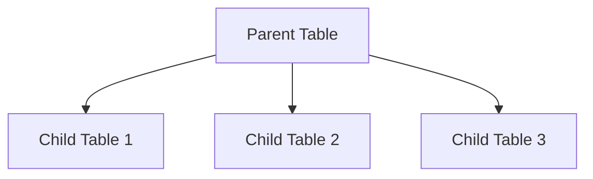

# PostgreSQL Inheritance

## Introduction

PostgreSQL offers a powerful feature called **table inheritance** that allows you to create parent-child relationships between tables. This concept is borrowed from object-oriented programming, where a child class can inherit attributes and behavior from a parent class.

In PostgreSQL, a child table can inherit columns from a parent table while adding its own specific columns. This feature can significantly simplify database design when dealing with hierarchical data structures and promote code reuse.

## Basic Inheritance Concepts

PostgreSQL's inheritance system lets you define parent-child relationships between tables where a child table inherits all columns from its parent table and can add its own columns.

Here's a simple diagram showing the inheritance concept:



Key points about PostgreSQL inheritance:

- A child table contains all columns from the parent table plus its own specific columns
- You can query data from just the parent table or from the parent and all child tables
- Constraints and indexes are not inherited from the parent table
- Each table is still a fully independent table that can be queried separately

## Creating Tables with Inheritance

Let's create a practical example to see inheritance in action. Imagine we're designing a database for a vehicle rental company. We'll create a parent `vehicles` table and then specific child tables for different types of vehicles.

### Step 1: Create the Parent Table

```sql
CREATE TABLE vehicles (
    vehicle_id SERIAL PRIMARY KEY,
    make VARCHAR(100) NOT NULL,
    model VARCHAR(100) NOT NULL,
    year INTEGER NOT NULL,
    daily_rate DECIMAL(10, 2) NOT NULL,
    available BOOLEAN DEFAULT TRUE
);
```

### Step 2: Create Child Tables That Inherit from the Parent

Now let's create child tables for cars and trucks, each with their specific attributes:

```sql
-- Cars table inherits from vehicles
CREATE TABLE cars (
    passenger_capacity INTEGER NOT NULL,
    cargo_volume_cu_ft DECIMAL(5, 2) NOT NULL,
    body_style VARCHAR(50) NOT NULL
) INHERITS (vehicles);

-- Trucks table inherits from vehicles
CREATE TABLE trucks (
    cargo_capacity_tons DECIMAL(5, 2) NOT NULL,
    num_axles INTEGER NOT NULL,
    truck_type VARCHAR(50) NOT NULL
) INHERITS (vehicles);
```

Each child table automatically includes all columns from the parent table (`vehicle_id`, `make`, `model`, `year`, `daily_rate`, and `available`) plus its own specific columns.

## Inserting Data into Tables

Let's insert some sample data into our tables:

```sql
-- Insert data into cars table
INSERT INTO cars (make, model, year, daily_rate, available, passenger_capacity, cargo_volume_cu_ft, body_style)
VALUES 
    ('Toyota', 'Camry', 2022, 45.00, true, 5, 15.1, 'Sedan'),
    ('Honda', 'CR-V', 2021, 55.00, true, 5, 39.2, 'SUV'),
    ('Ford', 'Mustang', 2022, 75.00, false, 4, 13.5, 'Coupe');

-- Insert data into trucks table  
INSERT INTO trucks (make, model, year, daily_rate, available, cargo_capacity_tons, num_axles, truck_type)
VALUES
    ('Ford', 'F-150', 2020, 85.00, true, 0.75, 2, 'Pickup'),
    ('Chevrolet', 'Silverado', 2021, 95.00, true, 0.85, 2, 'Pickup'),
    ('Mercedes', 'Actros', 2019, 250.00, false, 20, 5, 'Semi');
```

## Querying with Inheritance

One of the main benefits of inheritance is the ability to query data from all child tables through the parent table.

### Querying Just the Parent Table

If you only want to see data from the parent table (without including child table data):

```sql
SELECT * FROM ONLY vehicles;
```

Result:
```
 vehicle_id | make | model | year | daily_rate | available 
-----------+------+-------+------+------------+-----------
(0 rows)
```

This query returns no rows because we haven't inserted any data directly into the parent table.

### Querying Parent and All Child Tables

To query from the parent and all child tables:

```sql
SELECT vehicle_id, make, model, year, daily_rate, available FROM vehicles;
```

Result:
```
 vehicle_id |   make    |   model   | year | daily_rate | available 
-----------+-----------+-----------+------+------------+-----------
         1 | Toyota    | Camry     | 2022 |      45.00 | t
         2 | Honda     | CR-V      | 2021 |      55.00 | t
         3 | Ford      | Mustang   | 2022 |      75.00 | f
         4 | Ford      | F-150     | 2020 |      85.00 | t
         5 | Chevrolet | Silverado | 2021 |      95.00 | t
         6 | Mercedes  | Actros    | 2019 |     250.00 | f
(6 rows)
```

This query returns all vehicles from both child tables.

### Identifying Which Table a Row Comes From

To see which specific table each row belongs to:

```sql
SELECT tableoid::regclass AS table_name, vehicle_id, make, model 
FROM vehicles 
ORDER BY table_name, vehicle_id;
```

Result:
```
 table_name | vehicle_id |   make    |   model   
------------+-----------+-----------+-----------
 cars       |         1 | Toyota    | Camry
 cars       |         2 | Honda     | CR-V
 cars       |         3 | Ford      | Mustang
 trucks     |         4 | Ford      | F-150
 trucks     |         5 | Chevrolet | Silverado
 trucks     |         6 | Mercedes  | Actros
(6 rows)
```

### Querying Specific Child Tables

You can still query the child tables directly:

```sql
-- Query only cars
SELECT vehicle_id, make, model, passenger_capacity, body_style 
FROM cars
WHERE available = true;
```

Result:
```
 vehicle_id |  make  | model | passenger_capacity | body_style 
-----------+--------+-------+--------------------+------------
         1 | Toyota | Camry |                  5 | Sedan
         2 | Honda  | CR-V  |                  5 | SUV
(2 rows)
```

## Modifying Tables with Inheritance

### Adding Columns to Parent Table

When you add columns to the parent table, they are automatically inherited by all child tables:

```sql
-- Add a column to the parent table
ALTER TABLE vehicles ADD COLUMN last_maintenance_date DATE;
```

Now both `cars` and `trucks` tables will have this column.

### Adding Constraints

Remember that constraints are not inherited. If you want to add a constraint to both parent and child tables, you need to add it to each table separately:

```sql
-- Add a check constraint to vehicles table
ALTER TABLE vehicles ADD CONSTRAINT valid_year CHECK (year >= 2000);

-- Add the same constraint to child tables
ALTER TABLE cars ADD CONSTRAINT valid_year CHECK (year >= 2000);
ALTER TABLE trucks ADD CONSTRAINT valid_year CHECK (year >= 2000);
```

## Updating and Deleting with Inheritance

### Updating Data

You can update data across all tables using the parent table:

```sql
-- Set all vehicles to unavailable
UPDATE vehicles SET available = false;
```

This updates rows in both the parent table and all child tables.

### Deleting Data

Similarly, you can delete data across all tables:

```sql
-- Delete all vehicles made before 2021
DELETE FROM vehicles WHERE year < 2021;
```

This deletes matching rows from both the parent and all child tables.

## Practical Use Cases for Inheritance

PostgreSQL inheritance is particularly useful in several scenarios:

1. **Partitioning data**: Before PostgreSQL's declarative partitioning, inheritance was commonly used for table partitioning.

2. **Content Management Systems**: Different content types can share common fields like creation date, author, etc.

3. **Product catalogs**: All products might share common attributes like price and description, while specific product types have their own attributes.

4. **Geographic Information Systems**: Different geographic entities can share common spatial attributes.

Let's look at a practical example for a product catalog:

```sql
-- Create a base products table
CREATE TABLE products (
    product_id SERIAL PRIMARY KEY,
    name VARCHAR(100) NOT NULL,
    description TEXT,
    price DECIMAL(10, 2) NOT NULL,
    stock_quantity INTEGER NOT NULL,
    created_at TIMESTAMPTZ DEFAULT NOW()
);

-- Create specific product tables
CREATE TABLE electronics (
    warranty_months INTEGER NOT NULL,
    power_consumption_watts INTEGER,
    manufacturer VARCHAR(100)
) INHERITS (products);

CREATE TABLE clothing (
    size VARCHAR(20) NOT NULL,
    color VARCHAR(50) NOT NULL,
    material VARCHAR(50),
    gender VARCHAR(20)
) INHERITS (products);

CREATE TABLE books (
    author VARCHAR(100) NOT NULL,
    isbn VARCHAR(20) UNIQUE NOT NULL,
    pages INTEGER,
    publisher VARCHAR(100)
) INHERITS (products);
```

This structure allows you to:
- Query all products regardless of type using the parent table
- Query specific product types using their respective tables
- Maintain common attributes in one place

## Limitations and Considerations

While inheritance is powerful, it has some limitations to be aware of:

1. **Constraints are not inherited**: You need to define constraints separately for each table.

2. **Indexes are not inherited**: Each table needs its own indexes.

3. **Foreign keys cannot reference the entire hierarchy**: You can only reference specific tables.

4. **Triggers are not inherited**: You need to define triggers separately for each table.

5. **Performance considerations**: Queries on the parent table need to scan all child tables, which can be slow with many child tables or large datasets.

## Inheritance vs. Partitioning

In newer versions of PostgreSQL (10+), declarative partitioning provides a more powerful alternative to inheritance for dividing large tables. Partitioning is preferable when your main goal is to improve query performance on very large tables.

Inheritance is still useful for modeling hierarchical data and when you want the flexibility to query tables both separately and together.

## Summary

PostgreSQL inheritance is a powerful feature that:

- Allows tables to inherit columns from parent tables
- Enables hierarchical data modeling
- Facilitates querying data across multiple related tables
- Promotes code reuse in database design

By organizing your tables in inheritance hierarchies, you can create cleaner, more maintainable database designs that better reflect the structure of your data.

## Exercises

1. Create a parent table `employees` with common fields like `employee_id`, `name`, `hire_date`, and `salary`. Then create child tables for different employee types like `managers`, `developers`, and `sales_representatives` with their specific attributes.

2. Write a query that lists all employees sorted by salary, including which department they belong to.

3. Add a new column `performance_rating` to the parent table and verify it exists in all child tables.

4. Create a query that shows the average salary for each employee type.

## Additional Resources

- [PostgreSQL Official Documentation on Inheritance](https://www.postgresql.org/docs/current/ddl-inherit.html)
- [PostgreSQL Table Partitioning](https://www.postgresql.org/docs/current/ddl-partitioning.html) for comparing inheritance with newer partitioning features